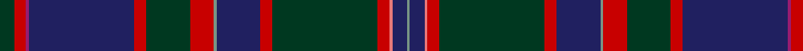

In pattern [GBRRGRBGRGRBRRG](/patterns/gbrrgrbgrgrbrrg/).

This was sourced from tartans-authority.  It is a [15 stripes tartan](/stripes/stripes15/).

Original link http://www.tartansauthority.com/tartan-ferret/display/5045/

## Thread count
DG/10 R8 P2 DB72 R8 DG30 R16 LG2 DB30 R8 DG72 R8 LR2 DB10 LG/2

## Palette
Each colour and its ΔE from the base-6 reference it is a variant of.

| Colour | Shade | Base | ΔE (OKLab) |
|---|---|---|---|
| DB | <code style="background-color:#202060;">#202060</code> `#202060` | B <code style="background-color:#2A418A;">#2A418A</code> | 0.11 |
| DG | <code style="background-color:#003820;">#003820</code> `#003820` | G <code style="background-color:#006100;">#006100</code> | 0.15 |
| LG | <code style="background-color:#789484;">#789484</code> `#789484` | G <code style="background-color:#006100;">#006100</code> | 0.24 |
| LR | <code style="background-color:#E87878;">#E87878</code> `#E87878` | R <code style="background-color:#CC0000;">#CC0000</code> | 0.19 |
| P | <code style="background-color:#981C70;">#981C70</code> `#981C70` | R <code style="background-color:#CC0000;">#CC0000</code> | 0.17 |
| R | <code style="background-color:#C80000;">#C80000</code> `#C80000` | R <code style="background-color:#CC0000;">#CC0000</code> | 0.01 |

## Nearest tartans

The nearest existing variants by ΔTartan distance.

1. [McGuirk (2013)](/setts/s12/g4r1g1r3g16k12r1b27w2b3w1y2~b202060-g003820-k101010-ra00000-wa8ace8-ye8c000~x2/) — ΔT 1.08
1. [Highland Pride of Scotland (Fashion)](/setts/s11/b9g2ba2bb2g18ba2k2g1k19b33w2~b202060-ba780078-bb440044-g285800-k101010-we0e0e0~x2/) — ΔT 1.10
1. [Highland Pride of Scotland](/setts/s20/b9g2ba2bb2g18ba2k2g1k19b33w2b33k19g1k2ba2g18bb2ba2g2~b202060-ba780078-bb440044-g285800-k101010-we0e0e0~x2/) — ΔT 1.14
1. [Trew 40th (Personal)](/setts/s15/r4g3k11b3ba3b30k1w4k1g3k3g3k3b12r2~b3c3c3c-ba1c0070-g405844-k101010-rc80000-we0e0e0~x2/) — ΔT 1.14
1. [Capercaillie Corporate Tartan Tartan Number: 6857. Earliest known date: 2005 RSPB Scotland will receive a 7% royalty on all products made from the new tartan, created in the colours of the world's largest woodland grouse, in a deal struck with the leading tartan weavers Lochcarron. See products available Copyright © Blair Urquhart, Comrie, 2015](/setts/s14/b4r3b4r2b4ba8b30k4ba4k36b4ra2k4w2~b505050-ba3c4464-k101010-r98481c-rac80000-wf8f8f8/) — ΔT 1.14
1. [Scragg Moran (Personal)](/setts/s10/g1b28k11r5w1r5k11y1k2g1~b14465c-g509721-k120a01-r89051b-wddd5af-yc1ae8c~x2/) — ΔT 1.16
1. [Unidentified #7](/setts/s11/b2r2b2r2b20k24g12y1k2g2ba2~b2c4084-ba3c82af-g005020-k101010-rdc0000-ye8c000~x2/) — ΔT 1.25
1. [McGuirk (2013)](/setts/s12/g4r1g1r3g16k12r1b27ba2b3ba1y2~b2c4084-ba5f749c-g285800-k101010-rc8002c-yffe600~x2/) — ΔT 1.30
1. [Livingstone - Australia (Personal)](/setts/s11/g15r25g4k2y1b1y1k2g4b12w1~b2c2c80-g00643c-k101010-r901c38-we0e0e0-ybc8c00~x2/) — ΔT 1.31
1. [Causeway, The (District)](/setts/s15/b38ba8bb3b20ba42k2g6k2ba2bc3ba2w2bb10ba2k6~b1c1c1c-ba5c5c5c-bb2c2c80-bc780078-g006818-k101010-wfcfcfc/) — ΔT 1.33

## Neighbour map

Every grey dot is one of 15726 variants placed by the first two principal components of the ΔTartan feature space (44% of its variance). Red is this tartan; blue dots are its nearest — click one to open its page.

<svg viewBox="0 0 640 380" role="img" style="max-width:100%;height:auto;border:1px solid #e0e0e0;border-radius:4px;display:block" xmlns="http://www.w3.org/2000/svg"><image href="/nn/cloud.v1.png" width="640" height="380"/><a href="/setts/s12/g4r1g1r3g16k12r1b27w2b3w1y2~b202060-g003820-k101010-ra00000-wa8ace8-ye8c000~x2/"><circle cx="254.3" cy="103.5" r="4" fill="#3465a4"><title>McGuirk (2013)</title></circle></a><a href="/setts/s11/b9g2ba2bb2g18ba2k2g1k19b33w2~b202060-ba780078-bb440044-g285800-k101010-we0e0e0~x2/"><circle cx="294.2" cy="110.8" r="4" fill="#3465a4"><title>Highland Pride of Scotland (Fashion)</title></circle></a><a href="/setts/s20/b9g2ba2bb2g18ba2k2g1k19b33w2b33k19g1k2ba2g18bb2ba2g2~b202060-ba780078-bb440044-g285800-k101010-we0e0e0~x2/"><circle cx="282.6" cy="88.8" r="4" fill="#3465a4"><title>Highland Pride of Scotland</title></circle></a><a href="/setts/s15/r4g3k11b3ba3b30k1w4k1g3k3g3k3b12r2~b3c3c3c-ba1c0070-g405844-k101010-rc80000-we0e0e0~x2/"><circle cx="309.3" cy="89.8" r="4" fill="#3465a4"><title>Trew 40th (Personal)</title></circle></a><a href="/setts/s14/b4r3b4r2b4ba8b30k4ba4k36b4ra2k4w2~b505050-ba3c4464-k101010-r98481c-rac80000-wf8f8f8/"><circle cx="267.6" cy="110.8" r="4" fill="#3465a4"><title>Capercaillie Corporate Tartan Tartan Number: 6857. Earliest known date: 2005 RSPB Scotland will receive a 7% royalty on all products made from the new tartan, created in the colours of the world's largest woodland grouse, in a deal struck with the leading tartan weavers Lochcarron. See products available Copyright © Blair Urquhart, Comrie, 2015</title></circle></a><a href="/setts/s10/g1b28k11r5w1r5k11y1k2g1~b14465c-g509721-k120a01-r89051b-wddd5af-yc1ae8c~x2/"><circle cx="273.9" cy="110.3" r="4" fill="#3465a4"><title>Scragg Moran (Personal)</title></circle></a><a href="/setts/s11/b2r2b2r2b20k24g12y1k2g2ba2~b2c4084-ba3c82af-g005020-k101010-rdc0000-ye8c000~x2/"><circle cx="229.3" cy="110.8" r="4" fill="#3465a4"><title>Unidentified #7</title></circle></a><a href="/setts/s12/g4r1g1r3g16k12r1b27ba2b3ba1y2~b2c4084-ba5f749c-g285800-k101010-rc8002c-yffe600~x2/"><circle cx="237.9" cy="94.1" r="4" fill="#3465a4"><title>McGuirk (2013)</title></circle></a><a href="/setts/s11/g15r25g4k2y1b1y1k2g4b12w1~b2c2c80-g00643c-k101010-r901c38-we0e0e0-ybc8c00~x2/"><circle cx="240.8" cy="104.1" r="4" fill="#3465a4"><title>Livingstone - Australia (Personal)</title></circle></a><a href="/setts/s15/b38ba8bb3b20ba42k2g6k2ba2bc3ba2w2bb10ba2k6~b1c1c1c-ba5c5c5c-bb2c2c80-bc780078-g006818-k101010-wfcfcfc/"><circle cx="241.4" cy="90.3" r="4" fill="#3465a4"><title>Causeway, The (District)</title></circle></a><circle cx="285.3" cy="88.9" r="5" fill="#c00000"/></svg>

ID: /setts/s15/g5r4ra1b36r4g15r8ga1b15r4g36r4rb1b5ga1~b202060-g003820-ga789484-rc80000-ra981c70-rbe87878~x2/
