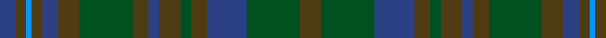

In pattern [BGBGBGGGBGGGBGG](/patterns/bgbgbgggbgggbgg/).

This was sourced from register-of-tartans.  It is a [15 stripes tartan](/stripes/stripes15/).

Original link https://www.tartanregister.gov.uk/tartanDetails.aspx?ref=4296

## Thread count
B/6 T4 Ba2 T4 B6 T8 G20 T6 B4 T8 G4 T6 B15 G20 T/8

## Palette
Each colour and its ΔE from the base-6 reference it is a variant of.

| Colour | Shade | Base | ΔE (OKLab) |
|---|---|---|---|
| B | <code style="background-color:#2C4084;">#2C4084</code> `#2C4084` | B <code style="background-color:#2C4084;">#2C4084</code> | 0.00 |
| Ba | <code style="background-color:#0596FA;">#0596FA</code> `#0596FA` | B <code style="background-color:#2C4084;">#2C4084</code> | 0.28 |
| G | <code style="background-color:#005020;">#005020</code> `#005020` | G <code style="background-color:#006400;">#006400</code> | 0.08 |
| T | <code style="background-color:#503C14;">#503C14</code> `#503C14` | G <code style="background-color:#006400;">#006400</code> | 0.15 |

## Nearest tartans

The nearest existing variants by ΔTartan distance.

1. [Buchanan Hunting](/setts/s11/b6g28ga28g4b28g4b28g4ga28g28r6-b2c4084-g503c14-ga005020-rdc0000/) — ΔT 1.09
1. [Protheroe (Welsh Name)](/setts/s12/g20ga8b8ga8b8ba20ga8ba4y4ba4ga40b12-b202060-ba003c64-g285800-ga003820-ya08858/) — ΔT 1.49
1. [Crawfordjohn Personal Tartan Tartan Number: 6864. Earliest known date: 2005 A tartan for the Barony of Crawfordjohn designed by the present baron, Travis K Svensson. See products available Copyright © Blair Urquhart, Comrie, 2015](/setts/s12/b20ba44g14ga20g44bb6g44ga20g14ba44b20ba16-b2c2c80-ba003c64-bb780078-g003820-ga006818/) — ΔT 1.57
1. [Cowal Highland Games Corporate Tartan Tartan Number: 2536. Earliest known date: 1994 The Cowal Highland Gathering takes place on the last weekend of August each year in Dunoon, Argyllshire, on the Firth of Clyde and is the largest, most spectacular Highland Games in the world with thousands of dancers, pipers, drummers and athletes attending from all over the world. In 1994, the centenary year of the Gathering, this soft muted tartan in blues and greens was designed. Only available from Bells of Dunoon - michael.boyce@telco4u.net (Sept. 2004) See products available Copyright © Blair Urquhart, Comrie, 2015](/setts/s16/b36ba32g4ba4g4ba4g32ga8g32ba4g4ba4g4ba32b36bb4-b003c64-ba14283c-bb5c5c5c-g5c6428-ga003820/) — ΔT 1.60
1. [de Meuron (Family)](/setts/s12/g18ga26gb52gc12b10gc80b10gc12gb52ga26g18gb6-b440044-g5c6428-ga006818-gb003820-gc604000/) — ΔT 1.60
1. [Lochinvar Marine Harvest Corporate Tartan Tartan Number: 2102. Earliest known date: 1989 Colours represents the Scottish hills, the water, and the heather. See products available Copyright © Blair Urquhart, Comrie, 2015](/setts/s13/g20k4g4k4g4k14b16ba4b16k14g16k4g4-b202060-ba780078-g003820-k101010/) — ΔT 1.68
1. [Black Watch/Isetan Men's](/setts/s13/b32k4b4k4b4k24g26k4g26k24b24k4r2-b202060-g003820-k101010-rc80000/) — ΔT 1.69
1. [Richard of Wales](/setts/s12/b20g8b8g8b8ba20g8ba4bb4ba4g40r12-b202060-ba003c64-bb5c8ca8-g003820-r901c38/) — ΔT 1.69
1. [McWilliams (2014)](/setts/s12/b6k4b26k18ba6k4ba28k4ba6k18b30k6-b003c64-ba4c3428-k101010/) — ΔT 1.69
1. [Rogers (Personal)](/setts/s15/b32k4b8k4b8k24g32k4ba8k4g32k24b32k4b8-b202060-ba5c8ca8-g003820-k101010/) — ΔT 1.72

## Neighbour map

Every grey dot is one of 15726 variants placed by the first two principal components of the ΔTartan feature space (44% of its variance). Red is this tartan; blue dots are its nearest — click one to open its page.

<svg viewBox="0 0 640 380" role="img" style="max-width:100%;height:auto;border:1px solid #e0e0e0;border-radius:4px;display:block" xmlns="http://www.w3.org/2000/svg"><image href="/nn/cloud.v1.png" width="640" height="380"/><a href="/setts/s11/b6g28ga28g4b28g4b28g4ga28g28r6-b2c4084-g503c14-ga005020-rdc0000/"><circle cx="262.9" cy="268.2" r="4" fill="#3465a4"><title>Buchanan Hunting</title></circle></a><a href="/setts/s12/g20ga8b8ga8b8ba20ga8ba4y4ba4ga40b12-b202060-ba003c64-g285800-ga003820-ya08858/"><circle cx="302.1" cy="233.8" r="4" fill="#3465a4"><title>Protheroe (Welsh Name)</title></circle></a><a href="/setts/s12/b20ba44g14ga20g44bb6g44ga20g14ba44b20ba16-b2c2c80-ba003c64-bb780078-g003820-ga006818/"><circle cx="246.4" cy="276.7" r="4" fill="#3465a4"><title>Crawfordjohn Personal Tartan Tartan Number: 6864. Earliest known date: 2005 A tartan for the Barony of Crawfordjohn designed by the present baron, Travis K Svensson. See products available Copyright © Blair Urquhart, Comrie, 2015</title></circle></a><a href="/setts/s16/b36ba32g4ba4g4ba4g32ga8g32ba4g4ba4g4ba32b36bb4-b003c64-ba14283c-bb5c5c5c-g5c6428-ga003820/"><circle cx="246.8" cy="204.2" r="4" fill="#3465a4"><title>Cowal Highland Games Corporate Tartan Tartan Number: 2536. Earliest known date: 1994 The Cowal Highland Gathering takes place on the last weekend of August each year in Dunoon, Argyllshire, on the Firth of Clyde and is the largest, most spectacular Highland Games in the world with thousands of dancers, pipers, drummers and athletes attending from all over the world. In 1994, the centenary year of the Gathering, this soft muted tartan in blues and greens was designed. Only available from Bells of Dunoon - michael.boyce@telco4u.net (Sept. 2004) See products available Copyright © Blair Urquhart, Comrie, 2015</title></circle></a><a href="/setts/s12/g18ga26gb52gc12b10gc80b10gc12gb52ga26g18gb6-b440044-g5c6428-ga006818-gb003820-gc604000/"><circle cx="270.9" cy="218.5" r="4" fill="#3465a4"><title>de Meuron (Family)</title></circle></a><a href="/setts/s13/g20k4g4k4g4k14b16ba4b16k14g16k4g4-b202060-ba780078-g003820-k101010/"><circle cx="279.0" cy="290.6" r="4" fill="#3465a4"><title>Lochinvar Marine Harvest Corporate Tartan Tartan Number: 2102. Earliest known date: 1989 Colours represents the Scottish hills, the water, and the heather. See products available Copyright © Blair Urquhart, Comrie, 2015</title></circle></a><a href="/setts/s13/b32k4b4k4b4k24g26k4g26k24b24k4r2-b202060-g003820-k101010-rc80000/"><circle cx="328.9" cy="235.0" r="4" fill="#3465a4"><title>Black Watch/Isetan Men's</title></circle></a><a href="/setts/s12/b20g8b8g8b8ba20g8ba4bb4ba4g40r12-b202060-ba003c64-bb5c8ca8-g003820-r901c38/"><circle cx="298.6" cy="226.7" r="4" fill="#3465a4"><title>Richard of Wales</title></circle></a><a href="/setts/s12/b6k4b26k18ba6k4ba28k4ba6k18b30k6-b003c64-ba4c3428-k101010/"><circle cx="329.1" cy="278.5" r="4" fill="#3465a4"><title>McWilliams (2014)</title></circle></a><a href="/setts/s15/b32k4b8k4b8k24g32k4ba8k4g32k24b32k4b8-b202060-ba5c8ca8-g003820-k101010/"><circle cx="280.7" cy="243.8" r="4" fill="#3465a4"><title>Rogers (Personal)</title></circle></a><circle cx="294.1" cy="250.6" r="5" fill="#c00000"/></svg>

ID: /setts/s15/g8ga20b15g6ga4g8b4g6ga20g8b6g4ba2g4b6-b2c4084-ba0596fa-g503c14-ga005020/
