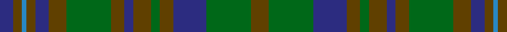

In pattern [BGBGBGGGBGGGBGG](/patterns/bgbgbgggbgggbgg/).

This was sourced from house-of-tartan.  It is a [15 stripes tartan](/stripes/stripes15/).

Original link http://www.house-of-tartan.scotland.net/house/TartanViewjs.asp?colr=Def&tnam=2018

## Thread count
DB/6 T4 B2 T4 DB6 T8 G20 T6 DB4 T8 G4 T6 DB15 G20 T/8

## Palette
Each colour and its ΔE from the base-6 reference it is a variant of.

| Colour | Shade | Base | ΔE (OKLab) |
|---|---|---|---|
| B | <code style="background-color:#2888C4;">#2888C4</code> `#2888C4` | B <code style="background-color:#2A418A;">#2A418A</code> | 0.21 |
| DB | <code style="background-color:#2C2C80;">#2C2C80</code> `#2C2C80` | B <code style="background-color:#2A418A;">#2A418A</code> | 0.06 |
| G | <code style="background-color:#006818;">#006818</code> `#006818` | G <code style="background-color:#006100;">#006100</code> | 0.02 |
| T | <code style="background-color:#604000;">#604000</code> `#604000` | G <code style="background-color:#006100;">#006100</code> | 0.14 |

## Nearest tartans

The nearest existing variants by ΔTartan distance.

1. [Unidentified, Fragment](/setts/s15/r8g20b15r6g4r8b4r6g20r8b6r4ba2r4b6~b304080-ba8080d0-g008000-r806050/) — ΔT 0.78
1. [Buchanan, hunting](/setts/s11/b3r14g14r2b14r2b14r2g14r14ra3~b304080-g008000-r806050-rac00000~x2/) — ΔT 1.18
1. [Kerry, County](/setts/s15/y2b3g3b4ga16b3g3b4ga3b3g16b4ga3b3y2~b003c64-g5c6428-ga604000-yd09800~x2/) — ΔT 1.20
1. [Montmorency Family Tartan Tartan Number: 103. Earliest known date: pre 2003 Canadian fancy. Presented by Mrs K Sinclair See products available Copyright © Blair Urquhart, Comrie, 2015](/setts/s13/b21g2b3g2b2g14ga15g4ga15g14b14g2b3~b2c2c80-g006818-ga604000~x2/) — ΔT 1.20
1. [Tyneside Scottish (Blue)](/setts/s13/b8g1b1g1b1g8ga8g1ga8g8b8g1b1~b1474b4-g604000-ga006818~x6/) — ΔT 1.24
1. [Montmorency](/setts/s13/b21g2b3g2b2g14r15g4r15g14b14g2b3~b304080-g008000-r806050~x2/) — ΔT 1.36
1. [Strange of Balcaskie (Personal)](/setts/s12/g32ga7g7ga16b32y3ga8y3b32ga16g7ga7~b2c2c80-g006818-ga604000-ye8c000~x2/) — ΔT 1.43
1. [Tupper. Sir Charles.. Family Tartan Tartan Number: 614. Earliest known date: 1983 From Canada. See products available Copyright © Blair Urquhart, Comrie, 2015](/setts/s10/b4g7y3g12ga15g5b20g5ga4g2~b2c2c80-g604000-ga006818-ye8c000~x2/) — ΔT 1.44
1. [Brown Watch Trade Tartan Tartan Number: 1739. Earliest known date: pre 1986 Product of J & D Paton of Tillicoultry, one of many samples presented to the Scottish Tartan Society sometime before 1986 See products available Copyright © Blair Urquhart, Comrie, 2015](/setts/s13/g11k1g1k1g1k8ga8k1ga8k8g8k1g1~g604000-ga005818-k101010~x4/) — ΔT 1.47
1. [Turcan Connell](/setts/s18/g27b3g8b4g8b3g14ga8y5g5ga14b12y6b12g15ga9r4ga9~b1c1c1c-g604000-ga00643c-rc80000-ya0a0a0~x2/) — ΔT 1.48

## Neighbour map

Every grey dot is one of 15726 variants placed by the first two principal components of the ΔTartan feature space (44% of its variance). Red is this tartan; blue dots are its nearest — click one to open its page.

<svg viewBox="0 0 640 380" role="img" style="max-width:100%;height:auto;border:1px solid #e0e0e0;border-radius:4px;display:block" xmlns="http://www.w3.org/2000/svg"><image href="/nn/cloud.v1.png" width="640" height="380"/><a href="/setts/s15/r8g20b15r6g4r8b4r6g20r8b6r4ba2r4b6~b304080-ba8080d0-g008000-r806050/"><circle cx="232.0" cy="212.6" r="4" fill="#3465a4"><title>Unidentified, Fragment</title></circle></a><a href="/setts/s11/b3r14g14r2b14r2b14r2g14r14ra3~b304080-g008000-r806050-rac00000~x2/"><circle cx="212.6" cy="237.1" r="4" fill="#3465a4"><title>Buchanan, hunting</title></circle></a><a href="/setts/s15/y2b3g3b4ga16b3g3b4ga3b3g16b4ga3b3y2~b003c64-g5c6428-ga604000-yd09800~x2/"><circle cx="247.7" cy="207.8" r="4" fill="#3465a4"><title>Kerry, County</title></circle></a><a href="/setts/s13/b21g2b3g2b2g14ga15g4ga15g14b14g2b3~b2c2c80-g006818-ga604000~x2/"><circle cx="277.4" cy="228.4" r="4" fill="#3465a4"><title>Montmorency Family Tartan Tartan Number: 103. Earliest known date: pre 2003 Canadian fancy. Presented by Mrs K Sinclair See products available Copyright © Blair Urquhart, Comrie, 2015</title></circle></a><a href="/setts/s13/b8g1b1g1b1g8ga8g1ga8g8b8g1b1~b1474b4-g604000-ga006818~x6/"><circle cx="266.2" cy="235.3" r="4" fill="#3465a4"><title>Tyneside Scottish (Blue)</title></circle></a><a href="/setts/s13/b21g2b3g2b2g14r15g4r15g14b14g2b3~b304080-g008000-r806050~x2/"><circle cx="267.0" cy="222.2" r="4" fill="#3465a4"><title>Montmorency</title></circle></a><a href="/setts/s12/g32ga7g7ga16b32y3ga8y3b32ga16g7ga7~b2c2c80-g006818-ga604000-ye8c000~x2/"><circle cx="227.5" cy="203.8" r="4" fill="#3465a4"><title>Strange of Balcaskie (Personal)</title></circle></a><a href="/setts/s10/b4g7y3g12ga15g5b20g5ga4g2~b2c2c80-g604000-ga006818-ye8c000~x2/"><circle cx="239.3" cy="218.6" r="4" fill="#3465a4"><title>Tupper. Sir Charles.. Family Tartan Tartan Number: 614. Earliest known date: 1983 From Canada. See products available Copyright © Blair Urquhart, Comrie, 2015</title></circle></a><a href="/setts/s13/g11k1g1k1g1k8ga8k1ga8k8g8k1g1~g604000-ga005818-k101010~x4/"><circle cx="298.9" cy="227.6" r="4" fill="#3465a4"><title>Brown Watch Trade Tartan Tartan Number: 1739. Earliest known date: pre 1986 Product of J &amp; D Paton of Tillicoultry, one of many samples presented to the Scottish Tartan Society sometime before 1986 See products available Copyright © Blair Urquhart, Comrie, 2015</title></circle></a><a href="/setts/s18/g27b3g8b4g8b3g14ga8y5g5ga14b12y6b12g15ga9r4ga9~b1c1c1c-g604000-ga00643c-rc80000-ya0a0a0~x2/"><circle cx="239.3" cy="201.4" r="4" fill="#3465a4"><title>Turcan Connell</title></circle></a><circle cx="245.1" cy="220.6" r="5" fill="#c00000"/></svg>

ID: /setts/s15/g8ga20b15g6ga4g8b4g6ga20g8b6g4ba2g4b6~b2c2c80-ba2888c4-g604000-ga006818/
