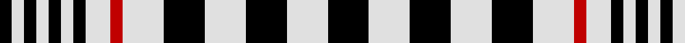

In pattern [KWKWKWKWRWKWKWK](/patterns/kwkwkwkwrwkwkwk/).

This was sourced from weddslist.  It is a [15 stripes tartan](/stripes/stripes15/).

Original link http://www.weddslist.com/cgi-bin/tartans/pg.pl?source=sts

## Thread count
K/6 LN6 K6 LN6 K6 LN6 K6 LN12 R6 LN20 K20 LN20 K20 LN20 K/20

## Palette
Each colour and its ΔE from the base-6 reference it is a variant of.

| Colour | Shade | Base | ΔE (OKLab) |
|---|---|---|---|
| K | <code style="background-color:#000000;">#000000</code> `#000000` | K <code style="background-color:#000000;">#000000</code> | 0.00 |
| LN | <code style="background-color:#E0E0E0;">#E0E0E0</code> `#E0E0E0` | W <code style="background-color:#F7F7F7;">#F7F7F7</code> | 0.07 |
| R | <code style="background-color:#C00000;">#C00000</code> `#C00000` | R <code style="background-color:#CC0000;">#CC0000</code> | 0.03 |

## Nearest tartans

The nearest existing variants by ΔTartan distance.

1. [Blackcraig Family Tartan Tartan Number: 1230. Earliest known date: 1984 For an American customer. See products available Copyright © Blair Urquhart, Comrie, 2015](/setts/s15/k10w10k10w10k10w10r3w6k3w3k3w3k3w3k3~k101010-rc80000-we0e0e0~x2/) — ΔT 0.71
1. [Blackcraig (Personal)](/setts/s13/k10w10k10w10r3w6k3w3k3w3k3w3k3~k101010-rc80000-wfcfcfc~x2/) — ΔT 1.12
1. [Stewart/Stuart Royal (B,W. & Grey)](/setts/s20/r11k16r4k4w4k4w19k14w4k14w4k14w19k4w4k4r4k16r11k8~k101010-r888888-we0e0e0/) — ΔT 1.13
1. [Blackcraig (Personal)](/setts/s13/k10w10k10w10r3w6k3w3k3w3k3w3k3~k101010-rc80000-wffffff~x2/) — ΔT 1.16
1. [Prince of Wales Check](/setts/s21/w2b2w2b2w2ba4w2b1w1b1w1b1w1b1w1b1w1b1w1b1w1~b441800-ba003c64-wc0c0c0~x4/) — ΔT 1.44
1. [Prince of Wales (Estate Check)](/setts/s22/w2b2w2b2w2ba4w1b1w1b1w1b1w1b1w1b1w1b1w1b1w1b1~b441800-ba003c64-wc0c0c0~x4/) — ΔT 1.48
1. [Royal Stuart / Stewart](/setts/s11/k14w4k14w19k4w4k4g4k16g11k8~g808080-k000000-we0e0e0/) — ΔT 1.65
1. [Ogilvie (B&W) (Fashion?)](/setts/s20/k12w2k12w2k6w2k7w6k2w6k2w2k6w2k6w2k2w12k2w12~k101010-we0e0e0~x2/) — ΔT 1.65
1. [Ogilvy, Black and White](/setts/s20/k12w2k12w2k6w2k7w6k2w6k2w2k6w2k6w2k2w12k2w12~k000000-we0e0e0~x2/) — ΔT 1.68
1. [Scott, Sir Walter](/setts/s11/w6k6w2k1w1k1w2k6w6k1w2~k000000-we0e0e0~x2/) — ΔT 1.68

## Neighbour map

Every grey dot is one of 15726 variants placed by the first two principal components of the ΔTartan feature space (44% of its variance). Red is this tartan; blue dots are its nearest — click one to open its page.

<svg viewBox="0 0 640 380" role="img" style="max-width:100%;height:auto;border:1px solid #e0e0e0;border-radius:4px;display:block" xmlns="http://www.w3.org/2000/svg"><image href="/nn/cloud.v1.png" width="640" height="380"/><a href="/setts/s15/k10w10k10w10k10w10r3w6k3w3k3w3k3w3k3~k101010-rc80000-we0e0e0~x2/"><circle cx="182.7" cy="234.2" r="4" fill="#3465a4"><title>Blackcraig Family Tartan Tartan Number: 1230. Earliest known date: 1984 For an American customer. See products available Copyright © Blair Urquhart, Comrie, 2015</title></circle></a><a href="/setts/s13/k10w10k10w10r3w6k3w3k3w3k3w3k3~k101010-rc80000-wfcfcfc~x2/"><circle cx="181.5" cy="232.3" r="4" fill="#3465a4"><title>Blackcraig (Personal)</title></circle></a><a href="/setts/s20/r11k16r4k4w4k4w19k14w4k14w4k14w19k4w4k4r4k16r11k8~k101010-r888888-we0e0e0/"><circle cx="190.5" cy="207.0" r="4" fill="#3465a4"><title>Stewart/Stuart Royal (B,W. &amp; Grey)</title></circle></a><a href="/setts/s13/k10w10k10w10r3w6k3w3k3w3k3w3k3~k101010-rc80000-wffffff~x2/"><circle cx="181.1" cy="232.0" r="4" fill="#3465a4"><title>Blackcraig (Personal)</title></circle></a><a href="/setts/s21/w2b2w2b2w2ba4w2b1w1b1w1b1w1b1w1b1w1b1w1b1w1~b441800-ba003c64-wc0c0c0~x4/"><circle cx="169.7" cy="221.1" r="4" fill="#3465a4"><title>Prince of Wales Check</title></circle></a><a href="/setts/s22/w2b2w2b2w2ba4w1b1w1b1w1b1w1b1w1b1w1b1w1b1w1b1~b441800-ba003c64-wc0c0c0~x4/"><circle cx="158.0" cy="218.2" r="4" fill="#3465a4"><title>Prince of Wales (Estate Check)</title></circle></a><a href="/setts/s11/k14w4k14w19k4w4k4g4k16g11k8~g808080-k000000-we0e0e0/"><circle cx="226.5" cy="243.3" r="4" fill="#3465a4"><title>Royal Stuart / Stewart</title></circle></a><a href="/setts/s20/k12w2k12w2k6w2k7w6k2w6k2w2k6w2k6w2k2w12k2w12~k101010-we0e0e0~x2/"><circle cx="260.4" cy="204.2" r="4" fill="#3465a4"><title>Ogilvie (B&amp;W) (Fashion?)</title></circle></a><a href="/setts/s20/k12w2k12w2k6w2k7w6k2w6k2w2k6w2k6w2k2w12k2w12~k000000-we0e0e0~x2/"><circle cx="259.2" cy="208.1" r="4" fill="#3465a4"><title>Ogilvy, Black and White</title></circle></a><a href="/setts/s11/w6k6w2k1w1k1w2k6w6k1w2~k000000-we0e0e0~x2/"><circle cx="273.4" cy="229.2" r="4" fill="#3465a4"><title>Scott, Sir Walter</title></circle></a><circle cx="180.8" cy="237.3" r="5" fill="#c00000"/></svg>

ID: /setts/s15/k10w10k10w10k10w10r3w6k3w3k3w3k3w3k3~k000000-rc00000-we0e0e0~x2/
