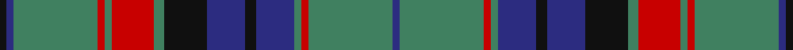

This page is one **sett** — a single exact thread-count. It belongs to the [tartan](/tartans/k2db2g24r2g2r12g3k12db11k3db11g2r2g24db2/)
(the same proportion at any scale), whose colour order is pattern [BGRGBKBKGRGRGBK](/stripes/bgrgbkbkgrgrgbk/).

Sourced from register-of-tartans.  It is a [15 stripe tartan](/stripes/stripes15/).

Original link https://www.tartanregister.gov.uk/tartanDetails.aspx?ref=4375

2 attestations — the source records this cloth was collapsed from (oldest owns this page)

<ul>
<li>01/01/1982 — MacInroy Hunting (register-of-tartans, <a href="https://www.tartanregister.gov.uk/tartanDetails.aspx?ref=4375">record</a>)</li>
<li>1982 — MacInroy Hunting (Clan?) (tartans-authority, <a href="http://www.tartansauthority.com/tartan-ferret/display/6321/">record</a>)</li>
</ul>

## Register references

External register numbers recorded for this tartan.

- Scottish Register of Tartans: [4375](https://www.tartanregister.gov.uk/tartanDetails.aspx?ref=4375)
- Scottish Tartans Authority (ITI): 6321

## Thread count
K/4 DB4 G48 R4 G4 R24 G6 K24 DB22 K6 DB22 G4 R4 G48 DB/4

## Palette

Palette: <strong>Tartan Register</strong>
<table><thead><tr><th>Colour</th><th>Threads</th><th>Shade</th><th>Base</th><th>OKLCh</th></tr></thead><tbody><tr><td>K/</td><td style="text-align:right;font-variant-numeric:tabular-nums">4</td><td><code style="background-color:#101010;">#101010</code> <small style="color:#888">#101010</small></td><td>K <code style="background-color:#000000;">#000000</code></td><td><small style="color:#888">oklch(17.3% 0.000 89.9)</small></td></tr><tr><td>DB</td><td style="text-align:right;font-variant-numeric:tabular-nums">4</td><td><code style="background-color:#2C2C80;">#2C2C80</code> <small style="color:#888">#2C2C80</small></td><td>B <code style="background-color:#2A418A;">#2A418A</code></td><td><small style="color:#888">oklch(35.0% 0.138 276.6)</small></td></tr><tr><td>G</td><td style="text-align:right;font-variant-numeric:tabular-nums">48</td><td><code style="background-color:#408060;">#408060</code> <small style="color:#888">#408060</small></td><td>G <code style="background-color:#006100;">#006100</code></td><td><small style="color:#888">oklch(54.8% 0.084 160.1)</small></td></tr><tr><td>R</td><td style="text-align:right;font-variant-numeric:tabular-nums">4</td><td><code style="background-color:#C80000;">#C80000</code> <small style="color:#888">#C80000</small></td><td>R <code style="background-color:#CC0000;">#CC0000</code></td><td><small style="color:#888">oklch(52.3% 0.215 29.2)</small></td></tr><tr><td>G</td><td style="text-align:right;font-variant-numeric:tabular-nums">4</td><td><code style="background-color:#408060;">#408060</code> <small style="color:#888">#408060</small></td><td>G <code style="background-color:#006100;">#006100</code></td><td><small style="color:#888">oklch(54.8% 0.084 160.1)</small></td></tr><tr><td>R</td><td style="text-align:right;font-variant-numeric:tabular-nums">24</td><td><code style="background-color:#C80000;">#C80000</code> <small style="color:#888">#C80000</small></td><td>R <code style="background-color:#CC0000;">#CC0000</code></td><td><small style="color:#888">oklch(52.3% 0.215 29.2)</small></td></tr><tr><td>G</td><td style="text-align:right;font-variant-numeric:tabular-nums">6</td><td><code style="background-color:#408060;">#408060</code> <small style="color:#888">#408060</small></td><td>G <code style="background-color:#006100;">#006100</code></td><td><small style="color:#888">oklch(54.8% 0.084 160.1)</small></td></tr><tr><td>K</td><td style="text-align:right;font-variant-numeric:tabular-nums">24</td><td><code style="background-color:#101010;">#101010</code> <small style="color:#888">#101010</small></td><td>K <code style="background-color:#000000;">#000000</code></td><td><small style="color:#888">oklch(17.3% 0.000 89.9)</small></td></tr><tr><td>DB</td><td style="text-align:right;font-variant-numeric:tabular-nums">22</td><td><code style="background-color:#2C2C80;">#2C2C80</code> <small style="color:#888">#2C2C80</small></td><td>B <code style="background-color:#2A418A;">#2A418A</code></td><td><small style="color:#888">oklch(35.0% 0.138 276.6)</small></td></tr><tr><td>K</td><td style="text-align:right;font-variant-numeric:tabular-nums">6</td><td><code style="background-color:#101010;">#101010</code> <small style="color:#888">#101010</small></td><td>K <code style="background-color:#000000;">#000000</code></td><td><small style="color:#888">oklch(17.3% 0.000 89.9)</small></td></tr><tr><td>DB</td><td style="text-align:right;font-variant-numeric:tabular-nums">22</td><td><code style="background-color:#2C2C80;">#2C2C80</code> <small style="color:#888">#2C2C80</small></td><td>B <code style="background-color:#2A418A;">#2A418A</code></td><td><small style="color:#888">oklch(35.0% 0.138 276.6)</small></td></tr><tr><td>G</td><td style="text-align:right;font-variant-numeric:tabular-nums">4</td><td><code style="background-color:#408060;">#408060</code> <small style="color:#888">#408060</small></td><td>G <code style="background-color:#006100;">#006100</code></td><td><small style="color:#888">oklch(54.8% 0.084 160.1)</small></td></tr><tr><td>R</td><td style="text-align:right;font-variant-numeric:tabular-nums">4</td><td><code style="background-color:#C80000;">#C80000</code> <small style="color:#888">#C80000</small></td><td>R <code style="background-color:#CC0000;">#CC0000</code></td><td><small style="color:#888">oklch(52.3% 0.215 29.2)</small></td></tr><tr><td>G</td><td style="text-align:right;font-variant-numeric:tabular-nums">48</td><td><code style="background-color:#408060;">#408060</code> <small style="color:#888">#408060</small></td><td>G <code style="background-color:#006100;">#006100</code></td><td><small style="color:#888">oklch(54.8% 0.084 160.1)</small></td></tr><tr><td>DB/</td><td style="text-align:right;font-variant-numeric:tabular-nums">4</td><td><code style="background-color:#2C2C80;">#2C2C80</code> <small style="color:#888">#2C2C80</small></td><td>B <code style="background-color:#2A418A;">#2A418A</code></td><td><small style="color:#888">oklch(35.0% 0.138 276.6)</small></td></tr></tbody></table>

## Nearest tartans

The nearest existing variants by ΔTartan distance, with this tartan at the top so the swatches line up against it.

ΔTartan

Tartan

Sett

—

<a href="/ttd/edit/#slug=k2db2g24r2g2r12g3k12db11k3db11g2r2g24db2~x2">MacInroy Hunting</a> <a class="nn-out" href="/setts/s15/k2db2g24r2g2r12g3k12db11k3db11g2r2g24db2~x2/" title="open its dictionary page">↗</a>

0.97

<a href="/ttd/edit/#slug=o16k2o3k2o4k10n27lr2n8lr2n27k10o4k2o3k2o16n2~x2">Highland Granite Weavers Tartan Tartan Number: 6499. Earliest known date: 2005 The colours reflect the imposing scenery when journeying north from Perth to Inverness or through to Royal Deeside, granite being the predominant composition of the surrounding unique hills and mountains. This tartan is for those wishing to embrace the growing popularity of the kilt who may either have no strong clan tartan connection, or who wish to wear a tartan different from their own. See products available Copyright © Blair Urquhart, Comrie, 2015</a> <a class="nn-out" href="/setts/s18/o16k2o3k2o4k10n27lr2n8lr2n27k10o4k2o3k2o16n2~x2/" title="open its dictionary page">↗</a>

0.99

<a href="/ttd/edit/#slug=db4o17db4y4db2y4db4y27db4ly4~x2">Cape Breton University Chemistry Society</a> <a class="nn-out" href="/setts/s10/db4o17db4y4db2y4db4y27db4ly4~x2/" title="open its dictionary page">↗</a>

1.01

<a href="/ttd/edit/#slug=gi24dp4gi3dp8k3t8dp2t2dp4t2dp2t8k3dp8gi3dp4gi24g2~x2">Jones Hunting</a> <a class="nn-out" href="/setts/s18/gi24dp4gi3dp8k3t8dp2t2dp4t2dp2t8k3dp8gi3dp4gi24g2~x2/" title="open its dictionary page">↗</a>

1.03

<a href="/setts/s16/db12r1db1r1db1r4g12ly1g2~x4/">Durie Clan Tartan Tartan Number: 2228. Earliest known date: 1988 When the matriculation of the Durie 'Arms' was updated in June 1988, this tartan was designed for family use by Harry G Lindlay of Kinloch &amp; Anderson of Edinburgh. The design is said to be based on the Argyle &amp; Southern Highlanders regimental tartan - the yellow is from the mess dress (military uniform evening wear) facings (lapels) and the burgundy represents the Durie family's French connections. Andrew, son of Lt. Col. Raymond Varley Dewar Durie succeded his father as clan chieftain in 1999. See products available Copyright © Blair Urquhart, Comrie, 2015</a>

1.07

<a href="/ttd/edit/#slug=g12k12r1k1r1k12b12r1b12k12r1k1r1k12g12k1~x4">Guthrie</a> <a class="nn-out" href="/setts/s16/g12k12r1k1r1k12b12r1b12k12r1k1r1k12g12k1~x4/" title="open its dictionary page">↗</a>

1.15

<a href="/ttd/edit/#slug=db2t1r2g16r2db6t1r2g6r2db16t1r2g2~x2">Glen Orchy</a> <a class="nn-out" href="/setts/s14/db2t1r2g16r2db6t1r2g6r2db16t1r2g2~x2/" title="open its dictionary page">↗</a>

1.16

<a href="/ttd/edit/#slug=dt15lb15g3r2g26r2g3lb15dt26r2dt3lb4dt3r2dt11~x2">Grampian Trade Tartan Tartan Number: 2151. Earliest known date: 1993 Designed as a district tartan to reflect the colours of the Grampian Mountains. MacNaughtons of Pitlochry introduced this sett with their new range of district tartans in 1993. See products available Copyright © Blair Urquhart, Comrie, 2015</a> <a class="nn-out" href="/setts/s15/dt15lb15g3r2g26r2g3lb15dt26r2dt3lb4dt3r2dt11~x2/" title="open its dictionary page">↗</a>

1.19

<a href="/setts/s16/k4b4k2b4k2b22dy27ly2r3~x2/">Falkirk District Tartan Tartan Number: 2347. Earliest known date: 1989 The original Falkirk &quot;Tartan&quot; , now in the National Museum of Scotland, has a place in history as one of the earliest examples of Scottish cloth in existence. It is a direct link back to the Roman occupation of the area around 250 A.D.and was found stuffed into a pot filled with over 2000 silver coins. This early Celtic tweed used undyed yarn to give a herringbone pattern in brown hues and is considered to be a &quot;poor man's plaid&quot;. The Falkirk District Tartan is alive with vibrant colour to reflect that part of Scotland as it is seen today. It was the winning entry by Jim McGeorge (aided by Tony Murray of Stirling) in a public competition run by Falkirk Town Centre Management to create a new image for an area that was rising from the ashes of its former industrial glory. Brown - represents the dominant colour of the original cloth; blue - links Falkirk district with sea via the River Forth and the canals. It is also the colour of the Falkirk &quot;Bairns.&quot; Red - is the colour of the blast furnace flames from the Falkirk foundries and yellow - signifies wealth and prosperity. Black - the black lines intersect on blue to show Falkirk at the crossroads of all roads through the region. See products available Copyright © Blair Urquhart, Comrie, 2015</a>

1.19

<a href="/ttd/edit/#slug=db18n16o11n20k7n7k11n7k7n35k52n71o7k7o12">CBS (Corporate)</a> <a class="nn-out" href="/setts/s15/db18n16o11n20k7n7k11n7k7n35k52n71o7k7o12/" title="open its dictionary page">↗</a>

1.19

<a href="/ttd/edit/#slug=b4k7lo3k3b34k17b4k5b4k7loi11b5lo4~x2">State Seal of Oregon (Fashion)</a> <a class="nn-out" href="/setts/s13/b4k7lo3k3b34k17b4k5b4k7loi11b5lo4~x2/" title="open its dictionary page">↗</a>

## Neighbour map

Every grey dot is one of 14359 variants placed by the first two principal components of the ΔTartan feature space (44% of its variance). Red is this tartan; blue dots are its nearest — click one to open its page.

<svg viewBox="0 0 640 380" role="img" style="max-width:100%;height:auto;border:1px solid #e0e0e0;border-radius:4px;display:block" xmlns="http://www.w3.org/2000/svg"><image href="/nn/cloud.v1.png" width="640" height="380"/><a href="/setts/s18/o16k2o3k2o4k10n27lr2n8lr2n27k10o4k2o3k2o16n2~x2/"><circle cx="272.7" cy="155.4" r="4" fill="#3465a4"><title>Highland Granite Weavers Tartan Tartan Number: 6499. Earliest known date: 2005 The colours reflect the imposing scenery when journeying north from Perth to Inverness or through to Royal Deeside, granite being the predominant composition of the surrounding unique hills and mountains. This tartan is for those wishing to embrace the growing popularity of the kilt who may either have no strong clan tartan connection, or who wish to wear a tartan different from their own. See products available Copyright © Blair Urquhart, Comrie, 2015</title></circle></a><a href="/setts/s10/db4o17db4y4db2y4db4y27db4ly4~x2/"><circle cx="280.5" cy="176.0" r="4" fill="#3465a4"><title>Cape Breton University Chemistry Society</title></circle></a><a href="/setts/s18/gi24dp4gi3dp8k3t8dp2t2dp4t2dp2t8k3dp8gi3dp4gi24g2~x2/"><circle cx="238.5" cy="138.5" r="4" fill="#3465a4"><title>Jones Hunting</title></circle></a><a href="/setts/s16/db12r1db1r1db1r4g12ly1g2~x4/"><circle cx="275.4" cy="153.2" r="4" fill="#3465a4"><title>Durie Clan Tartan Tartan Number: 2228. Earliest known date: 1988 When the matriculation of the Durie 'Arms' was updated in June 1988, this tartan was designed for family use by Harry G Lindlay of Kinloch &amp; Anderson of Edinburgh. The design is said to be based on the Argyle &amp; Southern Highlanders regimental tartan - the yellow is from the mess dress (military uniform evening wear) facings (lapels) and the burgundy represents the Durie family's French connections. Andrew, son of Lt. Col. Raymond Varley Dewar Durie succeded his father as clan chieftain in 1999. See products available Copyright © Blair Urquhart, Comrie, 2015</title></circle></a><a href="/setts/s16/g12k12r1k1r1k12b12r1b12k12r1k1r1k12g12k1~x4/"><circle cx="239.2" cy="170.8" r="4" fill="#3465a4"><title>Guthrie</title></circle></a><a href="/setts/s14/db2t1r2g16r2db6t1r2g6r2db16t1r2g2~x2/"><circle cx="259.3" cy="150.0" r="4" fill="#3465a4"><title>Glen Orchy</title></circle></a><a href="/setts/s15/dt15lb15g3r2g26r2g3lb15dt26r2dt3lb4dt3r2dt11~x2/"><circle cx="226.6" cy="156.8" r="4" fill="#3465a4"><title>Grampian Trade Tartan Tartan Number: 2151. Earliest known date: 1993 Designed as a district tartan to reflect the colours of the Grampian Mountains. MacNaughtons of Pitlochry introduced this sett with their new range of district tartans in 1993. See products available Copyright © Blair Urquhart, Comrie, 2015</title></circle></a><a href="/setts/s16/k4b4k2b4k2b22dy27ly2r3~x2/"><circle cx="267.9" cy="137.2" r="4" fill="#3465a4"><title>Falkirk District Tartan Tartan Number: 2347. Earliest known date: 1989 The original Falkirk &quot;Tartan&quot; , now in the National Museum of Scotland, has a place in history as one of the earliest examples of Scottish cloth in existence. It is a direct link back to the Roman occupation of the area around 250 A.D.and was found stuffed into a pot filled with over 2000 silver coins. This early Celtic tweed used undyed yarn to give a herringbone pattern in brown hues and is considered to be a &quot;poor man's plaid&quot;. The Falkirk District Tartan is alive with vibrant colour to reflect that part of Scotland as it is seen today. It was the winning entry by Jim McGeorge (aided by Tony Murray of Stirling) in a public competition run by Falkirk Town Centre Management to create a new image for an area that was rising from the ashes of its former industrial glory. Brown - represents the dominant colour of the original cloth; blue - links Falkirk district with sea via the River Forth and the canals. It is also the colour of the Falkirk &quot;Bairns.&quot; Red - is the colour of the blast furnace flames from the Falkirk foundries and yellow - signifies wealth and prosperity. Black - the black lines intersect on blue to show Falkirk at the crossroads of all roads through the region. See products available Copyright © Blair Urquhart, Comrie, 2015</title></circle></a><a href="/setts/s15/db18n16o11n20k7n7k11n7k7n35k52n71o7k7o12/"><circle cx="312.4" cy="184.9" r="4" fill="#3465a4"><title>CBS (Corporate)</title></circle></a><a href="/setts/s13/b4k7lo3k3b34k17b4k5b4k7loi11b5lo4~x2/"><circle cx="244.6" cy="164.3" r="4" fill="#3465a4"><title>State Seal of Oregon (Fashion)</title></circle></a><circle cx="252.8" cy="160.6" r="5" fill="#c00000"/></svg>

ID: /setts/s15/k2db2g24r2g2r12g3k12db11k3db11g2r2g24db2~x2/
