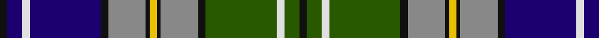

**Bands:** [KBWBKRKYKRKGWGK](/stripes/kbwbkrkykrkgwgk/) · **Stripes:** [K DB W DB K O K LY K O K DG W DG K](/stripes/stripes15/) K DB W DB K O K LY K O K DG W DG K

This was sourced from register-of-tartans.  It is a [15 band tartan](/bands/bands15/).

Original link https://www.tartanregister.gov.uk/tartanDetails.aspx?ref=2438

## Attestations

This cloth appears in 3 source records; the oldest owns this page.

- 01/03/2000 — MacGiboney/MacGibboney (register-of-tartans, [record](https://www.tartanregister.gov.uk/tartanDetails.aspx?ref=2438))
- June 2000 — McGibboney (Name) (tartans-authority, [record](http://www.tartansauthority.com/tartan-ferret/display/2693/))
- undated — MacGibboney Clan/Family Tartan Tartan Number: 2693. Earliest known date: June 2000 Designed by the late Donald Suttie Smith of Heraldic Graphics, Glasgow for Greg McGibonney of Fremont CA - descendant of a Scottish family that moved to the USA via Ireland in the 1760s. It is found in Pennsylvania, North Carolina, and Highlands of Tennessee. The tartan may be used by anyone of the name or its variants. See products available Copyright © Blair Urquhart, Comrie, 2015 (house-of-tartan, [record](http://www.house-of-tartan.scotland.net/house/TartanViewjs.asp?colr=Def&tnam=2693))

## Register references

External register numbers recorded for this tartan.

- Scottish Register of Tartans: [2438](https://www.tartanregister.gov.uk/tartanDetails.aspx?ref=2438)
- Scottish Tartans Authority (ITI): 2693
- Scottish Tartans World Register: 2693

## Thread count
K/4 DB8 LN4 DB38 K4 N20 K2 Y4 K2 N20 K4 G38 LN4 G8 K/4

## Palette
Each colour and its ΔE from the base-6 reference it is a variant of.

| Colour | Shade | Base | ΔE (OKLab) |
|---|---|---|---|
| DB | <code style="background-color:#1C0070;">#1C0070</code> `#1C0070` | B <code style="background-color:#2A418A;">#2A418A</code> | 0.14 |
| G | <code style="background-color:#285800;">#285800</code> `#285800` | G <code style="background-color:#006100;">#006100</code> | 0.03 |
| K | <code style="background-color:#101010;">#101010</code> `#101010` | K <code style="background-color:#000000;">#000000</code> | 0.17 |
| LN | <code style="background-color:#E0E0E0;">#E0E0E0</code> `#E0E0E0` | W <code style="background-color:#F7F7F7;">#F7F7F7</code> | 0.07 |
| N | <code style="background-color:#888888;">#888888</code> `#888888` | R <code style="background-color:#CC0000;">#CC0000</code> | 0.24 |
| Y | <code style="background-color:#E8C000;">#E8C000</code> `#E8C000` | Y <code style="background-color:#F2BF00;">#F2BF00</code> | 0.02 |

## Nearest tartans

The nearest existing variants by ΔTartan distance.

1. [Joseph Linn Family (Monohon 2012) (Personal)](/setts/s15/w3db3r1db3r1db15r1db2g15o1g2k20o1k2o2~x2/) — ΔT 0.88
1. [Ferrari (Coldrerio)](/setts/s19/ly6n2ly2n1k1n1lo4n2lo2n17k2n3k8n3k2n17k2n2lo2~x2/) — ΔT 0.89
1. [Reston (Personal)](/setts/s13/t4g32k2t4k2ly5k3ly5k2t4k2db32w4~x2/) — ΔT 0.93
1. [Linn (Personal)](/setts/s15/w3db3r1db3r1db15r1db2g15lo1g2k20lo1k2lo2~x2/) — ΔT 0.94
1. [Royal Scottish Pipe Band Association](/setts/s12/lb6k1t20r2g3r2k15r2g3r2k6k3~x2/) — ΔT 0.98
1. [Liberton](/setts/s13/k5lr5ly2lr5k5dt25k5lr3dg5r2dg5lr3k5~x2/) — ΔT 0.99
1. [Louise of Lorne #2](/setts/s13/r4dg22k16ly2k3w3k2db20r8k2r4k1w2~x2/) — ΔT 1.03
1. [St Andrew](/setts/s14/w4db20k1g2k1g2k4g1w2g1k4g16dp8g1~x2/) — ΔT 1.06
1. [Joseph Linn Family (Monohon) Name Tartan Tartan Number: 10722. Earliest known date: 22 October 2012 Designed by Euan Dalgliesh and Joseph Linn. Joseph Linn and his wife, CathyJo, retired to the Monohon community on the shores of Lake Sammamish before the first of the next generation came into the world in October 2012. This tartan celebrates their recommitment to their family values and Celtic heritage. It also symbolises their hopes for a strong family connection for generations to come. See products available Copyright © Blair Urquhart, Comrie, 2015](/setts/s15/w3db3k1db3k1db15k1db2g15o1g2k20o1k2o2~x2/) — ΔT 1.09
1. [Anstey (Personal)](/setts/s15/w6db6w3db44dg20g8dg2g8dg6r3dg2r3dg4w25lo4/) — ΔT 1.09

## Neighbour map

Every grey dot is one of 14313 variants placed by the first two principal components of the ΔTartan feature space (44% of its variance). Red is this tartan; blue dots are its nearest — click one to open its page.

<svg viewBox="0 0 640 380" role="img" style="max-width:100%;height:auto;border:1px solid #e0e0e0;border-radius:4px;display:block" xmlns="http://www.w3.org/2000/svg"><image href="/nn/cloud.v1.png" width="640" height="380"/><a href="/setts/s15/w3db3r1db3r1db15r1db2g15o1g2k20o1k2o2~x2/"><circle cx="144.1" cy="84.7" r="4" fill="#3465a4"><title>Joseph Linn Family (Monohon 2012) (Personal)</title></circle></a><a href="/setts/s19/ly6n2ly2n1k1n1lo4n2lo2n17k2n3k8n3k2n17k2n2lo2~x2/"><circle cx="145.0" cy="91.3" r="4" fill="#3465a4"><title>Ferrari (Coldrerio)</title></circle></a><a href="/setts/s13/t4g32k2t4k2ly5k3ly5k2t4k2db32w4~x2/"><circle cx="136.7" cy="91.6" r="4" fill="#3465a4"><title>Reston (Personal)</title></circle></a><a href="/setts/s15/w3db3r1db3r1db15r1db2g15lo1g2k20lo1k2lo2~x2/"><circle cx="159.2" cy="90.3" r="4" fill="#3465a4"><title>Linn (Personal)</title></circle></a><a href="/setts/s12/lb6k1t20r2g3r2k15r2g3r2k6k3~x2/"><circle cx="136.6" cy="96.5" r="4" fill="#3465a4"><title>Royal Scottish Pipe Band Association</title></circle></a><a href="/setts/s13/k5lr5ly2lr5k5dt25k5lr3dg5r2dg5lr3k5~x2/"><circle cx="131.4" cy="130.6" r="4" fill="#3465a4"><title>Liberton</title></circle></a><a href="/setts/s13/r4dg22k16ly2k3w3k2db20r8k2r4k1w2~x2/"><circle cx="121.3" cy="95.7" r="4" fill="#3465a4"><title>Louise of Lorne #2</title></circle></a><a href="/setts/s14/w4db20k1g2k1g2k4g1w2g1k4g16dp8g1~x2/"><circle cx="169.7" cy="104.2" r="4" fill="#3465a4"><title>St Andrew</title></circle></a><a href="/setts/s15/w3db3k1db3k1db15k1db2g15o1g2k20o1k2o2~x2/"><circle cx="145.5" cy="88.7" r="4" fill="#3465a4"><title>Joseph Linn Family (Monohon) Name Tartan Tartan Number: 10722. Earliest known date: 22 October 2012 Designed by Euan Dalgliesh and Joseph Linn. Joseph Linn and his wife, CathyJo, retired to the Monohon community on the shores of Lake Sammamish before the first of the next generation came into the world in October 2012. This tartan celebrates their recommitment to their family values and Celtic heritage. It also symbolises their hopes for a strong family connection for generations to come. See products available Copyright © Blair Urquhart, Comrie, 2015</title></circle></a><a href="/setts/s15/w6db6w3db44dg20g8dg2g8dg6r3dg2r3dg4w25lo4/"><circle cx="136.0" cy="72.3" r="4" fill="#3465a4"><title>Anstey (Personal)</title></circle></a><circle cx="119.2" cy="95.1" r="5" fill="#c00000"/></svg>

ID: /setts/s15/k2db4w2db19k2o10k1ly2k1o10k2dg19w2dg4k2~x2/
