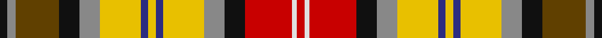

**Bands:** [KRGKRYBYBYRKRWR](/stripes/krgkrybybyrkrwr/) · **Stripes:** [K O DY K O LY DB LY DB LY O K R W R](/stripes/stripes15/) K O DY K O LY DB LY DB LY O K R W R

This was sourced from register-of-tartans.  It is a [15 band tartan](/bands/bands15/).

Original link https://www.tartanregister.gov.uk/tartanDetails.aspx?ref=5810

## Register references

External register numbers recorded for this tartan.

- Scottish Register of Tartans: [5810](https://www.tartanregister.gov.uk/tartanDetails.aspx?ref=5810)
- Scottish Tartans Authority (ITI): 7859

## Thread count
K/6 N7 T36 K17 N17 Y34 DB6 Y6 DB6 Y34 N17 K17 R39 LN4 R/6

## Palette
Each colour and its ΔE from the base-6 reference it is a variant of.

| Colour | Shade | Base | ΔE (OKLab) |
|---|---|---|---|
| DB | <code style="background-color:#2C2C80;">#2C2C80</code> `#2C2C80` | B <code style="background-color:#2A418A;">#2A418A</code> | 0.06 |
| K | <code style="background-color:#101010;">#101010</code> `#101010` | K <code style="background-color:#000000;">#000000</code> | 0.17 |
| LN | <code style="background-color:#E0E0E0;">#E0E0E0</code> `#E0E0E0` | W <code style="background-color:#F7F7F7;">#F7F7F7</code> | 0.07 |
| N | <code style="background-color:#888888;">#888888</code> `#888888` | R <code style="background-color:#CC0000;">#CC0000</code> | 0.24 |
| R | <code style="background-color:#C80000;">#C80000</code> `#C80000` | R <code style="background-color:#CC0000;">#CC0000</code> | 0.01 |
| T | <code style="background-color:#604000;">#604000</code> `#604000` | G <code style="background-color:#006100;">#006100</code> | 0.14 |
| Y | <code style="background-color:#E8C000;">#E8C000</code> `#E8C000` | Y <code style="background-color:#F2BF00;">#F2BF00</code> | 0.02 |

## Nearest tartans

The nearest existing variants by ΔTartan distance.

1. [Bonnie Prince Charlie (Hudson Bay)](/setts/s15/w9dy14do11dy3lo11ly7w1do3w1ly7dy7do3w2t2w2~x2/) — ΔT 1.12
1. [Hudson Bay Company Artifact](/setts/s15/w9o14dr11o3o11ly7w1dr3w1ly7o7dr3w2b2w2~x2/) — ΔT 1.15
1. [Gordon, dress 5](/setts/s13/w6db3w18k5w5dr10o17ly4o17dr10t10dr2t4~x2/) — ΔT 1.17
1. [Hovington (2014)](/setts/s13/k2w1lo6r6w1k2lb2do3lb2k1lb2g3lb2~x2/) — ΔT 1.18
1. [Cree (Fashion)](/setts/s13/w3r3k3r6g6k2w3k2ly3k6db2dy20ly3~x2/) — ΔT 1.18
1. [Gordon dress #5](/setts/s13/w6db3w18k5w5dy10o17ly4o17dy10t10dy2t4~x2/) — ΔT 1.20
1. [Unidentified Silk scarf](/setts/s10/w3r10dy6ly8t8dg32r8r10r6w3~x4/) — ΔT 1.21
1. [Mayo County Crest (Fashion)](/setts/s12/ly9y7db3r28db4y7db5t4db5g7db3w6~x2/) — ΔT 1.22
1. [Du Lion](/setts/s16/dy8db8dy3db1ly2dy10ly2db2ly15ly3k3ly15k1r3k8r8~x2/) — ΔT 1.26
1. [Wilson's No.110](/setts/s16/dp10w3k3g19r14t3k2ly3k2t3r14g19k3w3dp10t3~x2/) — ΔT 1.27

## Neighbour map

Every grey dot is one of 14299 variants placed by the first two principal components of the ΔTartan feature space (44% of its variance). Red is this tartan; blue dots are its nearest — click one to open its page.

<svg viewBox="0 0 640 380" role="img" style="max-width:100%;height:auto;border:1px solid #e0e0e0;border-radius:4px;display:block" xmlns="http://www.w3.org/2000/svg"><image href="/nn/cloud.v1.png" width="640" height="380"/><a href="/setts/s15/w9dy14do11dy3lo11ly7w1do3w1ly7dy7do3w2t2w2~x2/"><circle cx="65.0" cy="112.3" r="4" fill="#3465a4"><title>Bonnie Prince Charlie (Hudson Bay)</title></circle></a><a href="/setts/s15/w9o14dr11o3o11ly7w1dr3w1ly7o7dr3w2b2w2~x2/"><circle cx="70.1" cy="112.3" r="4" fill="#3465a4"><title>Hudson Bay Company Artifact</title></circle></a><a href="/setts/s13/w6db3w18k5w5dr10o17ly4o17dr10t10dr2t4~x2/"><circle cx="29.7" cy="125.9" r="4" fill="#3465a4"><title>Gordon, dress 5</title></circle></a><a href="/setts/s13/k2w1lo6r6w1k2lb2do3lb2k1lb2g3lb2~x2/"><circle cx="14.0" cy="132.6" r="4" fill="#3465a4"><title>Hovington (2014)</title></circle></a><a href="/setts/s13/w3r3k3r6g6k2w3k2ly3k6db2dy20ly3~x2/"><circle cx="66.6" cy="98.2" r="4" fill="#3465a4"><title>Cree (Fashion)</title></circle></a><a href="/setts/s13/w6db3w18k5w5dy10o17ly4o17dy10t10dy2t4~x2/"><circle cx="30.7" cy="126.5" r="4" fill="#3465a4"><title>Gordon dress #5</title></circle></a><a href="/setts/s10/w3r10dy6ly8t8dg32r8r10r6w3~x4/"><circle cx="93.1" cy="123.3" r="4" fill="#3465a4"><title>Unidentified Silk scarf</title></circle></a><a href="/setts/s12/ly9y7db3r28db4y7db5t4db5g7db3w6~x2/"><circle cx="74.0" cy="113.2" r="4" fill="#3465a4"><title>Mayo County Crest (Fashion)</title></circle></a><a href="/setts/s16/dy8db8dy3db1ly2dy10ly2db2ly15ly3k3ly15k1r3k8r8~x2/"><circle cx="38.5" cy="98.7" r="4" fill="#3465a4"><title>Du Lion</title></circle></a><a href="/setts/s16/dp10w3k3g19r14t3k2ly3k2t3r14g19k3w3dp10t3~x2/"><circle cx="77.3" cy="110.8" r="4" fill="#3465a4"><title>Wilson's No.110</title></circle></a><circle cx="33.4" cy="106.6" r="5" fill="#c00000"/></svg>

ID: /setts/s15/k6o7dy36k17o17ly34db6ly6db6ly34o17k17r39w4r6/
