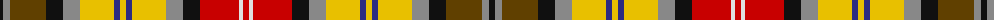

In pattern [KRGKRYBYBYRKRWR](/patterns/krgkrybybyrkrwr/).

This was sourced from register-of-tartans.  It is a [15 stripes tartan](/stripes/stripes15/).

Original link https://www.tartanregister.gov.uk/tartanDetails.aspx?ref=5810

## Thread count
K/6 N7 T36 K17 N17 Y34 DB6 Y6 DB6 Y34 N17 K17 R39 LN4 R/6

## Palette
Each colour and its ΔE from the base-6 reference it is a variant of.

| Colour | Shade | Base | ΔE (OKLab) |
|---|---|---|---|
| DB | <code style="background-color:#2C2C80;">#2C2C80</code> `#2C2C80` | B <code style="background-color:#2C4084;">#2C4084</code> | 0.05 |
| K | <code style="background-color:#101010;">#101010</code> `#101010` | K <code style="background-color:#000000;">#000000</code> | 0.17 |
| LN | <code style="background-color:#E0E0E0;">#E0E0E0</code> `#E0E0E0` | W <code style="background-color:#F4F4F0;">#F4F4F0</code> | 0.06 |
| N | <code style="background-color:#888888;">#888888</code> `#888888` | R <code style="background-color:#C80000;">#C80000</code> | 0.24 |
| R | <code style="background-color:#C80000;">#C80000</code> `#C80000` | R <code style="background-color:#C80000;">#C80000</code> | 0.00 |
| T | <code style="background-color:#604000;">#604000</code> `#604000` | G <code style="background-color:#006400;">#006400</code> | 0.14 |
| Y | <code style="background-color:#E8C000;">#E8C000</code> `#E8C000` | Y <code style="background-color:#E8C000;">#E8C000</code> | 0.00 |

## Nearest tartans

The nearest existing variants by ΔTartan distance.

1. [Bonnie Prince Charlie (Hudson Bay)](/setts/s15/w18g28b22g6y22ya14w2b6w2ya14g14b6w4ba4w4-b441800-ba2888c4-g604000-we0e0e0-ya08858-yae8c000/) — ΔT 1.11
1. [Hudson Bay Company Artifact](/setts/s15/w18r28b22r6ra22y14w2b6w2y14r14b6w4ba4w4-b401000-ba8080d0-r806050-ra906030-we0e0e0-yf0c000/) — ΔT 1.14
1. [Gordon, dress 5](/setts/s13/w12b6w36k10w10ba20r34y8r34ba20bb20ba4bb8-b304080-ba401000-bb5480b0-k000000-r906030-we0e0e0-yf0c000/) — ΔT 1.17
1. [Cree (Fashion)](/setts/s13/w6r6k6r12g12k4w6k4y6k12b4ga40y6-b2c2c80-g006818-ga603800-k101010-rc80000-wfcfcfc-ye8c000/) — ΔT 1.17
1. [Hovington (2014)](/setts/s13/k4w2y12r12w2k4wa4b6wa4k2wa4g6wa4-b4c3428-g00643c-k101010-rc8002c-wffffff-wae8ccb8-ye0a126/) — ΔT 1.18
1. [Gordon dress #5](/setts/s13/w12b6w36k10w10ba20r34y8r34ba20bb20ba4bb8-b2c4084-ba2a2303-bb3c82af-k101010-rbe7832-we0e0e0-ye8c000/) — ΔT 1.20
1. [Unidentified Silk scarf](/setts/s10/w12r40g24y32b32ga128ra32r40ra24w12-b3c82af-g503c14-ga005020-rdc0000-rac82828-we0e0e0-ye8c000/) — ΔT 1.21
1. [Mayo County Crest (Fashion)](/setts/s12/y18g14b6r56b8g14b10ba8b10ga14b6w12-b2c2c80-ba2888c4-g5c6428-ga006818-rc80000-we0e0e0-ye8c000/) — ΔT 1.21
1. [Du Lion](/setts/s16/g16b16g6b2y4g20y4b4y30y6k6y30k2r6k16r16-b202060-g604000-k101010-rc80000-ye8c000/) — ΔT 1.26
1. [Wilson's No.110](/setts/s16/b20w6k6g38r28ba6k4y6k4ba6r28g38k6w6b20ba6-b440044-ba5c8ca8-g006818-k101010-rc80000-we0e0e0-yd8b000/) — ΔT 1.27

## Neighbour map

Every grey dot is one of 15726 variants placed by the first two principal components of the ΔTartan feature space (44% of its variance). Red is this tartan; blue dots are its nearest — click one to open its page.

<svg viewBox="0 0 640 380" role="img" style="max-width:100%;height:auto;border:1px solid #e0e0e0;border-radius:4px;display:block" xmlns="http://www.w3.org/2000/svg"><image href="/nn/cloud.v1.png" width="640" height="380"/><a href="/setts/s15/w18g28b22g6y22ya14w2b6w2ya14g14b6w4ba4w4-b441800-ba2888c4-g604000-we0e0e0-ya08858-yae8c000/"><circle cx="61.0" cy="112.6" r="4" fill="#3465a4"><title>Bonnie Prince Charlie (Hudson Bay)</title></circle></a><a href="/setts/s15/w18r28b22r6ra22y14w2b6w2y14r14b6w4ba4w4-b401000-ba8080d0-r806050-ra906030-we0e0e0-yf0c000/"><circle cx="66.2" cy="112.5" r="4" fill="#3465a4"><title>Hudson Bay Company Artifact</title></circle></a><a href="/setts/s13/w12b6w36k10w10ba20r34y8r34ba20bb20ba4bb8-b304080-ba401000-bb5480b0-k000000-r906030-we0e0e0-yf0c000/"><circle cx="25.6" cy="126.7" r="4" fill="#3465a4"><title>Gordon, dress 5</title></circle></a><a href="/setts/s13/w6r6k6r12g12k4w6k4y6k12b4ga40y6-b2c2c80-g006818-ga603800-k101010-rc80000-wfcfcfc-ye8c000/"><circle cx="61.8" cy="98.3" r="4" fill="#3465a4"><title>Cree (Fashion)</title></circle></a><a href="/setts/s13/k4w2y12r12w2k4wa4b6wa4k2wa4g6wa4-b4c3428-g00643c-k101010-rc8002c-wffffff-wae8ccb8-ye0a126/"><circle cx="14.0" cy="134.3" r="4" fill="#3465a4"><title>Hovington (2014)</title></circle></a><a href="/setts/s13/w12b6w36k10w10ba20r34y8r34ba20bb20ba4bb8-b2c4084-ba2a2303-bb3c82af-k101010-rbe7832-we0e0e0-ye8c000/"><circle cx="26.7" cy="127.1" r="4" fill="#3465a4"><title>Gordon dress #5</title></circle></a><a href="/setts/s10/w12r40g24y32b32ga128ra32r40ra24w12-b3c82af-g503c14-ga005020-rdc0000-rac82828-we0e0e0-ye8c000/"><circle cx="89.2" cy="122.5" r="4" fill="#3465a4"><title>Unidentified Silk scarf</title></circle></a><a href="/setts/s12/y18g14b6r56b8g14b10ba8b10ga14b6w12-b2c2c80-ba2888c4-g5c6428-ga006818-rc80000-we0e0e0-ye8c000/"><circle cx="69.6" cy="112.7" r="4" fill="#3465a4"><title>Mayo County Crest (Fashion)</title></circle></a><a href="/setts/s16/g16b16g6b2y4g20y4b4y30y6k6y30k2r6k16r16-b202060-g604000-k101010-rc80000-ye8c000/"><circle cx="34.0" cy="99.4" r="4" fill="#3465a4"><title>Du Lion</title></circle></a><a href="/setts/s16/b20w6k6g38r28ba6k4y6k4ba6r28g38k6w6b20ba6-b440044-ba5c8ca8-g006818-k101010-rc80000-we0e0e0-yd8b000/"><circle cx="72.3" cy="109.5" r="4" fill="#3465a4"><title>Wilson's No.110</title></circle></a><circle cx="29.4" cy="107.3" r="5" fill="#c00000"/></svg>

ID: /setts/s15/k6r7g36k17r17y34b6y6b6y34r17k17ra39w4ra6-b2c2c80-g604000-k101010-r888888-rac80000-we0e0e0-ye8c000/
