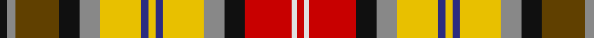

In pattern [KRGKRYBYBYRKRWR](/patterns/krgkrybybyrkrwr/).

This was sourced from register-of-tartans.  It is a [15 stripes tartan](/stripes/stripes15/).

Original link https://www.tartanregister.gov.uk/tartanDetails.aspx?ref=5810

## Register references

External register numbers recorded for this tartan.

- Scottish Register of Tartans: [5810](https://www.tartanregister.gov.uk/tartanDetails.aspx?ref=5810)
- Scottish Tartans Authority (ITI): 7859

## Thread count
K/6 N7 T36 K17 N17 Y34 DB6 Y6 DB6 Y34 N17 K17 R39 LN4 R/6

## Palette
Each colour and its ΔE from the base-6 reference it is a variant of.

| Colour | Shade | Base | ΔE (OKLab) |
|---|---|---|---|
| DB | <code style="background-color:#2C2C80;">#2C2C80</code> `#2C2C80` | B <code style="background-color:#2A418A;">#2A418A</code> | 0.06 |
| K | <code style="background-color:#101010;">#101010</code> `#101010` | K <code style="background-color:#000000;">#000000</code> | 0.17 |
| LN | <code style="background-color:#E0E0E0;">#E0E0E0</code> `#E0E0E0` | W <code style="background-color:#F7F7F7;">#F7F7F7</code> | 0.07 |
| N | <code style="background-color:#888888;">#888888</code> `#888888` | R <code style="background-color:#CC0000;">#CC0000</code> | 0.24 |
| R | <code style="background-color:#C80000;">#C80000</code> `#C80000` | R <code style="background-color:#CC0000;">#CC0000</code> | 0.01 |
| T | <code style="background-color:#604000;">#604000</code> `#604000` | G <code style="background-color:#006100;">#006100</code> | 0.14 |
| Y | <code style="background-color:#E8C000;">#E8C000</code> `#E8C000` | Y <code style="background-color:#F2BF00;">#F2BF00</code> | 0.02 |

## Nearest tartans

The nearest existing variants by ΔTartan distance.

1. [Bonnie Prince Charlie (Hudson Bay)](/setts/s15/w9g14b11g3y11ya7w1b3w1ya7g7b3w2ba2w2~b441800-ba2888c4-g604000-we0e0e0-ya08858-yae8c000~x2/) — ΔT 1.11
1. [Hudson Bay Company Artifact](/setts/s15/w9r14b11r3ra11y7w1b3w1y7r7b3w2ba2w2~b401000-ba8080d0-r806050-ra906030-we0e0e0-yf0c000~x2/) — ΔT 1.14
1. [Gordon, dress 5](/setts/s13/w6b3w18k5w5ba10r17y4r17ba10bb10ba2bb4~b304080-ba401000-bb5480b0-k000000-r906030-we0e0e0-yf0c000~x2/) — ΔT 1.17
1. [Cree (Fashion)](/setts/s13/w3r3k3r6g6k2w3k2y3k6b2ga20y3~b2c2c80-g006818-ga603800-k101010-rc80000-wfcfcfc-ye8c000~x2/) — ΔT 1.18
1. [Hovington (2014)](/setts/s13/k2w1y6r6w1k2wa2b3wa2k1wa2g3wa2~b4c3428-g00643c-k101010-rc8002c-wffffff-wae8ccb8-ye0a126~x2/) — ΔT 1.18
1. [Gordon dress #5](/setts/s13/w6b3w18k5w5g10r17y4r17g10ba10g2ba4~b2c4084-ba3c82af-g2a2303-k101010-rbe7832-we0e0e0-ye8c000~x2/) — ΔT 1.20
1. [Unidentified Silk scarf](/setts/s10/w3r10g6y8b8ga32ra8r10ra6w3~b3c82af-g503c14-ga005020-rdc0000-rac82828-we0e0e0-ye8c000~x4/) — ΔT 1.22
1. [Mayo County Crest (Fashion)](/setts/s12/y9g7b3r28b4g7b5ba4b5ga7b3w6~b2c2c80-ba2888c4-g5c6428-ga006818-rc80000-we0e0e0-ye8c000~x2/) — ΔT 1.22
1. [Du Lion](/setts/s16/g8b8g3b1y2g10y2b2y15y3k3y15k1r3k8r8~b202060-g604000-k101010-rc80000-ye8c000~x2/) — ΔT 1.26
1. [Wilson's No.110](/setts/s16/b10w3k3g19r14ba3k2y3k2ba3r14g19k3w3b10ba3~b440044-ba5c8ca8-g006818-k101010-rc80000-we0e0e0-yd8b000~x2/) — ΔT 1.27

## Neighbour map

Every grey dot is one of 15726 variants placed by the first two principal components of the ΔTartan feature space (44% of its variance). Red is this tartan; blue dots are its nearest — click one to open its page.

<svg viewBox="0 0 640 380" role="img" style="max-width:100%;height:auto;border:1px solid #e0e0e0;border-radius:4px;display:block" xmlns="http://www.w3.org/2000/svg"><image href="/nn/cloud.v1.png" width="640" height="380"/><a href="/setts/s15/w9g14b11g3y11ya7w1b3w1ya7g7b3w2ba2w2~b441800-ba2888c4-g604000-we0e0e0-ya08858-yae8c000~x2/"><circle cx="62.9" cy="110.8" r="4" fill="#3465a4"><title>Bonnie Prince Charlie (Hudson Bay)</title></circle></a><a href="/setts/s15/w9r14b11r3ra11y7w1b3w1y7r7b3w2ba2w2~b401000-ba8080d0-r806050-ra906030-we0e0e0-yf0c000~x2/"><circle cx="68.2" cy="110.6" r="4" fill="#3465a4"><title>Hudson Bay Company Artifact</title></circle></a><a href="/setts/s13/w6b3w18k5w5ba10r17y4r17ba10bb10ba2bb4~b304080-ba401000-bb5480b0-k000000-r906030-we0e0e0-yf0c000~x2/"><circle cx="27.2" cy="124.9" r="4" fill="#3465a4"><title>Gordon, dress 5</title></circle></a><a href="/setts/s13/w3r3k3r6g6k2w3k2y3k6b2ga20y3~b2c2c80-g006818-ga603800-k101010-rc80000-wfcfcfc-ye8c000~x2/"><circle cx="64.2" cy="96.7" r="4" fill="#3465a4"><title>Cree (Fashion)</title></circle></a><a href="/setts/s13/k2w1y6r6w1k2wa2b3wa2k1wa2g3wa2~b4c3428-g00643c-k101010-rc8002c-wffffff-wae8ccb8-ye0a126~x2/"><circle cx="14.0" cy="131.8" r="4" fill="#3465a4"><title>Hovington (2014)</title></circle></a><a href="/setts/s13/w6b3w18k5w5g10r17y4r17g10ba10g2ba4~b2c4084-ba3c82af-g2a2303-k101010-rbe7832-we0e0e0-ye8c000~x2/"><circle cx="28.3" cy="125.1" r="4" fill="#3465a4"><title>Gordon dress #5</title></circle></a><a href="/setts/s10/w3r10g6y8b8ga32ra8r10ra6w3~b3c82af-g503c14-ga005020-rdc0000-rac82828-we0e0e0-ye8c000~x4/"><circle cx="91.4" cy="120.4" r="4" fill="#3465a4"><title>Unidentified Silk scarf</title></circle></a><a href="/setts/s12/y9g7b3r28b4g7b5ba4b5ga7b3w6~b2c2c80-ba2888c4-g5c6428-ga006818-rc80000-we0e0e0-ye8c000~x2/"><circle cx="72.0" cy="110.6" r="4" fill="#3465a4"><title>Mayo County Crest (Fashion)</title></circle></a><a href="/setts/s16/g8b8g3b1y2g10y2b2y15y3k3y15k1r3k8r8~b202060-g604000-k101010-rc80000-ye8c000~x2/"><circle cx="36.3" cy="97.4" r="4" fill="#3465a4"><title>Du Lion</title></circle></a><a href="/setts/s16/b10w3k3g19r14ba3k2y3k2ba3r14g19k3w3b10ba3~b440044-ba5c8ca8-g006818-k101010-rc80000-we0e0e0-yd8b000~x2/"><circle cx="74.9" cy="107.4" r="4" fill="#3465a4"><title>Wilson's No.110</title></circle></a><circle cx="31.5" cy="105.1" r="5" fill="#c00000"/></svg>

ID: /setts/s15/k6r7g36k17r17y34b6y6b6y34r17k17ra39w4ra6~b2c2c80-g604000-k101010-r888888-rac80000-we0e0e0-ye8c000/
