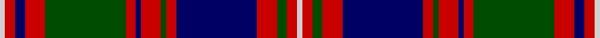

In pattern [WRBRGRBRGRBRGRW](/stripes/wrbrgrbrgrbrgrw/).

This was sourced from weddslist.  It is a [15 stripe tartan](/stripes/stripes15/).

Original link http://www.weddslist.com/cgi-bin/tartans/pg.pl?source=rb

## Thread count
N/2 R4 DB4 R8 G32 R4 DB2 R8 G2 R4 DB32 R8 G4 R4 N/2

## Palette
Each colour and the base-6 reference it is a variant of.

| Colour | Shade | Base |
|---|---|---|
| DB | <code style="background-color:#000064;">#000064</code> `oklch(22.7% 0.158 264.1)` <small>#000064</small> | B <code style="background-color:#2A418A;">#2A418A</code> |
| G | <code style="background-color:#004C00;">#004C00</code> `oklch(36.1% 0.123 142.5)` <small>#004C00</small> | G <code style="background-color:#006100;">#006100</code> |
| N | <code style="background-color:#D0D0D0;">#D0D0D0</code> `oklch(85.8% 0.000 89.9)` <small>#D0D0D0</small> | W <code style="background-color:#F7F7F7;">#F7F7F7</code> |
| R | <code style="background-color:#C80000;">#C80000</code> `oklch(52.3% 0.215 29.2)` <small>#C80000</small> | R <code style="background-color:#CC0000;">#CC0000</code> |

## Nearest tartans

The nearest existing variants by ΔTartan distance, with this tartan at the top so the swatches line up against it.

ΔTartan

Tartan

Sett

—

<a href="/ttd/edit/#slug=lb1r2dg2r4db16r2dg1r4db1r2dg16r4db2r2lb1~x2">MacIntyre</a> <a class="nn-out" href="/setts/s15/lb1r2dg2r4db16r2dg1r4db1r2dg16r4db2r2lb1~x2/" title="open its dictionary page">↗</a>

0.88

<a href="/ttd/edit/#slug=b1r2dg2r4db16r2dg1r4db1r2dg16r4db2r2b1~x2">MacIntyre</a> <a class="nn-out" href="/setts/s15/b1r2dg2r4db16r2dg1r4db1r2dg16r4db2r2b1~x2/" title="open its dictionary page">↗</a>

0.88

<a href="/ttd/edit/#slug=b1r2dg2r4db16r2dg1r4db1r2dg16r4db2r2b1">MacIntyre</a> <a class="nn-out" href="/setts/s15/b1r2dg2r4db16r2dg1r4db1r2dg16r4db2r2b1/" title="open its dictionary page">↗</a>

0.92

<a href="/ttd/edit/#slug=t1r2db2r4g16r2db2r4g2r2db16r4g2r2t1~x2">MacIntyre of Whitehouse (Clan?)</a> <a class="nn-out" href="/setts/s15/t1r2db2r4g16r2db2r4g2r2db16r4g2r2t1~x2/" title="open its dictionary page">↗</a>

1.04

<a href="/ttd/edit/#slug=o4n12k12n4o18n1o1n1o2n1o2n1o4n1o4~x4">Ettrick (Fashion)</a> <a class="nn-out" href="/setts/s15/o4n12k12n4o18n1o1n1o2n1o2n1o4n1o4~x4/" title="open its dictionary page">↗</a>

1.14

<a href="/ttd/edit/#slug=dp20k2w2k2dp2k10g3k2g20k2g3k10dp8k2~x2">Caithelyn (Personal)</a> <a class="nn-out" href="/setts/s14/dp20k2w2k2dp2k10g3k2g20k2g3k10dp8k2~x2/" title="open its dictionary page">↗</a>

1.17

<a href="/ttd/edit/#slug=r5k20n1k2n1k2n2k2n5o2n2o2n2o3n2o10w3~x2">Nike Golf Dark (Corporate)</a> <a class="nn-out" href="/setts/s17/r5k20n1k2n1k2n2k2n5o2n2o2n2o3n2o10w3~x2/" title="open its dictionary page">↗</a>

1.22

<a href="/ttd/edit/#slug=dp3m4g26k3dp4k16dp4k3m26g2~x2">Famous Grouse, The</a> <a class="nn-out" href="/setts/s10/dp3m4g26k3dp4k16dp4k3m26g2~x2/" title="open its dictionary page">↗</a>

1.25

<a href="/ttd/edit/#slug=dt43k4dt4k4dt4k26r32k4w10k4r32k26dt32k4r10">Frankfurt &amp; Disttrict P &amp; D (Corpora</a> <a class="nn-out" href="/setts/s15/dt43k4dt4k4dt4k26r32k4w10k4r32k26dt32k4r10/" title="open its dictionary page">↗</a>

1.26

<a href="/setts/s18/dg3dp2dg2dp2dg2dp20k20dg22k1o3~x4/">Urbino</a>

1.28

<a href="/ttd/edit/#slug=k4o4k1o4k1o8k1o4k8db2k1db14r2~x2">Fowler</a> <a class="nn-out" href="/setts/s13/k4o4k1o4k1o8k1o4k8db2k1db14r2~x2/" title="open its dictionary page">↗</a>

## Neighbour map

Every grey dot is one of 14299 variants placed by the first two principal components of the ΔTartan feature space (44% of its variance). Red is this tartan; blue dots are its nearest — click one to open its page.

<svg viewBox="0 0 640 380" role="img" style="max-width:100%;height:auto;border:1px solid #e0e0e0;border-radius:4px;display:block" xmlns="http://www.w3.org/2000/svg"><image href="/nn/cloud.v1.png" width="640" height="380"/><a href="/setts/s15/b1r2dg2r4db16r2dg1r4db1r2dg16r4db2r2b1~x2/"><circle cx="232.8" cy="138.3" r="4" fill="#3465a4"><title>MacIntyre</title></circle></a><a href="/setts/s15/b1r2dg2r4db16r2dg1r4db1r2dg16r4db2r2b1/"><circle cx="232.8" cy="138.3" r="4" fill="#3465a4"><title>MacIntyre</title></circle></a><a href="/setts/s15/t1r2db2r4g16r2db2r4g2r2db16r4g2r2t1~x2/"><circle cx="212.4" cy="129.3" r="4" fill="#3465a4"><title>MacIntyre of Whitehouse (Clan?)</title></circle></a><a href="/setts/s15/o4n12k12n4o18n1o1n1o2n1o2n1o4n1o4~x4/"><circle cx="197.1" cy="123.1" r="4" fill="#3465a4"><title>Ettrick (Fashion)</title></circle></a><a href="/setts/s14/dp20k2w2k2dp2k10g3k2g20k2g3k10dp8k2~x2/"><circle cx="199.2" cy="166.7" r="4" fill="#3465a4"><title>Caithelyn (Personal)</title></circle></a><a href="/setts/s17/r5k20n1k2n1k2n2k2n5o2n2o2n2o3n2o10w3~x2/"><circle cx="196.0" cy="94.2" r="4" fill="#3465a4"><title>Nike Golf Dark (Corporate)</title></circle></a><a href="/setts/s10/dp3m4g26k3dp4k16dp4k3m26g2~x2/"><circle cx="188.5" cy="154.7" r="4" fill="#3465a4"><title>Famous Grouse, The</title></circle></a><a href="/setts/s15/dt43k4dt4k4dt4k26r32k4w10k4r32k26dt32k4r10/"><circle cx="181.1" cy="162.8" r="4" fill="#3465a4"><title>Frankfurt &amp; Disttrict P &amp; D (Corpora</title></circle></a><a href="/setts/s18/dg3dp2dg2dp2dg2dp20k20dg22k1o3~x4/"><circle cx="228.8" cy="122.2" r="4" fill="#3465a4"><title>Urbino</title></circle></a><a href="/setts/s13/k4o4k1o4k1o8k1o4k8db2k1db14r2~x2/"><circle cx="202.8" cy="163.6" r="4" fill="#3465a4"><title>Fowler</title></circle></a><circle cx="208.7" cy="123.3" r="5" fill="#c00000"/></svg>

ID: /setts/s15/lb1r2dg2r4db16r2dg1r4db1r2dg16r4db2r2lb1~x2/
