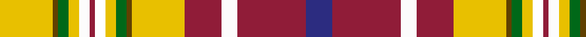

**Bands:** [YGGYWRKYGGYRWRB](/stripes/yggywrkyggyrwrb/) · **Stripes:** [LY DY G LY W R K LY G DY LY R W R DB](/stripes/stripes15/) LY DY G LY W R K LY G DY LY R W R DB

This was sourced from house-of-tartan.  It is a [15 band tartan](/bands/bands15/).

Original link http://www.house-of-tartan.scotland.net/house/TartanViewjs.asp?colr=Def&tnam=2294

## Thread count
Y/20 T2 G4 Y4 W4 DR2 CW4 Y4 G4 T2 Y20 DR14 Wa6 DR26 DB/10

## Palette
Each colour and its ΔE from the base-6 reference it is a variant of.

| Colour | Shade | Base | ΔE (OKLab) |
|---|---|---|---|
| DB | <code style="background-color:#2C2C80;">#2C2C80</code> `#2C2C80` | B <code style="background-color:#2A418A;">#2A418A</code> | 0.06 |
| DR | <code style="background-color:#901C38;">#901C38</code> `#901C38` | R <code style="background-color:#CC0000;">#CC0000</code> | 0.13 |
| G | <code style="background-color:#006818;">#006818</code> `#006818` | G <code style="background-color:#006100;">#006100</code> | 0.02 |
| T | <code style="background-color:#604000;">#604000</code> `#604000` | G <code style="background-color:#006100;">#006100</code> | 0.14 |
| W | <code style="background-color:#FCFCFC;">#FCFCFC</code> `#FCFCFC` | W <code style="background-color:#F7F7F7;">#F7F7F7</code> | 0.01 |
| Wa | <code style="background-color:#FCFCFC;">#FCFCFC</code> `#FCFCFC` | W <code style="background-color:#F7F7F7;">#F7F7F7</code> | 0.01 |
| Y | <code style="background-color:#E8C000;">#E8C000</code> `#E8C000` | Y <code style="background-color:#F2BF00;">#F2BF00</code> | 0.02 |

## Nearest tartans

The nearest existing variants by ΔTartan distance.

1. [Contrecoeur](/setts/s15/ly10dy1g2ly2w2r1w2ly2g2dy1ly10r7w3r13db5~x2/) — ΔT 0.90
1. [Contrecoeur](/setts/s15/ly10o1g2ly2lb2m1lb2ly2g2o1ly10m7w3m13db5~x2/) — ΔT 0.96
1. [Dundee Dress](/setts/s14/r36r2k16r2w19ly4w2k2w2ly4w12t2db10g10~x2/) — ΔT 1.37
1. [Dundee Dress District Tartan Tartan Number: 691. Earliest known date: 1986 Original index card confused. See products available Copyright © Blair Urquhart, Comrie, 2015](/setts/s14/r36m2k16m2w19ly4w2k2w2ly4w12t2db10g10~x2/) — ΔT 1.39
1. [Porcupine](/setts/s11/y1r1y3o1y1dr8ly7g1y1t1w1~x2/) — ΔT 1.43
1. [Campbell, New Louden](/setts/s18/r25w2lo5t2db2lo5w2g12w2m2lo2r5k2r5lo2m2w2lo9~x2/) — ΔT 1.46
1. [Cree](/setts/s13/ly30dy20db2k6ly3k2w3k2g6r6k3r3w3~x2/) — ΔT 1.47
1. [Porcupine Fancy Tartan Tartan Number: 1303. Earliest known date: 1969 Some mention of MacDougall and a Wilson connection. See products available Copyright © Blair Urquhart, Comrie, 2015](/setts/s11/o1r1o3lo1o1do8ly7g1o1t1w1~x2/) — ΔT 1.48
1. [Unnamed 11](/setts/s14/r12w1k1g12ly2db5t6r2t2r4g2r2k2g2~x2/) — ΔT 1.53
1. [Dundee #2](/setts/s14/r30r2k6r2dg17ly7w2k2w2ly4t7w2k6w6~x2/) — ΔT 1.53

## Neighbour map

Every grey dot is one of 14299 variants placed by the first two principal components of the ΔTartan feature space (44% of its variance). Red is this tartan; blue dots are its nearest — click one to open its page.

<svg viewBox="0 0 640 380" role="img" style="max-width:100%;height:auto;border:1px solid #e0e0e0;border-radius:4px;display:block" xmlns="http://www.w3.org/2000/svg"><image href="/nn/cloud.v1.png" width="640" height="380"/><a href="/setts/s15/ly10dy1g2ly2w2r1w2ly2g2dy1ly10r7w3r13db5~x2/"><circle cx="110.8" cy="78.0" r="4" fill="#3465a4"><title>Contrecoeur</title></circle></a><a href="/setts/s15/ly10o1g2ly2lb2m1lb2ly2g2o1ly10m7w3m13db5~x2/"><circle cx="117.6" cy="82.8" r="4" fill="#3465a4"><title>Contrecoeur</title></circle></a><a href="/setts/s14/r36r2k16r2w19ly4w2k2w2ly4w12t2db10g10~x2/"><circle cx="60.3" cy="39.2" r="4" fill="#3465a4"><title>Dundee Dress</title></circle></a><a href="/setts/s14/r36m2k16m2w19ly4w2k2w2ly4w12t2db10g10~x2/"><circle cx="60.7" cy="39.5" r="4" fill="#3465a4"><title>Dundee Dress District Tartan Tartan Number: 691. Earliest known date: 1986 Original index card confused. See products available Copyright © Blair Urquhart, Comrie, 2015</title></circle></a><a href="/setts/s11/y1r1y3o1y1dr8ly7g1y1t1w1~x2/"><circle cx="57.5" cy="89.5" r="4" fill="#3465a4"><title>Porcupine</title></circle></a><a href="/setts/s18/r25w2lo5t2db2lo5w2g12w2m2lo2r5k2r5lo2m2w2lo9~x2/"><circle cx="135.3" cy="53.7" r="4" fill="#3465a4"><title>Campbell, New Louden</title></circle></a><a href="/setts/s13/ly30dy20db2k6ly3k2w3k2g6r6k3r3w3~x2/"><circle cx="111.6" cy="61.3" r="4" fill="#3465a4"><title>Cree</title></circle></a><a href="/setts/s11/o1r1o3lo1o1do8ly7g1o1t1w1~x2/"><circle cx="59.8" cy="91.2" r="4" fill="#3465a4"><title>Porcupine Fancy Tartan Tartan Number: 1303. Earliest known date: 1969 Some mention of MacDougall and a Wilson connection. See products available Copyright © Blair Urquhart, Comrie, 2015</title></circle></a><a href="/setts/s14/r12w1k1g12ly2db5t6r2t2r4g2r2k2g2~x2/"><circle cx="114.2" cy="101.6" r="4" fill="#3465a4"><title>Unnamed 11</title></circle></a><a href="/setts/s14/r30r2k6r2dg17ly7w2k2w2ly4t7w2k6w6~x2/"><circle cx="83.3" cy="62.7" r="4" fill="#3465a4"><title>Dundee #2</title></circle></a><circle cx="90.2" cy="62.6" r="5" fill="#c00000"/></svg>

ID: /setts/s15/ly10dy1g2ly2w2r1k2ly2g2dy1ly10r7w3r13db5~x2/
