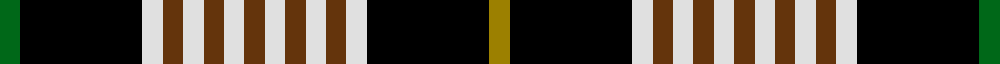

In pattern [GKWGWGWGWGWGWKR](/stripes/gkwgwgwgwgwgwkr/).

This was sourced from tartans-authority.  It is a [15 stripe tartan](/stripes/stripes15/).

Original link http://www.tartansauthority.com/tartan-ferret/display/3714/

## Thread count
G/8 K48 LN8 T8 LN8 T8 LN8 T8 LN8 T8 LN8 T8 LN8 K48 LG/8

## Palette
Each colour and the base-6 reference it is a variant of.

| Colour | Shade | Base |
|---|---|---|
| G | <code style="background-color:#006818;">#006818</code> `oklch(45.0% 0.142 145.0)` <small>#006818</small> | G <code style="background-color:#006100;">#006100</code> |
| K | <code style="background-color:#000000;">#000000</code> `oklch(0.0% 0.000 0.0)` <small>#000000</small> | K <code style="background-color:#000000;">#000000</code> |
| LG | <code style="background-color:#9C8000;">#9C8000</code> `oklch(60.8% 0.125 93.4)` <small>#9C8000</small> | R <code style="background-color:#CC0000;">#CC0000</code> |
| LN | <code style="background-color:#E0E0E0;">#E0E0E0</code> `oklch(90.7% 0.000 89.9)` <small>#E0E0E0</small> | W <code style="background-color:#F7F7F7;">#F7F7F7</code> |
| T | <code style="background-color:#64340C;">#64340C</code> `oklch(38.0% 0.085 55.0)` <small>#64340C</small> | G <code style="background-color:#006100;">#006100</code> |

## Nearest tartans

The nearest existing variants by ΔTartan distance, with this tartan at the top so the swatches line up against it.

ΔTartan

Tartan

Sett

—

<a href="/ttd/edit/#slug=o1k6w1dy1w1dy1w1dy1w1dy1w1dy1w1k6g1~x8">Alliance of Border Scots (Corporate)</a> <a class="nn-out" href="/setts/s15/o1k6w1dy1w1dy1w1dy1w1dy1w1dy1w1k6g1~x8/" title="open its dictionary page">↗</a>

1.16

<a href="/ttd/edit/#slug=r3w2g8r8k16w2k3w2k16k8w8k2w3~x2">Niagara Celtic Heritage Festival</a> <a class="nn-out" href="/setts/s13/r3w2g8r8k16w2k3w2k16k8w8k2w3~x2/" title="open its dictionary page">↗</a>

1.18

<a href="/ttd/edit/#slug=k8p1k1w1k2p8k8g8k1ly1k2g8~x2">Unnamed 10</a> <a class="nn-out" href="/setts/s12/k8p1k1w1k2p8k8g8k1ly1k2g8~x2/" title="open its dictionary page">↗</a>

1.33

<a href="/ttd/edit/#slug=k6y1k1y4ly1r1ly4r1ly2y4k1y1k8w1k2~x4">Confessore (Personal)</a> <a class="nn-out" href="/setts/s15/k6y1k1y4ly1r1ly4r1ly2y4k1y1k8w1k2~x4/" title="open its dictionary page">↗</a>

1.35

<a href="/ttd/edit/#slug=g1k6w1dy1w1dy1w1dy1w1dy1w1dy1w1k6o1k6w1dy1w1dy1w1dy1w1dy1w1dy1w1k6g1~x8">Alliance of Border Scots</a> <a class="nn-out" href="/setts/s29/g1k6w1dy1w1dy1w1dy1w1dy1w1dy1w1k6o1k6w1dy1w1dy1w1dy1w1dy1w1dy1w1k6g1~x8/" title="open its dictionary page">↗</a>

1.37

<a href="/ttd/edit/#slug=o4k12db2k2db2k2db2o16dr3o2lr2o4~x2">Cailean #2 (Fashion)</a> <a class="nn-out" href="/setts/s12/o4k12db2k2db2k2db2o16dr3o2lr2o4~x2/" title="open its dictionary page">↗</a>

1.50

<a href="/ttd/edit/#slug=r4k2ly13lo3k22r2k2w13k7r3k7w4~x2">Tyrone County Crest (Fashion)</a> <a class="nn-out" href="/setts/s12/r4k2ly13lo3k22r2k2w13k7r3k7w4~x2/" title="open its dictionary page">↗</a>

1.50

<a href="/ttd/edit/#slug=k16db2t2db4g16ly2k15db6t2k3t4~x2">Wilson's, No 30</a> <a class="nn-out" href="/setts/s11/k16db2t2db4g16ly2k15db6t2k3t4~x2/" title="open its dictionary page">↗</a>

1.50

<a href="/ttd/edit/#slug=k3lb7lo26k26w5k26lo26lb7k3r3~x2">Cornish National</a> <a class="nn-out" href="/setts/s10/k3lb7lo26k26w5k26lo26lb7k3r3~x2/" title="open its dictionary page">↗</a>

1.53

<a href="/ttd/edit/#slug=t4k6g1w1r1k6t4k2lo1k1lo1k1lo1k2lo3k3~x4">Baseggio Name Tartan Tartan Number: 10628. Earliest known date: 23/05/2012 This tartan is for members of the Golden Bones branch of the Baseggio family, one of the oldest houses of the city of Venice, Italy, but it can be worn by anyone who likes the design. Colours: gold and blue are for the Baseggio coat of arms, the thick golden line represents the crown and the three thin golden lines are for the three bones; the green, white and red stripes represent the Italian Tricolore flag. See products available Copyright © Blair Urquhart, Comrie, 2015</a> <a class="nn-out" href="/setts/s16/t4k6g1w1r1k6t4k2lo1k1lo1k1lo1k2lo3k3~x4/" title="open its dictionary page">↗</a>

1.53

<a href="/ttd/edit/#slug=dg22r4dg2r2dg2r4dg12k12r2db10r4db4ly3">Cochrane LC</a> <a class="nn-out" href="/setts/s13/dg22r4dg2r2dg2r4dg12k12r2db10r4db4ly3/" title="open its dictionary page">↗</a>

## Neighbour map

Every grey dot is one of 14299 variants placed by the first two principal components of the ΔTartan feature space (44% of its variance). Red is this tartan; blue dots are its nearest — click one to open its page.

<svg viewBox="0 0 640 380" role="img" style="max-width:100%;height:auto;border:1px solid #e0e0e0;border-radius:4px;display:block" xmlns="http://www.w3.org/2000/svg"><image href="/nn/cloud.v1.png" width="640" height="380"/><a href="/setts/s13/r3w2g8r8k16w2k3w2k16k8w8k2w3~x2/"><circle cx="120.5" cy="153.7" r="4" fill="#3465a4"><title>Niagara Celtic Heritage Festival</title></circle></a><a href="/setts/s12/k8p1k1w1k2p8k8g8k1ly1k2g8~x2/"><circle cx="166.9" cy="169.4" r="4" fill="#3465a4"><title>Unnamed 10</title></circle></a><a href="/setts/s15/k6y1k1y4ly1r1ly4r1ly2y4k1y1k8w1k2~x4/"><circle cx="168.9" cy="147.7" r="4" fill="#3465a4"><title>Confessore (Personal)</title></circle></a><a href="/setts/s29/g1k6w1dy1w1dy1w1dy1w1dy1w1dy1w1k6o1k6w1dy1w1dy1w1dy1w1dy1w1dy1w1k6g1~x8/"><circle cx="158.0" cy="116.8" r="4" fill="#3465a4"><title>Alliance of Border Scots</title></circle></a><a href="/setts/s12/o4k12db2k2db2k2db2o16dr3o2lr2o4~x2/"><circle cx="136.6" cy="130.7" r="4" fill="#3465a4"><title>Cailean #2 (Fashion)</title></circle></a><a href="/setts/s12/r4k2ly13lo3k22r2k2w13k7r3k7w4~x2/"><circle cx="181.3" cy="138.7" r="4" fill="#3465a4"><title>Tyrone County Crest (Fashion)</title></circle></a><a href="/setts/s11/k16db2t2db4g16ly2k15db6t2k3t4~x2/"><circle cx="170.6" cy="172.8" r="4" fill="#3465a4"><title>Wilson's, No 30</title></circle></a><a href="/setts/s10/k3lb7lo26k26w5k26lo26lb7k3r3~x2/"><circle cx="165.5" cy="160.7" r="4" fill="#3465a4"><title>Cornish National</title></circle></a><a href="/setts/s16/t4k6g1w1r1k6t4k2lo1k1lo1k1lo1k2lo3k3~x4/"><circle cx="167.0" cy="155.2" r="4" fill="#3465a4"><title>Baseggio Name Tartan Tartan Number: 10628. Earliest known date: 23/05/2012 This tartan is for members of the Golden Bones branch of the Baseggio family, one of the oldest houses of the city of Venice, Italy, but it can be worn by anyone who likes the design. Colours: gold and blue are for the Baseggio coat of arms, the thick golden line represents the crown and the three thin golden lines are for the three bones; the green, white and red stripes represent the Italian Tricolore flag. See products available Copyright © Blair Urquhart, Comrie, 2015</title></circle></a><a href="/setts/s13/dg22r4dg2r2dg2r4dg12k12r2db10r4db4ly3/"><circle cx="187.3" cy="151.4" r="4" fill="#3465a4"><title>Cochrane LC</title></circle></a><circle cx="163.4" cy="143.4" r="5" fill="#c00000"/></svg>

ID: /setts/s15/o1k6w1dy1w1dy1w1dy1w1dy1w1dy1w1k6g1~x8/
