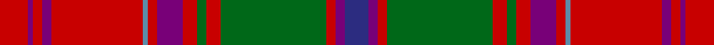

**Bands:** [RBRBRBRBRGRGRBB](/stripes/rbrbrbrbrgrgrbb/) · **Stripes:** [R DP R DP R T R DP R G R G R DP DB](/stripes/stripes15/) R DP R DP R T R DP R G R G R DP DB

This was sourced from house-of-tartan.  It is a [15 band tartan](/bands/bands15/).

Original link http://www.house-of-tartan.scotland.net/house/TartanViewjs.asp?colr=Def&tnam=1385

## Thread count
R/12 P2 R4 P4 R39 B2 R4 P11 R6 G4 R6 G45 R4 P4 DB/10

## Palette
Each colour and its ΔE from the base-6 reference it is a variant of.

| Colour | Shade | Base | ΔE (OKLab) |
|---|---|---|---|
| B | <code style="background-color:#5C8CA8;">#5C8CA8</code> `#5C8CA8` | B <code style="background-color:#2A418A;">#2A418A</code> | 0.23 |
| DB | <code style="background-color:#2C2C80;">#2C2C80</code> `#2C2C80` | B <code style="background-color:#2A418A;">#2A418A</code> | 0.06 |
| G | <code style="background-color:#006818;">#006818</code> `#006818` | G <code style="background-color:#006100;">#006100</code> | 0.02 |
| P | <code style="background-color:#780078;">#780078</code> `#780078` | B <code style="background-color:#2A418A;">#2A418A</code> | 0.17 |
| R | <code style="background-color:#C80000;">#C80000</code> `#C80000` | R <code style="background-color:#CC0000;">#CC0000</code> | 0.01 |

## Nearest tartans

The nearest existing variants by ΔTartan distance.

1. [Grant or New Bruce](/setts/s15/r12p2r4p4r39t2r4p11r6g4r6g45r4p4db10/) — ΔT 0.33
1. [MacQuarrie #2](/setts/s14/r4t2r50db26r10dg44r4r10r4dg44r51db2r4t2~x2/) — ΔT 0.70
1. [Scobie (Name)](/setts/s12/dp1r1dp1r6g26dp14r20t1r1t1r2lr1~x2/) — ΔT 0.88
1. [Hebridean, South Uist](/setts/s18/db19r2g3r2db2r20g1ly1r1g2r2db18r2g2r22g3w1r3~x2/) — ΔT 0.95
1. [Dalziel (Clan)](/setts/s17/r24w1dp2r4g32r4dp2w1r4dp6r4w1dp2r32g6r6g6~x2/) — ΔT 0.97
1. [Glendronach Corporate Tartan Tartan Number: 2293. Earliest known date: 1989 A copyright design created for the Glendronach Company. See products available Copyright © Blair Urquhart, Comrie, 2015](/setts/s12/dy21m2w1ly3m2dy5m21ly1ly1ly1m1dy8~x2/) — ΔT 0.98
1. [MacQuarrie 1](/setts/s14/r4t2r50db26r10g44r4r10r4g44r51db2r4t2~x2/) — ΔT 1.01
1. [MacDonald of Glenaladale](/setts/s11/db3t1r30db32r3w1r3g23r31db3w1/) — ΔT 1.03
1. [MacDougall (Paton)](/setts/s20/w1dp2r1dg22r3dg1r3db9dp2r1dp2dg8r8dg8r1db1r22dp2r2w1~x2/) — ΔT 1.09
1. [Lochiel, (Cameron)](/setts/s17/r36ly2db2r3g40r3db2ly2r3db12r3ly2db2r36g3dr3g4~x2/) — ΔT 1.09

## Neighbour map

Every grey dot is one of 14299 variants placed by the first two principal components of the ΔTartan feature space (44% of its variance). Red is this tartan; blue dots are its nearest — click one to open its page.

<svg viewBox="0 0 640 380" role="img" style="max-width:100%;height:auto;border:1px solid #e0e0e0;border-radius:4px;display:block" xmlns="http://www.w3.org/2000/svg"><image href="/nn/cloud.v1.png" width="640" height="380"/><a href="/setts/s15/r12p2r4p4r39t2r4p11r6g4r6g45r4p4db10/"><circle cx="294.9" cy="97.9" r="4" fill="#3465a4"><title>Grant or New Bruce</title></circle></a><a href="/setts/s14/r4t2r50db26r10dg44r4r10r4dg44r51db2r4t2~x2/"><circle cx="309.7" cy="105.7" r="4" fill="#3465a4"><title>MacQuarrie #2</title></circle></a><a href="/setts/s12/dp1r1dp1r6g26dp14r20t1r1t1r2lr1~x2/"><circle cx="279.9" cy="95.8" r="4" fill="#3465a4"><title>Scobie (Name)</title></circle></a><a href="/setts/s18/db19r2g3r2db2r20g1ly1r1g2r2db18r2g2r22g3w1r3~x2/"><circle cx="326.8" cy="91.0" r="4" fill="#3465a4"><title>Hebridean, South Uist</title></circle></a><a href="/setts/s17/r24w1dp2r4g32r4dp2w1r4dp6r4w1dp2r32g6r6g6~x2/"><circle cx="345.3" cy="79.2" r="4" fill="#3465a4"><title>Dalziel (Clan)</title></circle></a><a href="/setts/s12/dy21m2w1ly3m2dy5m21ly1ly1ly1m1dy8~x2/"><circle cx="353.9" cy="117.1" r="4" fill="#3465a4"><title>Glendronach Corporate Tartan Tartan Number: 2293. Earliest known date: 1989 A copyright design created for the Glendronach Company. See products available Copyright © Blair Urquhart, Comrie, 2015</title></circle></a><a href="/setts/s14/r4t2r50db26r10g44r4r10r4g44r51db2r4t2~x2/"><circle cx="312.9" cy="110.7" r="4" fill="#3465a4"><title>MacQuarrie 1</title></circle></a><a href="/setts/s11/db3t1r30db32r3w1r3g23r31db3w1/"><circle cx="326.9" cy="106.3" r="4" fill="#3465a4"><title>MacDonald of Glenaladale</title></circle></a><a href="/setts/s20/w1dp2r1dg22r3dg1r3db9dp2r1dp2dg8r8dg8r1db1r22dp2r2w1~x2/"><circle cx="250.7" cy="81.1" r="4" fill="#3465a4"><title>MacDougall (Paton)</title></circle></a><a href="/setts/s17/r36ly2db2r3g40r3db2ly2r3db12r3ly2db2r36g3dr3g4~x2/"><circle cx="324.5" cy="84.4" r="4" fill="#3465a4"><title>Lochiel, (Cameron)</title></circle></a><circle cx="299.8" cy="99.7" r="5" fill="#c00000"/></svg>

ID: /setts/s15/r12dp2r4dp4r39t2r4dp11r6g4r6g45r4dp4db10/
