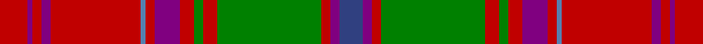

In pattern [BBRGRGRBRBRBRBR](/stripes/bbrgrgrbrbrbrbr/).

This was sourced from weddslist.  It is a [15 stripe tartan](/stripes/stripes15/).

Original link http://www.weddslist.com/cgi-bin/tartans/pg.pl?source=sts

## Thread count
R/12 P2 R4 P4 R39 Ba2 R4 P11 R6 G4 R6 G45 R4 P4 B/10

## Palette
Each colour and the base-6 reference it is a variant of.

| Colour | Shade | Base |
|---|---|---|
| B | <code style="background-color:#304080;">#304080</code> `oklch(39.4% 0.109 270.2)` <small>#304080</small> | B <code style="background-color:#2A418A;">#2A418A</code> |
| Ba | <code style="background-color:#5480B0;">#5480B0</code> `oklch(58.8% 0.089 251.5)` <small>#5480B0</small> | B <code style="background-color:#2A418A;">#2A418A</code> |
| G | <code style="background-color:#008000;">#008000</code> `oklch(52.0% 0.177 142.5)` <small>#008000</small> | G <code style="background-color:#006100;">#006100</code> |
| P | <code style="background-color:#800080;">#800080</code> `oklch(42.1% 0.193 328.4)` <small>#800080</small> | B <code style="background-color:#2A418A;">#2A418A</code> |
| R | <code style="background-color:#C00000;">#C00000</code> `oklch(50.7% 0.208 29.2)` <small>#C00000</small> | R <code style="background-color:#CC0000;">#CC0000</code> |

## Nearest tartans

The nearest existing variants by ΔTartan distance.

1. [Grant or New Bruce Clan Tartan Tartan Number: 1385. Earliest known date: 1819 As ordered by Patrick Grant of Redcastle, the chief of the Clan Grant. The large red and the large green squares have been reduced by a factor of 4 to allow display. The original sett was S15 P2 S4 P4 S156 LB2 S4 P42 S6 G4 S6 G178 S4 P4 S10 (HSHP half sett half pivot). This tartan was also adopted by the Drummonds. See products available Copyright © Blair Urquhart, Comrie, 2015](/setts/s15/r12dp2r4dp4r39t2r4dp11r6g4r6g45r4dp4db10/) — ΔT 0.33
1. [MacQuarrie #2](/setts/s14/r4t2r50db26r10dg44r4r10r4dg44r51db2r4t2~x2/) — ΔT 0.68
1. [MacQuarrie 1](/setts/s14/r4t2r50db26r10g44r4r10r4g44r51db2r4t2~x2/) — ΔT 0.80
1. [Scobie (Name)](/setts/s12/dp1r1dp1r6g26dp14r20t1r1t1r2lr1~x2/) — ΔT 0.91
1. [Lochiel, (Cameron)](/setts/s17/r36ly2db2r3g40r3db2ly2r3db12r3ly2db2r36g3dr3g4~x2/) — ΔT 0.91
1. [Dalziel (Clan)](/setts/s17/r24w1dp2r4g32r4dp2w1r4dp6r4w1dp2r32g6r6g6~x2/) — ΔT 0.95
1. [Leask](/setts/s14/g4r2w1r2k1r24g12ly2g3ly2g12r2g3ly4~x2/) — ΔT 0.99
1. [MacDonald of Lochmaddy](/setts/s17/r13w1t2r2g14r2w1t2r2db4r2t2w1r16g1r2g3~x2/) — ΔT 1.03
1. [MacDougall (Paton)](/setts/s20/w1dp2r1dg22r3dg1r3db9dp2r1dp2dg8r8dg8r1db1r22dp2r2w1~x2/) — ΔT 1.04
1. [Unidentified 15](/setts/s17/g4r3t1p1r35p1t1r3p16r3t1p1r2g35r7k1t2~x2/) — ΔT 1.05

## Neighbour map

Every grey dot is one of 14299 variants placed by the first two principal components of the ΔTartan feature space (44% of its variance). Red is this tartan; blue dots are its nearest — click one to open its page.

<svg viewBox="0 0 640 380" role="img" style="max-width:100%;height:auto;border:1px solid #e0e0e0;border-radius:4px;display:block" xmlns="http://www.w3.org/2000/svg"><image href="/nn/cloud.v1.png" width="640" height="380"/><a href="/setts/s15/r12dp2r4dp4r39t2r4dp11r6g4r6g45r4dp4db10/"><circle cx="299.8" cy="99.7" r="4" fill="#3465a4"><title>Grant or New Bruce Clan Tartan Tartan Number: 1385. Earliest known date: 1819 As ordered by Patrick Grant of Redcastle, the chief of the Clan Grant. The large red and the large green squares have been reduced by a factor of 4 to allow display. The original sett was S15 P2 S4 P4 S156 LB2 S4 P42 S6 G4 S6 G178 S4 P4 S10 (HSHP half sett half pivot). This tartan was also adopted by the Drummonds. See products available Copyright © Blair Urquhart, Comrie, 2015</title></circle></a><a href="/setts/s14/r4t2r50db26r10dg44r4r10r4dg44r51db2r4t2~x2/"><circle cx="309.7" cy="105.7" r="4" fill="#3465a4"><title>MacQuarrie #2</title></circle></a><a href="/setts/s14/r4t2r50db26r10g44r4r10r4g44r51db2r4t2~x2/"><circle cx="312.9" cy="110.7" r="4" fill="#3465a4"><title>MacQuarrie 1</title></circle></a><a href="/setts/s12/dp1r1dp1r6g26dp14r20t1r1t1r2lr1~x2/"><circle cx="279.9" cy="95.8" r="4" fill="#3465a4"><title>Scobie (Name)</title></circle></a><a href="/setts/s17/r36ly2db2r3g40r3db2ly2r3db12r3ly2db2r36g3dr3g4~x2/"><circle cx="324.5" cy="84.4" r="4" fill="#3465a4"><title>Lochiel, (Cameron)</title></circle></a><a href="/setts/s17/r24w1dp2r4g32r4dp2w1r4dp6r4w1dp2r32g6r6g6~x2/"><circle cx="345.3" cy="79.2" r="4" fill="#3465a4"><title>Dalziel (Clan)</title></circle></a><a href="/setts/s14/g4r2w1r2k1r24g12ly2g3ly2g12r2g3ly4~x2/"><circle cx="300.0" cy="100.3" r="4" fill="#3465a4"><title>Leask</title></circle></a><a href="/setts/s17/r13w1t2r2g14r2w1t2r2db4r2t2w1r16g1r2g3~x2/"><circle cx="310.3" cy="103.2" r="4" fill="#3465a4"><title>MacDonald of Lochmaddy</title></circle></a><a href="/setts/s20/w1dp2r1dg22r3dg1r3db9dp2r1dp2dg8r8dg8r1db1r22dp2r2w1~x2/"><circle cx="250.7" cy="81.1" r="4" fill="#3465a4"><title>MacDougall (Paton)</title></circle></a><a href="/setts/s17/g4r3t1p1r35p1t1r3p16r3t1p1r2g35r7k1t2~x2/"><circle cx="311.6" cy="57.3" r="4" fill="#3465a4"><title>Unidentified 15</title></circle></a><circle cx="294.9" cy="97.9" r="5" fill="#c00000"/></svg>

ID: /setts/s15/r12p2r4p4r39t2r4p11r6g4r6g45r4p4db10/
