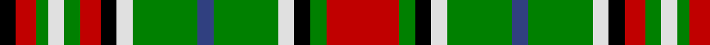

In pattern [KRGWGRKWGBGWKGR](/patterns/krgwgrkwgbgwkgr/).

This was sourced from weddslist.  It is a [15 stripes tartan](/stripes/stripes15/).

Original link http://www.weddslist.com/cgi-bin/tartans/pg.pl?source=sts

## Thread count
K/8 R10 G6 LN8 G8 R10 K8 LN8 G32 B8 G32 LN8 K8 G8 R/36

## Palette
Each colour and its ΔE from the base-6 reference it is a variant of.

| Colour | Shade | Base | ΔE (OKLab) |
|---|---|---|---|
| B | <code style="background-color:#304080;">#304080</code> `#304080` | B <code style="background-color:#2A418A;">#2A418A</code> | 0.02 |
| G | <code style="background-color:#008000;">#008000</code> `#008000` | G <code style="background-color:#006100;">#006100</code> | 0.10 |
| K | <code style="background-color:#000000;">#000000</code> `#000000` | K <code style="background-color:#000000;">#000000</code> | 0.00 |
| LN | <code style="background-color:#E0E0E0;">#E0E0E0</code> `#E0E0E0` | W <code style="background-color:#F7F7F7;">#F7F7F7</code> | 0.07 |
| R | <code style="background-color:#C00000;">#C00000</code> `#C00000` | R <code style="background-color:#CC0000;">#CC0000</code> | 0.03 |

## Nearest tartans

The nearest existing variants by ΔTartan distance.

1. [Gayre Bodyguard (Clan)](/setts/s15/r18g4k4w4g16b4g16w4k4r5g4w4g3r5k4x2~b1c1c50-g006818-k101010-rc80000-we0e0e0/) — ΔT 0.54
1. [Confessore (Personal)](/setts/s15/k6g1k1g4y1r1y4r1y2g4k1g1k8w1k2x4~g5c6428-k101010-rc80000-we0e0e0-yfccc00/) — ΔT 0.98
1. [Gayre (Clan)](/setts/s15/r20g4k4w4g16r4g16w4k4r6g4w4g3r6k4x2~g006818-k101010-rc80000-wc0c0c0/) — ΔT 1.05
1. [Confessore Family Tartan Tartan Number: 2165. Earliest known date: 1994 Designed for Mr Confessore of Napoli, Italy in 1994 by Mr. Keith Lumsden, researcher at the Scottish Tartans Society. The colours reflect the shades and tones of the Italian countryside. See products available Copyright © Blair Urquhart, Comrie, 2015](/setts/s15/g12ga2g2ga7y4r2y8r2y4ga7g2ga2g16w2g4x2~g003820-ga5c6428-ra03400-we0e0e0-ye8c000/) — ΔT 1.06
1. [Maguire](/setts/s13/g18r18k3r3b3r3b4r3k9r4g18w6k3x2~b2c2c80-g006818-k101010-rc80000-wfcfcfc/) — ΔT 1.06
1. [MacKinnon 12](/setts/s14/k4r3g2b2r6g15r2b4g2r15g7k2r4w2x2~b304080-g008000-k000000-rc00000-we0e0e0/) — ΔT 1.12
1. [Fraser Hunting Dress Clan Tartan Tartan Number: 603. Earliest known date: pre 2003 In the Hunting Fraser, brown replaces the red of the Clan sett. The late Charles Ian Fraser of Reeling said, in his publication, "Clan Fraser", that this sett was designed by the Sobieski Stuart brothers at the request of Lord Lovat for use by the Inverness and Nairn militia. A letter to Lord Lovat from the War Office, c.1855, authorised the use of the Fraser tartan for the corps. The tartan is worn by the Boghall & Bathgate pipe bands. (Strathallan 1994) See products available Copyright © Blair Urquhart, Comrie, 2015](/setts/s11/b4g24ga17g3w18g3w18g3ga17g24r4x2~b2c2c80-g604000-ga006818-rc80000-we0e0e0/) — ΔT 1.14
1. [Confessore](/setts/s15/g12ga2g2ga7y4r2y8r2y4ga7g2ga2g16w2g4x2~g004010-ga607030-rc00020-we0e0e0-yf0c000/) — ΔT 1.16
1. [Gayre](/setts/s15/b18g4k4w4g16b4g16w4k4r5g4w4g4r5k4x2~b304080-g008000-k000000-rc00000-we0e0e0/) — ΔT 1.18
1. [Gayre](/setts/s15/w20g4k4wa4g16w4g16wa4k4r6g4wa4g3r6k4x2~g006818-k101010-rc80000-w98c8e8-wac0c0c0/) — ΔT 1.19

## Neighbour map

Every grey dot is one of 15726 variants placed by the first two principal components of the ΔTartan feature space (44% of its variance). Red is this tartan; blue dots are its nearest — click one to open its page.

<svg viewBox="0 0 640 380" role="img" style="max-width:100%;height:auto;border:1px solid #e0e0e0;border-radius:4px;display:block" xmlns="http://www.w3.org/2000/svg"><image href="/nn/cloud.v1.png" width="640" height="380"/><a href="/setts/s15/r18g4k4w4g16b4g16w4k4r5g4w4g3r5k4x2~b1c1c50-g006818-k101010-rc80000-we0e0e0/"><circle cx="138.7" cy="165.6" r="4" fill="#3465a4"><title>Gayre Bodyguard (Clan)</title></circle></a><a href="/setts/s15/k6g1k1g4y1r1y4r1y2g4k1g1k8w1k2x4~g5c6428-k101010-rc80000-we0e0e0-yfccc00/"><circle cx="166.4" cy="149.6" r="4" fill="#3465a4"><title>Confessore (Personal)</title></circle></a><a href="/setts/s15/r20g4k4w4g16r4g16w4k4r6g4w4g3r6k4x2~g006818-k101010-rc80000-wc0c0c0/"><circle cx="149.3" cy="163.8" r="4" fill="#3465a4"><title>Gayre (Clan)</title></circle></a><a href="/setts/s15/g12ga2g2ga7y4r2y8r2y4ga7g2ga2g16w2g4x2~g003820-ga5c6428-ra03400-we0e0e0-ye8c000/"><circle cx="177.7" cy="160.2" r="4" fill="#3465a4"><title>Confessore Family Tartan Tartan Number: 2165. Earliest known date: 1994 Designed for Mr Confessore of Napoli, Italy in 1994 by Mr. Keith Lumsden, researcher at the Scottish Tartans Society. The colours reflect the shades and tones of the Italian countryside. See products available Copyright © Blair Urquhart, Comrie, 2015</title></circle></a><a href="/setts/s13/g18r18k3r3b3r3b4r3k9r4g18w6k3x2~b2c2c80-g006818-k101010-rc80000-wfcfcfc/"><circle cx="128.1" cy="166.2" r="4" fill="#3465a4"><title>Maguire</title></circle></a><a href="/setts/s14/k4r3g2b2r6g15r2b4g2r15g7k2r4w2x2~b304080-g008000-k000000-rc00000-we0e0e0/"><circle cx="176.4" cy="152.9" r="4" fill="#3465a4"><title>MacKinnon 12</title></circle></a><a href="/setts/s11/b4g24ga17g3w18g3w18g3ga17g24r4x2~b2c2c80-g604000-ga006818-rc80000-we0e0e0/"><circle cx="146.1" cy="176.5" r="4" fill="#3465a4"><title>Fraser Hunting Dress Clan Tartan Tartan Number: 603. Earliest known date: pre 2003 In the Hunting Fraser, brown replaces the red of the Clan sett. The late Charles Ian Fraser of Reeling said, in his publication, &quot;Clan Fraser&quot;, that this sett was designed by the Sobieski Stuart brothers at the request of Lord Lovat for use by the Inverness and Nairn militia. A letter to Lord Lovat from the War Office, c.1855, authorised the use of the Fraser tartan for the corps. The tartan is worn by the Boghall &amp; Bathgate pipe bands. (Strathallan 1994) See products available Copyright © Blair Urquhart, Comrie, 2015</title></circle></a><a href="/setts/s15/g12ga2g2ga7y4r2y8r2y4ga7g2ga2g16w2g4x2~g004010-ga607030-rc00020-we0e0e0-yf0c000/"><circle cx="177.7" cy="159.4" r="4" fill="#3465a4"><title>Confessore</title></circle></a><a href="/setts/s15/b18g4k4w4g16b4g16w4k4r5g4w4g4r5k4x2~b304080-g008000-k000000-rc00000-we0e0e0/"><circle cx="103.5" cy="178.1" r="4" fill="#3465a4"><title>Gayre</title></circle></a><a href="/setts/s15/w20g4k4wa4g16w4g16wa4k4r6g4wa4g3r6k4x2~g006818-k101010-rc80000-w98c8e8-wac0c0c0/"><circle cx="116.0" cy="159.7" r="4" fill="#3465a4"><title>Gayre</title></circle></a><circle cx="124.7" cy="161.4" r="5" fill="#c00000"/></svg>

ID: /setts/s15/r18g4k4w4g16b4g16w4k4r5g4w4g3r5k4x2~b304080-g008000-k000000-rc00000-we0e0e0/
