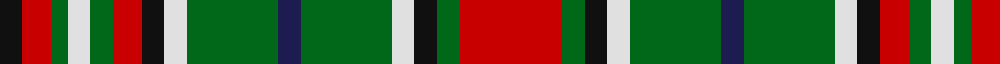

This page is one **sett** — a single exact thread-count. It belongs to the [tartan](/tartans/r18g4k4ln4g16db4g16ln4k4r5g4ln4g3r5k4/)
(the same proportion at any scale), whose colour order is pattern [KRGWGRKWGBGWKGR](/stripes/krgwgrkwgbgwkgr/).

Sourced from tartans-authority.  It is a [15 stripe tartan](/stripes/stripes15/).

Original link http://www.tartansauthority.com/tartan-ferret/display/1154/

## Also known as

This cloth is also recorded under:

- Gayre Bodyguard #2
- Gayre, Bodyguard

3 attestations — the source records this cloth was collapsed from (oldest owns this page)

<ul>
<li>pre 1800? — Gayre Bodyguard (Clan) (tartans-authority, <a href="http://www.tartansauthority.com/tartan-ferret/display/1154/">record</a>)</li>
<li>undated — Gayre Bodyguard #2 (register-of-tartans, <a href="https://www.tartanregister.gov.uk/tartanDetails.aspx?ref=1322">record</a>)</li>
<li>undated — Gayre, Bodyguard (weddslist, <a href="http://www.weddslist.com/cgi-bin/tartans/pg.pl?source=sts">record</a>)</li>
</ul>

## Register references

External register numbers recorded for this tartan.

- Scottish Register of Tartans: [1322](https://www.tartanregister.gov.uk/tartanDetails.aspx?ref=1322)
- Scottish Tartans Authority (ITI): 1154
- Scottish Tartans World Register: 1154

## Thread count
R/36 G8 K8 LN8 G32 DB8 G32 LN8 K8 R10 G8 LN8 G6 R10 K/8

## Palette
Each colour and the base-6 reference it is a variant of.

| Colour | Shade | Base |
|---|---|---|
| DB | <code style="background-color:#1C1C50;">#1C1C50</code> `oklch(26.2% 0.093 277.9)` <small>#1C1C50</small> | B <code style="background-color:#2A418A;">#2A418A</code> |
| G | <code style="background-color:#006818;">#006818</code> `oklch(45.0% 0.142 145.0)` <small>#006818</small> | G <code style="background-color:#006100;">#006100</code> |
| K | <code style="background-color:#101010;">#101010</code> `oklch(17.3% 0.000 89.9)` <small>#101010</small> | K <code style="background-color:#000000;">#000000</code> |
| LN | <code style="background-color:#E0E0E0;">#E0E0E0</code> `oklch(90.7% 0.000 89.9)` <small>#E0E0E0</small> | W <code style="background-color:#F7F7F7;">#F7F7F7</code> |
| R | <code style="background-color:#C80000;">#C80000</code> `oklch(52.3% 0.215 29.2)` <small>#C80000</small> | R <code style="background-color:#CC0000;">#CC0000</code> |

## Nearest tartans

The nearest existing variants by ΔTartan distance, with this tartan at the top so the swatches line up against it.

ΔTartan

Tartan

Sett

—

<a href="/ttd/edit/#slug=r18g4k4w4g16db4g16w4k4r5g4w4g3r5k4~x2">Gayre Bodyguard (Clan)</a> <a class="nn-out" href="/setts/s15/r18g4k4w4g16db4g16w4k4r5g4w4g3r5k4~x2/" title="open its dictionary page">↗</a>

0.61

<a href="/ttd/edit/#slug=r20g4k4lb4g16r4g16lb4k4r6g4lb4g3r6k4~x2">Gayre (Clan)</a> <a class="nn-out" href="/setts/s15/r20g4k4lb4g16r4g16lb4k4r6g4lb4g3r6k4~x2/" title="open its dictionary page">↗</a>

0.73

<a href="/ttd/edit/#slug=g18r18k3r3db3r3db4r3k9r4g18w6k3~x2">Maguire</a> <a class="nn-out" href="/setts/s13/g18r18k3r3db3r3db4r3k9r4g18w6k3~x2/" title="open its dictionary page">↗</a>

0.85

<a href="/ttd/edit/#slug=k4r3g2db2r6g15r2db4g2r15g7k2r4w2~x2">MacKinnon 12</a> <a class="nn-out" href="/setts/s14/k4r3g2db2r6g15r2db4g2r15g7k2r4w2~x2/" title="open its dictionary page">↗</a>

1.01

<a href="/ttd/edit/#slug=k6y1k1y4ly1r1ly4r1ly2y4k1y1k8w1k2~x4">Confessore (Personal)</a> <a class="nn-out" href="/setts/s15/k6y1k1y4ly1r1ly4r1ly2y4k1y1k8w1k2~x4/" title="open its dictionary page">↗</a>

1.08

<a href="/ttd/edit/#slug=dg12y2dg2y7ly4o2ly8o2ly4y7dg2y2dg16w2dg4~x2">Confessore Family Tartan Tartan Number: 2165. Earliest known date: 1994 Designed for Mr Confessore of Napoli, Italy in 1994 by Mr. Keith Lumsden, researcher at the Scottish Tartans Society. The colours reflect the shades and tones of the Italian countryside. See products available Copyright © Blair Urquhart, Comrie, 2015</a> <a class="nn-out" href="/setts/s15/dg12y2dg2y7ly4o2ly8o2ly4y7dg2y2dg16w2dg4~x2/" title="open its dictionary page">↗</a>

1.09

<a href="/ttd/edit/#slug=o4k2r2k1r1k1r2db3o1dg4o9dg1~x4">California Firefighters (Corporate)</a> <a class="nn-out" href="/setts/s12/o4k2r2k1r1k1r2db3o1dg4o9dg1~x4/" title="open its dictionary page">↗</a>

1.09

<a href="/ttd/edit/#slug=db4dy24g17dy3w18dy3w18dy3g17dy24r4~x2">Fraser Hunting Dress Clan Tartan Tartan Number: 603. Earliest known date: pre 2003 In the Hunting Fraser, brown replaces the red of the Clan sett. The late Charles Ian Fraser of Reeling said, in his publication, &quot;Clan Fraser&quot;, that this sett was designed by the Sobieski Stuart brothers at the request of Lord Lovat for use by the Inverness and Nairn militia. A letter to Lord Lovat from the War Office, c.1855, authorised the use of the Fraser tartan for the corps. The tartan is worn by the Boghall &amp; Bathgate pipe bands. (Strathallan 1994) See products available Copyright © Blair Urquhart, Comrie, 2015</a> <a class="nn-out" href="/setts/s11/db4dy24g17dy3w18dy3w18dy3g17dy24r4~x2/" title="open its dictionary page">↗</a>

1.13

<a href="/ttd/edit/#slug=w5k3g15r3db6r15b3r3b3r3db3r15g15k3~x2">MacGuire</a> <a class="nn-out" href="/setts/s14/w5k3g15r3db6r15b3r3b3r3db3r15g15k3~x2/" title="open its dictionary page">↗</a>

1.19

<a href="/ttd/edit/#slug=ly25k4ly4k4ly4k23y23ly4y23k23ly23k4ly4~x2">Poulter, Green (Corporate)</a> <a class="nn-out" href="/setts/s13/ly25k4ly4k4ly4k23y23ly4y23k23ly23k4ly4~x2/" title="open its dictionary page">↗</a>

1.19

<a href="/ttd/edit/#slug=r4do15g11do3lb11do3lb11do3g11do15b4~x2">Fraser Hunting Dress</a> <a class="nn-out" href="/setts/s11/r4do15g11do3lb11do3lb11do3g11do15b4~x2/" title="open its dictionary page">↗</a>

## Neighbour map

Every grey dot is one of 14299 variants placed by the first two principal components of the ΔTartan feature space (44% of its variance). Red is this tartan; blue dots are its nearest — click one to open its page.

<svg viewBox="0 0 640 380" role="img" style="max-width:100%;height:auto;border:1px solid #e0e0e0;border-radius:4px;display:block" xmlns="http://www.w3.org/2000/svg"><image href="/nn/cloud.v1.png" width="640" height="380"/><a href="/setts/s15/r20g4k4lb4g16r4g16lb4k4r6g4lb4g3r6k4~x2/"><circle cx="151.0" cy="164.8" r="4" fill="#3465a4"><title>Gayre (Clan)</title></circle></a><a href="/setts/s13/g18r18k3r3db3r3db4r3k9r4g18w6k3~x2/"><circle cx="130.4" cy="166.3" r="4" fill="#3465a4"><title>Maguire</title></circle></a><a href="/setts/s14/k4r3g2db2r6g15r2db4g2r15g7k2r4w2~x2/"><circle cx="178.0" cy="152.0" r="4" fill="#3465a4"><title>MacKinnon 12</title></circle></a><a href="/setts/s15/k6y1k1y4ly1r1ly4r1ly2y4k1y1k8w1k2~x4/"><circle cx="168.9" cy="147.7" r="4" fill="#3465a4"><title>Confessore (Personal)</title></circle></a><a href="/setts/s15/dg12y2dg2y7ly4o2ly8o2ly4y7dg2y2dg16w2dg4~x2/"><circle cx="180.2" cy="161.2" r="4" fill="#3465a4"><title>Confessore Family Tartan Tartan Number: 2165. Earliest known date: 1994 Designed for Mr Confessore of Napoli, Italy in 1994 by Mr. Keith Lumsden, researcher at the Scottish Tartans Society. The colours reflect the shades and tones of the Italian countryside. See products available Copyright © Blair Urquhart, Comrie, 2015</title></circle></a><a href="/setts/s12/o4k2r2k1r1k1r2db3o1dg4o9dg1~x4/"><circle cx="174.2" cy="157.4" r="4" fill="#3465a4"><title>California Firefighters (Corporate)</title></circle></a><a href="/setts/s11/db4dy24g17dy3w18dy3w18dy3g17dy24r4~x2/"><circle cx="148.3" cy="176.3" r="4" fill="#3465a4"><title>Fraser Hunting Dress Clan Tartan Tartan Number: 603. Earliest known date: pre 2003 In the Hunting Fraser, brown replaces the red of the Clan sett. The late Charles Ian Fraser of Reeling said, in his publication, &quot;Clan Fraser&quot;, that this sett was designed by the Sobieski Stuart brothers at the request of Lord Lovat for use by the Inverness and Nairn militia. A letter to Lord Lovat from the War Office, c.1855, authorised the use of the Fraser tartan for the corps. The tartan is worn by the Boghall &amp; Bathgate pipe bands. (Strathallan 1994) See products available Copyright © Blair Urquhart, Comrie, 2015</title></circle></a><a href="/setts/s14/w5k3g15r3db6r15b3r3b3r3db3r15g15k3~x2/"><circle cx="113.2" cy="155.5" r="4" fill="#3465a4"><title>MacGuire</title></circle></a><a href="/setts/s13/ly25k4ly4k4ly4k23y23ly4y23k23ly23k4ly4~x2/"><circle cx="138.7" cy="189.0" r="4" fill="#3465a4"><title>Poulter, Green (Corporate)</title></circle></a><a href="/setts/s11/r4do15g11do3lb11do3lb11do3g11do15b4~x2/"><circle cx="121.1" cy="208.7" r="4" fill="#3465a4"><title>Fraser Hunting Dress</title></circle></a><circle cx="140.9" cy="165.5" r="5" fill="#c00000"/></svg>

ID: /setts/s15/r18g4k4w4g16db4g16w4k4r5g4w4g3r5k4~x2/
