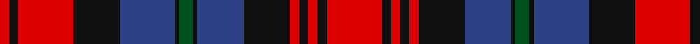

In pattern [RKRKBKGKBKRKRKR](/patterns/rkrkbkgkbkrkrkr/).

This was sourced from register-of-tartans.  It is a [15 stripes tartan](/stripes/stripes15/).

Original link https://www.tartanregister.gov.uk/tartanDetails.aspx?ref=2583

## Thread count
R/4 K4 R24 K20 B24 K2 G6 K2 B20 K20 R4 K4 R4 K4 R/24

## Palette
Each colour and its ΔE from the base-6 reference it is a variant of.

| Colour | Shade | Base | ΔE (OKLab) |
|---|---|---|---|
| B | <code style="background-color:#2C4084;">#2C4084</code> `#2C4084` | B <code style="background-color:#2A418A;">#2A418A</code> | 0.01 |
| G | <code style="background-color:#005020;">#005020</code> `#005020` | G <code style="background-color:#006100;">#006100</code> | 0.07 |
| K | <code style="background-color:#101010;">#101010</code> `#101010` | K <code style="background-color:#000000;">#000000</code> | 0.17 |
| R | <code style="background-color:#DC0000;">#DC0000</code> `#DC0000` | R <code style="background-color:#CC0000;">#CC0000</code> | 0.03 |

## Nearest tartans

The nearest existing variants by ΔTartan distance.

1. [Frankfurt & Disttrict P & D (Corpora](/setts/s15/b43k4b4k4b4k26r32k4w10k4r32k26b32k4r10-b003c64-k101010-rc80000-we0e0e0/) — ΔT 0.58
1. [Bonner (Bonnar) Family Tartan Tartan Number: 285. Earliest known date: 1930 MacKinlay (Fractional scale). Meaning 'gentle' (from the french) or `Bona res...' A good thing, this reputedly spoken by the King of France after a very un-gentle act of war on the part of Guilhen de Bonares as he was called thereafter. (Guilhen de Bonares is recorded in Perthshire c.1200) Coulson Bonnar was a tatan collecter c1930-1950. See products available Copyright © Blair Urquhart, Comrie, 2015](/setts/s13/r26k2r6g20r10k4r6k24b4k4b4k4b24-b2c2c80-g006818-k101010-rc80000/) — ΔT 0.70
1. [MacLachlan #2](/setts/s13/r32k4r4k4r4k32b32g6b32k32r32k4r4-b2c4084-g005020-k101010-rdc0000/) — ΔT 0.71
1. [MacLachlan Clan Tartan Tartan Number: 732. Earliest known date: 1850 T. Smibert produced a book entitled, 'The Clans of the Highlands of Scotland' in 1850 which is widely regarded as an accurate source for the tartans illustrated within it. Smibert had access to the patterns of Wilson's of Bannockburn who had been weavers 'since the '45', and to the works of Logan and the Sobieski brothers. Of the three distinct versions of MacLachlan tartan, Smiberts rendering is the one woven today, and it would appear to have a longer history than might be gathered from the date of its first publication. See products available Copyright © Blair Urquhart, Comrie, 2015](/setts/s13/r32k4r4k4r4k32b32g6b32k32r32k4r4-b2c2c80-g006818-k101010-rc80000/) — ΔT 0.83
1. [MacLachlan](/setts/s13/r32k4r4k4r4k32b32g6b32k32r32k4r4-b202060-g006818-k101010-rc80000/) — ΔT 0.90
1. [MacLachlan 1](/setts/s15/r24k4r4k4r4k20b20k2g6k2b24k20r24k4r4-b304080-g008000-k000000-rc00000/) — ΔT 0.90
1. [MacInroy (Wedding) (Personal)](/setts/s12/b20g2b4g6b32g2k32r32g6r4g2r20-b2c2c80-g408060-k101010-rc80000/) — ΔT 0.94
1. [MacInroy](/setts/s12/b20g2b4g6b32g2k32r32g6r4g2r20-b304080-g008000-k000000-rc00000/) — ΔT 0.96
1. [Bonner, (Bonnar)](/setts/s13/r26k2r6g20r10k4r6k24b4k4b4k4b24-b304080-g008000-k000000-rc00000/) — ΔT 1.08
1. [Royal Canadian Air Force #3](/setts/s18/r8b16k2r8k2b32k4w6k4r8k4r6k8r6k12r6k16r8-b3c82af-k101010-rdc0000-we0e0e0/) — ΔT 1.09

## Neighbour map

Every grey dot is one of 15726 variants placed by the first two principal components of the ΔTartan feature space (44% of its variance). Red is this tartan; blue dots are its nearest — click one to open its page.

<svg viewBox="0 0 640 380" role="img" style="max-width:100%;height:auto;border:1px solid #e0e0e0;border-radius:4px;display:block" xmlns="http://www.w3.org/2000/svg"><image href="/nn/cloud.v1.png" width="640" height="380"/><a href="/setts/s15/b43k4b4k4b4k26r32k4w10k4r32k26b32k4r10-b003c64-k101010-rc80000-we0e0e0/"><circle cx="177.6" cy="161.4" r="4" fill="#3465a4"><title>Frankfurt &amp; Disttrict P &amp; D (Corpora</title></circle></a><a href="/setts/s13/r26k2r6g20r10k4r6k24b4k4b4k4b24-b2c2c80-g006818-k101010-rc80000/"><circle cx="180.4" cy="162.7" r="4" fill="#3465a4"><title>Bonner (Bonnar) Family Tartan Tartan Number: 285. Earliest known date: 1930 MacKinlay (Fractional scale). Meaning 'gentle' (from the french) or `Bona res...' A good thing, this reputedly spoken by the King of France after a very un-gentle act of war on the part of Guilhen de Bonares as he was called thereafter. (Guilhen de Bonares is recorded in Perthshire c.1200) Coulson Bonnar was a tatan collecter c1930-1950. See products available Copyright © Blair Urquhart, Comrie, 2015</title></circle></a><a href="/setts/s13/r32k4r4k4r4k32b32g6b32k32r32k4r4-b2c4084-g005020-k101010-rdc0000/"><circle cx="172.6" cy="179.9" r="4" fill="#3465a4"><title>MacLachlan #2</title></circle></a><a href="/setts/s13/r32k4r4k4r4k32b32g6b32k32r32k4r4-b2c2c80-g006818-k101010-rc80000/"><circle cx="180.9" cy="184.9" r="4" fill="#3465a4"><title>MacLachlan Clan Tartan Tartan Number: 732. Earliest known date: 1850 T. Smibert produced a book entitled, 'The Clans of the Highlands of Scotland' in 1850 which is widely regarded as an accurate source for the tartans illustrated within it. Smibert had access to the patterns of Wilson's of Bannockburn who had been weavers 'since the '45', and to the works of Logan and the Sobieski brothers. Of the three distinct versions of MacLachlan tartan, Smiberts rendering is the one woven today, and it would appear to have a longer history than might be gathered from the date of its first publication. See products available Copyright © Blair Urquhart, Comrie, 2015</title></circle></a><a href="/setts/s13/r32k4r4k4r4k32b32g6b32k32r32k4r4-b202060-g006818-k101010-rc80000/"><circle cx="184.5" cy="187.2" r="4" fill="#3465a4"><title>MacLachlan</title></circle></a><a href="/setts/s15/r24k4r4k4r4k20b20k2g6k2b24k20r24k4r4-b304080-g008000-k000000-rc00000/"><circle cx="172.9" cy="154.6" r="4" fill="#3465a4"><title>MacLachlan 1</title></circle></a><a href="/setts/s12/b20g2b4g6b32g2k32r32g6r4g2r20-b2c2c80-g408060-k101010-rc80000/"><circle cx="204.3" cy="153.3" r="4" fill="#3465a4"><title>MacInroy (Wedding) (Personal)</title></circle></a><a href="/setts/s12/b20g2b4g6b32g2k32r32g6r4g2r20-b304080-g008000-k000000-rc00000/"><circle cx="182.6" cy="146.6" r="4" fill="#3465a4"><title>MacInroy</title></circle></a><a href="/setts/s13/r26k2r6g20r10k4r6k24b4k4b4k4b24-b304080-g008000-k000000-rc00000/"><circle cx="155.0" cy="154.2" r="4" fill="#3465a4"><title>Bonner, (Bonnar)</title></circle></a><a href="/setts/s18/r8b16k2r8k2b32k4w6k4r8k4r6k8r6k12r6k16r8-b3c82af-k101010-rdc0000-we0e0e0/"><circle cx="161.9" cy="133.2" r="4" fill="#3465a4"><title>Royal Canadian Air Force #3</title></circle></a><circle cx="189.8" cy="157.7" r="5" fill="#c00000"/></svg>

ID: /setts/s15/r24k4r4k4r4k20b20k2g6k2b24k20r24k4r4-b2c4084-g005020-k101010-rdc0000/
