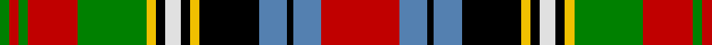

In pattern [GRGRGYKWKYKBKBR](/patterns/grgrgykwkykbkbr/).

This was sourced from weddslist.  It is a [15 stripes tartan](/stripes/stripes15/).

Original link http://www.weddslist.com/cgi-bin/tartans/pg.pl?source=sts

## Thread count
G/6 R6 G6 R32 G44 Y6 K6 LN10 K6 Y6 K38 B18 K4 B18 R/50

## Palette
Each colour and its ΔE from the base-6 reference it is a variant of.

| Colour | Shade | Base | ΔE (OKLab) |
|---|---|---|---|
| B | <code style="background-color:#5480B0;">#5480B0</code> `#5480B0` | B <code style="background-color:#2A418A;">#2A418A</code> | 0.19 |
| G | <code style="background-color:#008000;">#008000</code> `#008000` | G <code style="background-color:#006100;">#006100</code> | 0.10 |
| K | <code style="background-color:#000000;">#000000</code> `#000000` | K <code style="background-color:#000000;">#000000</code> | 0.00 |
| LN | <code style="background-color:#E0E0E0;">#E0E0E0</code> `#E0E0E0` | W <code style="background-color:#F7F7F7;">#F7F7F7</code> | 0.07 |
| R | <code style="background-color:#C00000;">#C00000</code> `#C00000` | R <code style="background-color:#CC0000;">#CC0000</code> | 0.03 |
| Y | <code style="background-color:#F0C000;">#F0C000</code> `#F0C000` | Y <code style="background-color:#F2BF00;">#F2BF00</code> | 0.00 |

## Nearest tartans

The nearest existing variants by ΔTartan distance.

1. [Royal Stewart](/setts/s12/r20b14k17y2k3w3k3g24r14k4r4w2x2~b5480b0-g008000-k000000-rc00000-we0e0e0-yf0c000/) — ΔT 0.56
1. [Wilson's, No 226](/setts/s14/r25w4k4g25y3k15b13r5b5r15g4r5k2g3x2~b5480b0-g008000-k000000-rc00000-we0e0e0-yf0c000/) — ΔT 0.57
1. [Wilson's, No 90](/setts/s12/r19b13k16y3k3w5k3g32k2r15b5r15x2~b5480b0-g008000-k000000-rc00000-we0e0e0-yf0c000/) — ΔT 0.76
1. [Jones, Melnyk (Personal)](/setts/s20/g5k5g5r12g3k15g3k2w1k2b7k2y10k2b7k2w1k3r15k3x2~b2888c4-g006818-k101010-rc80000-we0e0e0-ye8c000/) — ΔT 0.83
1. [Stuart/Stewart #2](/setts/s12/r20b14k17y2k3w3k3g24r14k4r4w2x2~b3c82af-g005020-k101010-rdc0000-we0e0e0-ye8c000/) — ΔT 0.83
1. [MacPherson 5](/setts/s15/b1y3r3k2b8y3r2k1r2y3g8w1k1r12w1x2~b304080-g008000-k000000-rc00000-we0e0e0-yf0c000/) — ΔT 0.86
1. [Stewart, Prince Charles Edward](/setts/s12/r14b4k6y1k2w2k2g12r6k2r2w1x2~b5480b0-g008000-k000000-rc00000-we0e0e0-yf0c000/) — ΔT 0.86
1. [Wilson's, No 152](/setts/s16/g3k2r12b9k2b9k16y3k3w5k3g25r13k4r5w3x2~b5480b0-g008000-k000000-rc00000-we0e0e0-yf0c000/) — ΔT 0.89
1. [Unnamed No 158, Silk Fragment](/setts/s13/b8k1r4k1r4k1r4k1g8k1y1r1w1x2~b304080-g008000-k000000-rc00000-we0e0e0-yf0c000/) — ΔT 0.89
1. [MacPherson 4](/setts/s17/b3y5r4k4b14w3y4r4k2r4y4w3g17w3k3r22w3x2~b304080-g008000-k000000-rc00000-we0e0e0-yf0c000/) — ΔT 0.90

## Neighbour map

Every grey dot is one of 15726 variants placed by the first two principal components of the ΔTartan feature space (44% of its variance). Red is this tartan; blue dots are its nearest — click one to open its page.

<svg viewBox="0 0 640 380" role="img" style="max-width:100%;height:auto;border:1px solid #e0e0e0;border-radius:4px;display:block" xmlns="http://www.w3.org/2000/svg"><image href="/nn/cloud.v1.png" width="640" height="380"/><a href="/setts/s12/r20b14k17y2k3w3k3g24r14k4r4w2x2~b5480b0-g008000-k000000-rc00000-we0e0e0-yf0c000/"><circle cx="98.0" cy="120.7" r="4" fill="#3465a4"><title>Royal Stewart</title></circle></a><a href="/setts/s14/r25w4k4g25y3k15b13r5b5r15g4r5k2g3x2~b5480b0-g008000-k000000-rc00000-we0e0e0-yf0c000/"><circle cx="124.2" cy="113.0" r="4" fill="#3465a4"><title>Wilson's, No 226</title></circle></a><a href="/setts/s12/r19b13k16y3k3w5k3g32k2r15b5r15x2~b5480b0-g008000-k000000-rc00000-we0e0e0-yf0c000/"><circle cx="120.9" cy="114.6" r="4" fill="#3465a4"><title>Wilson's, No 90</title></circle></a><a href="/setts/s20/g5k5g5r12g3k15g3k2w1k2b7k2y10k2b7k2w1k3r15k3x2~b2888c4-g006818-k101010-rc80000-we0e0e0-ye8c000/"><circle cx="96.9" cy="95.8" r="4" fill="#3465a4"><title>Jones, Melnyk (Personal)</title></circle></a><a href="/setts/s12/r20b14k17y2k3w3k3g24r14k4r4w2x2~b3c82af-g005020-k101010-rdc0000-we0e0e0-ye8c000/"><circle cx="114.7" cy="123.9" r="4" fill="#3465a4"><title>Stuart/Stewart #2</title></circle></a><a href="/setts/s15/b1y3r3k2b8y3r2k1r2y3g8w1k1r12w1x2~b304080-g008000-k000000-rc00000-we0e0e0-yf0c000/"><circle cx="111.7" cy="98.4" r="4" fill="#3465a4"><title>MacPherson 5</title></circle></a><a href="/setts/s12/r14b4k6y1k2w2k2g12r6k2r2w1x2~b5480b0-g008000-k000000-rc00000-we0e0e0-yf0c000/"><circle cx="142.8" cy="108.5" r="4" fill="#3465a4"><title>Stewart, Prince Charles Edward</title></circle></a><a href="/setts/s16/g3k2r12b9k2b9k16y3k3w5k3g25r13k4r5w3x2~b5480b0-g008000-k000000-rc00000-we0e0e0-yf0c000/"><circle cx="49.2" cy="105.2" r="4" fill="#3465a4"><title>Wilson's, No 152</title></circle></a><a href="/setts/s13/b8k1r4k1r4k1r4k1g8k1y1r1w1x2~b304080-g008000-k000000-rc00000-we0e0e0-yf0c000/"><circle cx="105.0" cy="128.6" r="4" fill="#3465a4"><title>Unnamed No 158, Silk Fragment</title></circle></a><a href="/setts/s17/b3y5r4k4b14w3y4r4k2r4y4w3g17w3k3r22w3x2~b304080-g008000-k000000-rc00000-we0e0e0-yf0c000/"><circle cx="76.1" cy="93.2" r="4" fill="#3465a4"><title>MacPherson 4</title></circle></a><circle cx="94.7" cy="103.3" r="5" fill="#c00000"/></svg>

ID: /setts/s15/r25b9k2b9k19y3k3w5k3y3g22r16g3r3g3x2~b5480b0-g008000-k000000-rc00000-we0e0e0-yf0c000/
