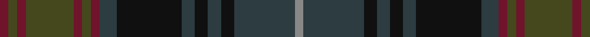

In pattern [RBKBKBKBRGRGRGR](/patterns/rbkbkbkbrgrgrgr/).

This was sourced from tartans-authority.  It is a [15 stripes tartan](/stripes/stripes15/).

Original link http://www.tartansauthority.com/tartan-ferret/display/7823/

## Attestations

This cloth appears in 2 source records; the oldest owns this page.

- Dec. 2008 — Homecoming (Fashion) (tartans-authority, [record](http://www.tartansauthority.com/tartan-ferret/display/7823/))
- undated — Homecoming (register-of-tartans, [record](https://www.tartanregister.gov.uk/tartanDetails.aspx?ref=5779))

## Thread count
DR/4 T4 DR4 T22 DR4 T4 DR4 DN8 K30 DN6 K6 DN6 K6 DN28 N/4

## Palette
Each colour and its ΔE from the base-6 reference it is a variant of.

| Colour | Shade | Base | ΔE (OKLab) |
|---|---|---|---|
| DN | <code style="background-color:#2C3C40;">#2C3C40</code> `#2C3C40` | B <code style="background-color:#2A418A;">#2A418A</code> | 0.13 |
| DR | <code style="background-color:#70142C;">#70142C</code> `#70142C` | R <code style="background-color:#CC0000;">#CC0000</code> | 0.20 |
| K | <code style="background-color:#101010;">#101010</code> `#101010` | K <code style="background-color:#000000;">#000000</code> | 0.17 |
| N | <code style="background-color:#888888;">#888888</code> `#888888` | R <code style="background-color:#CC0000;">#CC0000</code> | 0.24 |
| T | <code style="background-color:#44481C;">#44481C</code> `#44481C` | G <code style="background-color:#006100;">#006100</code> | 0.10 |

## Nearest tartans

The nearest existing variants by ΔTartan distance.

1. [Cowal Highland Games Corporate Tartan Tartan Number: 2536. Earliest known date: 1994 The Cowal Highland Gathering takes place on the last weekend of August each year in Dunoon, Argyllshire, on the Firth of Clyde and is the largest, most spectacular Highland Games in the world with thousands of dancers, pipers, drummers and athletes attending from all over the world. In 1994, the centenary year of the Gathering, this soft muted tartan in blues and greens was designed. Only available from Bells of Dunoon - michael.boyce@telco4u.net (Sept. 2004) See products available Copyright © Blair Urquhart, Comrie, 2015](/setts/s16/b9ba8g1ba1g1ba1g8ga2g8ba1g1ba1g1ba8b9bb1x4~b003c64-ba14283c-bb5c5c5c-g5c6428-ga003820/) — ΔT 1.09
1. [Yeomans (2016)](/setts/s16/b22k2r3k2b22k4g10k2g10ra3k4ra3ba10g2ba10k3x2~b003c64-ba4c3428-g004028-k101010-ra07c58-ra960028/) — ΔT 1.37
1. [Renton (Personal)](/setts/s18/r8g2r8k4ra3k4g8k2g8k4b21ba8k2g3k2ba8b24k3x2~b244458-ba405c74-g543820-k101010-r886044-raa00028/) — ΔT 1.39
1. [Loudoun's Highlanders - 1747 #2 (Mil](/setts/s13/b24k2b2k2b2k20g20y3g20k20b24k2r4x2~b202060-g003820-k101010-r880000-ye8c000/) — ΔT 1.42
1. [MacAndreis](/setts/s10/k3g4b25k16g3k3g3k3g6r3x2~b383c60-g28442c-k101010-r883834/) — ΔT 1.44
1. [Cowal Highland Gathering](/setts/s9/g2ga8b1ga1b1ga1b8ba9bb1x4~b14283c-ba003c64-bb5c5c5c-g003820-ga5c6428/) — ΔT 1.49
1. [Limerick, County](/setts/s11/b6y4b3ba2b5ba2b3ba2g14r3ba2x2~b4c3428-ba003c64-g5c6428-r880000-ybc8c00/) — ΔT 1.50
1. [Sound of Mull](/setts/s9/b30ba4g6bb4g6bc6g12bc13bd4x2~b141e46-ba003c64-bb505050-bc646464-bd4c0000-g503c14/) — ΔT 1.52
1. [Kerry, County](/setts/s15/y2b3g3b4ga16b3g3b4ga3b3g16b4ga3b3y2x2~b003c64-g5c6428-ga604000-yd09800/) — ΔT 1.53
1. [Wilson's No.230](/setts/s12/r4k2b16k17g16k2ga4k2g16k17b16k2x2~b202060-g003820-ga789484-k101010-rc80000/) — ΔT 1.55

## Neighbour map

Every grey dot is one of 15726 variants placed by the first two principal components of the ΔTartan feature space (44% of its variance). Red is this tartan; blue dots are its nearest — click one to open its page.

<svg viewBox="0 0 640 380" role="img" style="max-width:100%;height:auto;border:1px solid #e0e0e0;border-radius:4px;display:block" xmlns="http://www.w3.org/2000/svg"><image href="/nn/cloud.v1.png" width="640" height="380"/><a href="/setts/s16/b9ba8g1ba1g1ba1g8ga2g8ba1g1ba1g1ba8b9bb1x4~b003c64-ba14283c-bb5c5c5c-g5c6428-ga003820/"><circle cx="250.7" cy="199.1" r="4" fill="#3465a4"><title>Cowal Highland Games Corporate Tartan Tartan Number: 2536. Earliest known date: 1994 The Cowal Highland Gathering takes place on the last weekend of August each year in Dunoon, Argyllshire, on the Firth of Clyde and is the largest, most spectacular Highland Games in the world with thousands of dancers, pipers, drummers and athletes attending from all over the world. In 1994, the centenary year of the Gathering, this soft muted tartan in blues and greens was designed. Only available from Bells of Dunoon - michael.boyce@telco4u.net (Sept. 2004) See products available Copyright © Blair Urquhart, Comrie, 2015</title></circle></a><a href="/setts/s16/b22k2r3k2b22k4g10k2g10ra3k4ra3ba10g2ba10k3x2~b003c64-ba4c3428-g004028-k101010-ra07c58-ra960028/"><circle cx="250.7" cy="177.4" r="4" fill="#3465a4"><title>Yeomans (2016)</title></circle></a><a href="/setts/s18/r8g2r8k4ra3k4g8k2g8k4b21ba8k2g3k2ba8b24k3x2~b244458-ba405c74-g543820-k101010-r886044-raa00028/"><circle cx="219.8" cy="159.6" r="4" fill="#3465a4"><title>Renton (Personal)</title></circle></a><a href="/setts/s13/b24k2b2k2b2k20g20y3g20k20b24k2r4x2~b202060-g003820-k101010-r880000-ye8c000/"><circle cx="255.5" cy="199.0" r="4" fill="#3465a4"><title>Loudoun's Highlanders - 1747 #2 (Mil</title></circle></a><a href="/setts/s10/k3g4b25k16g3k3g3k3g6r3x2~b383c60-g28442c-k101010-r883834/"><circle cx="307.0" cy="232.0" r="4" fill="#3465a4"><title>MacAndreis</title></circle></a><a href="/setts/s9/g2ga8b1ga1b1ga1b8ba9bb1x4~b14283c-ba003c64-bb5c5c5c-g003820-ga5c6428/"><circle cx="253.7" cy="221.6" r="4" fill="#3465a4"><title>Cowal Highland Gathering</title></circle></a><a href="/setts/s11/b6y4b3ba2b5ba2b3ba2g14r3ba2x2~b4c3428-ba003c64-g5c6428-r880000-ybc8c00/"><circle cx="223.2" cy="215.4" r="4" fill="#3465a4"><title>Limerick, County</title></circle></a><a href="/setts/s9/b30ba4g6bb4g6bc6g12bc13bd4x2~b141e46-ba003c64-bb505050-bc646464-bd4c0000-g503c14/"><circle cx="221.8" cy="212.8" r="4" fill="#3465a4"><title>Sound of Mull</title></circle></a><a href="/setts/s15/y2b3g3b4ga16b3g3b4ga3b3g16b4ga3b3y2x2~b003c64-g5c6428-ga604000-yd09800/"><circle cx="247.7" cy="207.8" r="4" fill="#3465a4"><title>Kerry, County</title></circle></a><a href="/setts/s12/r4k2b16k17g16k2ga4k2g16k17b16k2x2~b202060-g003820-ga789484-k101010-rc80000/"><circle cx="225.9" cy="222.0" r="4" fill="#3465a4"><title>Wilson's No.230</title></circle></a><circle cx="241.6" cy="202.2" r="5" fill="#c00000"/></svg>

ID: /setts/s15/r2g2r2g11r2g2r2b4k15b3k3b3k3b14ra2x2~b2c3c40-g44481c-k101010-r70142c-ra888888/
