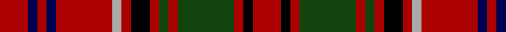

In pattern [RBRBRYRKRGRGRKR](/patterns/rbrbryrkrgrgrkr/).

This was sourced from weddslist.  It is a [15 stripes tartan](/stripes/stripes15/).

Original link http://www.weddslist.com/cgi-bin/tartans/pg.pl?source=tinsel

## Attestations

This cloth appears in 2 source records; the oldest owns this page.

- undated — Drummond C (weddslist, [record](http://www.weddslist.com/cgi-bin/tartans/pg.pl?source=tinsel))
- undated — Drummond C (weddslist, [record](http://www.weddslist.com/cgi-bin/tartans/pg.pl?source=x))

## Thread count
DR/6 DB2 DR2 DB2 DR12 N2 DR2 K4 DR2 DG2 DR2 DG12 DR2 K2 DR/6

## Palette
Each colour and its ΔE from the base-6 reference it is a variant of.

| Colour | Shade | Base | ΔE (OKLab) |
|---|---|---|---|
| DB | <code style="background-color:#000052;">#000052</code> `#000052` | B <code style="background-color:#2A418A;">#2A418A</code> | 0.20 |
| DG | <code style="background-color:#11450D;">#11450D</code> `#11450D` | G <code style="background-color:#006100;">#006100</code> | 0.09 |
| DR | <code style="background-color:#AA0000;">#AA0000</code> `#AA0000` | R <code style="background-color:#CC0000;">#CC0000</code> | 0.07 |
| K | <code style="background-color:#000000;">#000000</code> `#000000` | K <code style="background-color:#000000;">#000000</code> | 0.00 |
| N | <code style="background-color:#AAAAAA;">#AAAAAA</code> `#AAAAAA` | Y <code style="background-color:#F2BF00;">#F2BF00</code> | 0.19 |

## Nearest tartans

The nearest existing variants by ΔTartan distance.

1. [Drummond C](/setts/s15/r3b1r1b1r6w1r1k2r1g1r1g6r1k1r3x2~b000064-g004c00-k000000-rc80000-wd0d0d0/) — ΔT 0.68
1. [London Caledonian](/setts/s13/r8b2r14g2r2b6r2ga2r2ga11r2ba2r6x2~b440044-ba202060-g789484-ga003820-rc80000/) — ΔT 1.20
1. [Hunter (USA)](/setts/s11/g6r2g14r14b2r14w2g14b2g4y3x2~b202060-g003820-rc80000-wfcfcfc-yd8b000/) — ΔT 1.23
1. [MacNicol D](/setts/s13/k2r10g2r10g13r2k6b2k8r10g2r10k2x2~b4367ae-g11450d-k000000-raa0000/) — ΔT 1.29
1. [MacNicol D](/setts/s13/k2r10g2r10g13r2k6b2k8r10g2r10k2~b4367ae-g11450d-k000000-raa0000/) — ΔT 1.29
1. [MacKinnon #3](/setts/s14/b3r4g3ba3r7g17r3ba5g4r21g7b3r6w3x2~b5a008c-ba2c4084-g005020-rdc0000-we0e0e0/) — ΔT 1.30
1. [Order of the Holy Sepulchre (Corp)](/setts/s20/w1r7k7r1k7w1r7w1k7r1k7w1y2w1k8r1k8r7w1ya1x4~k101010-rc80000-we0e0e0-ybc8c00-yae8c000/) — ΔT 1.33
1. [City of New Bern 300 (District)](/setts/s18/r12k2y2k2r2k2y2k2r12k1ka2ka3ka2k1r12k2y2k2x2~k101010-ka000000-r880000-ye8c000/) — ΔT 1.35
1. [MacDougall #6](/setts/s19/k1r4g8r2g1r2b4r2w1r1w1r2g4r3g4r1k1r8w1x2~b2c4084-g005020-k101010-rdc0000-we0e0e0/) — ΔT 1.35
1. [Seton](/setts/s18/r2g1r10k2r1b2r2g6w1g3w1g6r2b2r1k2r10g1x8~b780078-g006818-k101010-rc80000-wfcfcfc/) — ΔT 1.37

## Neighbour map

Every grey dot is one of 15726 variants placed by the first two principal components of the ΔTartan feature space (44% of its variance). Red is this tartan; blue dots are its nearest — click one to open its page.

<svg viewBox="0 0 640 380" role="img" style="max-width:100%;height:auto;border:1px solid #e0e0e0;border-radius:4px;display:block" xmlns="http://www.w3.org/2000/svg"><image href="/nn/cloud.v1.png" width="640" height="380"/><a href="/setts/s15/r3b1r1b1r6w1r1k2r1g1r1g6r1k1r3x2~b000064-g004c00-k000000-rc80000-wd0d0d0/"><circle cx="237.4" cy="158.2" r="4" fill="#3465a4"><title>Drummond C</title></circle></a><a href="/setts/s13/r8b2r14g2r2b6r2ga2r2ga11r2ba2r6x2~b440044-ba202060-g789484-ga003820-rc80000/"><circle cx="297.2" cy="172.0" r="4" fill="#3465a4"><title>London Caledonian</title></circle></a><a href="/setts/s11/g6r2g14r14b2r14w2g14b2g4y3x2~b202060-g003820-rc80000-wfcfcfc-yd8b000/"><circle cx="227.9" cy="182.6" r="4" fill="#3465a4"><title>Hunter (USA)</title></circle></a><a href="/setts/s13/k2r10g2r10g13r2k6b2k8r10g2r10k2x2~b4367ae-g11450d-k000000-raa0000/"><circle cx="235.2" cy="202.9" r="4" fill="#3465a4"><title>MacNicol D</title></circle></a><a href="/setts/s13/k2r10g2r10g13r2k6b2k8r10g2r10k2~b4367ae-g11450d-k000000-raa0000/"><circle cx="235.2" cy="202.9" r="4" fill="#3465a4"><title>MacNicol D</title></circle></a><a href="/setts/s14/b3r4g3ba3r7g17r3ba5g4r21g7b3r6w3x2~b5a008c-ba2c4084-g005020-rdc0000-we0e0e0/"><circle cx="205.9" cy="159.1" r="4" fill="#3465a4"><title>MacKinnon #3</title></circle></a><a href="/setts/s20/w1r7k7r1k7w1r7w1k7r1k7w1y2w1k8r1k8r7w1ya1x4~k101010-rc80000-we0e0e0-ybc8c00-yae8c000/"><circle cx="241.8" cy="145.7" r="4" fill="#3465a4"><title>Order of the Holy Sepulchre (Corp)</title></circle></a><a href="/setts/s18/r12k2y2k2r2k2y2k2r12k1ka2ka3ka2k1r12k2y2k2x2~k101010-ka000000-r880000-ye8c000/"><circle cx="291.5" cy="120.1" r="4" fill="#3465a4"><title>City of New Bern 300 (District)</title></circle></a><a href="/setts/s19/k1r4g8r2g1r2b4r2w1r1w1r2g4r3g4r1k1r8w1x2~b2c4084-g005020-k101010-rdc0000-we0e0e0/"><circle cx="209.3" cy="142.6" r="4" fill="#3465a4"><title>MacDougall #6</title></circle></a><a href="/setts/s18/r2g1r10k2r1b2r2g6w1g3w1g6r2b2r1k2r10g1x8~b780078-g006818-k101010-rc80000-wfcfcfc/"><circle cx="243.1" cy="128.8" r="4" fill="#3465a4"><title>Seton</title></circle></a><circle cx="252.8" cy="167.8" r="5" fill="#c00000"/></svg>

ID: /setts/s15/r3b1r1b1r6y1r1k2r1g1r1g6r1k1r3x2~b000052-g11450d-k000000-raa0000-yaaaaaa/
