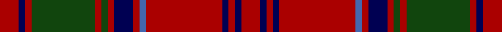

**Bands:** [RBRGRGRBRBRBRBR](/stripes/rbrgrgrbrbrbrbr/) · **Stripes:** [R DB R DG R DG R DB R B R DB R DB R](/stripes/stripes15/) R DB R DG R DG R DB R B R DB R DB R

This was sourced from weddslist.  It is a [15 band tartan](/bands/bands15/).

Original link http://www.weddslist.com/cgi-bin/tartans/pg.pl?source=tinsel

## Register references

External register numbers recorded for this tartan.

- Scottish Register of Tartans: [1166](https://www.tartanregister.gov.uk/tartanDetails.aspx?ref=1166)
- Scottish Register of Tartans: [1510](https://www.tartanregister.gov.uk/tartanDetails.aspx?ref=1510)
- Scottish Register of Tartans: [1758](https://www.tartanregister.gov.uk/tartanDetails.aspx?ref=1758)
- Scottish Register of Tartans: [2307](https://www.tartanregister.gov.uk/tartanDetails.aspx?ref=2307)
- Scottish Register of Tartans: [2349](https://www.tartanregister.gov.uk/tartanDetails.aspx?ref=2349)
- Scottish Register of Tartans: [2540](https://www.tartanregister.gov.uk/tartanDetails.aspx?ref=2540)
- Scottish Register of Tartans: [2582](https://www.tartanregister.gov.uk/tartanDetails.aspx?ref=2582)
- Scottish Register of Tartans: [2585](https://www.tartanregister.gov.uk/tartanDetails.aspx?ref=2585)
- Scottish Register of Tartans: [2625](https://www.tartanregister.gov.uk/tartanDetails.aspx?ref=2625)
- Scottish Register of Tartans: [2730](https://www.tartanregister.gov.uk/tartanDetails.aspx?ref=2730)
- Scottish Register of Tartans: [2862](https://www.tartanregister.gov.uk/tartanDetails.aspx?ref=2862)
- Scottish Register of Tartans: [3072](https://www.tartanregister.gov.uk/tartanDetails.aspx?ref=3072)
- Scottish Register of Tartans: [3555](https://www.tartanregister.gov.uk/tartanDetails.aspx?ref=3555)
- Scottish Register of Tartans: [4925](https://www.tartanregister.gov.uk/tartanDetails.aspx?ref=4925)
- Scottish Register of Tartans: [696](https://www.tartanregister.gov.uk/tartanDetails.aspx?ref=696)
- Scottish Register of Tartans: [697](https://www.tartanregister.gov.uk/tartanDetails.aspx?ref=697)
- Scottish Register of Tartans: [982](https://www.tartanregister.gov.uk/tartanDetails.aspx?ref=982)
- Scottish Tartans Authority (ITI): 1277
- Scottish Tartans Authority (ITI): 1429
- Scottish Tartans Authority (ITI): 218
- Scottish Tartans Authority (ITI): 977
- Scottish Tartans World Register: 1042
- Scottish Tartans World Register: 127
- Scottish Tartans World Register: 1277
- Scottish Tartans World Register: 1399
- Scottish Tartans World Register: 1429
- Scottish Tartans World Register: 1593
- Scottish Tartans World Register: 218
- Scottish Tartans World Register: 2218
- Scottish Tartans World Register: 3061
- Scottish Tartans World Register: 441
- Scottish Tartans World Register: 737
- Scottish Tartans World Register: 858
- Scottish Tartans World Register: 864
- Scottish Tartans World Register: 873
- Scottish Tartans World Register: 897
- Scottish Tartans World Register: 977
- Scottish Tartans World Register: 978

## Variants

Other setts woven to the same stripe pattern.

- [Grant](/setts/s15/r6db2r2dg24r2dg2r2db8r2b1r32db2r2db1r6~x2/)
- [Grant D](/setts/s15/r3db1r1dg10r1dg1r1db3r1b1r12db1r1db1r3~x2/)

## Thread count
DR/12 DB4 DR4 DG40 DR4 DG4 DR4 DB12 DR4 B4 DR48 DB4 DR4 DB4 DR/12

## Palette
Each colour and its ΔE from the base-6 reference it is a variant of.

| Colour | Shade | Base | ΔE (OKLab) |
|---|---|---|---|
| B | <code style="background-color:#4367AE;">#4367AE</code> `#4367AE` | B <code style="background-color:#2A418A;">#2A418A</code> | 0.12 |
| DB | <code style="background-color:#000052;">#000052</code> `#000052` | B <code style="background-color:#2A418A;">#2A418A</code> | 0.20 |
| DG | <code style="background-color:#11450D;">#11450D</code> `#11450D` | G <code style="background-color:#006100;">#006100</code> | 0.09 |
| DR | <code style="background-color:#AA0000;">#AA0000</code> `#AA0000` | R <code style="background-color:#CC0000;">#CC0000</code> | 0.07 |

## Nearest tartans

The nearest existing variants by ΔTartan distance.

1. [Grant D](/setts/s15/r3db1r1dg10r1dg1r1db3r1b1r12db1r1db1r3~x2/) — ΔT 0.00
1. [Grant D](/setts/s15/r3db1r1g10r1g1r1db3r1lb1r12db1r1db1r3~x2/) — ΔT 1.04
1. [Hughes (Welsh Name)](/setts/s11/g4r34dt20r4dt8r6db2r5dt2r3g4/) — ΔT 1.09
1. [Walker, Evening (Name)](/setts/s12/o4k2r7k15r3k3r3k7r28dg7r6dg2~x2/) — ΔT 1.12
1. [Waddell (Name)](/setts/s11/r3db2r24db8dg2db2dg2db2dg10r3w2~x2/) — ΔT 1.14
1. [MacRae of Inverinate (Clan)](/setts/s21/dg5r5dg2r3dg2r3dg2r23dg23r5dg15r5dg23r23dg2r3dg2r3dg2r5dp5~x2/) — ΔT 1.15
1. [Ulster](/setts/s10/o28k2o28k2o2k2dr29k2r2k2~x2/) — ΔT 1.16
1. [Robertson D](/setts/s13/r5dg2r30db3r3dg30r3db30r3db3r30dg2r5~x2/) — ΔT 1.16
1. [Robertson D](/setts/s13/r5dg2r30db3r3dg30r3db30r3db3r30dg2r5/) — ΔT 1.16
1. [Hunter of Bute (Personal)](/setts/s16/r12g6k6g2k1g1k6r24w2~x2/) — ΔT 1.16

## Neighbour map

Every grey dot is one of 14299 variants placed by the first two principal components of the ΔTartan feature space (44% of its variance). Red is this tartan; blue dots are its nearest — click one to open its page.

<svg viewBox="0 0 640 380" role="img" style="max-width:100%;height:auto;border:1px solid #e0e0e0;border-radius:4px;display:block" xmlns="http://www.w3.org/2000/svg"><image href="/nn/cloud.v1.png" width="640" height="380"/><a href="/setts/s15/r3db1r1dg10r1dg1r1db3r1b1r12db1r1db1r3~x2/"><circle cx="345.1" cy="143.7" r="4" fill="#3465a4"><title>Grant D</title></circle></a><a href="/setts/s15/r3db1r1g10r1g1r1db3r1lb1r12db1r1db1r3~x2/"><circle cx="319.8" cy="126.6" r="4" fill="#3465a4"><title>Grant D</title></circle></a><a href="/setts/s11/g4r34dt20r4dt8r6db2r5dt2r3g4/"><circle cx="366.1" cy="144.7" r="4" fill="#3465a4"><title>Hughes (Welsh Name)</title></circle></a><a href="/setts/s12/o4k2r7k15r3k3r3k7r28dg7r6dg2~x2/"><circle cx="324.7" cy="164.4" r="4" fill="#3465a4"><title>Walker, Evening (Name)</title></circle></a><a href="/setts/s11/r3db2r24db8dg2db2dg2db2dg10r3w2~x2/"><circle cx="317.1" cy="165.4" r="4" fill="#3465a4"><title>Waddell (Name)</title></circle></a><a href="/setts/s21/dg5r5dg2r3dg2r3dg2r23dg23r5dg15r5dg23r23dg2r3dg2r3dg2r5dp5~x2/"><circle cx="308.5" cy="142.0" r="4" fill="#3465a4"><title>MacRae of Inverinate (Clan)</title></circle></a><a href="/setts/s10/o28k2o28k2o2k2dr29k2r2k2~x2/"><circle cx="369.3" cy="156.7" r="4" fill="#3465a4"><title>Ulster</title></circle></a><a href="/setts/s13/r5dg2r30db3r3dg30r3db30r3db3r30dg2r5~x2/"><circle cx="339.8" cy="163.4" r="4" fill="#3465a4"><title>Robertson D</title></circle></a><a href="/setts/s13/r5dg2r30db3r3dg30r3db30r3db3r30dg2r5/"><circle cx="339.8" cy="163.4" r="4" fill="#3465a4"><title>Robertson D</title></circle></a><a href="/setts/s16/r12g6k6g2k1g1k6r24w2~x2/"><circle cx="358.0" cy="125.7" r="4" fill="#3465a4"><title>Hunter of Bute (Personal)</title></circle></a><circle cx="345.1" cy="143.7" r="5" fill="#c00000"/></svg>

ID: /setts/s15/r3db1r1dg10r1dg1r1db3r1b1r12db1r1db1r3~x4/
