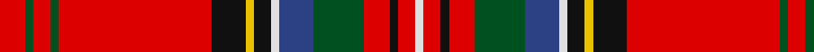

In pattern [RGRGRKYKWBGRKRW](/stripes/rgrgrkykwbgrkrw/).

This was sourced from register-of-tartans.  It is a [15 stripe tartan](/stripes/stripes15/).

Original link https://www.tartanregister.gov.uk/tartanDetails.aspx?ref=4014

## Also known as

This cloth is also recorded under:

- Stuart/Stewart of Appin #4

## Register references

External register numbers recorded for this tartan.

- Scottish Register of Tartans: [4014](https://www.tartanregister.gov.uk/tartanDetails.aspx?ref=4014)
- Scottish Tartans World Register: 1532

## Thread count
R/6 G2 R4 G2 R36 K8 Y2 K4 LN2 B8 G12 R6 K2 R4 LN/2

## Palette
Each colour and its ΔE from the base-6 reference it is a variant of.

| Colour | Shade | Base | ΔE (OKLab) |
|---|---|---|---|
| B | <code style="background-color:#2C4084;">#2C4084</code> `#2C4084` | B <code style="background-color:#2A418A;">#2A418A</code> | 0.01 |
| G | <code style="background-color:#005020;">#005020</code> `#005020` | G <code style="background-color:#006100;">#006100</code> | 0.07 |
| K | <code style="background-color:#101010;">#101010</code> `#101010` | K <code style="background-color:#000000;">#000000</code> | 0.17 |
| LN | <code style="background-color:#E0E0E0;">#E0E0E0</code> `#E0E0E0` | W <code style="background-color:#F7F7F7;">#F7F7F7</code> | 0.07 |
| R | <code style="background-color:#DC0000;">#DC0000</code> `#DC0000` | R <code style="background-color:#CC0000;">#CC0000</code> | 0.03 |
| Y | <code style="background-color:#E8C000;">#E8C000</code> `#E8C000` | Y <code style="background-color:#F2BF00;">#F2BF00</code> | 0.02 |

## Nearest tartans

The nearest existing variants by ΔTartan distance.

1. [Stewart of Appin 5](/setts/s15/r3g1r2g1r18k4ly1k2w1db4g6r3k1r2w1~x2/) — ΔT 0.63
1. [Stewart of Galloway - 1842 (Clan)](/setts/s12/k3r24k4ly1k2w1db4dg6r3k1r2w1~x4/) — ΔT 0.78
1. [Royal Stewart Royal Family Tartan Tartan Number: 1370. Earliest known date: 1831 The best known of all Scottish tartans, the Royal Stewart is the tartan of the Royal House of Stewart and the personal tartan of Her Majesty the Queen. In the same way that clansmen wear the tartan of their chief, it is appropriate for all subjects of the Queen to wear the Royal Stewart tartan. The pattern was first published by James Logan in his book, 'The Scottish Gael' in 1831, but references indicate that the sett was known at the end of the 18th century. Early samples show blue as a light 'azure'. See products available Copyright © Blair Urquhart, Comrie, 2015](/setts/s12/r18db2k3ly1k1w1k1g4r2k1r1w1~x4/) — ΔT 0.79
1. [Royal Stewart MINI Design Tartan Tartan Number: 11370. Earliest known date: Dupion Silk. Display Purposes Only. Reduced Copy of 1370 Royal Stewart. See products available Copyright © Blair Urquhart, Comrie, 2015](/setts/s12/r18db2k3ly1k1w1k1g4r2k1r1w1~x2/) — ΔT 0.79
1. [Stewart/Stuart, Royal #2](/setts/s12/r18db2k3ly1k1w1k1g4r2k1r1w1~x8/) — ΔT 0.80
1. [MacArthur-Fox Dress](/setts/s11/lb4k2db3r33dg9ly3r5db10r6dg2k2~x2/) — ΔT 0.85
1. [MacArthur-Fox Dress (Personal)](/setts/s11/t4k2db3r33g9w3r5db10r6g2k2~x2/) — ΔT 0.86
1. [Strathclyde Fire Services (Corporate](/setts/s12/r37k3r7w3dg3ly3dg2db10k6db3dg3w4~x2/) — ΔT 0.95
1. [Stewart/Stuart of Galloway (VS)](/setts/s22/r24k4ly1k2w1db4dg6r3k1r2w1r2k1r3dg6db4w1k2ly1k4r24k3~x4/) — ΔT 1.02
1. [McLinden, Thomas (Personal)](/setts/s11/r3db1r1db2r12b1r1k4w1dg6r1~x4/) — ΔT 1.03

## Neighbour map

Every grey dot is one of 14299 variants placed by the first two principal components of the ΔTartan feature space (44% of its variance). Red is this tartan; blue dots are its nearest — click one to open its page.

<svg viewBox="0 0 640 380" role="img" style="max-width:100%;height:auto;border:1px solid #e0e0e0;border-radius:4px;display:block" xmlns="http://www.w3.org/2000/svg"><image href="/nn/cloud.v1.png" width="640" height="380"/><a href="/setts/s15/r3g1r2g1r18k4ly1k2w1db4g6r3k1r2w1~x2/"><circle cx="268.7" cy="69.2" r="4" fill="#3465a4"><title>Stewart of Appin 5</title></circle></a><a href="/setts/s12/k3r24k4ly1k2w1db4dg6r3k1r2w1~x4/"><circle cx="305.3" cy="64.5" r="4" fill="#3465a4"><title>Stewart of Galloway - 1842 (Clan)</title></circle></a><a href="/setts/s12/r18db2k3ly1k1w1k1g4r2k1r1w1~x4/"><circle cx="312.7" cy="66.1" r="4" fill="#3465a4"><title>Royal Stewart Royal Family Tartan Tartan Number: 1370. Earliest known date: 1831 The best known of all Scottish tartans, the Royal Stewart is the tartan of the Royal House of Stewart and the personal tartan of Her Majesty the Queen. In the same way that clansmen wear the tartan of their chief, it is appropriate for all subjects of the Queen to wear the Royal Stewart tartan. The pattern was first published by James Logan in his book, 'The Scottish Gael' in 1831, but references indicate that the sett was known at the end of the 18th century. Early samples show blue as a light 'azure'. See products available Copyright © Blair Urquhart, Comrie, 2015</title></circle></a><a href="/setts/s12/r18db2k3ly1k1w1k1g4r2k1r1w1~x2/"><circle cx="312.7" cy="66.1" r="4" fill="#3465a4"><title>Royal Stewart MINI Design Tartan Tartan Number: 11370. Earliest known date: Dupion Silk. Display Purposes Only. Reduced Copy of 1370 Royal Stewart. See products available Copyright © Blair Urquhart, Comrie, 2015</title></circle></a><a href="/setts/s12/r18db2k3ly1k1w1k1g4r2k1r1w1~x8/"><circle cx="310.4" cy="64.6" r="4" fill="#3465a4"><title>Stewart/Stuart, Royal #2</title></circle></a><a href="/setts/s11/lb4k2db3r33dg9ly3r5db10r6dg2k2~x2/"><circle cx="288.7" cy="94.6" r="4" fill="#3465a4"><title>MacArthur-Fox Dress</title></circle></a><a href="/setts/s11/t4k2db3r33g9w3r5db10r6g2k2~x2/"><circle cx="287.7" cy="96.9" r="4" fill="#3465a4"><title>MacArthur-Fox Dress (Personal)</title></circle></a><a href="/setts/s12/r37k3r7w3dg3ly3dg2db10k6db3dg3w4~x2/"><circle cx="253.5" cy="70.8" r="4" fill="#3465a4"><title>Strathclyde Fire Services (Corporate</title></circle></a><a href="/setts/s22/r24k4ly1k2w1db4dg6r3k1r2w1r2k1r3dg6db4w1k2ly1k4r24k3~x4/"><circle cx="310.5" cy="41.9" r="4" fill="#3465a4"><title>Stewart/Stuart of Galloway (VS)</title></circle></a><a href="/setts/s11/r3db1r1db2r12b1r1k4w1dg6r1~x4/"><circle cx="249.0" cy="107.5" r="4" fill="#3465a4"><title>McLinden, Thomas (Personal)</title></circle></a><circle cx="281.5" cy="70.9" r="5" fill="#c00000"/></svg>

ID: /setts/s15/r3dg1r2dg1r18k4ly1k2w1db4dg6r3k1r2w1~x2/
