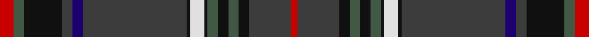

**Bands:** [RGKBBBKWKGKGKBR](/stripes/rgkbbbkwkgkgkbr/) · **Stripes:** [R DG K DO DB DO K W K DG K DG K DO R](/stripes/stripes15/) R DG K DO DB DO K W K DG K DG K DO R

This was sourced from tartans-authority.  It is a [15 band tartan](/bands/bands15/).

Original link http://www.tartansauthority.com/tartan-ferret/display/10033/

## Thread count
R/8 Na6 K22 N6 DB6 N60 K2 LN8 K2 Na6 K6 Na6 K6 N24 R/4

## Palette
Each colour and its ΔE from the base-6 reference it is a variant of.

| Colour | Shade | Base | ΔE (OKLab) |
|---|---|---|---|
| DB | <code style="background-color:#1C0070;">#1C0070</code> `#1C0070` | B <code style="background-color:#2A418A;">#2A418A</code> | 0.14 |
| K | <code style="background-color:#101010;">#101010</code> `#101010` | K <code style="background-color:#000000;">#000000</code> | 0.17 |
| LN | <code style="background-color:#E0E0E0;">#E0E0E0</code> `#E0E0E0` | W <code style="background-color:#F7F7F7;">#F7F7F7</code> | 0.07 |
| N | <code style="background-color:#3C3C3C;">#3C3C3C</code> `#3C3C3C` | B <code style="background-color:#2A418A;">#2A418A</code> | 0.13 |
| Na | <code style="background-color:#405844;">#405844</code> `#405844` | G <code style="background-color:#006100;">#006100</code> | 0.10 |
| R | <code style="background-color:#C80000;">#C80000</code> `#C80000` | R <code style="background-color:#CC0000;">#CC0000</code> | 0.01 |

## Nearest tartans

The nearest existing variants by ΔTartan distance.

1. [Donohoe Grey, Peter (Commemorative)](/setts/s11/do9lb2r1lb2do3k9dg3do1n35k3n2~x2/) — ΔT 0.94
1. [Donohoe Grey, Peter](/setts/s11/dy9db2r1db2dy3k9g3dy1n35k3n2~x2/) — ΔT 1.06
1. [Indianapolis MPD Emerald Society](/setts/s17/db67dy5g10r5ly2r5g10dy5db4dy5g10r5o2r5dy5g10db24/) — ΔT 1.07
1. [Knox (Personal)](/setts/s13/dg55y20w2y3k2y3w2y3db18k2y4ly2y3~x2/) — ΔT 1.09
1. [Earthrise](/setts/s12/k4n6k4o4n29o6k64db10k4db6t4w2/) — ΔT 1.13
1. [Glen Orchy (Fashion)](/setts/s15/dg5r4m1db36r4dg15r8y1db15r4dg36r4r1db5y1~x2/) — ΔT 1.13
1. [Highland Gathering (Fashion?)](/setts/s10/k45r4k4do4lo16do76dt8lo6dt2w4/) — ΔT 1.18
1. [Capercaillie Corporate Tartan Tartan Number: 6857. Earliest known date: 2005 RSPB Scotland will receive a 7% royalty on all products made from the new tartan, created in the colours of the world's largest woodland grouse, in a deal struck with the leading tartan weavers Lochcarron. See products available Copyright © Blair Urquhart, Comrie, 2015](/setts/s14/n4o3n4o2n4dt8n30k4dt4k36n4r2k4w2/) — ΔT 1.19
1. [The Trew 40th](/setts/s15/r4k3k11dt3db3dt30k1w4k1dt3k3dt3k3dt12r2~x2/) — ΔT 1.20
1. [Neumann - GPS German Pipe Smokers](/setts/s13/do2r3lo1k2lo1dp16lo1dg32lo1do2lo1r1do1~x2/) — ΔT 1.21

## Neighbour map

Every grey dot is one of 14299 variants placed by the first two principal components of the ΔTartan feature space (44% of its variance). Red is this tartan; blue dots are its nearest — click one to open its page.

<svg viewBox="0 0 640 380" role="img" style="max-width:100%;height:auto;border:1px solid #e0e0e0;border-radius:4px;display:block" xmlns="http://www.w3.org/2000/svg"><image href="/nn/cloud.v1.png" width="640" height="380"/><a href="/setts/s11/do9lb2r1lb2do3k9dg3do1n35k3n2~x2/"><circle cx="336.9" cy="88.7" r="4" fill="#3465a4"><title>Donohoe Grey, Peter (Commemorative)</title></circle></a><a href="/setts/s11/dy9db2r1db2dy3k9g3dy1n35k3n2~x2/"><circle cx="342.2" cy="91.2" r="4" fill="#3465a4"><title>Donohoe Grey, Peter</title></circle></a><a href="/setts/s17/db67dy5g10r5ly2r5g10dy5db4dy5g10r5o2r5dy5g10db24/"><circle cx="326.2" cy="76.4" r="4" fill="#3465a4"><title>Indianapolis MPD Emerald Society</title></circle></a><a href="/setts/s13/dg55y20w2y3k2y3w2y3db18k2y4ly2y3~x2/"><circle cx="306.9" cy="94.4" r="4" fill="#3465a4"><title>Knox (Personal)</title></circle></a><a href="/setts/s12/k4n6k4o4n29o6k64db10k4db6t4w2/"><circle cx="320.2" cy="88.7" r="4" fill="#3465a4"><title>Earthrise</title></circle></a><a href="/setts/s15/dg5r4m1db36r4dg15r8y1db15r4dg36r4r1db5y1~x2/"><circle cx="287.7" cy="96.9" r="4" fill="#3465a4"><title>Glen Orchy (Fashion)</title></circle></a><a href="/setts/s10/k45r4k4do4lo16do76dt8lo6dt2w4/"><circle cx="299.6" cy="90.9" r="4" fill="#3465a4"><title>Highland Gathering (Fashion?)</title></circle></a><a href="/setts/s14/n4o3n4o2n4dt8n30k4dt4k36n4r2k4w2/"><circle cx="270.0" cy="118.7" r="4" fill="#3465a4"><title>Capercaillie Corporate Tartan Tartan Number: 6857. Earliest known date: 2005 RSPB Scotland will receive a 7% royalty on all products made from the new tartan, created in the colours of the world's largest woodland grouse, in a deal struck with the leading tartan weavers Lochcarron. See products available Copyright © Blair Urquhart, Comrie, 2015</title></circle></a><a href="/setts/s15/r4k3k11dt3db3dt30k1w4k1dt3k3dt3k3dt12r2~x2/"><circle cx="358.3" cy="104.5" r="4" fill="#3465a4"><title>The Trew 40th</title></circle></a><a href="/setts/s13/do2r3lo1k2lo1dp16lo1dg32lo1do2lo1r1do1~x2/"><circle cx="339.9" cy="83.6" r="4" fill="#3465a4"><title>Neumann - GPS German Pipe Smokers</title></circle></a><circle cx="311.4" cy="96.4" r="5" fill="#c00000"/></svg>

ID: /setts/s15/r4dg3k11do3db3do30k1w4k1dg3k3dg3k3do12r2~x2/
