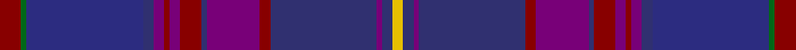

In pattern [RGBBBRBRBBRBBBY](/stripes/rgbbbrbrbbrbbby/).

This was sourced from tartans-authority.  It is a [15 stripe tartan](/stripes/stripes15/).

Original link http://www.tartansauthority.com/tartan-ferret/display/6136/

## Attestations

This cloth appears in 2 source records; the oldest owns this page.

- pre 2004 — Highland Cathedral (Fashion) (tartans-authority, [record](http://www.tartansauthority.com/tartan-ferret/display/6136/))
- undated — Highland Cathedral Fashion Tartan Tartan Number: 6136. Earliest known date: pre 2004 Nothing See products available Copyright © Blair Urquhart, Comrie, 2015 (house-of-tartan, [record](http://www.house-of-tartan.scotland.net/house/TartanViewjs.asp?colr=Def&tnam=6136))

## Thread count
DR/8 G2 DB44 DBa4 P4 DR2 P4 DR8 DBa2 P20 DR4 DBa40 P2 DBa4 Y/4

## Palette
Each colour and the base-6 reference it is a variant of.

| Colour | Shade | Base |
|---|---|---|
| DB | <code style="background-color:#2C2C80;">#2C2C80</code> `oklch(35.0% 0.138 276.6)` <small>#2C2C80</small> | B <code style="background-color:#2A418A;">#2A418A</code> |
| DBa | <code style="background-color:#303070;">#303070</code> `oklch(34.7% 0.108 279.2)` <small>#303070</small> | B <code style="background-color:#2A418A;">#2A418A</code> |
| DR | <code style="background-color:#880000;">#880000</code> `oklch(39.4% 0.162 29.2)` <small>#880000</small> | R <code style="background-color:#CC0000;">#CC0000</code> |
| G | <code style="background-color:#006818;">#006818</code> `oklch(45.0% 0.142 145.0)` <small>#006818</small> | G <code style="background-color:#006100;">#006100</code> |
| P | <code style="background-color:#780078;">#780078</code> `oklch(40.2% 0.185 328.4)` <small>#780078</small> | B <code style="background-color:#2A418A;">#2A418A</code> |
| Y | <code style="background-color:#E8C000;">#E8C000</code> `oklch(81.9% 0.168 93.7)` <small>#E8C000</small> | Y <code style="background-color:#F2BF00;">#F2BF00</code> |

## Nearest tartans

The nearest existing variants by ΔTartan distance, with this tartan at the top so the swatches line up against it.

ΔTartan

Tartan

Sett

—

<a href="/ttd/edit/#slug=r4g1db22db2dp2r1dp2r4db1dp10r2db20dp1db2ly2~x2">Highland Cathedral (Fashion)</a> <a class="nn-out" href="/setts/s15/r4g1db22db2dp2r1dp2r4db1dp10r2db20dp1db2ly2~x2/" title="open its dictionary page">↗</a>

1.39

<a href="/setts/s16/t4db19g1db2g2db18dp24g1db2~x2/">Spirit of Alba</a>

1.58

<a href="/setts/s28/r4g1db22db2dp2r1dp2r4db1dp10r2db20dp1db2ly2~x2/">Highland Cathedral</a>

1.64

<a href="/ttd/edit/#slug=t4db19g1db2g2db18dp24g1db2~x2">Spirit of Alba (Fashion)</a> <a class="nn-out" href="/setts/s9/t4db19g1db2g2db18dp24g1db2~x2/" title="open its dictionary page">↗</a>

1.82

<a href="/ttd/edit/#slug=db7w1k3dp3k3db3k13dp2k2dp2k2dp23db3dp2m2~x2">Passion of Scotland, Purple (Fashion</a> <a class="nn-out" href="/setts/s15/db7w1k3dp3k3db3k13dp2k2dp2k2dp23db3dp2m2~x2/" title="open its dictionary page">↗</a>

1.87

<a href="/ttd/edit/#slug=db45dp6o6dp30dg6dp6dg30k4r4k3">Dalgliesh, Ewen (Personal)</a> <a class="nn-out" href="/setts/s10/db45dp6o6dp30dg6dp6dg30k4r4k3/" title="open its dictionary page">↗</a>

1.92

<a href="/ttd/edit/#slug=dp4dp4dp3dg20dp5k4dp3k7dp3k3db35lb2db35k3dp3k7dp3k4dp5dg20dp3dp4dp4k2~x2">Spirit of Bannockburn Fashion Tartan Tartan Number: 3445. Earliest known date: 2000 Designed by Lochcarron of Scotland for ACS Clothing of Glasgow (0141 766 2600). Original name was 'Scotland the Brave' but changed to Spirit of Bannockburn by Lochcarron. See products available Copyright © Blair Urquhart, Comrie, 2015</a> <a class="nn-out" href="/setts/s24/dp4dp4dp3dg20dp5k4dp3k7dp3k3db35lb2db35k3dp3k7dp3k4dp5dg20dp3dp4dp4k2~x2/" title="open its dictionary page">↗</a>

2.02

<a href="/ttd/edit/#slug=db13w2dt38k13dt8k8dp17dg2dp17k4db11">Bute Heather</a> <a class="nn-out" href="/setts/s11/db13w2dt38k13dt8k8dp17dg2dp17k4db11/" title="open its dictionary page">↗</a>

2.03

<a href="/ttd/edit/#slug=db6k2dp9lb1dp9k2dt4k6dt24w1db6~x2">Newlands, Charlie (Personal)</a> <a class="nn-out" href="/setts/s11/db6k2dp9lb1dp9k2dt4k6dt24w1db6~x2/" title="open its dictionary page">↗</a>

2.07

<a href="/ttd/edit/#slug=db6ly1m18k6m4k4dp8dg1dp8k1db5~x2">Bute Heather, Autumn</a> <a class="nn-out" href="/setts/s11/db6ly1m18k6m4k4dp8dg1dp8k1db5~x2/" title="open its dictionary page">↗</a>

2.09

<a href="/ttd/edit/#slug=db37dp2db2dp3k13dp10w2dp10y1dp2y2dp2y9dp13~x2">Strathtummel (District?)</a> <a class="nn-out" href="/setts/s14/db37dp2db2dp3k13dp10w2dp10y1dp2y2dp2y9dp13~x2/" title="open its dictionary page">↗</a>

## Neighbour map

Every grey dot is one of 14299 variants placed by the first two principal components of the ΔTartan feature space (44% of its variance). Red is this tartan; blue dots are its nearest — click one to open its page.

<svg viewBox="0 0 640 380" role="img" style="max-width:100%;height:auto;border:1px solid #e0e0e0;border-radius:4px;display:block" xmlns="http://www.w3.org/2000/svg"><image href="/nn/cloud.v1.png" width="640" height="380"/><a href="/setts/s16/t4db19g1db2g2db18dp24g1db2~x2/"><circle cx="301.8" cy="165.5" r="4" fill="#3465a4"><title>Spirit of Alba</title></circle></a><a href="/setts/s28/r4g1db22db2dp2r1dp2r4db1dp10r2db20dp1db2ly2~x2/"><circle cx="287.2" cy="118.4" r="4" fill="#3465a4"><title>Highland Cathedral</title></circle></a><a href="/setts/s9/t4db19g1db2g2db18dp24g1db2~x2/"><circle cx="296.6" cy="180.9" r="4" fill="#3465a4"><title>Spirit of Alba (Fashion)</title></circle></a><a href="/setts/s15/db7w1k3dp3k3db3k13dp2k2dp2k2dp23db3dp2m2~x2/"><circle cx="325.1" cy="137.0" r="4" fill="#3465a4"><title>Passion of Scotland, Purple (Fashion</title></circle></a><a href="/setts/s10/db45dp6o6dp30dg6dp6dg30k4r4k3/"><circle cx="259.4" cy="192.1" r="4" fill="#3465a4"><title>Dalgliesh, Ewen (Personal)</title></circle></a><a href="/setts/s24/dp4dp4dp3dg20dp5k4dp3k7dp3k3db35lb2db35k3dp3k7dp3k4dp5dg20dp3dp4dp4k2~x2/"><circle cx="263.6" cy="135.8" r="4" fill="#3465a4"><title>Spirit of Bannockburn Fashion Tartan Tartan Number: 3445. Earliest known date: 2000 Designed by Lochcarron of Scotland for ACS Clothing of Glasgow (0141 766 2600). Original name was 'Scotland the Brave' but changed to Spirit of Bannockburn by Lochcarron. See products available Copyright © Blair Urquhart, Comrie, 2015</title></circle></a><a href="/setts/s11/db13w2dt38k13dt8k8dp17dg2dp17k4db11/"><circle cx="219.9" cy="177.3" r="4" fill="#3465a4"><title>Bute Heather</title></circle></a><a href="/setts/s11/db6k2dp9lb1dp9k2dt4k6dt24w1db6~x2/"><circle cx="308.6" cy="184.2" r="4" fill="#3465a4"><title>Newlands, Charlie (Personal)</title></circle></a><a href="/setts/s11/db6ly1m18k6m4k4dp8dg1dp8k1db5~x2/"><circle cx="244.1" cy="178.6" r="4" fill="#3465a4"><title>Bute Heather, Autumn</title></circle></a><a href="/setts/s14/db37dp2db2dp3k13dp10w2dp10y1dp2y2dp2y9dp13~x2/"><circle cx="310.6" cy="125.1" r="4" fill="#3465a4"><title>Strathtummel (District?)</title></circle></a><circle cx="266.6" cy="129.5" r="5" fill="#c00000"/></svg>

ID: /setts/s15/r4g1db22db2dp2r1dp2r4db1dp10r2db20dp1db2ly2~x2/
