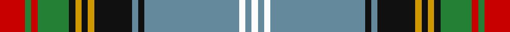

In pattern [RGRGKYKYKBKBWBW](/stripes/rgrgkykykbkbwbw/).

This was sourced from register-of-tartans.  It is a [15 stripe tartan](/stripes/stripes15/).

Original link https://www.tartanregister.gov.uk/tartanDetails.aspx?ref=1133

## Attestations

This cloth appears in 2 source records; the oldest owns this page.

- 01/01/1986 — Estes (register-of-tartans, [record](https://www.tartanregister.gov.uk/tartanDetails.aspx?ref=1133))
- 1986 — Estes (Name) (tartans-authority, [record](http://www.tartansauthority.com/tartan-ferret/display/1520/))

## Register references

External register numbers recorded for this tartan.

- Scottish Register of Tartans: [1133](https://www.tartanregister.gov.uk/tartanDetails.aspx?ref=1133)
- Scottish Tartans Authority (ITI): 1520
- Scottish Tartans World Register: 1520

## Thread count
R/16 G4 R4 G20 K4 DY4 K4 DY4 K24 B4 K4 B60 W4 B4 W/4

## Palette
Each colour and its ΔE from the base-6 reference it is a variant of.

| Colour | Shade | Base | ΔE (OKLab) |
|---|---|---|---|
| B | <code style="background-color:#64889C;">#64889C</code> `#64889C` | B <code style="background-color:#2A418A;">#2A418A</code> | 0.23 |
| DY | <code style="background-color:#D09800;">#D09800</code> `#D09800` | Y <code style="background-color:#F2BF00;">#F2BF00</code> | 0.12 |
| G | <code style="background-color:#248034;">#248034</code> `#248034` | G <code style="background-color:#006100;">#006100</code> | 0.10 |
| K | <code style="background-color:#101010;">#101010</code> `#101010` | K <code style="background-color:#000000;">#000000</code> | 0.17 |
| R | <code style="background-color:#C80000;">#C80000</code> `#C80000` | R <code style="background-color:#CC0000;">#CC0000</code> | 0.01 |
| W | <code style="background-color:#FCFCFC;">#FCFCFC</code> `#FCFCFC` | W <code style="background-color:#F7F7F7;">#F7F7F7</code> | 0.01 |

## Nearest tartans

The nearest existing variants by ΔTartan distance.

1. [Olympic](/setts/s13/db2g6db27r2k2w2db2r24g23db2r2k2ly2~x2/) — ΔT 1.00
1. [Oneness](/setts/s16/db12k3ly2k3r12db12k2lo28k2ly2k2o2k2lo28k2db12~x2/) — ΔT 1.02
1. [Otago](/setts/s18/lo16k2lo6k2r2k2db15g1db1w2~x2/) — ΔT 1.07
1. [Stuart/Stewart of Appin (Dress Hunting Stewart)](/setts/s16/r3k2t2r2dg20r3dg2r2db7r2dg2w23k2t2w2dg2~x2/) — ΔT 1.08
1. [Mungall](/setts/s15/lg27g7r2k7ly2k7r2g7db10r2lg9r3lg2r2db3~x2/) — ΔT 1.10
1. [Glasgow, City of Culture](/setts/s11/r6g2r2g21k2w4k2db23ly2db2ly6~x2/) — ΔT 1.10
1. [Oneness](/setts/s16/db12k2lo28k2lr2k2lo2k2lo28k2db12r12k3lo2k3r12~x2/) — ΔT 1.13
1. [Stirling University #2](/setts/s14/g22r3w1g2r3t16k3ly2~x4/) — ΔT 1.15
1. [Mungall Family Tartan Tartan Number: 4070. Earliest known date: 2001 This tartan was first produced in ancient colours. It is a personal tartan to commemorate the signing of the Ragman's Roll by William de Mungall See products available Copyright © Blair Urquhart, Comrie, 2015](/setts/s15/t30y8r2k8ly2k8r2y8db11r2t10r3t2r2db3~x2/) — ΔT 1.17
1. [Tait #2](/setts/s12/w4k1r2k1g9k2b24k2r6k2g12ly2~x2/) — ΔT 1.24

## Neighbour map

Every grey dot is one of 14299 variants placed by the first two principal components of the ΔTartan feature space (44% of its variance). Red is this tartan; blue dots are its nearest — click one to open its page.

<svg viewBox="0 0 640 380" role="img" style="max-width:100%;height:auto;border:1px solid #e0e0e0;border-radius:4px;display:block" xmlns="http://www.w3.org/2000/svg"><image href="/nn/cloud.v1.png" width="640" height="380"/><a href="/setts/s13/db2g6db27r2k2w2db2r24g23db2r2k2ly2~x2/"><circle cx="166.7" cy="100.7" r="4" fill="#3465a4"><title>Olympic</title></circle></a><a href="/setts/s16/db12k3ly2k3r12db12k2lo28k2ly2k2o2k2lo28k2db12~x2/"><circle cx="194.8" cy="98.4" r="4" fill="#3465a4"><title>Oneness</title></circle></a><a href="/setts/s18/lo16k2lo6k2r2k2db15g1db1w2~x2/"><circle cx="177.9" cy="83.5" r="4" fill="#3465a4"><title>Otago</title></circle></a><a href="/setts/s16/r3k2t2r2dg20r3dg2r2db7r2dg2w23k2t2w2dg2~x2/"><circle cx="115.7" cy="75.9" r="4" fill="#3465a4"><title>Stuart/Stewart of Appin (Dress Hunting Stewart)</title></circle></a><a href="/setts/s15/lg27g7r2k7ly2k7r2g7db10r2lg9r3lg2r2db3~x2/"><circle cx="147.3" cy="108.5" r="4" fill="#3465a4"><title>Mungall</title></circle></a><a href="/setts/s11/r6g2r2g21k2w4k2db23ly2db2ly6~x2/"><circle cx="129.8" cy="114.1" r="4" fill="#3465a4"><title>Glasgow, City of Culture</title></circle></a><a href="/setts/s16/db12k2lo28k2lr2k2lo2k2lo28k2db12r12k3lo2k3r12~x2/"><circle cx="172.0" cy="85.7" r="4" fill="#3465a4"><title>Oneness</title></circle></a><a href="/setts/s14/g22r3w1g2r3t16k3ly2~x4/"><circle cx="204.7" cy="93.4" r="4" fill="#3465a4"><title>Stirling University #2</title></circle></a><a href="/setts/s15/t30y8r2k8ly2k8r2y8db11r2t10r3t2r2db3~x2/"><circle cx="174.6" cy="110.0" r="4" fill="#3465a4"><title>Mungall Family Tartan Tartan Number: 4070. Earliest known date: 2001 This tartan was first produced in ancient colours. It is a personal tartan to commemorate the signing of the Ragman's Roll by William de Mungall See products available Copyright © Blair Urquhart, Comrie, 2015</title></circle></a><a href="/setts/s12/w4k1r2k1g9k2b24k2r6k2g12ly2~x2/"><circle cx="167.8" cy="90.6" r="4" fill="#3465a4"><title>Tait #2</title></circle></a><circle cx="174.6" cy="81.1" r="5" fill="#c00000"/></svg>

ID: /setts/s15/r4g1r1g5k1lo1k1lo1k6t1k1t15w1t1w1~x4/
