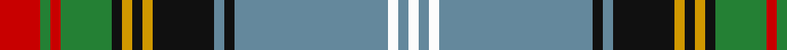

In pattern [RGRGKYKYKBKBWBW](/patterns/rgrgkykykbkbwbw/).

This was sourced from register-of-tartans.  It is a [15 stripes tartan](/stripes/stripes15/).

Original link https://www.tartanregister.gov.uk/tartanDetails.aspx?ref=1133

## Attestations

This cloth appears in 2 source records; the oldest owns this page.

- 01/01/1986 — Estes (register-of-tartans, [record](https://www.tartanregister.gov.uk/tartanDetails.aspx?ref=1133))
- 1986 — Estes (Name) (tartans-authority, [record](http://www.tartansauthority.com/tartan-ferret/display/1520/))

## Thread count
R/16 G4 R4 G20 K4 DY4 K4 DY4 K24 B4 K4 B60 W4 B4 W/4

## Palette
Each colour and its ΔE from the base-6 reference it is a variant of.

| Colour | Shade | Base | ΔE (OKLab) |
|---|---|---|---|
| B | <code style="background-color:#64889C;">#64889C</code> `#64889C` | B <code style="background-color:#2A418A;">#2A418A</code> | 0.23 |
| DY | <code style="background-color:#D09800;">#D09800</code> `#D09800` | Y <code style="background-color:#F2BF00;">#F2BF00</code> | 0.12 |
| G | <code style="background-color:#248034;">#248034</code> `#248034` | G <code style="background-color:#006100;">#006100</code> | 0.10 |
| K | <code style="background-color:#101010;">#101010</code> `#101010` | K <code style="background-color:#000000;">#000000</code> | 0.17 |
| R | <code style="background-color:#C80000;">#C80000</code> `#C80000` | R <code style="background-color:#CC0000;">#CC0000</code> | 0.01 |
| W | <code style="background-color:#FCFCFC;">#FCFCFC</code> `#FCFCFC` | W <code style="background-color:#F7F7F7;">#F7F7F7</code> | 0.01 |

## Nearest tartans

The nearest existing variants by ΔTartan distance.

1. [Stewart Blue Trade Tartan Tartan Number: 54. Earliest known date: 1956 Weft is slightly different. Commenting on the design, Mr Portch said, "The sett should be exactly the same as Royal Stewart with light Scottish blue replacing the red ground and white over checking." It is not entirely clear if Mr Portch has developed a 'trade variant' or is explaining his view of the 'correct form' of the Blue Stewart. See products available Copyright © Blair Urquhart, Comrie, 2015](/setts/s12/b29ba3k10y2k2b2k2g10r5k3r2b2x2~b5c8ca8-ba2c2c80-g006818-k101010-rc80000-ye8c000/) — ΔT 0.91
1. [Olympic](/setts/s13/b2g6b27r2k2w2b2r24g23b2r2k2y2x2~b304080-g008000-k000000-rc00000-we0e0e0-yf0c000/) — ΔT 1.00
1. [Oneness](/setts/s16/b12k3y2k3r12b12k2ya28k2y2k2ra2k2ya28k2b12x2~b202060-k101010-rd05054-ra888888-yc4bc68-yaa08858/) — ΔT 1.01
1. [Spirit of Romania](/setts/s16/b4ba1b2ba1bb16ba1y16r16ba1bb4ba2bb4ba2bb12ba1w4x2~b440044-ba202060-bb1870a4-rc80000-wfcfcfc-ye8c000/) — ΔT 1.06
1. [Otago](/setts/s18/y16k2y6k2r2k2b15g1b1w2b1g1b15k2r2k2y6k2x2~b2c2c80-g006818-k101010-rc80000-we0e0e0-ybc8c00/) — ΔT 1.07
1. [Stuart/Stewart of Appin (Dress Hunting Stewart)](/setts/s16/r3k2b2r2g20r3g2r2ba7r2g2w23k2b2w2g2x2~b3c82af-ba2c4084-g005020-k101010-rdc0000-we0e0e0/) — ΔT 1.08
1. [Culture The... Corporate Tartan Tartan Number: 1534. Earliest known date: 1989 Colours chosen to reflect a European essence that will endure beyond the 1990 'Year of Culture'. Supply and manufacture only at MacDonald MacKay (Kiltmakers) Ltd., Glasgow. See products available Copyright © Blair Urquhart, Comrie, 2015](/setts/s11/r6g2r2g21k2w4k2b23y2b2y6x2~b2c2c80-g006818-k101010-rc80000-we0e0e0-ye8c000/) — ΔT 1.10
1. [Mungall](/setts/s15/y27g7r2k7ya2k7r2g7b10r2y9r3y2r2b3x2~b2c2c80-g006818-k101010-rc80000-y48a4c0-yae8c000/) — ΔT 1.10
1. [Glasgow, City of Culture](/setts/s11/r6g2r2g21k2w4k2b23y2b2y6x2~b2c2c80-g006818-k101010-rc80000-wfcfcfc-ye8c000/) — ΔT 1.11
1. [Aberfeldy District Tartan Tartan Number: 7748. Earliest known date: 2008 Designed by Heather Yellowley of Strathmore Woollen Company, Forfar, for the Aberfeldy & District Gaelic Choir. Originally designed for use by the choir in the 2008 MOD in Falkirk but intended for wider use afterwards as the Aberfeldy district tartan. See products available Copyright © Blair Urquhart, Comrie, 2015](/setts/s14/w2b2k2ba2b32r2b2r2k13b2g16r2g2w2x2~b506878-ba5c8ca8-g007460-k000000-r901c38-we0e0e0/) — ΔT 1.11

## Neighbour map

Every grey dot is one of 15726 variants placed by the first two principal components of the ΔTartan feature space (44% of its variance). Red is this tartan; blue dots are its nearest — click one to open its page.

<svg viewBox="0 0 640 380" role="img" style="max-width:100%;height:auto;border:1px solid #e0e0e0;border-radius:4px;display:block" xmlns="http://www.w3.org/2000/svg"><image href="/nn/cloud.v1.png" width="640" height="380"/><a href="/setts/s12/b29ba3k10y2k2b2k2g10r5k3r2b2x2~b5c8ca8-ba2c2c80-g006818-k101010-rc80000-ye8c000/"><circle cx="203.8" cy="102.4" r="4" fill="#3465a4"><title>Stewart Blue Trade Tartan Tartan Number: 54. Earliest known date: 1956 Weft is slightly different. Commenting on the design, Mr Portch said, &quot;The sett should be exactly the same as Royal Stewart with light Scottish blue replacing the red ground and white over checking.&quot; It is not entirely clear if Mr Portch has developed a 'trade variant' or is explaining his view of the 'correct form' of the Blue Stewart. See products available Copyright © Blair Urquhart, Comrie, 2015</title></circle></a><a href="/setts/s13/b2g6b27r2k2w2b2r24g23b2r2k2y2x2~b304080-g008000-k000000-rc00000-we0e0e0-yf0c000/"><circle cx="164.1" cy="97.9" r="4" fill="#3465a4"><title>Olympic</title></circle></a><a href="/setts/s16/b12k3y2k3r12b12k2ya28k2y2k2ra2k2ya28k2b12x2~b202060-k101010-rd05054-ra888888-yc4bc68-yaa08858/"><circle cx="192.5" cy="96.5" r="4" fill="#3465a4"><title>Oneness</title></circle></a><a href="/setts/s16/b4ba1b2ba1bb16ba1y16r16ba1bb4ba2bb4ba2bb12ba1w4x2~b440044-ba202060-bb1870a4-rc80000-wfcfcfc-ye8c000/"><circle cx="151.5" cy="84.7" r="4" fill="#3465a4"><title>Spirit of Romania</title></circle></a><a href="/setts/s18/y16k2y6k2r2k2b15g1b1w2b1g1b15k2r2k2y6k2x2~b2c2c80-g006818-k101010-rc80000-we0e0e0-ybc8c00/"><circle cx="175.2" cy="82.0" r="4" fill="#3465a4"><title>Otago</title></circle></a><a href="/setts/s16/r3k2b2r2g20r3g2r2ba7r2g2w23k2b2w2g2x2~b3c82af-ba2c4084-g005020-k101010-rdc0000-we0e0e0/"><circle cx="112.7" cy="75.3" r="4" fill="#3465a4"><title>Stuart/Stewart of Appin (Dress Hunting Stewart)</title></circle></a><a href="/setts/s11/r6g2r2g21k2w4k2b23y2b2y6x2~b2c2c80-g006818-k101010-rc80000-we0e0e0-ye8c000/"><circle cx="130.2" cy="114.0" r="4" fill="#3465a4"><title>Culture The... Corporate Tartan Tartan Number: 1534. Earliest known date: 1989 Colours chosen to reflect a European essence that will endure beyond the 1990 'Year of Culture'. Supply and manufacture only at MacDonald MacKay (Kiltmakers) Ltd., Glasgow. See products available Copyright © Blair Urquhart, Comrie, 2015</title></circle></a><a href="/setts/s15/y27g7r2k7ya2k7r2g7b10r2y9r3y2r2b3x2~b2c2c80-g006818-k101010-rc80000-y48a4c0-yae8c000/"><circle cx="144.0" cy="105.3" r="4" fill="#3465a4"><title>Mungall</title></circle></a><a href="/setts/s11/r6g2r2g21k2w4k2b23y2b2y6x2~b2c2c80-g006818-k101010-rc80000-wfcfcfc-ye8c000/"><circle cx="126.5" cy="112.3" r="4" fill="#3465a4"><title>Glasgow, City of Culture</title></circle></a><a href="/setts/s14/w2b2k2ba2b32r2b2r2k13b2g16r2g2w2x2~b506878-ba5c8ca8-g007460-k000000-r901c38-we0e0e0/"><circle cx="210.5" cy="86.0" r="4" fill="#3465a4"><title>Aberfeldy District Tartan Tartan Number: 7748. Earliest known date: 2008 Designed by Heather Yellowley of Strathmore Woollen Company, Forfar, for the Aberfeldy &amp; District Gaelic Choir. Originally designed for use by the choir in the 2008 MOD in Falkirk but intended for wider use afterwards as the Aberfeldy district tartan. See products available Copyright © Blair Urquhart, Comrie, 2015</title></circle></a><circle cx="171.7" cy="78.9" r="5" fill="#c00000"/></svg>

ID: /setts/s15/r4g1r1g5k1y1k1y1k6b1k1b15w1b1w1x4~b64889c-g248034-k101010-rc80000-wfcfcfc-yd09800/
