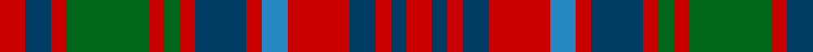

In pattern [RBRBRBRBRGRGRBR](/stripes/rbrbrbrbrgrgrbr/).

This was sourced from house-of-tartan.  It is a [15 stripe tartan](/stripes/stripes15/).

Original link http://www.house-of-tartan.scotland.net/house/TartanViewjs.asp?colr=Def&tnam=2149

## Thread count
R/10 DB10 R6 G32 R6 G6 R6 DB20 R6 B10 R24 DB10 R6 DB6 R/10

## Palette
Each colour and its ΔE from the base-6 reference it is a variant of.

| Colour | Shade | Base | ΔE (OKLab) |
|---|---|---|---|
| B | <code style="background-color:#2888C4;">#2888C4</code> `#2888C4` | B <code style="background-color:#2A418A;">#2A418A</code> | 0.21 |
| DB | <code style="background-color:#003C64;">#003C64</code> `#003C64` | B <code style="background-color:#2A418A;">#2A418A</code> | 0.08 |
| G | <code style="background-color:#006818;">#006818</code> `#006818` | G <code style="background-color:#006100;">#006100</code> | 0.02 |
| R | <code style="background-color:#C80000;">#C80000</code> `#C80000` | R <code style="background-color:#CC0000;">#CC0000</code> | 0.01 |

## Nearest tartans

The nearest existing variants by ΔTartan distance.

1. [Grant of Ballindalloch (Personal)](/setts/s15/r5db3r3g16r3g3r3db5r3y5r12db5r3db3r5~x4/) — ΔT 0.60
1. [Matheson (Logan 1831)](/setts/s13/r2dg2r12dg10r2dg2r2dg10t3db10r12dg2r2~x2/) — ΔT 0.76
1. [MacRae (Sample)](/setts/s12/dg21r5dg21r21dg5r4dg5r21w4r5db21r4/) — ΔT 0.84
1. [Glen Orchy](/setts/s15/t2r3db3r5g14r3db2r5g2r3db14r5g3r3t2~x2/) — ΔT 0.87
1. [Glen Orchy #1](/setts/s15/t2r3dg3r5db14r3dg2r5db2r3dg14r5db3r3t2~x2/) — ΔT 0.88
1. [Matheson N](/setts/s13/r2dg2r12dg10r2dg2r2dg10b3db10r12dg2r2~x2/) — ΔT 0.92
1. [Matheson N](/setts/s13/r2dg2r12dg10r2dg2r2dg10b3db10r12dg2r2/) — ΔT 0.92
1. [Matheson](/setts/s13/r2g2r12db10t3g10r2g2r2g10r12g2r2~x2/) — ΔT 0.98
1. [MacQuarrie](/setts/s12/r1t1r6db3r1dg6r1dg6r6db1r1t1~x2/) — ΔT 0.99
1. [Sydney (Nova Scotia) #2](/setts/s14/o16k4w2k4o6o11o2o16~x2/) — ΔT 1.00

## Neighbour map

Every grey dot is one of 14299 variants placed by the first two principal components of the ΔTartan feature space (44% of its variance). Red is this tartan; blue dots are its nearest — click one to open its page.

<svg viewBox="0 0 640 380" role="img" style="max-width:100%;height:auto;border:1px solid #e0e0e0;border-radius:4px;display:block" xmlns="http://www.w3.org/2000/svg"><image href="/nn/cloud.v1.png" width="640" height="380"/><a href="/setts/s15/r5db3r3g16r3g3r3db5r3y5r12db5r3db3r5~x4/"><circle cx="216.3" cy="200.4" r="4" fill="#3465a4"><title>Grant of Ballindalloch (Personal)</title></circle></a><a href="/setts/s13/r2dg2r12dg10r2dg2r2dg10t3db10r12dg2r2~x2/"><circle cx="224.2" cy="196.3" r="4" fill="#3465a4"><title>Matheson (Logan 1831)</title></circle></a><a href="/setts/s12/dg21r5dg21r21dg5r4dg5r21w4r5db21r4/"><circle cx="202.7" cy="206.8" r="4" fill="#3465a4"><title>MacRae (Sample)</title></circle></a><a href="/setts/s15/t2r3db3r5g14r3db2r5g2r3db14r5g3r3t2~x2/"><circle cx="195.1" cy="185.0" r="4" fill="#3465a4"><title>Glen Orchy</title></circle></a><a href="/setts/s15/t2r3dg3r5db14r3dg2r5db2r3dg14r5db3r3t2~x2/"><circle cx="193.5" cy="182.1" r="4" fill="#3465a4"><title>Glen Orchy #1</title></circle></a><a href="/setts/s13/r2dg2r12dg10r2dg2r2dg10b3db10r12dg2r2~x2/"><circle cx="235.2" cy="208.5" r="4" fill="#3465a4"><title>Matheson N</title></circle></a><a href="/setts/s13/r2dg2r12dg10r2dg2r2dg10b3db10r12dg2r2/"><circle cx="235.2" cy="208.5" r="4" fill="#3465a4"><title>Matheson N</title></circle></a><a href="/setts/s13/r2g2r12db10t3g10r2g2r2g10r12g2r2~x2/"><circle cx="226.4" cy="200.3" r="4" fill="#3465a4"><title>Matheson</title></circle></a><a href="/setts/s12/r1t1r6db3r1dg6r1dg6r6db1r1t1~x2/"><circle cx="236.6" cy="195.8" r="4" fill="#3465a4"><title>MacQuarrie</title></circle></a><a href="/setts/s14/o16k4w2k4o6o11o2o16~x2/"><circle cx="203.8" cy="180.2" r="4" fill="#3465a4"><title>Sydney (Nova Scotia) #2</title></circle></a><circle cx="193.8" cy="207.8" r="5" fill="#c00000"/></svg>

ID: /setts/s15/r5dt5r3g16r3g3r3dt10r3t5r12dt5r3dt3r5~x2/
