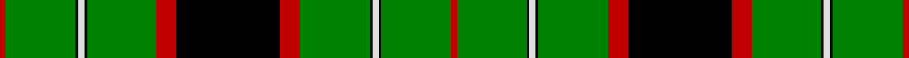

In pattern [RGKWKGRKRGKWKGR](/stripes/rgkwkgrkrgkwkgr/).

This was sourced from weddslist.  It is a [15 stripe tartan](/stripes/stripes15/).

Original link http://www.weddslist.com/cgi-bin/tartans/pg.pl?source=sts

## Thread count
R/10 G112 K4 LN10 K4 G112 R32 K166 R32 G112 K4 LN10 K4 G112 R/10

## Palette
Each colour and the base-6 reference it is a variant of.

| Colour | Shade | Base |
|---|---|---|
| G | <code style="background-color:#008000;">#008000</code> `oklch(52.0% 0.177 142.5)` <small>#008000</small> | G <code style="background-color:#006100;">#006100</code> |
| K | <code style="background-color:#000000;">#000000</code> `oklch(0.0% 0.000 0.0)` <small>#000000</small> | K <code style="background-color:#000000;">#000000</code> |
| LN | <code style="background-color:#E0E0E0;">#E0E0E0</code> `oklch(90.7% 0.000 89.9)` <small>#E0E0E0</small> | W <code style="background-color:#F7F7F7;">#F7F7F7</code> |
| R | <code style="background-color:#C00000;">#C00000</code> `oklch(50.7% 0.208 29.2)` <small>#C00000</small> | R <code style="background-color:#CC0000;">#CC0000</code> |

## Nearest tartans

The nearest existing variants by ΔTartan distance, with this tartan at the top so the swatches line up against it.

ΔTartan

Tartan

Sett

—

<a href="/ttd/edit/#slug=r5g56k2w5k2g56r16k83r16g56k2w5k2g56r5~x2">MacDiarmid</a> <a class="nn-out" href="/setts/s15/r5g56k2w5k2g56r16k83r16g56k2w5k2g56r5~x2/" title="open its dictionary page">↗</a>

1.46

<a href="/ttd/edit/#slug=g25w1k23g7ly2g2ly2g7k23w1g39g4g14~x2">Duffy</a> <a class="nn-out" href="/setts/s13/g25w1k23g7ly2g2ly2g7k23w1g39g4g14~x2/" title="open its dictionary page">↗</a>

1.55

<a href="/ttd/edit/#slug=ly8g84db21k10db10k10db10k10db21g62r3g6r3g10ly3g5r6~x2">King Edward VII</a> <a class="nn-out" href="/setts/s17/ly8g84db21k10db10k10db10k10db21g62r3g6r3g10ly3g5r6~x2/" title="open its dictionary page">↗</a>

1.67

<a href="/ttd/edit/#slug=dg19k1g3k1dg3k9dg20k1ly1k7ly1k1dg21k12dg2g1~x2">Hope Vere / Weir</a> <a class="nn-out" href="/setts/s16/dg19k1g3k1dg3k9dg20k1ly1k7ly1k1dg21k12dg2g1~x2/" title="open its dictionary page">↗</a>

1.69

<a href="/ttd/edit/#slug=g44lb2g10t3k6lb1r2k18~x2">Mull Rugby Club (Old)</a> <a class="nn-out" href="/setts/s8/g44lb2g10t3k6lb1r2k18~x2/" title="open its dictionary page">↗</a>

1.71

<a href="/ttd/edit/#slug=k3r1g32k12w1k12r1g3~x2">MacHardy</a> <a class="nn-out" href="/setts/s8/k3r1g32k12w1k12r1g3~x2/" title="open its dictionary page">↗</a>

1.72

<a href="/ttd/edit/#slug=dg40r8dg26g5dg10ly3db4ly2db1ly16~x2">Lodge Isandlwana</a> <a class="nn-out" href="/setts/s10/dg40r8dg26g5dg10ly3db4ly2db1ly16~x2/" title="open its dictionary page">↗</a>

1.88

<a href="/ttd/edit/#slug=g4k2g28r4g4k18g4lp4g4lp7k1w3~x2">Moss</a> <a class="nn-out" href="/setts/s12/g4k2g28r4g4k18g4lp4g4lp7k1w3~x2/" title="open its dictionary page">↗</a>

1.90

<a href="/ttd/edit/#slug=y42k10y2k2k2k2y10k6k2k3y2~x2">Laggen Dress (Fashion)</a> <a class="nn-out" href="/setts/s11/y42k10y2k2k2k2y10k6k2k3y2~x2/" title="open its dictionary page">↗</a>

1.92

<a href="/ttd/edit/#slug=k3dg32k2dg4ly4dg2ly4dg4k6w3~x2">University of Alberta (Corporate)</a> <a class="nn-out" href="/setts/s10/k3dg32k2dg4ly4dg2ly4dg4k6w3~x2/" title="open its dictionary page">↗</a>

1.93

<a href="/ttd/edit/#slug=g17t2g2t2k21t2k3g30k2t2k4~x2">Fort William</a> <a class="nn-out" href="/setts/s11/g17t2g2t2k21t2k3g30k2t2k4~x2/" title="open its dictionary page">↗</a>

## Neighbour map

Every grey dot is one of 14299 variants placed by the first two principal components of the ΔTartan feature space (44% of its variance). Red is this tartan; blue dots are its nearest — click one to open its page.

<svg viewBox="0 0 640 380" role="img" style="max-width:100%;height:auto;border:1px solid #e0e0e0;border-radius:4px;display:block" xmlns="http://www.w3.org/2000/svg"><image href="/nn/cloud.v1.png" width="640" height="380"/><a href="/setts/s13/g25w1k23g7ly2g2ly2g7k23w1g39g4g14~x2/"><circle cx="267.8" cy="99.8" r="4" fill="#3465a4"><title>Duffy</title></circle></a><a href="/setts/s17/ly8g84db21k10db10k10db10k10db21g62r3g6r3g10ly3g5r6~x2/"><circle cx="321.4" cy="89.3" r="4" fill="#3465a4"><title>King Edward VII</title></circle></a><a href="/setts/s16/dg19k1g3k1dg3k9dg20k1ly1k7ly1k1dg21k12dg2g1~x2/"><circle cx="365.9" cy="136.3" r="4" fill="#3465a4"><title>Hope Vere / Weir</title></circle></a><a href="/setts/s8/g44lb2g10t3k6lb1r2k18~x2/"><circle cx="372.0" cy="105.3" r="4" fill="#3465a4"><title>Mull Rugby Club (Old)</title></circle></a><a href="/setts/s8/k3r1g32k12w1k12r1g3~x2/"><circle cx="341.1" cy="133.1" r="4" fill="#3465a4"><title>MacHardy</title></circle></a><a href="/setts/s10/dg40r8dg26g5dg10ly3db4ly2db1ly16~x2/"><circle cx="367.9" cy="104.6" r="4" fill="#3465a4"><title>Lodge Isandlwana</title></circle></a><a href="/setts/s12/g4k2g28r4g4k18g4lp4g4lp7k1w3~x2/"><circle cx="263.1" cy="99.3" r="4" fill="#3465a4"><title>Moss</title></circle></a><a href="/setts/s11/y42k10y2k2k2k2y10k6k2k3y2~x2/"><circle cx="374.5" cy="114.1" r="4" fill="#3465a4"><title>Laggen Dress (Fashion)</title></circle></a><a href="/setts/s10/k3dg32k2dg4ly4dg2ly4dg4k6w3~x2/"><circle cx="377.7" cy="145.4" r="4" fill="#3465a4"><title>University of Alberta (Corporate)</title></circle></a><a href="/setts/s11/g17t2g2t2k21t2k3g30k2t2k4~x2/"><circle cx="288.2" cy="147.3" r="4" fill="#3465a4"><title>Fort William</title></circle></a><circle cx="348.8" cy="99.5" r="5" fill="#c00000"/></svg>

ID: /setts/s15/r5g56k2w5k2g56r16k83r16g56k2w5k2g56r5~x2/
