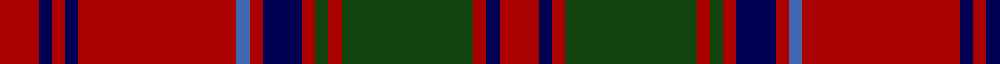

In pattern [RBRBRBRBRGRGRBR](/patterns/rbrbrbrbrgrgrbr/).

This was sourced from weddslist.  It is a [15 stripes tartan](/stripes/stripes15/).

Original link http://www.weddslist.com/cgi-bin/tartans/pg.pl?source=x

## Thread count
DR/6 DB2 DR2 DB2 DR24 B2 DR2 DB6 DR2 DG2 DR2 DG20 DR2 DB2 DR/6

## Palette
Each colour and its ΔE from the base-6 reference it is a variant of.

| Colour | Shade | Base | ΔE (OKLab) |
|---|---|---|---|
| B | <code style="background-color:#4367AE;">#4367AE</code> `#4367AE` | B <code style="background-color:#2A418A;">#2A418A</code> | 0.12 |
| DB | <code style="background-color:#000052;">#000052</code> `#000052` | B <code style="background-color:#2A418A;">#2A418A</code> | 0.20 |
| DG | <code style="background-color:#11450D;">#11450D</code> `#11450D` | G <code style="background-color:#006100;">#006100</code> | 0.09 |
| DR | <code style="background-color:#AA0000;">#AA0000</code> `#AA0000` | R <code style="background-color:#CC0000;">#CC0000</code> | 0.07 |

## Nearest tartans

The nearest existing variants by ΔTartan distance.

1. [Grant D](/setts/s15/r12b4r4g40r4g4r4b12r4ba4r48b4r4b4r12-b000052-ba4367ae-g11450d-raa0000/) — ΔT 0.00
1. [Grant D](/setts/s15/r6b2r2g20r2g2r2b6r2w2r24b2r2b2r6-b000064-g006400-rc80000-wd0d0d0/) — ΔT 1.03
1. [London Caledonian Commemorative Tartan Tartan Number: 1388. Earliest known date: 1953 For London Caledonian Games Association. See products available Copyright © Blair Urquhart, Comrie, 2015](/setts/s13/r18b4r42ba4r4b16r4g4r4g34r4b4r16-b2c2c80-ba5c8ca8-g006818-rc80000/) — ΔT 1.08
1. [Hughes (Welsh Name)](/setts/s11/g4r34b20r4b8r6ba2r5b2r3g4-b003c64-ba202060-g006818-rc80000/) — ΔT 1.09
1. [Walker, Evening (Name)](/setts/s12/r8k4ra14k30ra6k6ra6k14ra56g14ra12g4-g004c00-k00002c-r9c7400-ra8c0000/) — ΔT 1.12
1. [Waddell (Name)](/setts/s11/r6b4r48b16g4b4g4b4g20r6w4-b2c2c80-g285800-r880000-we0e0e0/) — ΔT 1.14
1. [MacColl](/setts/s14/r24b2r2g16r4b2r2b6r2b2r24g2r2g8-b000052-g11450d-raa0000/) — ΔT 1.14
1. [MacColl](/setts/s14/r12b1r1g8r2b1r1b3r1b1r12g1r1g4-b000052-g11450d-raa0000/) — ΔT 1.14
1. [MacRae of Inverinate (Clan)](/setts/s21/b10r10g4r6g4r6g4r46g46r10g30r10g46r46g4r6g4r6g4r10g10-b440044-g003820-rc80000/) — ΔT 1.15
1. [Robertson D](/setts/s13/r10g4r60b6r6b60r6g60r6b6r60g4r10-b000052-g11450d-raa0000/) — ΔT 1.16

## Neighbour map

Every grey dot is one of 15726 variants placed by the first two principal components of the ΔTartan feature space (44% of its variance). Red is this tartan; blue dots are its nearest — click one to open its page.

<svg viewBox="0 0 640 380" role="img" style="max-width:100%;height:auto;border:1px solid #e0e0e0;border-radius:4px;display:block" xmlns="http://www.w3.org/2000/svg"><image href="/nn/cloud.v1.png" width="640" height="380"/><a href="/setts/s15/r12b4r4g40r4g4r4b12r4ba4r48b4r4b4r12-b000052-ba4367ae-g11450d-raa0000/"><circle cx="343.1" cy="141.8" r="4" fill="#3465a4"><title>Grant D</title></circle></a><a href="/setts/s15/r6b2r2g20r2g2r2b6r2w2r24b2r2b2r6-b000064-g006400-rc80000-wd0d0d0/"><circle cx="318.4" cy="127.1" r="4" fill="#3465a4"><title>Grant D</title></circle></a><a href="/setts/s13/r18b4r42ba4r4b16r4g4r4g34r4b4r16-b2c2c80-ba5c8ca8-g006818-rc80000/"><circle cx="337.7" cy="159.2" r="4" fill="#3465a4"><title>London Caledonian Commemorative Tartan Tartan Number: 1388. Earliest known date: 1953 For London Caledonian Games Association. See products available Copyright © Blair Urquhart, Comrie, 2015</title></circle></a><a href="/setts/s11/g4r34b20r4b8r6ba2r5b2r3g4-b003c64-ba202060-g006818-rc80000/"><circle cx="365.0" cy="143.7" r="4" fill="#3465a4"><title>Hughes (Welsh Name)</title></circle></a><a href="/setts/s12/r8k4ra14k30ra6k6ra6k14ra56g14ra12g4-g004c00-k00002c-r9c7400-ra8c0000/"><circle cx="322.7" cy="162.5" r="4" fill="#3465a4"><title>Walker, Evening (Name)</title></circle></a><a href="/setts/s11/r6b4r48b16g4b4g4b4g20r6w4-b2c2c80-g285800-r880000-we0e0e0/"><circle cx="314.5" cy="162.1" r="4" fill="#3465a4"><title>Waddell (Name)</title></circle></a><a href="/setts/s14/r24b2r2g16r4b2r2b6r2b2r24g2r2g8-b000052-g11450d-raa0000/"><circle cx="399.2" cy="168.5" r="4" fill="#3465a4"><title>MacColl</title></circle></a><a href="/setts/s14/r12b1r1g8r2b1r1b3r1b1r12g1r1g4-b000052-g11450d-raa0000/"><circle cx="399.2" cy="168.5" r="4" fill="#3465a4"><title>MacColl</title></circle></a><a href="/setts/s21/b10r10g4r6g4r6g4r46g46r10g30r10g46r46g4r6g4r6g4r10g10-b440044-g003820-rc80000/"><circle cx="306.5" cy="140.5" r="4" fill="#3465a4"><title>MacRae of Inverinate (Clan)</title></circle></a><a href="/setts/s13/r10g4r60b6r6b60r6g60r6b6r60g4r10-b000052-g11450d-raa0000/"><circle cx="338.0" cy="161.9" r="4" fill="#3465a4"><title>Robertson D</title></circle></a><circle cx="343.1" cy="141.8" r="5" fill="#c00000"/></svg>

ID: /setts/s15/r6b2r2g20r2g2r2b6r2ba2r24b2r2b2r6-b000052-ba4367ae-g11450d-raa0000/
