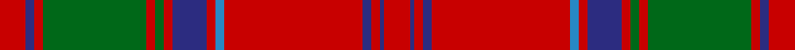

This page is one **sett** — a single exact thread-count. It belongs to the [tartan](/tartans/r6db2r2g24r2g2r2db8r2b2r32db2r2db1r6/)
(the same proportion at any scale), whose colour order is pattern [RBRBRBRBRGRGRBR](/stripes/rbrbrbrbrgrgrbr/).

Sourced from house-of-tartan.  It is a [15 stripe tartan](/stripes/stripes15/).

Original link http://www.house-of-tartan.scotland.net/house/TartanViewjs.asp?colr=Def&tnam=1384

## Thread count
R/12 DB4 R4 G48 R4 G4 R4 DB16 R4 B4 R64 DB4 R4 DB2 R/12

## Palette
Each colour and the base-6 reference it is a variant of.

| Colour | Shade | Base |
|---|---|---|
| B | <code style="background-color:#2888C4;">#2888C4</code> `oklch(60.1% 0.125 241.5)` <small>#2888C4</small> | B <code style="background-color:#2A418A;">#2A418A</code> |
| DB | <code style="background-color:#2C2C80;">#2C2C80</code> `oklch(35.0% 0.138 276.6)` <small>#2C2C80</small> | B <code style="background-color:#2A418A;">#2A418A</code> |
| G | <code style="background-color:#006818;">#006818</code> `oklch(45.0% 0.142 145.0)` <small>#006818</small> | G <code style="background-color:#006100;">#006100</code> |
| R | <code style="background-color:#C80000;">#C80000</code> `oklch(52.3% 0.215 29.2)` <small>#C80000</small> | R <code style="background-color:#CC0000;">#CC0000</code> |

## Nearest tartans

The nearest existing variants by ΔTartan distance, with this tartan at the top so the swatches line up against it.

ΔTartan

Tartan

Sett

—

<a href="/ttd/edit/#slug=r6db2r2g24r2g2r2db8r2t2r32db2r2db1r6~x2">Grant or Drummond Clan Tartan Tartan Number: 1384. Earliest known date: 1831 The usual design is sometimes called Drummond. It is recorded by Logan (1831), Smibert (1850), and Smith (1850). McIan's drawing of the Grant tartan is too roughly done to make out the pattern details. A certain difficulty arises in establishing a single Grant tartan to represent the clan, illustrated by the existance of ten Grant portraits at Cullen House in which each brother is wearing a different tartan, and where a coat or plaid is worn, these also differ. The chief of the Grants is Lord Strathspey. See products available Copyright © Blair Urquhart, Comrie, 2015</a> <a class="nn-out" href="/setts/s15/r6db2r2g24r2g2r2db8r2t2r32db2r2db1r6~x2/" title="open its dictionary page">↗</a>

0.37

<a href="/ttd/edit/#slug=r6b2r2g24r2g2r2b8r2t1r32b2r2b1r6~x2">Drummond</a> <a class="nn-out" href="/setts/s15/r6b2r2g24r2g2r2b8r2t1r32b2r2b1r6~x2/" title="open its dictionary page">↗</a>

0.38

<a href="/ttd/edit/#slug=r6db2r2g24r2g2r2db8r2t1r32db2r2db1r6~x2">Grant, or Drummond</a> <a class="nn-out" href="/setts/s15/r6db2r2g24r2g2r2db8r2t1r32db2r2db1r6~x2/" title="open its dictionary page">↗</a>

0.41

<a href="/ttd/edit/#slug=r4t1db1r32t2r2db12r2g16r4t1r4db2~x2">MacGillivray</a> <a class="nn-out" href="/setts/s13/r4t1db1r32t2r2db12r2g16r4t1r4db2~x2/" title="open its dictionary page">↗</a>

0.59

<a href="/ttd/edit/#slug=r6db1r2db2r28t2r2db9r2g2r2g24r3db2r6db2~x2">Drummond</a> <a class="nn-out" href="/setts/s16/r6db1r2db2r28t2r2db9r2g2r2g24r3db2r6db2~x2/" title="open its dictionary page">↗</a>

0.64

<a href="/setts/s12/r60db2g24r8db2t3db2/">Unidentified Cant #12</a>

0.68

<a href="/ttd/edit/#slug=r6dp2r2dg24r2dg2r2dp8r2t1r32dp2r2dp1r6~x2">Drummond - 1819 (Clan)</a> <a class="nn-out" href="/setts/s15/r6dp2r2dg24r2dg2r2dp8r2t1r32dp2r2dp1r6~x2/" title="open its dictionary page">↗</a>

0.75

<a href="/ttd/edit/#slug=r24lb1db2r4dg32r4db2lb1r4db6r4lb1db2r32dg2r3dg6~x2">Dalzell</a> <a class="nn-out" href="/setts/s17/r24lb1db2r4dg32r4db2lb1r4db6r4lb1db2r32dg2r3dg6~x2/" title="open its dictionary page">↗</a>

0.78

<a href="/ttd/edit/#slug=r6db1r1dg28r4db8w1r32dg1r4dg2~x2">MacDonell of Keppoch (artefact)</a> <a class="nn-out" href="/setts/s11/r6db1r1dg28r4db8w1r32dg1r4dg2~x2/" title="open its dictionary page">↗</a>

0.78

<a href="/ttd/edit/#slug=r6t1dt1r57t2r2dt23r4g30r6t1r6dt2~x2">MacGillivray - 1819 (Clan)</a> <a class="nn-out" href="/setts/s13/r6t1dt1r57t2r2dt23r4g30r6t1r6dt2~x2/" title="open its dictionary page">↗</a>

0.79

<a href="/ttd/edit/#slug=r6db2r2dg24r2dg2r2db8r2b1r32db2r2db1r6~x2">Grant</a> <a class="nn-out" href="/setts/s15/r6db2r2dg24r2dg2r2db8r2b1r32db2r2db1r6~x2/" title="open its dictionary page">↗</a>

## Neighbour map

Every grey dot is one of 14299 variants placed by the first two principal components of the ΔTartan feature space (44% of its variance). Red is this tartan; blue dots are its nearest — click one to open its page.

<svg viewBox="0 0 640 380" role="img" style="max-width:100%;height:auto;border:1px solid #e0e0e0;border-radius:4px;display:block" xmlns="http://www.w3.org/2000/svg"><image href="/nn/cloud.v1.png" width="640" height="380"/><a href="/setts/s15/r6b2r2g24r2g2r2b8r2t1r32b2r2b1r6~x2/"><circle cx="400.9" cy="94.4" r="4" fill="#3465a4"><title>Drummond</title></circle></a><a href="/setts/s15/r6db2r2g24r2g2r2db8r2t1r32db2r2db1r6~x2/"><circle cx="398.9" cy="93.8" r="4" fill="#3465a4"><title>Grant, or Drummond</title></circle></a><a href="/setts/s13/r4t1db1r32t2r2db12r2g16r4t1r4db2~x2/"><circle cx="395.5" cy="103.0" r="4" fill="#3465a4"><title>MacGillivray</title></circle></a><a href="/setts/s16/r6db1r2db2r28t2r2db9r2g2r2g24r3db2r6db2~x2/"><circle cx="360.9" cy="99.6" r="4" fill="#3465a4"><title>Drummond</title></circle></a><a href="/setts/s12/r60db2g24r8db2t3db2/"><circle cx="386.5" cy="105.3" r="4" fill="#3465a4"><title>Unidentified Cant #12</title></circle></a><a href="/setts/s15/r6dp2r2dg24r2dg2r2dp8r2t1r32dp2r2dp1r6~x2/"><circle cx="402.0" cy="89.1" r="4" fill="#3465a4"><title>Drummond - 1819 (Clan)</title></circle></a><a href="/setts/s17/r24lb1db2r4dg32r4db2lb1r4db6r4lb1db2r32dg2r3dg6~x2/"><circle cx="381.4" cy="84.0" r="4" fill="#3465a4"><title>Dalzell</title></circle></a><a href="/setts/s11/r6db1r1dg28r4db8w1r32dg1r4dg2~x2/"><circle cx="374.9" cy="104.2" r="4" fill="#3465a4"><title>MacDonell of Keppoch (artefact)</title></circle></a><a href="/setts/s13/r6t1dt1r57t2r2dt23r4g30r6t1r6dt2~x2/"><circle cx="412.6" cy="79.3" r="4" fill="#3465a4"><title>MacGillivray - 1819 (Clan)</title></circle></a><a href="/setts/s15/r6db2r2dg24r2dg2r2db8r2b1r32db2r2db1r6~x2/"><circle cx="403.7" cy="100.8" r="4" fill="#3465a4"><title>Grant</title></circle></a><circle cx="391.0" cy="92.9" r="5" fill="#c00000"/></svg>

ID: /setts/s15/r6db2r2g24r2g2r2db8r2t2r32db2r2db1r6~x2/
