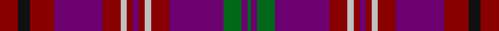

In pattern [GBGBRWRBRWRBRKR](/stripes/gbgbrwrbrwrbrkr/).

This was sourced from register-of-tartans.  It is a [15 stripe tartan](/stripes/stripes15/).

Original link https://www.tartanregister.gov.uk/tartanDetails.aspx?ref=10360

## Attestations

This cloth appears in 2 source records; the oldest owns this page.

- 28/01/2011 — McCall (Caithness) (register-of-tartans, [record](https://www.tartanregister.gov.uk/tartanDetails.aspx?ref=10360))
- 28th Jan 2011 — McCall (Caithness) (Name) (tartans-authority, [record](http://www.tartansauthority.com/tartan-ferret/display/10360/))

## Register references

External register numbers recorded for this tartan.

- Scottish Register of Tartans: [10360](https://www.tartanregister.gov.uk/tartanDetails.aspx?ref=10360)

## Thread count
DR/12 K8 DR16 P32 DR12 N4 DR4 P4 DR4 N4 DR12 P36 G12 P4 G/2

## Palette
Each colour and the base-6 reference it is a variant of.

| Colour | Shade | Base |
|---|---|---|
| DR | <code style="background-color:#880000;">#880000</code> `oklch(39.4% 0.162 29.2)` <small>#880000</small> | R <code style="background-color:#CC0000;">#CC0000</code> |
| G | <code style="background-color:#006818;">#006818</code> `oklch(45.0% 0.142 145.0)` <small>#006818</small> | G <code style="background-color:#006100;">#006100</code> |
| K | <code style="background-color:#101010;">#101010</code> `oklch(17.3% 0.000 89.9)` <small>#101010</small> | K <code style="background-color:#000000;">#000000</code> |
| N | <code style="background-color:#C0C0C0;">#C0C0C0</code> `oklch(80.8% 0.000 89.9)` <small>#C0C0C0</small> | W <code style="background-color:#F7F7F7;">#F7F7F7</code> |
| P | <code style="background-color:#6C0070;">#6C0070</code> `oklch(37.6% 0.174 326.5)` <small>#6C0070</small> | B <code style="background-color:#2A418A;">#2A418A</code> |

## Nearest tartans

The nearest existing variants by ΔTartan distance.

1. [Alyssa's Theme (Fashion)](/setts/s13/k2r13k8n2r1k1r21n1r1k2db8k13db2~x2/) — ΔT 1.46
1. [Bute Heather, Autumn (Fashion)](/setts/s11/dp13ly2r38k13r8k8dp17dg2dp17k4dp11/) — ΔT 1.50
1. [Gwyn of Wales](/setts/s20/k3r30k2r4k2r30k3db30k35w2k35db30k3r30k2r4k2r30k3w2/) — ΔT 1.51
1. [Strathdon (District?)](/setts/s15/lr3lo8r2lo8db11r2lo4r4r27db1r2db2r2db13r2~x2/) — ΔT 1.56
1. [Anderson of Kinnedear Red](/setts/s20/r4db6r2db2r4db6r3k4lo2k2lo2k4g2k4r22db1g2db1r6db3~x2/) — ΔT 1.57
1. [Faulkner (Personal)](/setts/s11/g10o1k3dp22o1dp8k2r26lo1r6k3~x2/) — ΔT 1.60
1. [MacColl Hunting Clan Tartan Tartan Number: 1637. Earliest known date: pre 2003 This sample comes from the MacGregor-Hastie collection which forms the basis of the cloth archive of the Scottish Tartans Society. Some of the samples, including this one, were unmarked. One can assume that the sample dates between 1930 and 1950. See products available Copyright © Blair Urquhart, Comrie, 2015](/setts/s18/r6m3r6db22r7m2w1r2db2r2w1m2r7y22r7y2r2m2~x2/) — ΔT 1.61
1. [Great Dane, The](/setts/s13/db6r30db6r30db6g6db6r6db15r2g10db15r2/) — ΔT 1.61
1. [Gwyn Welsh Name Tartan Tartan Number: 5734. Earliest known date: 2002 The tartan for this Welsh surname and its spelling variation, Wynn, is actually woven in Wales at the Cambrian Woollen Mill, weaving on the same site since 1830. This tartan differs from many traditional patterns in that the warp and weft differ, giving the finished worsted wool cloth more of a predominant stripe, vertically noticeable in the finished Kilt, or Cilt in Wales. See products available Copyright © Blair Urquhart, Comrie, 2015](/setts/s11/w2k35db30k3r30k2r4k2r30k3w2/) — ΔT 1.65
1. [Heirloom Red Alba](/setts/s16/r4ly2r34db10y4db4t4db23w3~x2/) — ΔT 1.66

## Neighbour map

Every grey dot is one of 14299 variants placed by the first two principal components of the ΔTartan feature space (44% of its variance). Red is this tartan; blue dots are its nearest — click one to open its page.

<svg viewBox="0 0 640 380" role="img" style="max-width:100%;height:auto;border:1px solid #e0e0e0;border-radius:4px;display:block" xmlns="http://www.w3.org/2000/svg"><image href="/nn/cloud.v1.png" width="640" height="380"/><a href="/setts/s13/k2r13k8n2r1k1r21n1r1k2db8k13db2~x2/"><circle cx="340.0" cy="154.6" r="4" fill="#3465a4"><title>Alyssa's Theme (Fashion)</title></circle></a><a href="/setts/s11/dp13ly2r38k13r8k8dp17dg2dp17k4dp11/"><circle cx="307.2" cy="182.5" r="4" fill="#3465a4"><title>Bute Heather, Autumn (Fashion)</title></circle></a><a href="/setts/s20/k3r30k2r4k2r30k3db30k35w2k35db30k3r30k2r4k2r30k3w2/"><circle cx="297.8" cy="145.0" r="4" fill="#3465a4"><title>Gwyn of Wales</title></circle></a><a href="/setts/s15/lr3lo8r2lo8db11r2lo4r4r27db1r2db2r2db13r2~x2/"><circle cx="257.8" cy="100.9" r="4" fill="#3465a4"><title>Strathdon (District?)</title></circle></a><a href="/setts/s20/r4db6r2db2r4db6r3k4lo2k2lo2k4g2k4r22db1g2db1r6db3~x2/"><circle cx="287.5" cy="106.1" r="4" fill="#3465a4"><title>Anderson of Kinnedear Red</title></circle></a><a href="/setts/s11/g10o1k3dp22o1dp8k2r26lo1r6k3~x2/"><circle cx="275.3" cy="118.6" r="4" fill="#3465a4"><title>Faulkner (Personal)</title></circle></a><a href="/setts/s18/r6m3r6db22r7m2w1r2db2r2w1m2r7y22r7y2r2m2~x2/"><circle cx="249.6" cy="99.1" r="4" fill="#3465a4"><title>MacColl Hunting Clan Tartan Tartan Number: 1637. Earliest known date: pre 2003 This sample comes from the MacGregor-Hastie collection which forms the basis of the cloth archive of the Scottish Tartans Society. Some of the samples, including this one, were unmarked. One can assume that the sample dates between 1930 and 1950. See products available Copyright © Blair Urquhart, Comrie, 2015</title></circle></a><a href="/setts/s13/db6r30db6r30db6g6db6r6db15r2g10db15r2/"><circle cx="293.4" cy="173.6" r="4" fill="#3465a4"><title>Great Dane, The</title></circle></a><a href="/setts/s11/w2k35db30k3r30k2r4k2r30k3w2/"><circle cx="297.8" cy="159.0" r="4" fill="#3465a4"><title>Gwyn Welsh Name Tartan Tartan Number: 5734. Earliest known date: 2002 The tartan for this Welsh surname and its spelling variation, Wynn, is actually woven in Wales at the Cambrian Woollen Mill, weaving on the same site since 1830. This tartan differs from many traditional patterns in that the warp and weft differ, giving the finished worsted wool cloth more of a predominant stripe, vertically noticeable in the finished Kilt, or Cilt in Wales. See products available Copyright © Blair Urquhart, Comrie, 2015</title></circle></a><a href="/setts/s16/r4ly2r34db10y4db4t4db23w3~x2/"><circle cx="249.8" cy="106.8" r="4" fill="#3465a4"><title>Heirloom Red Alba</title></circle></a><circle cx="288.4" cy="142.0" r="5" fill="#c00000"/></svg>

ID: /setts/s15/r6k4r8dp16r6lb2r2dp2r2lb2r6dp18g6dp2g1~x2/
