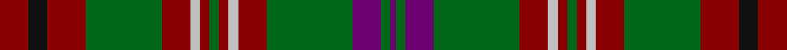

**Bands:** [RKRGRWRGRWRGBGB](/stripes/rkrgrwrgrwrgbgb/) · **Stripes:** [R K R G R LB R G R LB R G DP G DP](/stripes/stripes15/) R K R G R LB R G R LB R G DP G DP

This was sourced from house-of-tartan.  It is a [15 band tartan](/bands/bands15/).

Original link http://www.house-of-tartan.scotland.net/house/TartanViewjs.asp?colr=Def&tnam=2238

## Thread count
DR/12 K8 DR16 G32 DR12 N4 DR4 G4 DR4 N4 DR12 G36 P12 G4 P/2

## Palette
Each colour and its ΔE from the base-6 reference it is a variant of.

| Colour | Shade | Base | ΔE (OKLab) |
|---|---|---|---|
| DR | <code style="background-color:#880000;">#880000</code> `#880000` | R <code style="background-color:#CC0000;">#CC0000</code> | 0.15 |
| G | <code style="background-color:#006818;">#006818</code> `#006818` | G <code style="background-color:#006100;">#006100</code> | 0.02 |
| K | <code style="background-color:#101010;">#101010</code> `#101010` | K <code style="background-color:#000000;">#000000</code> | 0.17 |
| N | <code style="background-color:#C0C0C0;">#C0C0C0</code> `#C0C0C0` | W <code style="background-color:#F7F7F7;">#F7F7F7</code> | 0.17 |
| P | <code style="background-color:#6C0070;">#6C0070</code> `#6C0070` | B <code style="background-color:#2A418A;">#2A418A</code> | 0.16 |

## Nearest tartans

The nearest existing variants by ΔTartan distance.

1. [Hynde (Sir John) (Artefact)](/setts/s11/g14r1g14r7lb1r7lb1r7k5dp3lb1~x4/) — ΔT 0.77
1. [Glen Nevis #2 (Personal)](/setts/s12/y14lo1y1lo1y2k3y3k3do3do1do9lo1~x4/) — ΔT 0.94
1. [Beartrap (Military)](/setts/s13/r22lb1r2lb1r3k16g16ly1g16k16r16lb1r2~x2/) — ΔT 0.97
1. [Ainslie #2](/setts/s15/r6k2r2k4r2k2r6g18r2lo1r2k2r10w1r2~x4/) — ΔT 1.03
1. [Leach Family Tartan Tartan Number: 2356. Earliest known date: pre 1997 Originally the name given to physicians and has been in Scotland for centuries. Can be worn by all people with all spellings of the name Leach. See products available Copyright © Blair Urquhart, Comrie, 2015](/setts/s16/r24lb1k3lb1g14r8k3dp3lb2~x4/) — ΔT 1.08
1. [Hynde Artifact Tartan Tartan Number: 976. Earliest known date: 1744 Trews belonging to Sir John Hynde. See products available Copyright © Blair Urquhart, Comrie, 2015](/setts/s11/g14r1g14r7w1r7w1r7db5dp3w1~x4/) — ΔT 1.15
1. [MacDonald of Staffa 4](/setts/s14/r2r4g2db2r6g14r2db2g2r12g7r2r5w1~x2/) — ΔT 1.18
1. [Brown-Wells (Personal)](/setts/s16/r4dt1ly3dt1r20dt4g9r3g9dt4lb3dt1g7dt2r6ly2~x2/) — ΔT 1.19
1. [Pope of Wales](/setts/s12/k10r26k2r4k2r26k3g36k3g30k3y2/) — ΔT 1.21
1. [Cochrane (1974)](/setts/s13/dg22r4dg2r2dg2r4dg12k12r2db10r4db4ly3~x2/) — ΔT 1.24

## Neighbour map

Every grey dot is one of 14299 variants placed by the first two principal components of the ΔTartan feature space (44% of its variance). Red is this tartan; blue dots are its nearest — click one to open its page.

<svg viewBox="0 0 640 380" role="img" style="max-width:100%;height:auto;border:1px solid #e0e0e0;border-radius:4px;display:block" xmlns="http://www.w3.org/2000/svg"><image href="/nn/cloud.v1.png" width="640" height="380"/><a href="/setts/s11/g14r1g14r7lb1r7lb1r7k5dp3lb1~x4/"><circle cx="251.2" cy="167.0" r="4" fill="#3465a4"><title>Hynde (Sir John) (Artefact)</title></circle></a><a href="/setts/s12/y14lo1y1lo1y2k3y3k3do3do1do9lo1~x4/"><circle cx="275.4" cy="146.5" r="4" fill="#3465a4"><title>Glen Nevis #2 (Personal)</title></circle></a><a href="/setts/s13/r22lb1r2lb1r3k16g16ly1g16k16r16lb1r2~x2/"><circle cx="236.0" cy="136.5" r="4" fill="#3465a4"><title>Beartrap (Military)</title></circle></a><a href="/setts/s15/r6k2r2k4r2k2r6g18r2lo1r2k2r10w1r2~x4/"><circle cx="303.2" cy="126.7" r="4" fill="#3465a4"><title>Ainslie #2</title></circle></a><a href="/setts/s16/r24lb1k3lb1g14r8k3dp3lb2~x4/"><circle cx="253.5" cy="106.4" r="4" fill="#3465a4"><title>Leach Family Tartan Tartan Number: 2356. Earliest known date: pre 1997 Originally the name given to physicians and has been in Scotland for centuries. Can be worn by all people with all spellings of the name Leach. See products available Copyright © Blair Urquhart, Comrie, 2015</title></circle></a><a href="/setts/s11/g14r1g14r7w1r7w1r7db5dp3w1~x4/"><circle cx="234.5" cy="151.9" r="4" fill="#3465a4"><title>Hynde Artifact Tartan Tartan Number: 976. Earliest known date: 1744 Trews belonging to Sir John Hynde. See products available Copyright © Blair Urquhart, Comrie, 2015</title></circle></a><a href="/setts/s14/r2r4g2db2r6g14r2db2g2r12g7r2r5w1~x2/"><circle cx="257.1" cy="144.2" r="4" fill="#3465a4"><title>MacDonald of Staffa 4</title></circle></a><a href="/setts/s16/r4dt1ly3dt1r20dt4g9r3g9dt4lb3dt1g7dt2r6ly2~x2/"><circle cx="219.4" cy="112.7" r="4" fill="#3465a4"><title>Brown-Wells (Personal)</title></circle></a><a href="/setts/s12/k10r26k2r4k2r26k3g36k3g30k3y2/"><circle cx="209.2" cy="134.7" r="4" fill="#3465a4"><title>Pope of Wales</title></circle></a><a href="/setts/s13/dg22r4dg2r2dg2r4dg12k12r2db10r4db4ly3~x2/"><circle cx="209.1" cy="158.7" r="4" fill="#3465a4"><title>Cochrane (1974)</title></circle></a><circle cx="260.6" cy="141.0" r="5" fill="#c00000"/></svg>

ID: /setts/s15/r6k4r8g16r6lb2r2g2r2lb2r6g18dp6g2dp1~x2/
