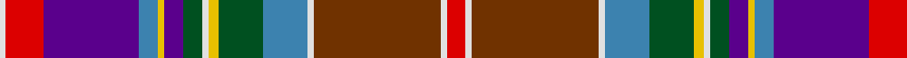

**Bands:** [RWGWBGYWGBYBBRW](/stripes/rwgwbgywgbybbrw/) · **Stripes:** [R W DY W T DG LY W DG DP LY T DP R W](/stripes/stripes15/) R W DY W T DG LY W DG DP LY T DP R W

This was sourced from register-of-tartans.  It is a [15 band tartan](/bands/bands15/).

Original link https://www.tartanregister.gov.uk/tartanDetails.aspx?ref=4023

## Register references

External register numbers recorded for this tartan.

- Scottish Register of Tartans: [4023](https://www.tartanregister.gov.uk/tartanDetails.aspx?ref=4023)
- Scottish Tartans World Register: 1706

## Thread count
LN/4 R24 P60 B12 Y4 P12 G12 LN4 Y6 G28 B28 LN4 T80 LN4 R/12

## Palette
Each colour and its ΔE from the base-6 reference it is a variant of.

| Colour | Shade | Base | ΔE (OKLab) |
|---|---|---|---|
| B | <code style="background-color:#3C82AF;">#3C82AF</code> `#3C82AF` | B <code style="background-color:#2A418A;">#2A418A</code> | 0.19 |
| G | <code style="background-color:#005020;">#005020</code> `#005020` | G <code style="background-color:#006100;">#006100</code> | 0.07 |
| LN | <code style="background-color:#E0E0E0;">#E0E0E0</code> `#E0E0E0` | W <code style="background-color:#F7F7F7;">#F7F7F7</code> | 0.07 |
| P | <code style="background-color:#5A008C;">#5A008C</code> `#5A008C` | B <code style="background-color:#2A418A;">#2A418A</code> | 0.13 |
| R | <code style="background-color:#DC0000;">#DC0000</code> `#DC0000` | R <code style="background-color:#CC0000;">#CC0000</code> | 0.03 |
| T | <code style="background-color:#703200;">#703200</code> `#703200` | G <code style="background-color:#006100;">#006100</code> | 0.18 |
| Y | <code style="background-color:#E8C000;">#E8C000</code> `#E8C000` | Y <code style="background-color:#F2BF00;">#F2BF00</code> | 0.02 |

## Nearest tartans

The nearest existing variants by ΔTartan distance.

1. [Stuart / Stewart, Plaid](/setts/s15/r6w2o40w2t14g14ly3w2g6p6ly2t6p30r12w2~x2/) — ΔT 0.52
1. [Salt Lake City Arts Council (Corp)](/setts/s12/db16dp2db2dp2db2dp8g8lo8r8k1w1r2~x2/) — ΔT 1.10
1. [Unnamed C18th - Hynde Cotton Jacket](/setts/s18/r40p5k26r4p10db14p10r5k2r5k2r5k2r5lr2dg26lb6lr2/) — ΔT 1.21
1. [Brinkie's Brae (Personal)](/setts/s17/k3w4k3r18db1o18k1g18w1db18r1o18g1r18k3w4k3~x2/) — ΔT 1.25
1. [Anderson (W L Anderson, Stirling)](/setts/s21/r4dg7k1r2k1dg7dp5r2k5ly2k2ly2k3w3dp3db16k1r2k1db6r4~x2/) — ΔT 1.28
1. [Bethune (Personal)](/setts/s13/t2db18ly4k5ly1k1w1k2g8r6k1r3w1~x4/) — ΔT 1.28
1. [British Airways (Corporate)](/setts/s15/ly2y2dg20t2r2t2r10t2r2t2db20r2r1db2w1~x2/) — ΔT 1.32
1. [Dundee Pink Variation](/setts/s14/m42r2k15r2dg22lo4lb2dp2lb2lo4lb7lb2dp6lb6~x2/) — ΔT 1.36
1. [Caledonian Society of Prince Edward Island](/setts/s17/db14k4db4k15g20k2y4r2k1w4r14db4r2db2r4db2r2~x2/) — ΔT 1.37
1. [Caledonian Society of P.E.I. (Corp)](/setts/s17/r14db4r2db2r4db2r2db14k4db4k15g20k2y4r2k1w4~x2/) — ΔT 1.37

## Neighbour map

Every grey dot is one of 14313 variants placed by the first two principal components of the ΔTartan feature space (44% of its variance). Red is this tartan; blue dots are its nearest — click one to open its page.

<svg viewBox="0 0 640 380" role="img" style="max-width:100%;height:auto;border:1px solid #e0e0e0;border-radius:4px;display:block" xmlns="http://www.w3.org/2000/svg"><image href="/nn/cloud.v1.png" width="640" height="380"/><a href="/setts/s15/r6w2o40w2t14g14ly3w2g6p6ly2t6p30r12w2~x2/"><circle cx="112.7" cy="70.1" r="4" fill="#3465a4"><title>Stuart / Stewart, Plaid</title></circle></a><a href="/setts/s12/db16dp2db2dp2db2dp8g8lo8r8k1w1r2~x2/"><circle cx="119.9" cy="107.2" r="4" fill="#3465a4"><title>Salt Lake City Arts Council (Corp)</title></circle></a><a href="/setts/s18/r40p5k26r4p10db14p10r5k2r5k2r5k2r5lr2dg26lb6lr2/"><circle cx="142.1" cy="58.0" r="4" fill="#3465a4"><title>Unnamed C18th - Hynde Cotton Jacket</title></circle></a><a href="/setts/s17/k3w4k3r18db1o18k1g18w1db18r1o18g1r18k3w4k3~x2/"><circle cx="100.7" cy="85.8" r="4" fill="#3465a4"><title>Brinkie's Brae (Personal)</title></circle></a><a href="/setts/s21/r4dg7k1r2k1dg7dp5r2k5ly2k2ly2k3w3dp3db16k1r2k1db6r4~x2/"><circle cx="63.8" cy="80.7" r="4" fill="#3465a4"><title>Anderson (W L Anderson, Stirling)</title></circle></a><a href="/setts/s13/t2db18ly4k5ly1k1w1k2g8r6k1r3w1~x4/"><circle cx="108.8" cy="74.3" r="4" fill="#3465a4"><title>Bethune (Personal)</title></circle></a><a href="/setts/s15/ly2y2dg20t2r2t2r10t2r2t2db20r2r1db2w1~x2/"><circle cx="126.8" cy="52.5" r="4" fill="#3465a4"><title>British Airways (Corporate)</title></circle></a><a href="/setts/s14/m42r2k15r2dg22lo4lb2dp2lb2lo4lb7lb2dp6lb6~x2/"><circle cx="119.5" cy="35.2" r="4" fill="#3465a4"><title>Dundee Pink Variation</title></circle></a><a href="/setts/s17/db14k4db4k15g20k2y4r2k1w4r14db4r2db2r4db2r2~x2/"><circle cx="104.8" cy="91.4" r="4" fill="#3465a4"><title>Caledonian Society of Prince Edward Island</title></circle></a><a href="/setts/s17/r14db4r2db2r4db2r2db14k4db4k15g20k2y4r2k1w4~x2/"><circle cx="104.8" cy="91.4" r="4" fill="#3465a4"><title>Caledonian Society of P.E.I. (Corp)</title></circle></a><circle cx="106.6" cy="70.3" r="5" fill="#c00000"/></svg>

ID: /setts/s15/r6w2dy40w2t14dg14ly3w2dg6dp6ly2t6dp30r12w2~x2/
