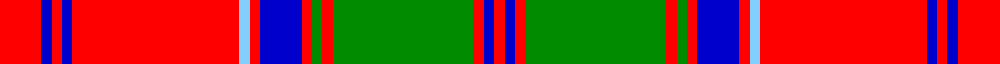

In pattern [RBRBRWRBRGRGRBR](/stripes/rbrbrwrbrgrgrbr/).

This was sourced from register-of-tartans.  It is a [15 stripe tartan](/stripes/stripes15/).

Original link https://www.tartanregister.gov.uk/tartanDetails.aspx?ref=6020

## Register references

External register numbers recorded for this tartan.

- Scottish Register of Tartans: [6020](https://www.tartanregister.gov.uk/tartanDetails.aspx?ref=6020)

## Thread count
R/16 B4 R4 B4 R64 LB4 R4 B16 R4 G4 R4 G54 R4 B4 R/4

## Palette
Each colour and the base-6 reference it is a variant of.

| Colour | Shade | Base |
|---|---|---|
| B | <code style="background-color:#0000CD;">#0000CD</code> `oklch(38.3% 0.266 264.1)` <small>#0000CD</small> | B <code style="background-color:#2A418A;">#2A418A</code> |
| G | <code style="background-color:#008B00;">#008B00</code> `oklch(55.2% 0.188 142.5)` <small>#008B00</small> | G <code style="background-color:#006100;">#006100</code> |
| LB | <code style="background-color:#82CFFD;">#82CFFD</code> `oklch(82.2% 0.100 236.0)` <small>#82CFFD</small> | W <code style="background-color:#F7F7F7;">#F7F7F7</code> |
| R | <code style="background-color:#FF0000;">#FF0000</code> `oklch(62.8% 0.258 29.2)` <small>#FF0000</small> | R <code style="background-color:#CC0000;">#CC0000</code> |

## Nearest tartans

The nearest existing variants by ΔTartan distance, with this tartan at the top so the swatches line up against it.

ΔTartan

Tartan

Sett

—

<a href="/ttd/edit/#slug=r8db2r2db2r32lt2r2db8r2g2r2g27r2db2r2~x2">Grant (Official)</a> <a class="nn-out" href="/setts/s15/r8db2r2db2r32lt2r2db8r2g2r2g27r2db2r2~x2/" title="open its dictionary page">↗</a>

1.01

<a href="/ttd/edit/#slug=w6k7r2ly2r2ly2r2ly2k7ly2r34ly2r2ly2r2ly2~x2">DeWolfe</a> <a class="nn-out" href="/setts/s16/w6k7r2ly2r2ly2r2ly2k7ly2r34ly2r2ly2r2ly2~x2/" title="open its dictionary page">↗</a>

1.02

<a href="/ttd/edit/#slug=r2w2db6r2db2r2db1r20ly1r2ly2r2ly6w2ly2~x2">Winthrop University</a> <a class="nn-out" href="/setts/s15/r2w2db6r2db2r2db1r20ly1r2ly2r2ly6w2ly2~x2/" title="open its dictionary page">↗</a>

1.18

<a href="/ttd/edit/#slug=r3db2r24db8g2db2g2db2g10r3w2~x2">Waddell (Fife), Greg</a> <a class="nn-out" href="/setts/s11/r3db2r24db8g2db2g2db2g10r3w2~x2/" title="open its dictionary page">↗</a>

1.23

<a href="/ttd/edit/#slug=r13w1lt2r2dg14r2w1lt2r2db4r2lt2w1r16dg1r2dg3~x2">MacDonald of Lochmaddy</a> <a class="nn-out" href="/setts/s17/r13w1lt2r2dg14r2w1lt2r2db4r2lt2w1r16dg1r2dg3~x2/" title="open its dictionary page">↗</a>

1.26

<a href="/ttd/edit/#slug=r3db1r1g10r1g1r1db3r1lb1r12db1r1db1r3~x2">Grant D</a> <a class="nn-out" href="/setts/s15/r3db1r1g10r1g1r1db3r1lb1r12db1r1db1r3~x2/" title="open its dictionary page">↗</a>

1.32

<a href="/ttd/edit/#slug=r2lb2db6r2db2r2db1r20lo1r2lo2r2lo6lb2lo2~x2">Winthrop University (Corporate)</a> <a class="nn-out" href="/setts/s15/r2lb2db6r2db2r2db1r20lo1r2lo2r2lo6lb2lo2~x2/" title="open its dictionary page">↗</a>

1.32

<a href="/ttd/edit/#slug=r2w1g1r16g7r1w1g1w1r1g7w2r1g2~x2">Mordente (Personal)</a> <a class="nn-out" href="/setts/s14/r2w1g1r16g7r1w1g1w1r1g7w2r1g2~x2/" title="open its dictionary page">↗</a>

1.32

<a href="/ttd/edit/#slug=r2w1g1r16g7r1w1g1w1r1g7w2r1g2~x4">Mordente (Personal)</a> <a class="nn-out" href="/setts/s14/r2w1g1r16g7r1w1g1w1r1g7w2r1g2~x4/" title="open its dictionary page">↗</a>

1.36

<a href="/ttd/edit/#slug=r31g3r2g2r3g2r2g3r15k15g2t15g3t3w2~x2">Moir (Loch Insch) (Personal)</a> <a class="nn-out" href="/setts/s15/r31g3r2g2r3g2r2g3r15k15g2t15g3t3w2~x2/" title="open its dictionary page">↗</a>

1.38

<a href="/setts/s18/b10r2w2r16g6r1g2r1g3r6~x4/">Harkness Dress</a>

## Neighbour map

Every grey dot is one of 14299 variants placed by the first two principal components of the ΔTartan feature space (44% of its variance). Red is this tartan; blue dots are its nearest — click one to open its page.

<svg viewBox="0 0 640 380" role="img" style="max-width:100%;height:auto;border:1px solid #e0e0e0;border-radius:4px;display:block" xmlns="http://www.w3.org/2000/svg"><image href="/nn/cloud.v1.png" width="640" height="380"/><a href="/setts/s16/w6k7r2ly2r2ly2r2ly2k7ly2r34ly2r2ly2r2ly2~x2/"><circle cx="319.1" cy="79.9" r="4" fill="#3465a4"><title>DeWolfe</title></circle></a><a href="/setts/s15/r2w2db6r2db2r2db1r20ly1r2ly2r2ly6w2ly2~x2/"><circle cx="304.1" cy="88.7" r="4" fill="#3465a4"><title>Winthrop University</title></circle></a><a href="/setts/s11/r3db2r24db8g2db2g2db2g10r3w2~x2/"><circle cx="257.6" cy="123.9" r="4" fill="#3465a4"><title>Waddell (Fife), Greg</title></circle></a><a href="/setts/s17/r13w1lt2r2dg14r2w1lt2r2db4r2lt2w1r16dg1r2dg3~x2/"><circle cx="279.6" cy="87.6" r="4" fill="#3465a4"><title>MacDonald of Lochmaddy</title></circle></a><a href="/setts/s15/r3db1r1g10r1g1r1db3r1lb1r12db1r1db1r3~x2/"><circle cx="319.8" cy="126.6" r="4" fill="#3465a4"><title>Grant D</title></circle></a><a href="/setts/s15/r2lb2db6r2db2r2db1r20lo1r2lo2r2lo6lb2lo2~x2/"><circle cx="337.1" cy="106.1" r="4" fill="#3465a4"><title>Winthrop University (Corporate)</title></circle></a><a href="/setts/s14/r2w1g1r16g7r1w1g1w1r1g7w2r1g2~x2/"><circle cx="311.2" cy="123.9" r="4" fill="#3465a4"><title>Mordente (Personal)</title></circle></a><a href="/setts/s14/r2w1g1r16g7r1w1g1w1r1g7w2r1g2~x4/"><circle cx="311.2" cy="123.9" r="4" fill="#3465a4"><title>Mordente (Personal)</title></circle></a><a href="/setts/s15/r31g3r2g2r3g2r2g3r15k15g2t15g3t3w2~x2/"><circle cx="257.1" cy="95.3" r="4" fill="#3465a4"><title>Moir (Loch Insch) (Personal)</title></circle></a><a href="/setts/s18/b10r2w2r16g6r1g2r1g3r6~x4/"><circle cx="316.8" cy="121.5" r="4" fill="#3465a4"><title>Harkness Dress</title></circle></a><circle cx="308.7" cy="90.2" r="5" fill="#c00000"/></svg>

ID: /setts/s15/r8db2r2db2r32lt2r2db8r2g2r2g27r2db2r2~x2/
