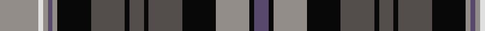

In pattern [BKRKBKBKBKRBRWR](/patterns/bkrkbkbkbkrbrwr/).

This was sourced from house-of-tartan.  It is a [15 stripes tartan](/stripes/stripes15/).

Original link http://www.house-of-tartan.scotland.net/house/TartanViewjs.asp?colr=Def&tnam=6622

## Thread count
N/16 LN2 N2 Nb2 N2 K14 Na14 K2 Na6 K2 Na14 K14 N14 K2 Nb/6

## Palette
Each colour and its ΔE from the base-6 reference it is a variant of.

| Colour | Shade | Base | ΔE (OKLab) |
|---|---|---|---|
| K | <code style="background-color:#080808;">#080808</code> `#080808` | K <code style="background-color:#000000;">#000000</code> | 0.13 |
| LN | <code style="background-color:#E0E0E0;">#E0E0E0</code> `#E0E0E0` | W <code style="background-color:#F7F7F7;">#F7F7F7</code> | 0.07 |
| N | <code style="background-color:#928D89;">#928D89</code> `#928D89` | R <code style="background-color:#CC0000;">#CC0000</code> | 0.24 |
| Na | <code style="background-color:#534E4B;">#534E4B</code> `#534E4B` | B <code style="background-color:#2A418A;">#2A418A</code> | 0.13 |
| Nb | <code style="background-color:#58486C;">#58486C</code> `#58486C` | B <code style="background-color:#2A418A;">#2A418A</code> | 0.09 |

## Nearest tartans

The nearest existing variants by ΔTartan distance.

1. [MacDonald of Clanranald #3](/setts/s13/b6r2b2r3b12r2k11w2g11r3g2r2g6x2~b2c2c80-g006818-k101010-rc80000-wfcfcfc/) — ΔT 0.61
1. [MacDonald of Clanranald Clan Tartan Tartan Number: 427. Earliest known date: 1850 This is the count from the Lord Lyons records multiplied by four. It corresponds to the sett given by A. and W. Smith in 'The Authenticated Tartans of the Clans and Families of Scotland' (1850) and in the work of J.Grant (1886). The tartan is distinguished by the two white lines. There is a certified example in the Highland Society of London collection. See products available Copyright © Blair Urquhart, Comrie, 2015](/setts/s13/b6r2b2r3b12r2k11w2g11r3g2r2g6x2~b2c2c80-g006818-k101010-rc80000-we0e0e0/) — ΔT 0.62
1. [Carnegie](/setts/s13/b3r1b1r2b6r1k6g6r2g1r1g2y1x6~b2c2c80-g006818-k101010-rc80000-ye8c000/) — ΔT 0.70
1. [Carnegie Family Tartan Tartan Number: 489. Earliest known date: c. 1715 A variant of the MacDonell of Glengarry said to have been adopted by Lord Southesk who was active in the 1715 rebellion. The Glengarry white becomes yellow in the Carnegie. It is possible that this minor difference was caused by the passage of time. See products available Copyright © Blair Urquhart, Comrie, 2015](/setts/s13/b3r1b1r2b6r1k6g6r2g1r1g2y1x2~b2c2c80-g006818-k101010-rc80000-ye8c000/) — ΔT 0.70
1. [Schneidersohne Centenary (Corporate)](/setts/s14/k3b5r5k3b5k3r5k3g20k3b10k3r5w3x2~b547894-g006818-k101010-rc8002c-we0e0e0/) — ΔT 0.84
1. [Swankie (Personal)](/setts/s12/r6k20g4ga10b21k4b21ga10g4k20r6b3x2~b1474b4-g8c7038-ga604000-k101010-rc80000/) — ΔT 0.84
1. [MacLeods Highlanders](/setts/s15/b12r2w2r2w2k12g11k2w2k2g11k12b11k2r2x2~b2c2c80-g006818-k101010-rc80000-we0e0e0/) — ΔT 0.85
1. [Farquharson Clan Tartan Tartan Number: 1352. Earliest known date: 1774 First published in James Logan's 'Scottish Gael' in 1831. Four small pieces of this tartan were exhibited by Miss Farquharson of Invercauld at the Highland Exhibition held in Inverness in 1930. They were dated 1774. A specimen in the Highland Society of London Collection bears the seal of Farquharson of Finzean. Farquharsons were prominent Jacobites who fought in both the 1715 and 1745 uprisings. There present day chief is Captain Alwynne Farquharson of Invercauld. See products available Copyright © Blair Urquhart, Comrie, 2015](/setts/s14/r2b4k1b1k1b1k8g8y2g8k8b8k1r2x2~b2c2c80-g006818-k101010-rc80000-ye8c000/) — ΔT 0.86
1. [MacSporran Clan Tartan Tartan Number: 495. Earliest known date: 1978 Adopted by the Clan MacSporran Association in 1978 See products available Copyright © Blair Urquhart, Comrie, 2015](/setts/s13/b17r3b4r5b20r3k20g20r5g4r3k3y11x2~b3c3c60-g005028-k101010-rc80000-yf0c800/) — ΔT 0.86
1. [MacRae Hunting (Wilsons)](/setts/s15/g26k4g6r4g6k26b26k3w7k3b26k26g26k3r7x2~b2c2c80-g006818-k101010-ra00048-wf8f8f8/) — ΔT 0.87

## Neighbour map

Every grey dot is one of 15726 variants placed by the first two principal components of the ΔTartan feature space (44% of its variance). Red is this tartan; blue dots are its nearest — click one to open its page.

<svg viewBox="0 0 640 380" role="img" style="max-width:100%;height:auto;border:1px solid #e0e0e0;border-radius:4px;display:block" xmlns="http://www.w3.org/2000/svg"><image href="/nn/cloud.v1.png" width="640" height="380"/><a href="/setts/s13/b6r2b2r3b12r2k11w2g11r3g2r2g6x2~b2c2c80-g006818-k101010-rc80000-wfcfcfc/"><circle cx="98.1" cy="180.5" r="4" fill="#3465a4"><title>MacDonald of Clanranald #3</title></circle></a><a href="/setts/s13/b6r2b2r3b12r2k11w2g11r3g2r2g6x2~b2c2c80-g006818-k101010-rc80000-we0e0e0/"><circle cx="101.8" cy="182.1" r="4" fill="#3465a4"><title>MacDonald of Clanranald Clan Tartan Tartan Number: 427. Earliest known date: 1850 This is the count from the Lord Lyons records multiplied by four. It corresponds to the sett given by A. and W. Smith in 'The Authenticated Tartans of the Clans and Families of Scotland' (1850) and in the work of J.Grant (1886). The tartan is distinguished by the two white lines. There is a certified example in the Highland Society of London collection. See products available Copyright © Blair Urquhart, Comrie, 2015</title></circle></a><a href="/setts/s13/b3r1b1r2b6r1k6g6r2g1r1g2y1x6~b2c2c80-g006818-k101010-rc80000-ye8c000/"><circle cx="100.3" cy="180.0" r="4" fill="#3465a4"><title>Carnegie</title></circle></a><a href="/setts/s13/b3r1b1r2b6r1k6g6r2g1r1g2y1x2~b2c2c80-g006818-k101010-rc80000-ye8c000/"><circle cx="100.3" cy="180.0" r="4" fill="#3465a4"><title>Carnegie Family Tartan Tartan Number: 489. Earliest known date: c. 1715 A variant of the MacDonell of Glengarry said to have been adopted by Lord Southesk who was active in the 1715 rebellion. The Glengarry white becomes yellow in the Carnegie. It is possible that this minor difference was caused by the passage of time. See products available Copyright © Blair Urquhart, Comrie, 2015</title></circle></a><a href="/setts/s14/k3b5r5k3b5k3r5k3g20k3b10k3r5w3x2~b547894-g006818-k101010-rc8002c-we0e0e0/"><circle cx="80.8" cy="165.3" r="4" fill="#3465a4"><title>Schneidersohne Centenary (Corporate)</title></circle></a><a href="/setts/s12/r6k20g4ga10b21k4b21ga10g4k20r6b3x2~b1474b4-g8c7038-ga604000-k101010-rc80000/"><circle cx="123.7" cy="193.1" r="4" fill="#3465a4"><title>Swankie (Personal)</title></circle></a><a href="/setts/s15/b12r2w2r2w2k12g11k2w2k2g11k12b11k2r2x2~b2c2c80-g006818-k101010-rc80000-we0e0e0/"><circle cx="105.9" cy="173.8" r="4" fill="#3465a4"><title>MacLeods Highlanders</title></circle></a><a href="/setts/s14/r2b4k1b1k1b1k8g8y2g8k8b8k1r2x2~b2c2c80-g006818-k101010-rc80000-ye8c000/"><circle cx="136.6" cy="174.6" r="4" fill="#3465a4"><title>Farquharson Clan Tartan Tartan Number: 1352. Earliest known date: 1774 First published in James Logan's 'Scottish Gael' in 1831. Four small pieces of this tartan were exhibited by Miss Farquharson of Invercauld at the Highland Exhibition held in Inverness in 1930. They were dated 1774. A specimen in the Highland Society of London Collection bears the seal of Farquharson of Finzean. Farquharsons were prominent Jacobites who fought in both the 1715 and 1745 uprisings. There present day chief is Captain Alwynne Farquharson of Invercauld. See products available Copyright © Blair Urquhart, Comrie, 2015</title></circle></a><a href="/setts/s13/b17r3b4r5b20r3k20g20r5g4r3k3y11x2~b3c3c60-g005028-k101010-rc80000-yf0c800/"><circle cx="114.1" cy="174.9" r="4" fill="#3465a4"><title>MacSporran Clan Tartan Tartan Number: 495. Earliest known date: 1978 Adopted by the Clan MacSporran Association in 1978 See products available Copyright © Blair Urquhart, Comrie, 2015</title></circle></a><a href="/setts/s15/g26k4g6r4g6k26b26k3w7k3b26k26g26k3r7x2~b2c2c80-g006818-k101010-ra00048-wf8f8f8/"><circle cx="130.6" cy="169.6" r="4" fill="#3465a4"><title>MacRae Hunting (Wilsons)</title></circle></a><circle cx="115.2" cy="164.8" r="5" fill="#c00000"/></svg>

ID: /setts/s15/r8w1r1b1r1k7ba7k1ba3k1ba7k7r7k1b3x2~b58486c-ba534e4b-k080808-r928d89-we0e0e0/
