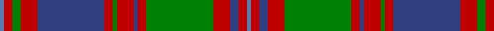

In pattern [BRBRGRBRGRBRGRB](/stripes/brbrgrbrgrbrgrb/).

This was sourced from weddslist.  It is a [15 stripe tartan](/stripes/stripes15/).

Original link http://www.weddslist.com/cgi-bin/tartans/pg.pl?source=sts

## Thread count
Ba/2 R4 G4 R8 B32 R4 G2 R8 B2 R4 G32 R8 B4 R4 Ba/2

## Palette
Each colour and the base-6 reference it is a variant of.

| Colour | Shade | Base |
|---|---|---|
| B | <code style="background-color:#304080;">#304080</code> `oklch(39.4% 0.109 270.2)` <small>#304080</small> | B <code style="background-color:#2A418A;">#2A418A</code> |
| Ba | <code style="background-color:#5480B0;">#5480B0</code> `oklch(58.8% 0.089 251.5)` <small>#5480B0</small> | B <code style="background-color:#2A418A;">#2A418A</code> |
| G | <code style="background-color:#008000;">#008000</code> `oklch(52.0% 0.177 142.5)` <small>#008000</small> | G <code style="background-color:#006100;">#006100</code> |
| R | <code style="background-color:#C00000;">#C00000</code> `oklch(50.7% 0.208 29.2)` <small>#C00000</small> | R <code style="background-color:#CC0000;">#CC0000</code> |

## Nearest tartans

The nearest existing variants by ΔTartan distance, with this tartan at the top so the swatches line up against it.

ΔTartan

Tartan

Sett

—

<a href="/ttd/edit/#slug=t1r2db2r4g16r2db1r4g1r2db16r4g2r2t1~x2">MacIntyre, and Glenorchy</a> <a class="nn-out" href="/setts/s15/t1r2db2r4g16r2db1r4g1r2db16r4g2r2t1~x2/" title="open its dictionary page">↗</a>

0.57

<a href="/ttd/edit/#slug=t1r2db2r4g16r2db2r4g2r2db16r4g2r2t1~x2">MacIntyre of Whitehouse (Clan?)</a> <a class="nn-out" href="/setts/s15/t1r2db2r4g16r2db2r4g2r2db16r4g2r2t1~x2/" title="open its dictionary page">↗</a>

0.86

<a href="/ttd/edit/#slug=r20p1r1db2r1p1r4db4g2db4g2db4g19r1p2~x2">Ladybird</a> <a class="nn-out" href="/setts/s15/r20p1r1db2r1p1r4db4g2db4g2db4g19r1p2~x2/" title="open its dictionary page">↗</a>

1.07

<a href="/ttd/edit/#slug=t3r24db4r8g32r4db4r8g4r4db32r8g4r4t2~x2">MacIntyre (of Gatehouse)</a> <a class="nn-out" href="/setts/s15/t3r24db4r8g32r4db4r8g4r4db32r8g4r4t2~x2/" title="open its dictionary page">↗</a>

1.07

<a href="/ttd/edit/#slug=o4n12k12n4o18n1o1n1o2n1o2n1o4n1o4~x4">Ettrick (Fashion)</a> <a class="nn-out" href="/setts/s15/o4n12k12n4o18n1o1n1o2n1o2n1o4n1o4~x4/" title="open its dictionary page">↗</a>

1.16

<a href="/ttd/edit/#slug=db2t1r2g16r2db6t1r2g6r2db16t1r2g2~x2">Glen Orchy</a> <a class="nn-out" href="/setts/s14/db2t1r2g16r2db6t1r2g6r2db16t1r2g2~x2/" title="open its dictionary page">↗</a>

1.21

<a href="/ttd/edit/#slug=t1r1db1r2g8r1db1r2g1r1db8r2g1r1t1~x4">MacIntyre of Glenorchy Clan Tartan Tartan Number: 402. Earliest known date: 1850 Smiths' version is also known as MacIntyre of Whitehouse. Though different from the sett recorded by Lord Lyon it is the one most often available in modern times. Before moving to Badenoch to take protection for Clan Chattan, the MacIntyres were listed as followers of Stewart of Appin. See products available Copyright © Blair Urquhart, Comrie, 2015</a> <a class="nn-out" href="/setts/s15/t1r1db1r2g8r1db1r2g1r1db8r2g1r1t1~x4/" title="open its dictionary page">↗</a>

1.21

<a href="/ttd/edit/#slug=db16r1db1r1g12r16w2r16g12db12r1db1~x2">Fraser of Lovat</a> <a class="nn-out" href="/setts/s12/db16r1db1r1g12r16w2r16g12db12r1db1~x2/" title="open its dictionary page">↗</a>

1.24

<a href="/ttd/edit/#slug=g6r2g2r24t1db1r2db12r2db1t1r2g24r2~x2">Unidentified, coat</a> <a class="nn-out" href="/setts/s14/g6r2g2r24t1db1r2db12r2db1t1r2g24r2~x2/" title="open its dictionary page">↗</a>

1.25

<a href="/ttd/edit/#slug=k10y26k2y4k2y26k3r36k3g30k3r2">Pope (Welsh Name)</a> <a class="nn-out" href="/setts/s12/k10y26k2y4k2y26k3r36k3g30k3r2/" title="open its dictionary page">↗</a>

1.26

<a href="/setts/s18/r47g14k5ly2k3g7k3ly2k5g14~x2/">Harbor Club</a>

## Neighbour map

Every grey dot is one of 14299 variants placed by the first two principal components of the ΔTartan feature space (44% of its variance). Red is this tartan; blue dots are its nearest — click one to open its page.

<svg viewBox="0 0 640 380" role="img" style="max-width:100%;height:auto;border:1px solid #e0e0e0;border-radius:4px;display:block" xmlns="http://www.w3.org/2000/svg"><image href="/nn/cloud.v1.png" width="640" height="380"/><a href="/setts/s15/t1r2db2r4g16r2db2r4g2r2db16r4g2r2t1~x2/"><circle cx="212.4" cy="129.3" r="4" fill="#3465a4"><title>MacIntyre of Whitehouse (Clan?)</title></circle></a><a href="/setts/s15/r20p1r1db2r1p1r4db4g2db4g2db4g19r1p2~x2/"><circle cx="269.8" cy="114.4" r="4" fill="#3465a4"><title>Ladybird</title></circle></a><a href="/setts/s15/t3r24db4r8g32r4db4r8g4r4db32r8g4r4t2~x2/"><circle cx="251.9" cy="137.2" r="4" fill="#3465a4"><title>MacIntyre (of Gatehouse)</title></circle></a><a href="/setts/s15/o4n12k12n4o18n1o1n1o2n1o2n1o4n1o4~x4/"><circle cx="197.1" cy="123.1" r="4" fill="#3465a4"><title>Ettrick (Fashion)</title></circle></a><a href="/setts/s14/db2t1r2g16r2db6t1r2g6r2db16t1r2g2~x2/"><circle cx="259.6" cy="149.5" r="4" fill="#3465a4"><title>Glen Orchy</title></circle></a><a href="/setts/s15/t1r1db1r2g8r1db1r2g1r1db8r2g1r1t1~x4/"><circle cx="185.6" cy="162.3" r="4" fill="#3465a4"><title>MacIntyre of Glenorchy Clan Tartan Tartan Number: 402. Earliest known date: 1850 Smiths' version is also known as MacIntyre of Whitehouse. Though different from the sett recorded by Lord Lyon it is the one most often available in modern times. Before moving to Badenoch to take protection for Clan Chattan, the MacIntyres were listed as followers of Stewart of Appin. See products available Copyright © Blair Urquhart, Comrie, 2015</title></circle></a><a href="/setts/s12/db16r1db1r1g12r16w2r16g12db12r1db1~x2/"><circle cx="230.7" cy="159.3" r="4" fill="#3465a4"><title>Fraser of Lovat</title></circle></a><a href="/setts/s14/g6r2g2r24t1db1r2db12r2db1t1r2g24r2~x2/"><circle cx="298.3" cy="111.5" r="4" fill="#3465a4"><title>Unidentified, coat</title></circle></a><a href="/setts/s12/k10y26k2y4k2y26k3r36k3g30k3r2/"><circle cx="203.2" cy="128.9" r="4" fill="#3465a4"><title>Pope (Welsh Name)</title></circle></a><a href="/setts/s18/r47g14k5ly2k3g7k3ly2k5g14~x2/"><circle cx="263.2" cy="110.0" r="4" fill="#3465a4"><title>Harbor Club</title></circle></a><circle cx="232.1" cy="132.7" r="5" fill="#c00000"/></svg>

ID: /setts/s15/t1r2db2r4g16r2db1r4g1r2db16r4g2r2t1~x2/
