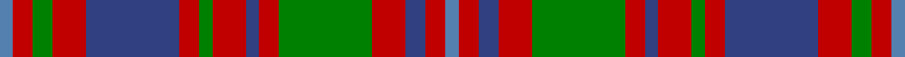

In pattern [BRBRGRBRGRBRGRB](/stripes/brbrgrbrgrbrgrb/).

This was sourced from weddslist.  It is a [15 stripe tartan](/stripes/stripes15/).

Original link http://www.weddslist.com/cgi-bin/tartans/pg.pl?source=sts

## Thread count
Ba/4 R6 G6 R10 B28 R6 G4 R10 B4 R6 G28 R10 B6 R6 Ba/4

## Palette
Each colour and the base-6 reference it is a variant of.

| Colour | Shade | Base |
|---|---|---|
| B | <code style="background-color:#304080;">#304080</code> `oklch(39.4% 0.109 270.2)` <small>#304080</small> | B <code style="background-color:#2A418A;">#2A418A</code> |
| Ba | <code style="background-color:#5480B0;">#5480B0</code> `oklch(58.8% 0.089 251.5)` <small>#5480B0</small> | B <code style="background-color:#2A418A;">#2A418A</code> |
| G | <code style="background-color:#008000;">#008000</code> `oklch(52.0% 0.177 142.5)` <small>#008000</small> | G <code style="background-color:#006100;">#006100</code> |
| R | <code style="background-color:#C00000;">#C00000</code> `oklch(50.7% 0.208 29.2)` <small>#C00000</small> | R <code style="background-color:#CC0000;">#CC0000</code> |

## Nearest tartans

The nearest existing variants by ΔTartan distance.

1. [Glen Orchy #1](/setts/s15/t2r3dg3r5db14r3dg2r5db2r3dg14r5db3r3t2~x2/) — ΔT 0.54
1. [Grant of Ballindalloch Clan Tartan Tartan Number: 2149. Earliest known date: 1993 Grant of Ballindalloch tartan was designed during the refurbishment of Ballindalloch Castle. It is based on the Grant tartan recorded by Logan in 1831. The first samples produced by Johnstons of Elgin were woven in 'Antique' colours. See products available Copyright © Blair Urquhart, Comrie, 2015](/setts/s15/r5dt5r3g16r3g3r3dt10r3t5r12dt5r3dt3r5~x2/) — ΔT 0.87
1. [Sydney (Nova Scotia) #2](/setts/s14/o16k4w2k4o6o11o2o16~x2/) — ΔT 0.88
1. [Fraser of Lovat](/setts/s12/db16r2db2r2g14r13w2r13g14db14r2db2~x2/) — ΔT 1.01
1. [Matheson (Logan 1831)](/setts/s13/r2dg2r12dg10r2dg2r2dg10t3db10r12dg2r2~x2/) — ΔT 1.03
1. [Matheson](/setts/s13/r2g2r12db10t3g10r2g2r2g10r12g2r2~x2/) — ΔT 1.03
1. [Reid of Straloch (Personal)](/setts/s17/r1g1r6db2r1g1w1g6r2db6w1db1r1g2r6g1r1~x6/) — ΔT 1.04
1. [Tyneside Scottish Purple (Mil/Distr)](/setts/s13/dp8dy1dp1dy1dp1dy8g8dy1g8dy8dp8dy1dp1~x6/) — ΔT 1.05
1. [Chisholm](/setts/s16/r5g16r5db4w2db4w2db4r22db4w2db4r5g16r5db2~x4/) — ΔT 1.06
1. [Unidentified, specimen](/setts/s10/db1g4db1r1db1ly1db5r6db1ly1~x2/) — ΔT 1.08

## Neighbour map

Every grey dot is one of 14299 variants placed by the first two principal components of the ΔTartan feature space (44% of its variance). Red is this tartan; blue dots are its nearest — click one to open its page.

<svg viewBox="0 0 640 380" role="img" style="max-width:100%;height:auto;border:1px solid #e0e0e0;border-radius:4px;display:block" xmlns="http://www.w3.org/2000/svg"><image href="/nn/cloud.v1.png" width="640" height="380"/><a href="/setts/s15/t2r3dg3r5db14r3dg2r5db2r3dg14r5db3r3t2~x2/"><circle cx="193.5" cy="182.1" r="4" fill="#3465a4"><title>Glen Orchy #1</title></circle></a><a href="/setts/s15/r5dt5r3g16r3g3r3dt10r3t5r12dt5r3dt3r5~x2/"><circle cx="193.8" cy="207.8" r="4" fill="#3465a4"><title>Grant of Ballindalloch Clan Tartan Tartan Number: 2149. Earliest known date: 1993 Grant of Ballindalloch tartan was designed during the refurbishment of Ballindalloch Castle. It is based on the Grant tartan recorded by Logan in 1831. The first samples produced by Johnstons of Elgin were woven in 'Antique' colours. See products available Copyright © Blair Urquhart, Comrie, 2015</title></circle></a><a href="/setts/s14/o16k4w2k4o6o11o2o16~x2/"><circle cx="203.8" cy="180.2" r="4" fill="#3465a4"><title>Sydney (Nova Scotia) #2</title></circle></a><a href="/setts/s12/db16r2db2r2g14r13w2r13g14db14r2db2~x2/"><circle cx="178.6" cy="192.2" r="4" fill="#3465a4"><title>Fraser of Lovat</title></circle></a><a href="/setts/s13/r2dg2r12dg10r2dg2r2dg10t3db10r12dg2r2~x2/"><circle cx="224.2" cy="196.3" r="4" fill="#3465a4"><title>Matheson (Logan 1831)</title></circle></a><a href="/setts/s13/r2g2r12db10t3g10r2g2r2g10r12g2r2~x2/"><circle cx="226.4" cy="200.3" r="4" fill="#3465a4"><title>Matheson</title></circle></a><a href="/setts/s17/r1g1r6db2r1g1w1g6r2db6w1db1r1g2r6g1r1~x6/"><circle cx="203.7" cy="170.1" r="4" fill="#3465a4"><title>Reid of Straloch (Personal)</title></circle></a><a href="/setts/s13/dp8dy1dp1dy1dp1dy8g8dy1g8dy8dp8dy1dp1~x6/"><circle cx="216.9" cy="204.9" r="4" fill="#3465a4"><title>Tyneside Scottish Purple (Mil/Distr)</title></circle></a><a href="/setts/s16/r5g16r5db4w2db4w2db4r22db4w2db4r5g16r5db2~x4/"><circle cx="209.7" cy="148.5" r="4" fill="#3465a4"><title>Chisholm</title></circle></a><a href="/setts/s10/db1g4db1r1db1ly1db5r6db1ly1~x2/"><circle cx="188.7" cy="196.1" r="4" fill="#3465a4"><title>Unidentified, specimen</title></circle></a><circle cx="195.1" cy="185.0" r="5" fill="#c00000"/></svg>

ID: /setts/s15/t2r3db3r5g14r3db2r5g2r3db14r5g3r3t2~x2/
