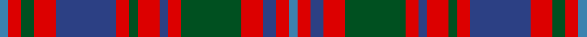

This page is one **sett** — a single exact thread-count. It belongs to the [tartan](/tartans/t2r3dg3r5db14r3dg2r5db2r3dg14r5db3r3t2/)
(the same proportion at any scale), whose colour order is pattern [BRBRGRBRGRBRGRB](/stripes/brbrgrbrgrbrgrb/).

Sourced from register-of-tartans.  It is a [15 stripe tartan](/stripes/stripes15/).

Original link https://www.tartanregister.gov.uk/tartanDetails.aspx?ref=1393

## Register references

External register numbers recorded for this tartan.

- Scottish Register of Tartans: [1393](https://www.tartanregister.gov.uk/tartanDetails.aspx?ref=1393)
- Scottish Tartans World Register: 2077

## Thread count
B/4 R6 G6 R10 Ba28 R6 G4 R10 Ba4 R6 G28 R10 Ba6 R6 B/4

## Palette

Palette: <strong>Tartan Register</strong>
<table><thead><tr><th>Colour</th><th>Threads</th><th>Shade</th><th>Base</th><th>OKLCh</th></tr></thead><tbody><tr><td>B/</td><td style="text-align:right;font-variant-numeric:tabular-nums">4</td><td><code style="background-color:#3C82AF;">#3C82AF</code> <small style="color:#888">#3C82AF</small></td><td>B <code style="background-color:#2A418A;">#2A418A</code></td><td><small style="color:#888">oklch(58.1% 0.099 239.8)</small></td></tr><tr><td>R</td><td style="text-align:right;font-variant-numeric:tabular-nums">6</td><td><code style="background-color:#DC0000;">#DC0000</code> <small style="color:#888">#DC0000</small></td><td>R <code style="background-color:#CC0000;">#CC0000</code></td><td><small style="color:#888">oklch(56.2% 0.230 29.2)</small></td></tr><tr><td>G</td><td style="text-align:right;font-variant-numeric:tabular-nums">6</td><td><code style="background-color:#005020;">#005020</code> <small style="color:#888">#005020</small></td><td>G <code style="background-color:#006100;">#006100</code></td><td><small style="color:#888">oklch(37.7% 0.105 149.6)</small></td></tr><tr><td>R</td><td style="text-align:right;font-variant-numeric:tabular-nums">10</td><td><code style="background-color:#DC0000;">#DC0000</code> <small style="color:#888">#DC0000</small></td><td>R <code style="background-color:#CC0000;">#CC0000</code></td><td><small style="color:#888">oklch(56.2% 0.230 29.2)</small></td></tr><tr><td>Ba</td><td style="text-align:right;font-variant-numeric:tabular-nums">28</td><td><code style="background-color:#2C4084;">#2C4084</code> <small style="color:#888">#2C4084</small></td><td>B <code style="background-color:#2A418A;">#2A418A</code></td><td><small style="color:#888">oklch(39.4% 0.117 268.3)</small></td></tr><tr><td>R</td><td style="text-align:right;font-variant-numeric:tabular-nums">6</td><td><code style="background-color:#DC0000;">#DC0000</code> <small style="color:#888">#DC0000</small></td><td>R <code style="background-color:#CC0000;">#CC0000</code></td><td><small style="color:#888">oklch(56.2% 0.230 29.2)</small></td></tr><tr><td>G</td><td style="text-align:right;font-variant-numeric:tabular-nums">4</td><td><code style="background-color:#005020;">#005020</code> <small style="color:#888">#005020</small></td><td>G <code style="background-color:#006100;">#006100</code></td><td><small style="color:#888">oklch(37.7% 0.105 149.6)</small></td></tr><tr><td>R</td><td style="text-align:right;font-variant-numeric:tabular-nums">10</td><td><code style="background-color:#DC0000;">#DC0000</code> <small style="color:#888">#DC0000</small></td><td>R <code style="background-color:#CC0000;">#CC0000</code></td><td><small style="color:#888">oklch(56.2% 0.230 29.2)</small></td></tr><tr><td>Ba</td><td style="text-align:right;font-variant-numeric:tabular-nums">4</td><td><code style="background-color:#2C4084;">#2C4084</code> <small style="color:#888">#2C4084</small></td><td>B <code style="background-color:#2A418A;">#2A418A</code></td><td><small style="color:#888">oklch(39.4% 0.117 268.3)</small></td></tr><tr><td>R</td><td style="text-align:right;font-variant-numeric:tabular-nums">6</td><td><code style="background-color:#DC0000;">#DC0000</code> <small style="color:#888">#DC0000</small></td><td>R <code style="background-color:#CC0000;">#CC0000</code></td><td><small style="color:#888">oklch(56.2% 0.230 29.2)</small></td></tr><tr><td>G</td><td style="text-align:right;font-variant-numeric:tabular-nums">28</td><td><code style="background-color:#005020;">#005020</code> <small style="color:#888">#005020</small></td><td>G <code style="background-color:#006100;">#006100</code></td><td><small style="color:#888">oklch(37.7% 0.105 149.6)</small></td></tr><tr><td>R</td><td style="text-align:right;font-variant-numeric:tabular-nums">10</td><td><code style="background-color:#DC0000;">#DC0000</code> <small style="color:#888">#DC0000</small></td><td>R <code style="background-color:#CC0000;">#CC0000</code></td><td><small style="color:#888">oklch(56.2% 0.230 29.2)</small></td></tr><tr><td>Ba</td><td style="text-align:right;font-variant-numeric:tabular-nums">6</td><td><code style="background-color:#2C4084;">#2C4084</code> <small style="color:#888">#2C4084</small></td><td>B <code style="background-color:#2A418A;">#2A418A</code></td><td><small style="color:#888">oklch(39.4% 0.117 268.3)</small></td></tr><tr><td>R</td><td style="text-align:right;font-variant-numeric:tabular-nums">6</td><td><code style="background-color:#DC0000;">#DC0000</code> <small style="color:#888">#DC0000</small></td><td>R <code style="background-color:#CC0000;">#CC0000</code></td><td><small style="color:#888">oklch(56.2% 0.230 29.2)</small></td></tr><tr><td>B/</td><td style="text-align:right;font-variant-numeric:tabular-nums">4</td><td><code style="background-color:#3C82AF;">#3C82AF</code> <small style="color:#888">#3C82AF</small></td><td>B <code style="background-color:#2A418A;">#2A418A</code></td><td><small style="color:#888">oklch(58.1% 0.099 239.8)</small></td></tr></tbody></table>

## Nearest tartans

The nearest existing variants by ΔTartan distance, with this tartan at the top so the swatches line up against it.

ΔTartan

Tartan

Sett

—

<a href="/ttd/edit/#slug=t2r3dg3r5db14r3dg2r5db2r3dg14r5db3r3t2~x2">Glen Orchy #1</a> <a class="nn-out" href="/setts/s15/t2r3dg3r5db14r3dg2r5db2r3dg14r5db3r3t2~x2/" title="open its dictionary page">↗</a>

0.54

<a href="/ttd/edit/#slug=t2r3db3r5g14r3db2r5g2r3db14r5g3r3t2~x2">Glen Orchy</a> <a class="nn-out" href="/setts/s15/t2r3db3r5g14r3db2r5g2r3db14r5g3r3t2~x2/" title="open its dictionary page">↗</a>

0.86

<a href="/ttd/edit/#slug=db16r2db2r2g14r13w2r13g14db14r2db2~x2">Fraser of Lovat</a> <a class="nn-out" href="/setts/s12/db16r2db2r2g14r13w2r13g14db14r2db2~x2/" title="open its dictionary page">↗</a>

0.88

<a href="/ttd/edit/#slug=r5dt5r3g16r3g3r3dt10r3t5r12dt5r3dt3r5~x2">Grant of Ballindalloch Clan Tartan Tartan Number: 2149. Earliest known date: 1993 Grant of Ballindalloch tartan was designed during the refurbishment of Ballindalloch Castle. It is based on the Grant tartan recorded by Logan in 1831. The first samples produced by Johnstons of Elgin were woven in 'Antique' colours. See products available Copyright © Blair Urquhart, Comrie, 2015</a> <a class="nn-out" href="/setts/s15/r5dt5r3g16r3g3r3dt10r3t5r12dt5r3dt3r5~x2/" title="open its dictionary page">↗</a>

0.88

<a href="/ttd/edit/#slug=r1g1r6db2r1g1w1g6r2db6w1db1r1g2r6g1r1~x6">Reid of Straloch (Personal)</a> <a class="nn-out" href="/setts/s17/r1g1r6db2r1g1w1g6r2db6w1db1r1g2r6g1r1~x6/" title="open its dictionary page">↗</a>

0.95

<a href="/setts/s14/o16k4w2k4o6o11o2o16~x2/">Sydney (Nova Scotia) #2</a>

0.99

<a href="/ttd/edit/#slug=o15db2o2db2o2dt12k12dt3k12dt12o12db2o2~x2">Balmoral Hotel (Corporate)</a> <a class="nn-out" href="/setts/s13/o15db2o2db2o2dt12k12dt3k12dt12o12db2o2~x2/" title="open its dictionary page">↗</a>

0.99

<a href="/ttd/edit/#slug=r2dg2r12dg10r2dg2r2dg10t3db10r12dg2r2~x2">Matheson (Logan 1831)</a> <a class="nn-out" href="/setts/s13/r2dg2r12dg10r2dg2r2dg10t3db10r12dg2r2~x2/" title="open its dictionary page">↗</a>

1.01

<a href="/ttd/edit/#slug=r3g3r18g6r4db3lb3db18r6g18lb3g3r3db4r18g3r3~x2">Reid Red Clan/Family Tartan Tartan Number: 5415. Earliest known date: pre 1991 Found in Dalgleish swatch files 1991, but in use long before then. known to be worn by James Reid of Washington D.C. Modification of Robertson. see 1428 for &quot;Reid - green&quot; designed by Phil Smith 1991 for Wm. M. Reid, Jr. (perhaps without knowledge of the previously existing &quot;Reid - red&quot;). See products available Copyright © Blair Urquhart, Comrie, 2015</a> <a class="nn-out" href="/setts/s17/r3g3r18g6r4db3lb3db18r6g18lb3g3r3db4r18g3r3~x2/" title="open its dictionary page">↗</a>

1.01

<a href="/setts/s20/dt10r2dt10r10dg2r2dg2r2dg10r1w2~x4/">North Berwick Pipe Band District Tartan Tartan Number: 2342. Earliest known date: 1990 Designed by Donald Fraser for the North Berwick Pipe Band dancers for their visit to Maine USA in 1990. The Pipe Band itself normally wears McKenzie. See products available Copyright © Blair Urquhart, Comrie, 2015</a>

1.01

<a href="/ttd/edit/#slug=r5g16r5db4w2db4w2db4r22db4w2db4r5g16r5db2~x4">Chisholm</a> <a class="nn-out" href="/setts/s16/r5g16r5db4w2db4w2db4r22db4w2db4r5g16r5db2~x4/" title="open its dictionary page">↗</a>

## Neighbour map

Every grey dot is one of 14299 variants placed by the first two principal components of the ΔTartan feature space (44% of its variance). Red is this tartan; blue dots are its nearest — click one to open its page.

<svg viewBox="0 0 640 380" role="img" style="max-width:100%;height:auto;border:1px solid #e0e0e0;border-radius:4px;display:block" xmlns="http://www.w3.org/2000/svg"><image href="/nn/cloud.v1.png" width="640" height="380"/><a href="/setts/s15/t2r3db3r5g14r3db2r5g2r3db14r5g3r3t2~x2/"><circle cx="195.1" cy="185.0" r="4" fill="#3465a4"><title>Glen Orchy</title></circle></a><a href="/setts/s12/db16r2db2r2g14r13w2r13g14db14r2db2~x2/"><circle cx="178.6" cy="192.2" r="4" fill="#3465a4"><title>Fraser of Lovat</title></circle></a><a href="/setts/s15/r5dt5r3g16r3g3r3dt10r3t5r12dt5r3dt3r5~x2/"><circle cx="193.8" cy="207.8" r="4" fill="#3465a4"><title>Grant of Ballindalloch Clan Tartan Tartan Number: 2149. Earliest known date: 1993 Grant of Ballindalloch tartan was designed during the refurbishment of Ballindalloch Castle. It is based on the Grant tartan recorded by Logan in 1831. The first samples produced by Johnstons of Elgin were woven in 'Antique' colours. See products available Copyright © Blair Urquhart, Comrie, 2015</title></circle></a><a href="/setts/s17/r1g1r6db2r1g1w1g6r2db6w1db1r1g2r6g1r1~x6/"><circle cx="203.7" cy="170.1" r="4" fill="#3465a4"><title>Reid of Straloch (Personal)</title></circle></a><a href="/setts/s14/o16k4w2k4o6o11o2o16~x2/"><circle cx="203.8" cy="180.2" r="4" fill="#3465a4"><title>Sydney (Nova Scotia) #2</title></circle></a><a href="/setts/s13/o15db2o2db2o2dt12k12dt3k12dt12o12db2o2~x2/"><circle cx="177.5" cy="197.8" r="4" fill="#3465a4"><title>Balmoral Hotel (Corporate)</title></circle></a><a href="/setts/s13/r2dg2r12dg10r2dg2r2dg10t3db10r12dg2r2~x2/"><circle cx="224.2" cy="196.3" r="4" fill="#3465a4"><title>Matheson (Logan 1831)</title></circle></a><a href="/setts/s17/r3g3r18g6r4db3lb3db18r6g18lb3g3r3db4r18g3r3~x2/"><circle cx="221.9" cy="184.4" r="4" fill="#3465a4"><title>Reid Red Clan/Family Tartan Tartan Number: 5415. Earliest known date: pre 1991 Found in Dalgleish swatch files 1991, but in use long before then. known to be worn by James Reid of Washington D.C. Modification of Robertson. see 1428 for &quot;Reid - green&quot; designed by Phil Smith 1991 for Wm. M. Reid, Jr. (perhaps without knowledge of the previously existing &quot;Reid - red&quot;). See products available Copyright © Blair Urquhart, Comrie, 2015</title></circle></a><a href="/setts/s20/dt10r2dt10r10dg2r2dg2r2dg10r1w2~x4/"><circle cx="194.5" cy="162.9" r="4" fill="#3465a4"><title>North Berwick Pipe Band District Tartan Tartan Number: 2342. Earliest known date: 1990 Designed by Donald Fraser for the North Berwick Pipe Band dancers for their visit to Maine USA in 1990. The Pipe Band itself normally wears McKenzie. See products available Copyright © Blair Urquhart, Comrie, 2015</title></circle></a><a href="/setts/s16/r5g16r5db4w2db4w2db4r22db4w2db4r5g16r5db2~x4/"><circle cx="209.7" cy="148.5" r="4" fill="#3465a4"><title>Chisholm</title></circle></a><circle cx="193.5" cy="182.1" r="5" fill="#c00000"/></svg>

ID: /setts/s15/t2r3dg3r5db14r3dg2r5db2r3dg14r5db3r3t2~x2/
