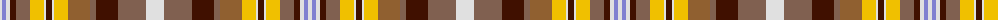

In pattern [WBWBRYWBWYRRBRW](/patterns/wbwbrywbwyrrbrw/).

This was sourced from weddslist.  It is a [15 stripes tartan](/stripes/stripes15/).

Original link http://www.weddslist.com/cgi-bin/tartans/pg.pl?source=sts

## Thread count
LN/4 B4 LN4 DR6 LTa14 Y14 LN2 DR6 LN2 Y14 LT22 LTa6 DR22 LTa28 LN/18

## Palette
Each colour and its ΔE from the base-6 reference it is a variant of.

| Colour | Shade | Base | ΔE (OKLab) |
|---|---|---|---|
| B | <code style="background-color:#8080D0;">#8080D0</code> `#8080D0` | B <code style="background-color:#2C4084;">#2C4084</code> | 0.24 |
| DR | <code style="background-color:#401000;">#401000</code> `#401000` | B <code style="background-color:#2C4084;">#2C4084</code> | 0.23 |
| LN | <code style="background-color:#E0E0E0;">#E0E0E0</code> `#E0E0E0` | W <code style="background-color:#F4F4F0;">#F4F4F0</code> | 0.06 |
| LT | <code style="background-color:#906030;">#906030</code> `#906030` | R <code style="background-color:#C80000;">#C80000</code> | 0.15 |
| LTa | <code style="background-color:#806050;">#806050</code> `#806050` | R <code style="background-color:#C80000;">#C80000</code> | 0.17 |
| Y | <code style="background-color:#F0C000;">#F0C000</code> `#F0C000` | Y <code style="background-color:#E8C000;">#E8C000</code> | 0.01 |

ID: /setts/s15/w18r28b22r6ra22y14w2b6w2y14r14b6w4ba4w4-b401000-ba8080d0-r806050-ra906030-we0e0e0-yf0c000/
