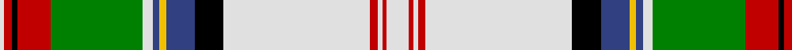

In pattern [WRKRGWBYBKWRWRW](/stripes/wrkrgwbybkwrwrw/).

This was sourced from weddslist.  It is a [15 stripe tartan](/stripes/stripes15/).

Original link http://www.weddslist.com/cgi-bin/tartans/pg.pl?source=sts

## Thread count
LN/20 R4 LN4 R7 LN132 K26 B26 Y6 B6 LN9 G83 R30 K5 R7 LN/4

## Palette
Each colour and the base-6 reference it is a variant of.

| Colour | Shade | Base |
|---|---|---|
| B | <code style="background-color:#304080;">#304080</code> `oklch(39.4% 0.109 270.2)` <small>#304080</small> | B <code style="background-color:#2A418A;">#2A418A</code> |
| G | <code style="background-color:#008000;">#008000</code> `oklch(52.0% 0.177 142.5)` <small>#008000</small> | G <code style="background-color:#006100;">#006100</code> |
| K | <code style="background-color:#000000;">#000000</code> `oklch(0.0% 0.000 0.0)` <small>#000000</small> | K <code style="background-color:#000000;">#000000</code> |
| LN | <code style="background-color:#E0E0E0;">#E0E0E0</code> `oklch(90.7% 0.000 89.9)` <small>#E0E0E0</small> | W <code style="background-color:#F7F7F7;">#F7F7F7</code> |
| R | <code style="background-color:#C00000;">#C00000</code> `oklch(50.7% 0.208 29.2)` <small>#C00000</small> | R <code style="background-color:#CC0000;">#CC0000</code> |
| Y | <code style="background-color:#F0C000;">#F0C000</code> `oklch(82.7% 0.169 90.5)` <small>#F0C000</small> | Y <code style="background-color:#F2BF00;">#F2BF00</code> |

## Nearest tartans

The nearest existing variants by ΔTartan distance, with this tartan at the top so the swatches line up against it.

ΔTartan

Tartan

Sett

—

<a href="/ttd/edit/#slug=w20r4w4r7w132k26db26ly6db6w9g83r30k5r7w4">Stewart dress</a> <a class="nn-out" href="/setts/s15/w20r4w4r7w132k26db26ly6db6w9g83r30k5r7w4/" title="open its dictionary page">↗</a>

0.72

<a href="/ttd/edit/#slug=r2w24t3w3k6ly1k1w1k1g8r4k1r2w1~x2">Stewart Victoria</a> <a class="nn-out" href="/setts/s14/r2w24t3w3k6ly1k1w1k1g8r4k1r2w1~x2/" title="open its dictionary page">↗</a>

0.74

<a href="/ttd/edit/#slug=k3w2k1w40g17r5k3o2r9g1r2g3~x2">Allandale Red Dress Tartan Tartan Number: 8457. Earliest known date: Threadcount and colours aren't 100% original. Generated manually. See products available Copyright © Blair Urquhart, Comrie, 2015</a> <a class="nn-out" href="/setts/s12/k3w2k1w40g17r5k3o2r9g1r2g3~x2/" title="open its dictionary page">↗</a>

0.75

<a href="/ttd/edit/#slug=r2w24b3w3k6lo1k1w1k1g8r4k1r2w1~x4">Stewart Victoria (Royal)</a> <a class="nn-out" href="/setts/s14/r2w24b3w3k6lo1k1w1k1g8r4k1r2w1~x4/" title="open its dictionary page">↗</a>

0.80

<a href="/ttd/edit/#slug=r2w24t3w3k6ly1k1w1k1dg8r4k1r2w1~x2">Stuart/Stewart Victoria</a> <a class="nn-out" href="/setts/s14/r2w24t3w3k6ly1k1w1k1dg8r4k1r2w1~x2/" title="open its dictionary page">↗</a>

1.12

<a href="/setts/s18/w55dg12r2dg3w2g10dp9dg2dp6w2~x2/">Strathyre Dress (Dance)</a>

1.19

<a href="/ttd/edit/#slug=k1w31k4g8r1g2dt7r4k1r4w1~x2">Hohenzollern</a> <a class="nn-out" href="/setts/s11/k1w31k4g8r1g2dt7r4k1r4w1~x2/" title="open its dictionary page">↗</a>

1.29

<a href="/ttd/edit/#slug=r6w1r1k15r1w2k1ly5w25w5k1m5k1w5k1ly5~x2">Puccini's Madama Butterfly</a> <a class="nn-out" href="/setts/s16/r6w1r1k15r1w2k1ly5w25w5k1m5k1w5k1ly5~x2/" title="open its dictionary page">↗</a>

1.31

<a href="/ttd/edit/#slug=t2w76lb4w4lb11o11ly7k11w4t11dt32w2">Antarctic</a> <a class="nn-out" href="/setts/s12/t2w76lb4w4lb11o11ly7k11w4t11dt32w2/" title="open its dictionary page">↗</a>

1.33

<a href="/ttd/edit/#slug=r4k3r15g42w5db3lo3db13k13w66r4w2r2w10r2w2r4w66k13db13lo3db3w5g42r15k3r4w2">Stewart/Stuart Dress (Four red lines)</a> <a class="nn-out" href="/setts/s28/r4k3r15g42w5db3lo3db13k13w66r4w2r2w10r2w2r4w66k13db13lo3db3w5g42r15k3r4w2/" title="open its dictionary page">↗</a>

1.44

<a href="/ttd/edit/#slug=k4lg9lb30k2lb4w5k2w2k1w2r7r15k3~x2">Un-named (USA Bedheads)</a> <a class="nn-out" href="/setts/s13/k4lg9lb30k2lb4w5k2w2k1w2r7r15k3~x2/" title="open its dictionary page">↗</a>

## Neighbour map

Every grey dot is one of 14299 variants placed by the first two principal components of the ΔTartan feature space (44% of its variance). Red is this tartan; blue dots are its nearest — click one to open its page.

<svg viewBox="0 0 640 380" role="img" style="max-width:100%;height:auto;border:1px solid #e0e0e0;border-radius:4px;display:block" xmlns="http://www.w3.org/2000/svg"><image href="/nn/cloud.v1.png" width="640" height="380"/><a href="/setts/s14/r2w24t3w3k6ly1k1w1k1g8r4k1r2w1~x2/"><circle cx="212.3" cy="41.1" r="4" fill="#3465a4"><title>Stewart Victoria</title></circle></a><a href="/setts/s12/k3w2k1w40g17r5k3o2r9g1r2g3~x2/"><circle cx="241.1" cy="30.4" r="4" fill="#3465a4"><title>Allandale Red Dress Tartan Tartan Number: 8457. Earliest known date: Threadcount and colours aren't 100% original. Generated manually. See products available Copyright © Blair Urquhart, Comrie, 2015</title></circle></a><a href="/setts/s14/r2w24b3w3k6lo1k1w1k1g8r4k1r2w1~x4/"><circle cx="217.1" cy="44.5" r="4" fill="#3465a4"><title>Stewart Victoria (Royal)</title></circle></a><a href="/setts/s14/r2w24t3w3k6ly1k1w1k1dg8r4k1r2w1~x2/"><circle cx="218.8" cy="42.3" r="4" fill="#3465a4"><title>Stuart/Stewart Victoria</title></circle></a><a href="/setts/s18/w55dg12r2dg3w2g10dp9dg2dp6w2~x2/"><circle cx="192.9" cy="42.2" r="4" fill="#3465a4"><title>Strathyre Dress (Dance)</title></circle></a><a href="/setts/s11/k1w31k4g8r1g2dt7r4k1r4w1~x2/"><circle cx="246.7" cy="56.6" r="4" fill="#3465a4"><title>Hohenzollern</title></circle></a><a href="/setts/s16/r6w1r1k15r1w2k1ly5w25w5k1m5k1w5k1ly5~x2/"><circle cx="150.0" cy="32.3" r="4" fill="#3465a4"><title>Puccini's Madama Butterfly</title></circle></a><a href="/setts/s12/t2w76lb4w4lb11o11ly7k11w4t11dt32w2/"><circle cx="206.0" cy="18.7" r="4" fill="#3465a4"><title>Antarctic</title></circle></a><a href="/setts/s28/r4k3r15g42w5db3lo3db13k13w66r4w2r2w10r2w2r4w66k13db13lo3db3w5g42r15k3r4w2/"><circle cx="174.2" cy="14.0" r="4" fill="#3465a4"><title>Stewart/Stuart Dress (Four red lines)</title></circle></a><a href="/setts/s13/k4lg9lb30k2lb4w5k2w2k1w2r7r15k3~x2/"><circle cx="163.7" cy="55.4" r="4" fill="#3465a4"><title>Un-named (USA Bedheads)</title></circle></a><circle cx="204.4" cy="30.2" r="5" fill="#c00000"/></svg>

ID: /setts/s15/w20r4w4r7w132k26db26ly6db6w9g83r30k5r7w4/
