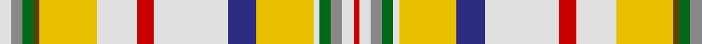

In pattern [RWRGWYBWRWYGGRW](/patterns/rwrgwybwrwyggrw/).

This was sourced from register-of-tartans.  It is a [15 stripes tartan](/stripes/stripes15/).

Original link https://www.tartanregister.gov.uk/tartanDetails.aspx?ref=749

## Attestations

This cloth appears in 2 source records; the oldest owns this page.

- 01/01/1992 — Contrecoeur Dress (register-of-tartans, [record](https://www.tartanregister.gov.uk/tartanDetails.aspx?ref=749))
- 1992 — Contrecoeur Dress (District) (tartans-authority, [record](http://www.tartansauthority.com/tartan-ferret/display/2295/))

## Register references

External register numbers recorded for this tartan.

- Scottish Register of Tartans: [749](https://www.tartanregister.gov.uk/tartanDetails.aspx?ref=749)
- Scottish Tartans Authority (ITI): 2295
- Scottish Tartans World Register: 2295

## Thread count
LN/8 N8 G8 T4 Y40 LN28 R12 LN52 DB20 Y40 LN4 G8 N8 LN8 R/4

## Palette
Each colour and its ΔE from the base-6 reference it is a variant of.

| Colour | Shade | Base | ΔE (OKLab) |
|---|---|---|---|
| DB | <code style="background-color:#2C2C80;">#2C2C80</code> `#2C2C80` | B <code style="background-color:#2A418A;">#2A418A</code> | 0.06 |
| G | <code style="background-color:#006818;">#006818</code> `#006818` | G <code style="background-color:#006100;">#006100</code> | 0.02 |
| LN | <code style="background-color:#E0E0E0;">#E0E0E0</code> `#E0E0E0` | W <code style="background-color:#F7F7F7;">#F7F7F7</code> | 0.07 |
| N | <code style="background-color:#888888;">#888888</code> `#888888` | R <code style="background-color:#CC0000;">#CC0000</code> | 0.24 |
| R | <code style="background-color:#C80000;">#C80000</code> `#C80000` | R <code style="background-color:#CC0000;">#CC0000</code> | 0.01 |
| T | <code style="background-color:#604000;">#604000</code> `#604000` | G <code style="background-color:#006100;">#006100</code> | 0.14 |
| Y | <code style="background-color:#E8C000;">#E8C000</code> `#E8C000` | Y <code style="background-color:#F2BF00;">#F2BF00</code> | 0.02 |

## Nearest tartans

The nearest existing variants by ΔTartan distance.

1. [Contreceour dress](/setts/s15/y10w1g2ga2w2r1w2ga2g2ra1y10w7r3w13b5~b304080-g008000-ga808080-rc00000-ra806050-we0e0e0-yf0c000~x2/) — ΔT 0.26
1. [Contreceour Dress Corporate Tartan Tartan Number: 2295. Earliest known date: 1992 Small township in southern Quebec. Tartan designed by French Canadian Madeleine Asselin. See products available Copyright © Blair Urquhart, Comrie, 2015](/setts/s15/y10w1g2k2w2r1w2k2g2k1y10w7r3w13b5~b588ca8-g006818-k000000-rc80000-we0e0e0-ye8c000~x2/) — ΔT 0.75
1. [MacLean of Duart Dress #4](/setts/s12/g10w2ga4y2ga3wa3ga3r18wa30b2wa4ga2~b505050-g808080-ga2a2303-rbe7832-wc0c0c0-wae0e0e0-ye8c000~x2/) — ΔT 1.25
1. [Contrecoeur](/setts/s15/y10r1g2y2w2ra1w2y2g2r1y10ra7wa3ra13b5~b304080-g008000-r806050-ra802040-wc0c0c0-wae0e0e0-yf0c000~x2/) — ΔT 1.37
1. [MacBean dress](/setts/s16/g10w4r4ra4g2ra4r4w4g10w4b4w2b4w23k2r2~b5480b0-g008000-k000000-rc00000-ra802040-we0e0e0~x2/) — ΔT 1.40
1. [MacBean Dress](/setts/s16/g10w4r4ra4g2ra4r4w4g10w4b4w2b4w23k2r2~b5c8ca8-g006818-k101010-rc80000-ra901c38-we0e0e0~x2/) — ΔT 1.41
1. [Contrecoeur (District)](/setts/s15/y10g1ga2y2w2r1w2y2ga2g1y10r7w3r13b5~b2c2c80-g604000-ga007c1c-r901c38-wfcfcfc-ye8c000~x2/) — ΔT 1.43
1. [MacLean of Duart, dress](/setts/s12/g10w2b4y2b3wa3b3r18wa30ba2wa4b2~b401000-ba505050-g808080-r906030-wc0c0c0-wae0e0e0-yf0c000~x2/) — ΔT 1.44
1. [MacLean of Duart (Reproduction Colours)](/setts/s12/g12b2ga4y2ga3w3ga3r20w29b2w4ga2~b3c82af-g808080-ga2a2303-rbe7832-we0e0e0-ye8c000~x2/) — ΔT 1.45
1. [Contrecoeur](/setts/s15/y10g1ga2y2w2r1w2y2ga2g1y10r7w3r13b5~b2c2c80-g604000-ga006818-r901c38-wfcfcfc-ye8c000~x2/) — ΔT 1.46

## Neighbour map

Every grey dot is one of 15726 variants placed by the first two principal components of the ΔTartan feature space (44% of its variance). Red is this tartan; blue dots are its nearest — click one to open its page.

<svg viewBox="0 0 640 380" role="img" style="max-width:100%;height:auto;border:1px solid #e0e0e0;border-radius:4px;display:block" xmlns="http://www.w3.org/2000/svg"><image href="/nn/cloud.v1.png" width="640" height="380"/><a href="/setts/s15/y10w1g2ga2w2r1w2ga2g2ra1y10w7r3w13b5~b304080-g008000-ga808080-rc00000-ra806050-we0e0e0-yf0c000~x2/"><circle cx="128.1" cy="84.8" r="4" fill="#3465a4"><title>Contreceour dress</title></circle></a><a href="/setts/s15/y10w1g2k2w2r1w2k2g2k1y10w7r3w13b5~b588ca8-g006818-k000000-rc80000-we0e0e0-ye8c000~x2/"><circle cx="101.4" cy="76.5" r="4" fill="#3465a4"><title>Contreceour Dress Corporate Tartan Tartan Number: 2295. Earliest known date: 1992 Small township in southern Quebec. Tartan designed by French Canadian Madeleine Asselin. See products available Copyright © Blair Urquhart, Comrie, 2015</title></circle></a><a href="/setts/s12/g10w2ga4y2ga3wa3ga3r18wa30b2wa4ga2~b505050-g808080-ga2a2303-rbe7832-wc0c0c0-wae0e0e0-ye8c000~x2/"><circle cx="164.1" cy="67.6" r="4" fill="#3465a4"><title>MacLean of Duart Dress #4</title></circle></a><a href="/setts/s15/y10r1g2y2w2ra1w2y2g2r1y10ra7wa3ra13b5~b304080-g008000-r806050-ra802040-wc0c0c0-wae0e0e0-yf0c000~x2/"><circle cx="116.2" cy="82.5" r="4" fill="#3465a4"><title>Contrecoeur</title></circle></a><a href="/setts/s16/g10w4r4ra4g2ra4r4w4g10w4b4w2b4w23k2r2~b5480b0-g008000-k000000-rc00000-ra802040-we0e0e0~x2/"><circle cx="129.5" cy="97.3" r="4" fill="#3465a4"><title>MacBean dress</title></circle></a><a href="/setts/s16/g10w4r4ra4g2ra4r4w4g10w4b4w2b4w23k2r2~b5c8ca8-g006818-k101010-rc80000-ra901c38-we0e0e0~x2/"><circle cx="132.4" cy="97.6" r="4" fill="#3465a4"><title>MacBean Dress</title></circle></a><a href="/setts/s15/y10g1ga2y2w2r1w2y2ga2g1y10r7w3r13b5~b2c2c80-g604000-ga007c1c-r901c38-wfcfcfc-ye8c000~x2/"><circle cx="109.7" cy="78.7" r="4" fill="#3465a4"><title>Contrecoeur (District)</title></circle></a><a href="/setts/s12/g10w2b4y2b3wa3b3r18wa30ba2wa4b2~b401000-ba505050-g808080-r906030-wc0c0c0-wae0e0e0-yf0c000~x2/"><circle cx="161.6" cy="66.8" r="4" fill="#3465a4"><title>MacLean of Duart, dress</title></circle></a><a href="/setts/s12/g12b2ga4y2ga3w3ga3r20w29b2w4ga2~b3c82af-g808080-ga2a2303-rbe7832-we0e0e0-ye8c000~x2/"><circle cx="167.3" cy="87.3" r="4" fill="#3465a4"><title>MacLean of Duart (Reproduction Colours)</title></circle></a><a href="/setts/s15/y10g1ga2y2w2r1w2y2ga2g1y10r7w3r13b5~b2c2c80-g604000-ga006818-r901c38-wfcfcfc-ye8c000~x2/"><circle cx="109.4" cy="78.7" r="4" fill="#3465a4"><title>Contrecoeur</title></circle></a><circle cx="121.7" cy="82.8" r="5" fill="#c00000"/></svg>

ID: /setts/s15/w2r2g2ga1y10w7ra3w13b5y10w1g2r2w2ra1~b2c2c80-g006818-ga604000-r888888-rac80000-we0e0e0-ye8c000~x4/
