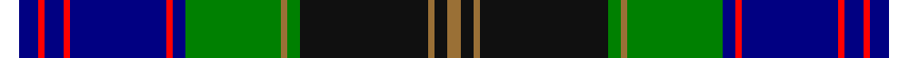

In pattern [RKRKGRGBRBRBRBW](/stripes/rkrkgrgbrbrbrbw/).

This was sourced from register-of-tartans.  It is a [15 stripe tartan](/stripes/stripes15/).

Original link https://www.tartanregister.gov.uk/tartanDetails.aspx?ref=10722

## Register references

External register numbers recorded for this tartan.

- Scottish Register of Tartans: [10722](https://www.tartanregister.gov.uk/tartanDetails.aspx?ref=10722)

## Thread count
W/6 DB6 R2 DB6 R2 DB30 R2 DB4 G30 LT2 G4 K40 LT2 K4 LT/4

## Palette
Each colour and the base-6 reference it is a variant of.

| Colour | Shade | Base |
|---|---|---|
| DB | <code style="background-color:#010082;">#010082</code> `oklch(27.5% 0.190 264.3)` <small>#010082</small> | B <code style="background-color:#2A418A;">#2A418A</code> |
| G | <code style="background-color:#008001;">#008001</code> `oklch(52.0% 0.177 142.5)` <small>#008001</small> | G <code style="background-color:#006100;">#006100</code> |
| K | <code style="background-color:#101010;">#101010</code> `oklch(17.3% 0.000 89.9)` <small>#101010</small> | K <code style="background-color:#000000;">#000000</code> |
| LT | <code style="background-color:#9A7036;">#9A7036</code> `oklch(57.6% 0.092 73.0)` <small>#9A7036</small> | R <code style="background-color:#CC0000;">#CC0000</code> |
| R | <code style="background-color:#FF0000;">#FF0000</code> `oklch(62.8% 0.258 29.2)` <small>#FF0000</small> | R <code style="background-color:#CC0000;">#CC0000</code> |
| W | <code style="background-color:#FFFFFF;">#FFFFFF</code> `oklch(100.0% 0.000 89.9)` <small>#FFFFFF</small> | W <code style="background-color:#F7F7F7;">#F7F7F7</code> |

## Nearest tartans

The nearest existing variants by ΔTartan distance.

1. [Joseph Linn Family (Monohon) Name Tartan Tartan Number: 10722. Earliest known date: 22 October 2012 Designed by Euan Dalgliesh and Joseph Linn. Joseph Linn and his wife, CathyJo, retired to the Monohon community on the shores of Lake Sammamish before the first of the next generation came into the world in October 2012. This tartan celebrates their recommitment to their family values and Celtic heritage. It also symbolises their hopes for a strong family connection for generations to come. See products available Copyright © Blair Urquhart, Comrie, 2015](/setts/s15/w3db3k1db3k1db15k1db2g15o1g2k20o1k2o2~x2/) — ΔT 0.33
1. [Linn (Personal)](/setts/s15/w3db3r1db3r1db15r1db2g15lo1g2k20lo1k2lo2~x2/) — ΔT 0.58
1. [MacGiboney/MacGibboney](/setts/s15/k2dg4w2dg19k2o10k1ly2k1o10k2db19w2db4k2~x2/) — ΔT 0.88
1. [Strathclyde, University of (Corporat](/setts/s14/db7k1r3k1db24k1w3k3y3k3y3g19k2w4~x2/) — ΔT 1.03
1. [St Andrew](/setts/s14/w4db20k1g2k1g2k4g1w2g1k4g16dp8g1~x2/) — ΔT 1.08
1. [Unidentified 26](/setts/s11/db2r2db2r2db20k24g12ly1k2g2t2~x2/) — ΔT 1.11
1. [Reston (Personal)](/setts/s13/t4g32k2t4k2ly5k3ly5k2t4k2db32w4~x2/) — ΔT 1.12
1. [Baron of Greencastle (Personal)](/setts/s13/g4ly2g24r2k12db3k2db2k2db12w1db1w3~x2/) — ΔT 1.13
1. [Lyon, Jeffrey M (Personal)](/setts/s12/dt30k4dg5k2r2k2dg5k4w10k5n8k1~x2/) — ΔT 1.14
1. [Scottish Islamic](/setts/s18/dg2ly2dg2ly2dg2ly2dg18k1dg2k5db2k1db19w2db2w2db2w2~x2/) — ΔT 1.15

## Neighbour map

Every grey dot is one of 14299 variants placed by the first two principal components of the ΔTartan feature space (44% of its variance). Red is this tartan; blue dots are its nearest — click one to open its page.

<svg viewBox="0 0 640 380" role="img" style="max-width:100%;height:auto;border:1px solid #e0e0e0;border-radius:4px;display:block" xmlns="http://www.w3.org/2000/svg"><image href="/nn/cloud.v1.png" width="640" height="380"/><a href="/setts/s15/w3db3k1db3k1db15k1db2g15o1g2k20o1k2o2~x2/"><circle cx="145.6" cy="88.8" r="4" fill="#3465a4"><title>Joseph Linn Family (Monohon) Name Tartan Tartan Number: 10722. Earliest known date: 22 October 2012 Designed by Euan Dalgliesh and Joseph Linn. Joseph Linn and his wife, CathyJo, retired to the Monohon community on the shores of Lake Sammamish before the first of the next generation came into the world in October 2012. This tartan celebrates their recommitment to their family values and Celtic heritage. It also symbolises their hopes for a strong family connection for generations to come. See products available Copyright © Blair Urquhart, Comrie, 2015</title></circle></a><a href="/setts/s15/w3db3r1db3r1db15r1db2g15lo1g2k20lo1k2lo2~x2/"><circle cx="159.2" cy="90.4" r="4" fill="#3465a4"><title>Linn (Personal)</title></circle></a><a href="/setts/s15/k2dg4w2dg19k2o10k1ly2k1o10k2db19w2db4k2~x2/"><circle cx="119.3" cy="95.3" r="4" fill="#3465a4"><title>MacGiboney/MacGibboney</title></circle></a><a href="/setts/s14/db7k1r3k1db24k1w3k3y3k3y3g19k2w4~x2/"><circle cx="191.1" cy="86.3" r="4" fill="#3465a4"><title>Strathclyde, University of (Corporat</title></circle></a><a href="/setts/s14/w4db20k1g2k1g2k4g1w2g1k4g16dp8g1~x2/"><circle cx="169.6" cy="104.3" r="4" fill="#3465a4"><title>St Andrew</title></circle></a><a href="/setts/s11/db2r2db2r2db20k24g12ly1k2g2t2~x2/"><circle cx="183.5" cy="95.0" r="4" fill="#3465a4"><title>Unidentified 26</title></circle></a><a href="/setts/s13/t4g32k2t4k2ly5k3ly5k2t4k2db32w4~x2/"><circle cx="136.6" cy="91.7" r="4" fill="#3465a4"><title>Reston (Personal)</title></circle></a><a href="/setts/s13/g4ly2g24r2k12db3k2db2k2db12w1db1w3~x2/"><circle cx="193.7" cy="92.2" r="4" fill="#3465a4"><title>Baron of Greencastle (Personal)</title></circle></a><a href="/setts/s12/dt30k4dg5k2r2k2dg5k4w10k5n8k1~x2/"><circle cx="180.8" cy="87.6" r="4" fill="#3465a4"><title>Lyon, Jeffrey M (Personal)</title></circle></a><a href="/setts/s18/dg2ly2dg2ly2dg2ly2dg18k1dg2k5db2k1db19w2db2w2db2w2~x2/"><circle cx="182.5" cy="87.8" r="4" fill="#3465a4"><title>Scottish Islamic</title></circle></a><circle cx="144.2" cy="84.8" r="5" fill="#c00000"/></svg>

ID: /setts/s15/w3db3r1db3r1db15r1db2g15o1g2k20o1k2o2~x2/
