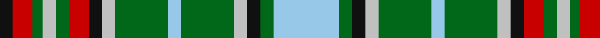

In pattern [KRGWGRKWGWGWKGW](/patterns/krgwgrkwgwgwkgw/).

This was sourced from register-of-tartans.  It is a [15 stripes tartan](/stripes/stripes15/).

Original link https://www.tartanregister.gov.uk/tartanDetails.aspx?ref=1319

## Attestations

This cloth appears in 2 source records; the oldest owns this page.

- 01/01/1981 — Gayre (register-of-tartans, [record](https://www.tartanregister.gov.uk/tartanDetails.aspx?ref=1319))
- ? — Gayre (Clan ?) (tartans-authority, [record](http://www.tartansauthority.com/tartan-ferret/display/8876/))

## Thread count
K/8 R12 G6 N8 G8 R12 K8 N8 G32 LB8 G32 N8 K8 G8 LB/40

## Palette
Each colour and its ΔE from the base-6 reference it is a variant of.

| Colour | Shade | Base | ΔE (OKLab) |
|---|---|---|---|
| G | <code style="background-color:#006818;">#006818</code> `#006818` | G <code style="background-color:#006100;">#006100</code> | 0.02 |
| K | <code style="background-color:#101010;">#101010</code> `#101010` | K <code style="background-color:#000000;">#000000</code> | 0.17 |
| LB | <code style="background-color:#98C8E8;">#98C8E8</code> `#98C8E8` | W <code style="background-color:#F7F7F7;">#F7F7F7</code> | 0.18 |
| N | <code style="background-color:#C0C0C0;">#C0C0C0</code> `#C0C0C0` | W <code style="background-color:#F7F7F7;">#F7F7F7</code> | 0.17 |
| R | <code style="background-color:#C80000;">#C80000</code> `#C80000` | R <code style="background-color:#CC0000;">#CC0000</code> | 0.01 |

## Nearest tartans

The nearest existing variants by ΔTartan distance.

1. [Gayre Dress](/setts/s15/g16ga4k4w4ga16g4ga16w4k4gb6ga4w4ga2g4k4-g789484-ga006818-gb006400-k101010-wffffff/) — ΔT 0.87
1. [Gayre Dress (Clan)](/setts/s15/g28ga8k8w8ga24g8ga24w8k8r12ga8w8ga6g8k8-g789484-ga006818-k101010-rc80000-wfcfcfc/) — ΔT 0.94
1. [Gayre Dress Clan Tartan Tartan Number: 161. Earliest known date: pre 2003 Five versions of Gayre tartan are recorded. Hunting, Dress, Bodyguard, Arisaidh and the version recorded by Lord Lyon, the Clan sett. This can be found in the Public Register of All Arms and Bearings in Scotland. (1992) See products available Copyright © Blair Urquhart, Comrie, 2015](/setts/s15/b28g8k8w8g24b8g24w8k8r12g8w8g6b8k8-b5c8ca8-g006818-k101010-rc80000-we0e0e0/) — ΔT 0.97
1. [Gayre](/setts/s15/b36g8k8w8g32b8g32w8k8r10g8w8g8r10k8-b304080-g008000-k000000-rc00000-we0e0e0/) — ΔT 0.97
1. [MacInnes Dress (Dalgliesh)](/setts/s12/g4w24g3k3g3k3g24w4k4b24g16r4-b2c2c80-g006818-k101010-rc80000-wf8f8f8/) — ΔT 1.05
1. [Gayre, dress](/setts/s15/b28g8k8w8g24b8g24w8k8r12g8w8g6b8k8-b5480b0-g008000-k000000-rc00000-we0e0e0/) — ΔT 1.06
1. [Fraser Hunting Dress Clan Tartan Tartan Number: 603. Earliest known date: pre 2003 In the Hunting Fraser, brown replaces the red of the Clan sett. The late Charles Ian Fraser of Reeling said, in his publication, "Clan Fraser", that this sett was designed by the Sobieski Stuart brothers at the request of Lord Lovat for use by the Inverness and Nairn militia. A letter to Lord Lovat from the War Office, c.1855, authorised the use of the Fraser tartan for the corps. The tartan is worn by the Boghall & Bathgate pipe bands. (Strathallan 1994) See products available Copyright © Blair Urquhart, Comrie, 2015](/setts/s11/b8g48ga34g6w36g6w36g6ga34g48r8-b2c2c80-g604000-ga006818-rc80000-we0e0e0/) — ΔT 1.08
1. [Praetorian, Green (Fashion)](/setts/s14/w6k6y6g48k6ya6w48ya6k48ya6w6g48ya6w6-g285800-k101010-we0e0e0-ye8c000-yaa0a0a0/) — ΔT 1.11
1. [MacInnes, dress](/setts/s13/g8w48g6k6g6k6g48k8w8k8b48g16r8-b304080-g008000-k000000-rc00000-we0e0e0/) — ΔT 1.11
1. [92nd Regiment Drummers' Plaid (Mil.)](/setts/s13/y24k4r4k4r4k24ya22yb4ya22k24y22k4r4-k101010-rc80000-ya4bcc4-yaacbc98-ybe8c000/) — ΔT 1.12

## Neighbour map

Every grey dot is one of 15726 variants placed by the first two principal components of the ΔTartan feature space (44% of its variance). Red is this tartan; blue dots are its nearest — click one to open its page.

<svg viewBox="0 0 640 380" role="img" style="max-width:100%;height:auto;border:1px solid #e0e0e0;border-radius:4px;display:block" xmlns="http://www.w3.org/2000/svg"><image href="/nn/cloud.v1.png" width="640" height="380"/><a href="/setts/s15/g16ga4k4w4ga16g4ga16w4k4gb6ga4w4ga2g4k4-g789484-ga006818-gb006400-k101010-wffffff/"><circle cx="135.0" cy="163.3" r="4" fill="#3465a4"><title>Gayre Dress</title></circle></a><a href="/setts/s15/g28ga8k8w8ga24g8ga24w8k8r12ga8w8ga6g8k8-g789484-ga006818-k101010-rc80000-wfcfcfc/"><circle cx="78.4" cy="190.7" r="4" fill="#3465a4"><title>Gayre Dress (Clan)</title></circle></a><a href="/setts/s15/b28g8k8w8g24b8g24w8k8r12g8w8g6b8k8-b5c8ca8-g006818-k101010-rc80000-we0e0e0/"><circle cx="85.8" cy="195.4" r="4" fill="#3465a4"><title>Gayre Dress Clan Tartan Tartan Number: 161. Earliest known date: pre 2003 Five versions of Gayre tartan are recorded. Hunting, Dress, Bodyguard, Arisaidh and the version recorded by Lord Lyon, the Clan sett. This can be found in the Public Register of All Arms and Bearings in Scotland. (1992) See products available Copyright © Blair Urquhart, Comrie, 2015</title></circle></a><a href="/setts/s15/b36g8k8w8g32b8g32w8k8r10g8w8g8r10k8-b304080-g008000-k000000-rc00000-we0e0e0/"><circle cx="103.3" cy="178.2" r="4" fill="#3465a4"><title>Gayre</title></circle></a><a href="/setts/s12/g4w24g3k3g3k3g24w4k4b24g16r4-b2c2c80-g006818-k101010-rc80000-wf8f8f8/"><circle cx="136.8" cy="147.8" r="4" fill="#3465a4"><title>MacInnes Dress (Dalgliesh)</title></circle></a><a href="/setts/s15/b28g8k8w8g24b8g24w8k8r12g8w8g6b8k8-b5480b0-g008000-k000000-rc00000-we0e0e0/"><circle cx="69.2" cy="189.5" r="4" fill="#3465a4"><title>Gayre, dress</title></circle></a><a href="/setts/s11/b8g48ga34g6w36g6w36g6ga34g48r8-b2c2c80-g604000-ga006818-rc80000-we0e0e0/"><circle cx="145.9" cy="176.5" r="4" fill="#3465a4"><title>Fraser Hunting Dress Clan Tartan Tartan Number: 603. Earliest known date: pre 2003 In the Hunting Fraser, brown replaces the red of the Clan sett. The late Charles Ian Fraser of Reeling said, in his publication, &quot;Clan Fraser&quot;, that this sett was designed by the Sobieski Stuart brothers at the request of Lord Lovat for use by the Inverness and Nairn militia. A letter to Lord Lovat from the War Office, c.1855, authorised the use of the Fraser tartan for the corps. The tartan is worn by the Boghall &amp; Bathgate pipe bands. (Strathallan 1994) See products available Copyright © Blair Urquhart, Comrie, 2015</title></circle></a><a href="/setts/s14/w6k6y6g48k6ya6w48ya6k48ya6w6g48ya6w6-g285800-k101010-we0e0e0-ye8c000-yaa0a0a0/"><circle cx="122.9" cy="131.1" r="4" fill="#3465a4"><title>Praetorian, Green (Fashion)</title></circle></a><a href="/setts/s13/g8w48g6k6g6k6g48k8w8k8b48g16r8-b304080-g008000-k000000-rc00000-we0e0e0/"><circle cx="107.7" cy="138.7" r="4" fill="#3465a4"><title>MacInnes, dress</title></circle></a><a href="/setts/s13/y24k4r4k4r4k24ya22yb4ya22k24y22k4r4-k101010-rc80000-ya4bcc4-yaacbc98-ybe8c000/"><circle cx="88.4" cy="164.9" r="4" fill="#3465a4"><title>92nd Regiment Drummers' Plaid (Mil.)</title></circle></a><circle cx="115.2" cy="160.3" r="5" fill="#c00000"/></svg>

ID: /setts/s15/w40g8k8wa8g32w8g32wa8k8r12g8wa8g6r12k8-g006818-k101010-rc80000-w98c8e8-wac0c0c0/
