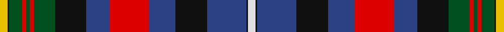

In pattern [WKBKBRBKGRGRGKY](/stripes/wkbkbrbkgrgrgky/).

This was sourced from register-of-tartans.  It is a [15 stripe tartan](/stripes/stripes15/).

Original link https://www.tartanregister.gov.uk/tartanDetails.aspx?ref=4294

## Also known as

This cloth is also recorded under:

- Unidentified, Flora MacDonald

## Register references

External register numbers recorded for this tartan.

- Scottish Register of Tartans: [4294](https://www.tartanregister.gov.uk/tartanDetails.aspx?ref=4294)
- Scottish Tartans World Register: 1814

## Thread count
Y/12 K2 G20 R6 G6 R6 G32 K48 B36 R60 B40 K48 B60 K2 LN/12

## Palette
Each colour and the base-6 reference it is a variant of.

| Colour | Shade | Base |
|---|---|---|
| B | <code style="background-color:#2C4084;">#2C4084</code> `oklch(39.4% 0.117 268.3)` <small>#2C4084</small> | B <code style="background-color:#2A418A;">#2A418A</code> |
| G | <code style="background-color:#005020;">#005020</code> `oklch(37.7% 0.105 149.6)` <small>#005020</small> | G <code style="background-color:#006100;">#006100</code> |
| K | <code style="background-color:#101010;">#101010</code> `oklch(17.3% 0.000 89.9)` <small>#101010</small> | K <code style="background-color:#000000;">#000000</code> |
| LN | <code style="background-color:#E0E0E0;">#E0E0E0</code> `oklch(90.7% 0.000 89.9)` <small>#E0E0E0</small> | W <code style="background-color:#F7F7F7;">#F7F7F7</code> |
| R | <code style="background-color:#DC0000;">#DC0000</code> `oklch(56.2% 0.230 29.2)` <small>#DC0000</small> | R <code style="background-color:#CC0000;">#CC0000</code> |
| Y | <code style="background-color:#E8C000;">#E8C000</code> `oklch(81.9% 0.168 93.7)` <small>#E8C000</small> | Y <code style="background-color:#F2BF00;">#F2BF00</code> |

## Nearest tartans

The nearest existing variants by ΔTartan distance, with this tartan at the top so the swatches line up against it.

ΔTartan

Tartan

Sett

—

<a href="/ttd/edit/#slug=w6k1db30k24db20r30db18k24dg16r3dg3r3dg10k1ly6~x2">Unidentified Flora MacDonald</a> <a class="nn-out" href="/setts/s15/w6k1db30k24db20r30db18k24dg16r3dg3r3dg10k1ly6~x2/" title="open its dictionary page">↗</a>

0.85

<a href="/ttd/edit/#slug=w6k1db30k24db20r30db18k24g16r3g3r3g10k1ly6~x2">Unidentified, Flora MacDonald</a> <a class="nn-out" href="/setts/s15/w6k1db30k24db20r30db18k24g16r3g3r3g10k1ly6~x2/" title="open its dictionary page">↗</a>

0.86

<a href="/ttd/edit/#slug=w9k1o31g30db36g3db3g3db36g30o31k1ly9~x2">Campbell, Brown (Personal)</a> <a class="nn-out" href="/setts/s13/w9k1o31g30db36g3db3g3db36g30o31k1ly9~x2/" title="open its dictionary page">↗</a>

0.96

<a href="/ttd/edit/#slug=dg10ly6dg20k20db20k6db8r6db20r6w4r16w4db6w1~x2">Watson - Kirby (Personal)</a> <a class="nn-out" href="/setts/s15/dg10ly6dg20k20db20k6db8r6db20r6w4r16w4db6w1~x2/" title="open its dictionary page">↗</a>

0.99

<a href="/ttd/edit/#slug=w9k1dr31g30db36g3db3g3db36g30dr31k1ly9~x2">Campbell Brown Personal Tartan Tartan Number: 17. Earliest known date: pre 1992 Specially made for Captain Campbell of the Blythswood family. See products available Copyright © Blair Urquhart, Comrie, 2015</a> <a class="nn-out" href="/setts/s13/w9k1dr31g30db36g3db3g3db36g30dr31k1ly9~x2/" title="open its dictionary page">↗</a>

1.15

<a href="/ttd/edit/#slug=dr10w1do1w2o10dr8do2k17do2dr7o19k3ly1k1~x2">Scottish Wildcat</a> <a class="nn-out" href="/setts/s14/dr10w1do1w2o10dr8do2k17do2dr7o19k3ly1k1~x2/" title="open its dictionary page">↗</a>

1.18

<a href="/ttd/edit/#slug=db14k4db4k15g20k2y4r2k1w4r14db4r2db2r4db2r2~x2">Caledonian Society of Prince Edward Island</a> <a class="nn-out" href="/setts/s17/db14k4db4k15g20k2y4r2k1w4r14db4r2db2r4db2r2~x2/" title="open its dictionary page">↗</a>

1.18

<a href="/ttd/edit/#slug=r14db4r2db2r4db2r2db14k4db4k15g20k2y4r2k1w4~x2">Caledonian Society of P.E.I. (Corp)</a> <a class="nn-out" href="/setts/s17/r14db4r2db2r4db2r2db14k4db4k15g20k2y4r2k1w4~x2/" title="open its dictionary page">↗</a>

1.23

<a href="/ttd/edit/#slug=o18k2o2k2o9g10ly2g10dp11k9dp2k2dp1r3~x2">Hay Gray (Personal)</a> <a class="nn-out" href="/setts/s14/o18k2o2k2o9g10ly2g10dp11k9dp2k2dp1r3~x2/" title="open its dictionary page">↗</a>

1.23

<a href="/ttd/edit/#slug=t8k4t8k20lo1g20r8w1r8w1r8g20lo1k20t8k4t4~x2">Cumming</a> <a class="nn-out" href="/setts/s17/t8k4t8k20lo1g20r8w1r8w1r8g20lo1k20t8k4t4~x2/" title="open its dictionary page">↗</a>

1.24

<a href="/ttd/edit/#slug=r4dg22k16ly2k3w3k2db20r8k2r4k1w2~x2">Louise of Lorne #2</a> <a class="nn-out" href="/setts/s13/r4dg22k16ly2k3w3k2db20r8k2r4k1w2~x2/" title="open its dictionary page">↗</a>

## Neighbour map

Every grey dot is one of 14299 variants placed by the first two principal components of the ΔTartan feature space (44% of its variance). Red is this tartan; blue dots are its nearest — click one to open its page.

<svg viewBox="0 0 640 380" role="img" style="max-width:100%;height:auto;border:1px solid #e0e0e0;border-radius:4px;display:block" xmlns="http://www.w3.org/2000/svg"><image href="/nn/cloud.v1.png" width="640" height="380"/><a href="/setts/s15/w6k1db30k24db20r30db18k24g16r3g3r3g10k1ly6~x2/"><circle cx="130.1" cy="92.7" r="4" fill="#3465a4"><title>Unidentified, Flora MacDonald</title></circle></a><a href="/setts/s13/w9k1o31g30db36g3db3g3db36g30o31k1ly9~x2/"><circle cx="177.7" cy="103.9" r="4" fill="#3465a4"><title>Campbell, Brown (Personal)</title></circle></a><a href="/setts/s15/dg10ly6dg20k20db20k6db8r6db20r6w4r16w4db6w1~x2/"><circle cx="111.7" cy="125.1" r="4" fill="#3465a4"><title>Watson - Kirby (Personal)</title></circle></a><a href="/setts/s13/w9k1dr31g30db36g3db3g3db36g30dr31k1ly9~x2/"><circle cx="181.0" cy="108.0" r="4" fill="#3465a4"><title>Campbell Brown Personal Tartan Tartan Number: 17. Earliest known date: pre 1992 Specially made for Captain Campbell of the Blythswood family. See products available Copyright © Blair Urquhart, Comrie, 2015</title></circle></a><a href="/setts/s14/dr10w1do1w2o10dr8do2k17do2dr7o19k3ly1k1~x2/"><circle cx="157.8" cy="102.4" r="4" fill="#3465a4"><title>Scottish Wildcat</title></circle></a><a href="/setts/s17/db14k4db4k15g20k2y4r2k1w4r14db4r2db2r4db2r2~x2/"><circle cx="104.8" cy="91.6" r="4" fill="#3465a4"><title>Caledonian Society of Prince Edward Island</title></circle></a><a href="/setts/s17/r14db4r2db2r4db2r2db14k4db4k15g20k2y4r2k1w4~x2/"><circle cx="104.8" cy="91.6" r="4" fill="#3465a4"><title>Caledonian Society of P.E.I. (Corp)</title></circle></a><a href="/setts/s14/o18k2o2k2o9g10ly2g10dp11k9dp2k2dp1r3~x2/"><circle cx="130.1" cy="110.9" r="4" fill="#3465a4"><title>Hay Gray (Personal)</title></circle></a><a href="/setts/s17/t8k4t8k20lo1g20r8w1r8w1r8g20lo1k20t8k4t4~x2/"><circle cx="129.8" cy="108.7" r="4" fill="#3465a4"><title>Cumming</title></circle></a><a href="/setts/s13/r4dg22k16ly2k3w3k2db20r8k2r4k1w2~x2/"><circle cx="121.3" cy="95.8" r="4" fill="#3465a4"><title>Louise of Lorne #2</title></circle></a><circle cx="151.2" cy="101.0" r="5" fill="#c00000"/></svg>

ID: /setts/s15/w6k1db30k24db20r30db18k24dg16r3dg3r3dg10k1ly6~x2/
