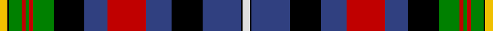

In pattern [WKBKBRBKGRGRGKY](/stripes/wkbkbrbkgrgrgky/).

This was sourced from weddslist.  It is a [15 stripe tartan](/stripes/stripes15/).

Original link http://www.weddslist.com/cgi-bin/tartans/pg.pl?source=sts

## Also known as

This cloth is also recorded under:

- Unidentified, Flora MacDonald

## Thread count
Y/12 K2 G20 R6 G6 R6 G32 K48 B36 R60 B40 K48 B60 K2 LN/12

## Palette
Each colour and the base-6 reference it is a variant of.

| Colour | Shade | Base |
|---|---|---|
| B | <code style="background-color:#304080;">#304080</code> `oklch(39.4% 0.109 270.2)` <small>#304080</small> | B <code style="background-color:#2A418A;">#2A418A</code> |
| G | <code style="background-color:#008000;">#008000</code> `oklch(52.0% 0.177 142.5)` <small>#008000</small> | G <code style="background-color:#006100;">#006100</code> |
| K | <code style="background-color:#000000;">#000000</code> `oklch(0.0% 0.000 0.0)` <small>#000000</small> | K <code style="background-color:#000000;">#000000</code> |
| LN | <code style="background-color:#E0E0E0;">#E0E0E0</code> `oklch(90.7% 0.000 89.9)` <small>#E0E0E0</small> | W <code style="background-color:#F7F7F7;">#F7F7F7</code> |
| R | <code style="background-color:#C00000;">#C00000</code> `oklch(50.7% 0.208 29.2)` <small>#C00000</small> | R <code style="background-color:#CC0000;">#CC0000</code> |
| Y | <code style="background-color:#F0C000;">#F0C000</code> `oklch(82.7% 0.169 90.5)` <small>#F0C000</small> | Y <code style="background-color:#F2BF00;">#F2BF00</code> |

## Nearest tartans

The nearest existing variants by ΔTartan distance.

1. [Unidentified Flora MacDonald](/setts/s15/w6k1db30k24db20r30db18k24dg16r3dg3r3dg10k1ly6~x2/) — ΔT 0.85
1. [Watson - Kirby (Personal)](/setts/s15/dg10ly6dg20k20db20k6db8r6db20r6w4r16w4db6w1~x2/) — ΔT 1.00
1. [Hay Gray (Personal)](/setts/s14/o18k2o2k2o9g10ly2g10dp11k9dp2k2dp1r3~x2/) — ΔT 1.20
1. [Campbell, Brown (Personal)](/setts/s13/w9k1o31g30db36g3db3g3db36g30o31k1ly9~x2/) — ΔT 1.20
1. [Vine (2015)](/setts/s12/dg19k20m1db8b8dg8db3m1lb12k8m1lb1~x2/) — ΔT 1.26
1. [Royal Scottish Pipe Band Association](/setts/s12/lb6k1t20r2g3r2k15r2g3r2k6k3~x2/) — ΔT 1.29
1. [Tilley, Sir Samuel Leonard](/setts/s13/r4dg20k16ly2k3lb3k2n18r6k2r4k1lb2~x4/) — ΔT 1.30
1. [Galt, Sir Alexander..](/setts/s13/r4g22k16ly2k3w3k2db20r8k2r4k1w2~x2/) — ΔT 1.30
1. [Cumming](/setts/s17/t8k4t8k20lo1g20r8w1r8w1r8g20lo1k20t8k4t4~x2/) — ΔT 1.31
1. [Campbell Brown Personal Tartan Tartan Number: 17. Earliest known date: pre 1992 Specially made for Captain Campbell of the Blythswood family. See products available Copyright © Blair Urquhart, Comrie, 2015](/setts/s13/w9k1dr31g30db36g3db3g3db36g30dr31k1ly9~x2/) — ΔT 1.32

## Neighbour map

Every grey dot is one of 14299 variants placed by the first two principal components of the ΔTartan feature space (44% of its variance). Red is this tartan; blue dots are its nearest — click one to open its page.

<svg viewBox="0 0 640 380" role="img" style="max-width:100%;height:auto;border:1px solid #e0e0e0;border-radius:4px;display:block" xmlns="http://www.w3.org/2000/svg"><image href="/nn/cloud.v1.png" width="640" height="380"/><a href="/setts/s15/w6k1db30k24db20r30db18k24dg16r3dg3r3dg10k1ly6~x2/"><circle cx="151.2" cy="101.0" r="4" fill="#3465a4"><title>Unidentified Flora MacDonald</title></circle></a><a href="/setts/s15/dg10ly6dg20k20db20k6db8r6db20r6w4r16w4db6w1~x2/"><circle cx="111.7" cy="125.1" r="4" fill="#3465a4"><title>Watson - Kirby (Personal)</title></circle></a><a href="/setts/s14/o18k2o2k2o9g10ly2g10dp11k9dp2k2dp1r3~x2/"><circle cx="130.1" cy="110.9" r="4" fill="#3465a4"><title>Hay Gray (Personal)</title></circle></a><a href="/setts/s13/w9k1o31g30db36g3db3g3db36g30o31k1ly9~x2/"><circle cx="177.7" cy="103.9" r="4" fill="#3465a4"><title>Campbell, Brown (Personal)</title></circle></a><a href="/setts/s12/dg19k20m1db8b8dg8db3m1lb12k8m1lb1~x2/"><circle cx="102.7" cy="117.1" r="4" fill="#3465a4"><title>Vine (2015)</title></circle></a><a href="/setts/s12/lb6k1t20r2g3r2k15r2g3r2k6k3~x2/"><circle cx="136.6" cy="96.6" r="4" fill="#3465a4"><title>Royal Scottish Pipe Band Association</title></circle></a><a href="/setts/s13/r4dg20k16ly2k3lb3k2n18r6k2r4k1lb2~x4/"><circle cx="112.5" cy="101.3" r="4" fill="#3465a4"><title>Tilley, Sir Samuel Leonard</title></circle></a><a href="/setts/s13/r4g22k16ly2k3w3k2db20r8k2r4k1w2~x2/"><circle cx="99.4" cy="87.4" r="4" fill="#3465a4"><title>Galt, Sir Alexander..</title></circle></a><a href="/setts/s17/t8k4t8k20lo1g20r8w1r8w1r8g20lo1k20t8k4t4~x2/"><circle cx="129.8" cy="108.7" r="4" fill="#3465a4"><title>Cumming</title></circle></a><a href="/setts/s13/w9k1dr31g30db36g3db3g3db36g30dr31k1ly9~x2/"><circle cx="181.0" cy="108.0" r="4" fill="#3465a4"><title>Campbell Brown Personal Tartan Tartan Number: 17. Earliest known date: pre 1992 Specially made for Captain Campbell of the Blythswood family. See products available Copyright © Blair Urquhart, Comrie, 2015</title></circle></a><circle cx="130.1" cy="92.7" r="5" fill="#c00000"/></svg>

ID: /setts/s15/w6k1db30k24db20r30db18k24g16r3g3r3g10k1ly6~x2/
