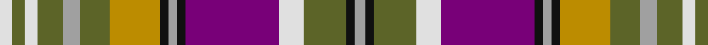

**Bands:** [WGWGYGYKYKBWGKY](/stripes/wgwgygykykbwgky/) · **Stripes:** [W Y W Y LR Y LO K LR K DP W Y K LR](/stripes/stripes15/) W Y W Y LR Y LO K LR K DP W Y K LR

This was sourced from tartans-authority.  It is a [15 band tartan](/bands/bands15/).

Original link http://www.tartansauthority.com/tartan-ferret/display/7435/

## Attestations

This cloth appears in 2 source records; the oldest owns this page.

- 2004 — Wexford County Crest (Fashion) (tartans-authority, [record](http://www.tartansauthority.com/tartan-ferret/display/7435/))
- 01/05/2005 — Wexford County, Crest Range (register-of-tartans, [record](https://www.tartanregister.gov.uk/tartanDetails.aspx?ref=5323))

## Register references

External register numbers recorded for this tartan.

- Scottish Register of Tartans: [5323](https://www.tartanregister.gov.uk/tartanDetails.aspx?ref=5323)
- Scottish Tartans Authority (ITI): 7435
- Scottish Tartans World Register: 3104

## Thread count
LN/6 G6 LN6 G12 N8 G14 DY24 K4 N4 K4 P44 LN12 G20 K4 N/5

## Palette
Each colour and its ΔE from the base-6 reference it is a variant of.

| Colour | Shade | Base | ΔE (OKLab) |
|---|---|---|---|
| DY | <code style="background-color:#BC8C00;">#BC8C00</code> `#BC8C00` | Y <code style="background-color:#F2BF00;">#F2BF00</code> | 0.16 |
| G | <code style="background-color:#5C6428;">#5C6428</code> `#5C6428` | G <code style="background-color:#006100;">#006100</code> | 0.10 |
| K | <code style="background-color:#101010;">#101010</code> `#101010` | K <code style="background-color:#000000;">#000000</code> | 0.17 |
| LN | <code style="background-color:#E0E0E0;">#E0E0E0</code> `#E0E0E0` | W <code style="background-color:#F7F7F7;">#F7F7F7</code> | 0.07 |
| N | <code style="background-color:#A0A0A0;">#A0A0A0</code> `#A0A0A0` | Y <code style="background-color:#F2BF00;">#F2BF00</code> | 0.21 |
| P | <code style="background-color:#780078;">#780078</code> `#780078` | B <code style="background-color:#2A418A;">#2A418A</code> | 0.17 |

## Nearest tartans

The nearest existing variants by ΔTartan distance.

1. [Dalrymple of Castleton](/setts/s14/lo2r15lo3dr2lo3k14lo2t6w2t6lo2r7t10w1~x2/) — ΔT 0.67
1. [Wilson's No.227](/setts/s16/r26t7dp8ly3r3w3g20dp10w2dp10g20w3r3ly3dp8t7~x2/) — ΔT 0.78
1. [City of Edinburgh (2001) (District)](/setts/s16/r18t1o18k1g18w1t18r1o18g1r18k3w4k3w4k3~x2/) — ΔT 0.85
1. [Cribb (2016)](/setts/s16/lr2dg4n2dg12dp10m1dp10lr2m2lr2m2lr2m2lr12n1w2~x2/) — ΔT 0.88
1. [Brinkie's Brae (Personal)](/setts/s17/k3w4k3r18db1o18k1g18w1db18r1o18g1r18k3w4k3~x2/) — ΔT 0.88
1. [Wilson's No.083](/setts/s14/dp14w2r3w2r15g18ly3k14ly3g18r15w2r3w2~x2/) — ΔT 0.91
1. [Isle of Skye (District)](/setts/s11/lb24dg3lb3dg3lb3dg10o12dp12o12o2o3~x2/) — ΔT 0.93
1. [Beguinot, (Personal)](/setts/s18/b12g4r2ly3g4g4r20w4r14g4g4ly3r2g4b12ly2b8ly2~x2/) — ΔT 0.94
1. [Devon 2000](/setts/s14/db24g4dg2g8dg2g4db12g3r22ly3b8g3r22ly6~x2/) — ΔT 0.94
1. [Devon 2000](/setts/s14/db24g4dg2g8dg2g4db12g3r22ly3t8g3r22ly6~x2/) — ΔT 0.97

## Neighbour map

Every grey dot is one of 14313 variants placed by the first two principal components of the ΔTartan feature space (44% of its variance). Red is this tartan; blue dots are its nearest — click one to open its page.

<svg viewBox="0 0 640 380" role="img" style="max-width:100%;height:auto;border:1px solid #e0e0e0;border-radius:4px;display:block" xmlns="http://www.w3.org/2000/svg"><image href="/nn/cloud.v1.png" width="640" height="380"/><a href="/setts/s14/lo2r15lo3dr2lo3k14lo2t6w2t6lo2r7t10w1~x2/"><circle cx="95.3" cy="107.6" r="4" fill="#3465a4"><title>Dalrymple of Castleton</title></circle></a><a href="/setts/s16/r26t7dp8ly3r3w3g20dp10w2dp10g20w3r3ly3dp8t7~x2/"><circle cx="89.7" cy="110.4" r="4" fill="#3465a4"><title>Wilson's No.227</title></circle></a><a href="/setts/s16/r18t1o18k1g18w1t18r1o18g1r18k3w4k3w4k3~x2/"><circle cx="110.4" cy="93.0" r="4" fill="#3465a4"><title>City of Edinburgh (2001) (District)</title></circle></a><a href="/setts/s16/lr2dg4n2dg12dp10m1dp10lr2m2lr2m2lr2m2lr12n1w2~x2/"><circle cx="94.2" cy="107.5" r="4" fill="#3465a4"><title>Cribb (2016)</title></circle></a><a href="/setts/s17/k3w4k3r18db1o18k1g18w1db18r1o18g1r18k3w4k3~x2/"><circle cx="100.7" cy="85.8" r="4" fill="#3465a4"><title>Brinkie's Brae (Personal)</title></circle></a><a href="/setts/s14/dp14w2r3w2r15g18ly3k14ly3g18r15w2r3w2~x2/"><circle cx="90.9" cy="127.2" r="4" fill="#3465a4"><title>Wilson's No.083</title></circle></a><a href="/setts/s11/lb24dg3lb3dg3lb3dg10o12dp12o12o2o3~x2/"><circle cx="105.7" cy="131.2" r="4" fill="#3465a4"><title>Isle of Skye (District)</title></circle></a><a href="/setts/s18/b12g4r2ly3g4g4r20w4r14g4g4ly3r2g4b12ly2b8ly2~x2/"><circle cx="110.7" cy="118.0" r="4" fill="#3465a4"><title>Beguinot, (Personal)</title></circle></a><a href="/setts/s14/db24g4dg2g8dg2g4db12g3r22ly3b8g3r22ly6~x2/"><circle cx="141.3" cy="123.0" r="4" fill="#3465a4"><title>Devon 2000</title></circle></a><a href="/setts/s14/db24g4dg2g8dg2g4db12g3r22ly3t8g3r22ly6~x2/"><circle cx="138.0" cy="121.9" r="4" fill="#3465a4"><title>Devon 2000</title></circle></a><circle cx="86.9" cy="111.5" r="5" fill="#c00000"/></svg>

ID: /setts/s15/w6y6w6y12lr8y14lo24k4lr4k4dp44w12y20k4lr5/
