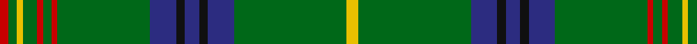

In pattern [RGYGRGRGBKBKBGY](/patterns/rgygrgrgbkbkbgy/).

This was sourced from tartans-authority.  It is a [15 stripes tartan](/stripes/stripes15/).

Original link http://www.tartansauthority.com/tartan-ferret/display/5729/

## Thread count
R/6 G6 Y4 G10 R4 G6 R4 G64 DB18 K6 DB10 K6 DB18 G78 Y/8

## Palette
Each colour and its ΔE from the base-6 reference it is a variant of.

| Colour | Shade | Base | ΔE (OKLab) |
|---|---|---|---|
| DB | <code style="background-color:#2C2C80;">#2C2C80</code> `#2C2C80` | B <code style="background-color:#2A418A;">#2A418A</code> | 0.06 |
| G | <code style="background-color:#006818;">#006818</code> `#006818` | G <code style="background-color:#006100;">#006100</code> | 0.02 |
| K | <code style="background-color:#101010;">#101010</code> `#101010` | K <code style="background-color:#000000;">#000000</code> | 0.17 |
| R | <code style="background-color:#C80000;">#C80000</code> `#C80000` | R <code style="background-color:#CC0000;">#CC0000</code> | 0.01 |
| Y | <code style="background-color:#E8C000;">#E8C000</code> `#E8C000` | Y <code style="background-color:#F2BF00;">#F2BF00</code> | 0.02 |

## Nearest tartans

The nearest existing variants by ΔTartan distance.

1. [Bartlett from Winnetka, Illinois](/setts/s13/r4g40b12y2b12g30k2g4k2g4y2g3k3x2~b1c0070-g006818-k101010-r880000-yd09800/) — ΔT 0.58
1. [Kennedy #2](/setts/s15/y8g77b18k7b9k6b18g64r4g5r4g9y4g5r6~b2c4084-g005020-k101010-rdc0000-ye8c000/) — ΔT 0.72
1. [Kennedy](/setts/s15/y4g39b9k3b5k3b9g32r2g3r2g5y2g3r3x2~b304080-g008000-k000000-rc00000-yf0c000/) — ΔT 0.92
1. [Seattle](/setts/s18/g14w1b2r1g1r1b2w1g4w1b2r1g1r1b2w1g14y1x4~b1c0070-g006818-re87878-wc0c0c0-yd09800/) — ΔT 0.95
1. [King Edward VII (Royal)](/setts/s17/y8g84b21k10b10k10b10k10b21g62r3g6r3g10y3g5r6~b1474b4-g006818-k101010-rc80000-ye8c000/) — ΔT 1.08
1. [King Edward VII Royal Family Tartan Tartan Number: 1559. Earliest known date: pre 1992 Reputed to be a tartan specifically woven for King Edward VII. In the possession of Miss K Roberts of Torquay. See Kennedy See products available Copyright © Blair Urquhart, Comrie, 2015](/setts/s17/y8g84b21k10b10k10b10k10b21g62r3g6r3g10y3g5r6x2~b2c2c80-g006818-k101010-rc80000-ye8c000/) — ΔT 1.10
1. [Bartlett from Winnetka, Illinois](/setts/s13/k3g3y2g4k2g3k2g24b10y2b10g30r3x2~b304080-g008000-k000000-rc00000-yf0c000/) — ΔT 1.15
1. [Seattle (District)](/setts/s10/g4w1b2r1g1r1b2w1g14y1x4~b1c0070-g006818-re87878-wc0c0c0-yd09800/) — ΔT 1.16
1. [Savoy](/setts/s13/g16k8g1k1w1g1w1y1g1k1r1g4k1x4~g408060-k101010-r888888-wc0c0c0-yd09800/) — ΔT 1.20
1. [Seattle District Tartan Tartan Number: 2113. Earliest known date: 1990 Emerald green for the Emerald city - Seattle, Aegean blue for the waters around the city, primrose pink for the wild rhododendrons native to the region, white for the snowy mountains and for the golden sunshine of summer. See products available Copyright © Blair Urquhart, Comrie, 2015](/setts/s10/g14w1b2r1g1r1b2w1g4y1x4~b2c2c80-g006818-rc80000-we0e0e0-ye8c000/) — ΔT 1.20

## Neighbour map

Every grey dot is one of 15726 variants placed by the first two principal components of the ΔTartan feature space (44% of its variance). Red is this tartan; blue dots are its nearest — click one to open its page.

<svg viewBox="0 0 640 380" role="img" style="max-width:100%;height:auto;border:1px solid #e0e0e0;border-radius:4px;display:block" xmlns="http://www.w3.org/2000/svg"><image href="/nn/cloud.v1.png" width="640" height="380"/><a href="/setts/s13/r4g40b12y2b12g30k2g4k2g4y2g3k3x2~b1c0070-g006818-k101010-r880000-yd09800/"><circle cx="403.4" cy="133.0" r="4" fill="#3465a4"><title>Bartlett from Winnetka, Illinois</title></circle></a><a href="/setts/s15/y8g77b18k7b9k6b18g64r4g5r4g9y4g5r6~b2c4084-g005020-k101010-rdc0000-ye8c000/"><circle cx="399.8" cy="125.5" r="4" fill="#3465a4"><title>Kennedy #2</title></circle></a><a href="/setts/s15/y4g39b9k3b5k3b9g32r2g3r2g5y2g3r3x2~b304080-g008000-k000000-rc00000-yf0c000/"><circle cx="368.9" cy="112.1" r="4" fill="#3465a4"><title>Kennedy</title></circle></a><a href="/setts/s18/g14w1b2r1g1r1b2w1g4w1b2r1g1r1b2w1g14y1x4~b1c0070-g006818-re87878-wc0c0c0-yd09800/"><circle cx="361.0" cy="110.4" r="4" fill="#3465a4"><title>Seattle</title></circle></a><a href="/setts/s17/y8g84b21k10b10k10b10k10b21g62r3g6r3g10y3g5r6~b1474b4-g006818-k101010-rc80000-ye8c000/"><circle cx="350.8" cy="101.2" r="4" fill="#3465a4"><title>King Edward VII (Royal)</title></circle></a><a href="/setts/s17/y8g84b21k10b10k10b10k10b21g62r3g6r3g10y3g5r6x2~b2c2c80-g006818-k101010-rc80000-ye8c000/"><circle cx="349.1" cy="100.0" r="4" fill="#3465a4"><title>King Edward VII Royal Family Tartan Tartan Number: 1559. Earliest known date: pre 1992 Reputed to be a tartan specifically woven for King Edward VII. In the possession of Miss K Roberts of Torquay. See Kennedy See products available Copyright © Blair Urquhart, Comrie, 2015</title></circle></a><a href="/setts/s13/k3g3y2g4k2g3k2g24b10y2b10g30r3x2~b304080-g008000-k000000-rc00000-yf0c000/"><circle cx="344.0" cy="135.7" r="4" fill="#3465a4"><title>Bartlett from Winnetka, Illinois</title></circle></a><a href="/setts/s10/g4w1b2r1g1r1b2w1g14y1x4~b1c0070-g006818-re87878-wc0c0c0-yd09800/"><circle cx="380.7" cy="139.2" r="4" fill="#3465a4"><title>Seattle (District)</title></circle></a><a href="/setts/s13/g16k8g1k1w1g1w1y1g1k1r1g4k1x4~g408060-k101010-r888888-wc0c0c0-yd09800/"><circle cx="341.5" cy="114.1" r="4" fill="#3465a4"><title>Savoy</title></circle></a><a href="/setts/s10/g14w1b2r1g1r1b2w1g4y1x4~b2c2c80-g006818-rc80000-we0e0e0-ye8c000/"><circle cx="380.5" cy="138.1" r="4" fill="#3465a4"><title>Seattle District Tartan Tartan Number: 2113. Earliest known date: 1990 Emerald green for the Emerald city - Seattle, Aegean blue for the waters around the city, primrose pink for the wild rhododendrons native to the region, white for the snowy mountains and for the golden sunshine of summer. See products available Copyright © Blair Urquhart, Comrie, 2015</title></circle></a><circle cx="389.3" cy="120.0" r="5" fill="#c00000"/></svg>

ID: /setts/s15/y4g39b9k3b5k3b9g32r2g3r2g5y2g3r3x2~b2c2c80-g006818-k101010-rc80000-ye8c000/
