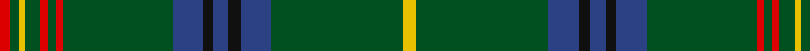

In pattern [RGYGRGRGBKBKBGY](/patterns/rgygrgrgbkbkbgy/).

This was sourced from register-of-tartans.  It is a [15 stripes tartan](/stripes/stripes15/).

Original link https://www.tartanregister.gov.uk/tartanDetails.aspx?ref=1943

## Thread count
R/6 G5 Y4 G9 R4 G5 R4 G64 B18 K6 B9 K7 B18 G77 Y/8

## Palette
Each colour and its ΔE from the base-6 reference it is a variant of.

| Colour | Shade | Base | ΔE (OKLab) |
|---|---|---|---|
| B | <code style="background-color:#2C4084;">#2C4084</code> `#2C4084` | B <code style="background-color:#2C4084;">#2C4084</code> | 0.00 |
| G | <code style="background-color:#005020;">#005020</code> `#005020` | G <code style="background-color:#006400;">#006400</code> | 0.08 |
| K | <code style="background-color:#101010;">#101010</code> `#101010` | K <code style="background-color:#000000;">#000000</code> | 0.17 |
| R | <code style="background-color:#DC0000;">#DC0000</code> `#DC0000` | R <code style="background-color:#C80000;">#C80000</code> | 0.04 |
| Y | <code style="background-color:#E8C000;">#E8C000</code> `#E8C000` | Y <code style="background-color:#E8C000;">#E8C000</code> | 0.00 |

## Nearest tartans

The nearest existing variants by ΔTartan distance.

1. [Holmes (Clan)](/setts/s15/y8g78b18k6b10k6b18g64r4g6r4g10y4g6r6-b2c2c80-g006818-k101010-rc80000-ye8c000/) — ΔT 0.71
1. [Bartlett from Winnetka, Illinois](/setts/s13/r8g80b24y4b24g60k4g8k4g8y4g6k6-b1c0070-g006818-k101010-r880000-yd09800/) — ΔT 0.79
1. [King Edward VII Royal Family Tartan Tartan Number: 1559. Earliest known date: pre 1992 Reputed to be a tartan specifically woven for King Edward VII. In the possession of Miss K Roberts of Torquay. See Kennedy See products available Copyright © Blair Urquhart, Comrie, 2015](/setts/s17/y16g168b42k20b20k20b20k20b42g124r6g12r6g20y6g10r12-b2c2c80-g006818-k101010-rc80000-ye8c000/) — ΔT 1.12
1. [Hyslop Hunting (Name)](/setts/s18/g8r4g48k4g4k12g4k12g4k4g6y2b6k4b2k4b6g4-b1c0070-g006818-k101010-r880000-yd09800/) — ΔT 1.19
1. [King Edward VII (Royal)](/setts/s17/y8g84b21k10b10k10b10k10b21g62r3g6r3g10y3g5r6-b1474b4-g006818-k101010-rc80000-ye8c000/) — ΔT 1.24
1. [Kennedy Clan Tartan Tartan Number: 1123. Earliest known date: 1847 The Earls of Cassilis built Culzean Castle on the site of an ancient Kennedy stronghold. Dunure Castle near Culzean on the Ayrshire coast, was also owned by the Kennedys. The tartan was first recorded by MacIan in his book 'The Clans of the Scottish Highlands' (1847) which he co-authored with James Logan. See products available Copyright © Blair Urquhart, Comrie, 2015](/setts/s17/k4g4y2g6r2g4r2g24b8k6b6k6b6k6b8g48ra4-b2c2c80-g006818-k101010-ra00048-rac8002c-ye8c000/) — ΔT 1.28
1. [Sarafilovic](/setts/s16/b30k36g6k4g4k4g88y8g88k4g4k4g6k36b30r8-b2c2c80-g006818-k101010-rc80000-ye8c000/) — ΔT 1.36
1. [Seattle](/setts/s18/g56w4b8r4g4r4b8w4g16w4b8r4g4r4b8w4g56y4-b1c0070-g006818-re87878-wc0c0c0-yd09800/) — ΔT 1.40
1. [Grand Lodge of Scotland](/setts/s16/g36k12g2k2b2k12b2k4b2k12b2k2g2k12g42y2-b2c2c80-g006818-k101010-ye8c000/) — ΔT 1.40
1. [Savoy](/setts/s13/g64k32g4k4w4g4w4y4g4k4r4g16k4-g408060-k101010-r888888-wc0c0c0-yd09800/) — ΔT 1.42

## Neighbour map

Every grey dot is one of 15726 variants placed by the first two principal components of the ΔTartan feature space (44% of its variance). Red is this tartan; blue dots are its nearest — click one to open its page.

<svg viewBox="0 0 640 380" role="img" style="max-width:100%;height:auto;border:1px solid #e0e0e0;border-radius:4px;display:block" xmlns="http://www.w3.org/2000/svg"><image href="/nn/cloud.v1.png" width="640" height="380"/><a href="/setts/s15/y8g78b18k6b10k6b18g64r4g6r4g10y4g6r6-b2c2c80-g006818-k101010-rc80000-ye8c000/"><circle cx="387.4" cy="118.5" r="4" fill="#3465a4"><title>Holmes (Clan)</title></circle></a><a href="/setts/s13/r8g80b24y4b24g60k4g8k4g8y4g6k6-b1c0070-g006818-k101010-r880000-yd09800/"><circle cx="401.8" cy="131.2" r="4" fill="#3465a4"><title>Bartlett from Winnetka, Illinois</title></circle></a><a href="/setts/s17/y16g168b42k20b20k20b20k20b42g124r6g12r6g20y6g10r12-b2c2c80-g006818-k101010-rc80000-ye8c000/"><circle cx="346.5" cy="99.2" r="4" fill="#3465a4"><title>King Edward VII Royal Family Tartan Tartan Number: 1559. Earliest known date: pre 1992 Reputed to be a tartan specifically woven for King Edward VII. In the possession of Miss K Roberts of Torquay. See Kennedy See products available Copyright © Blair Urquhart, Comrie, 2015</title></circle></a><a href="/setts/s18/g8r4g48k4g4k12g4k12g4k4g6y2b6k4b2k4b6g4-b1c0070-g006818-k101010-r880000-yd09800/"><circle cx="339.2" cy="106.2" r="4" fill="#3465a4"><title>Hyslop Hunting (Name)</title></circle></a><a href="/setts/s17/y8g84b21k10b10k10b10k10b21g62r3g6r3g10y3g5r6-b1474b4-g006818-k101010-rc80000-ye8c000/"><circle cx="348.2" cy="100.8" r="4" fill="#3465a4"><title>King Edward VII (Royal)</title></circle></a><a href="/setts/s17/k4g4y2g6r2g4r2g24b8k6b6k6b6k6b8g48ra4-b2c2c80-g006818-k101010-ra00048-rac8002c-ye8c000/"><circle cx="327.4" cy="94.3" r="4" fill="#3465a4"><title>Kennedy Clan Tartan Tartan Number: 1123. Earliest known date: 1847 The Earls of Cassilis built Culzean Castle on the site of an ancient Kennedy stronghold. Dunure Castle near Culzean on the Ayrshire coast, was also owned by the Kennedys. The tartan was first recorded by MacIan in his book 'The Clans of the Scottish Highlands' (1847) which he co-authored with James Logan. See products available Copyright © Blair Urquhart, Comrie, 2015</title></circle></a><a href="/setts/s16/b30k36g6k4g4k4g88y8g88k4g4k4g6k36b30r8-b2c2c80-g006818-k101010-rc80000-ye8c000/"><circle cx="310.9" cy="116.1" r="4" fill="#3465a4"><title>Sarafilovic</title></circle></a><a href="/setts/s18/g56w4b8r4g4r4b8w4g16w4b8r4g4r4b8w4g56y4-b1c0070-g006818-re87878-wc0c0c0-yd09800/"><circle cx="359.4" cy="108.5" r="4" fill="#3465a4"><title>Seattle</title></circle></a><a href="/setts/s16/g36k12g2k2b2k12b2k4b2k12b2k2g2k12g42y2-b2c2c80-g006818-k101010-ye8c000/"><circle cx="364.7" cy="134.9" r="4" fill="#3465a4"><title>Grand Lodge of Scotland</title></circle></a><a href="/setts/s13/g64k32g4k4w4g4w4y4g4k4r4g16k4-g408060-k101010-r888888-wc0c0c0-yd09800/"><circle cx="340.0" cy="112.2" r="4" fill="#3465a4"><title>Savoy</title></circle></a><circle cx="397.6" cy="124.5" r="5" fill="#c00000"/></svg>

ID: /setts/s15/y8g77b18k7b9k6b18g64r4g5r4g9y4g5r6-b2c4084-g005020-k101010-rdc0000-ye8c000/
