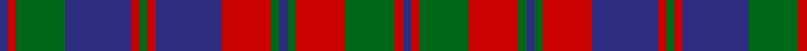

In pattern [BRGBRGRBRGBGRGRB](/patterns/brgbrgrbrgbgrgrb/).

This was sourced from register-of-tartans.  It is a [16 stripes tartan](/stripes/stripes16/).

Original link https://www.tartanregister.gov.uk/tartanDetails.aspx?ref=805

## Attestations

This cloth appears in 2 source records; the oldest owns this page.

- 01/01/1990 — Crieff Hydro Hotel (register-of-tartans, [record](https://www.tartanregister.gov.uk/tartanDetails.aspx?ref=805))
- pre 1990 — Crieff Hydro Hotel (Corporate) (tartans-authority, [record](http://www.tartansauthority.com/tartan-ferret/display/5166/))

## Thread count
DB/4 R4 G24 DB32 R4 G4 R4 DB32 R24 G4 DB4 G4 R24 G24 R4 DB/4

## Palette
Each colour and its ΔE from the base-6 reference it is a variant of.

| Colour | Shade | Base | ΔE (OKLab) |
|---|---|---|---|
| DB | <code style="background-color:#2C2C80;">#2C2C80</code> `#2C2C80` | B <code style="background-color:#2A418A;">#2A418A</code> | 0.06 |
| DG | <code style="background-color:#003820;">#003820</code> `#003820` | G <code style="background-color:#006100;">#006100</code> | 0.15 |
| DP | <code style="background-color:#440044;">#440044</code> `#440044` | B <code style="background-color:#2A418A;">#2A418A</code> | 0.18 |
| G | <code style="background-color:#006818;">#006818</code> `#006818` | G <code style="background-color:#006100;">#006100</code> | 0.02 |
| R | <code style="background-color:#C80000;">#C80000</code> `#C80000` | R <code style="background-color:#CC0000;">#CC0000</code> | 0.01 |

## Nearest tartans

The nearest existing variants by ΔTartan distance.

1. [Black Watch (Band Plaid)](/setts/s13/b16r4b4r4b4r29g27r4g27r29b26r4b4~b2c2c80-g006818-rc80000~x2/) — ΔT 0.80
1. [Tyneside Scottish Purple (Mil/Distr)](/setts/s13/b8g1b1g1b1g8ga8g1ga8g8b8g1b1~b780078-g604000-ga289c18~x6/) — ΔT 0.80
1. [Fraser of Stratherrick](/setts/s12/b20r2b2r2g19r18g2r18g19b19r2b2~b2c2c80-g006818-rc80000~x2/) — ΔT 0.81
1. [Black Watch (Band Plaid)](/setts/s13/b16r4b4r4b4r29g27r4g27r29b26r4b4~b202060-g006818-rc80000~x2/) — ΔT 0.90
1. [Black Watch, Plaid for Band](/setts/s13/b16r4b4r4b4r29g27r4g27r29b26r4b4~b304080-g008000-rc00000~x2/) — ΔT 1.00
1. [Fraser Stewart of Athol](/setts/s12/b28r3b3r3g20r30g4r30g20b22r3b3~b2c4084-g005020-rdc0000~x2/) — ΔT 1.03
1. [Fraser, Stewart of Athol](/setts/s12/b28r3b3r3g20r30g4r30g20b22r3b3~b304080-g008000-rc00000~x2/) — ΔT 1.03
1. [Monarch of Argyll (Corporate)](/setts/s12/r23k3r3k3b19k20b3k20b19r19b3r3~b5c5c5c-k101010-r888888~x2/) — ΔT 1.10
1. [Glen Orchy #1](/setts/s15/b2r3ba3r5g14r3ba2r5g2r3ba14r5g3r3b2~b3c82af-ba2c4084-g005020-rdc0000~x2/) — ΔT 1.11
1. [Stuart/Stewart of Urrard](/setts/s14/g6r2g2r18b9r3g3r3b9r3g24r2g2r4~b2c4084-g005020-rdc0000~x2/) — ΔT 1.13

## Neighbour map

Every grey dot is one of 15726 variants placed by the first two principal components of the ΔTartan feature space (44% of its variance). Red is this tartan; blue dots are its nearest — click one to open its page.

<svg viewBox="0 0 640 380" role="img" style="max-width:100%;height:auto;border:1px solid #e0e0e0;border-radius:4px;display:block" xmlns="http://www.w3.org/2000/svg"><image href="/nn/cloud.v1.png" width="640" height="380"/><a href="/setts/s13/b16r4b4r4b4r29g27r4g27r29b26r4b4~b2c2c80-g006818-rc80000~x2/"><circle cx="227.6" cy="205.5" r="4" fill="#3465a4"><title>Black Watch (Band Plaid)</title></circle></a><a href="/setts/s13/b8g1b1g1b1g8ga8g1ga8g8b8g1b1~b780078-g604000-ga289c18~x6/"><circle cx="214.9" cy="202.9" r="4" fill="#3465a4"><title>Tyneside Scottish Purple (Mil/Distr)</title></circle></a><a href="/setts/s12/b20r2b2r2g19r18g2r18g19b19r2b2~b2c2c80-g006818-rc80000~x2/"><circle cx="217.3" cy="199.1" r="4" fill="#3465a4"><title>Fraser of Stratherrick</title></circle></a><a href="/setts/s13/b16r4b4r4b4r29g27r4g27r29b26r4b4~b202060-g006818-rc80000~x2/"><circle cx="224.5" cy="204.8" r="4" fill="#3465a4"><title>Black Watch (Band Plaid)</title></circle></a><a href="/setts/s13/b16r4b4r4b4r29g27r4g27r29b26r4b4~b304080-g008000-rc00000~x2/"><circle cx="228.9" cy="206.5" r="4" fill="#3465a4"><title>Black Watch, Plaid for Band</title></circle></a><a href="/setts/s12/b28r3b3r3g20r30g4r30g20b22r3b3~b2c4084-g005020-rdc0000~x2/"><circle cx="244.8" cy="196.2" r="4" fill="#3465a4"><title>Fraser Stewart of Athol</title></circle></a><a href="/setts/s12/b28r3b3r3g20r30g4r30g20b22r3b3~b304080-g008000-rc00000~x2/"><circle cx="245.9" cy="198.6" r="4" fill="#3465a4"><title>Fraser, Stewart of Athol</title></circle></a><a href="/setts/s12/r23k3r3k3b19k20b3k20b19r19b3r3~b5c5c5c-k101010-r888888~x2/"><circle cx="194.0" cy="217.3" r="4" fill="#3465a4"><title>Monarch of Argyll (Corporate)</title></circle></a><a href="/setts/s15/b2r3ba3r5g14r3ba2r5g2r3ba14r5g3r3b2~b3c82af-ba2c4084-g005020-rdc0000~x2/"><circle cx="191.9" cy="179.9" r="4" fill="#3465a4"><title>Glen Orchy #1</title></circle></a><a href="/setts/s14/g6r2g2r18b9r3g3r3b9r3g24r2g2r4~b2c4084-g005020-rdc0000~x2/"><circle cx="269.8" cy="170.2" r="4" fill="#3465a4"><title>Stuart/Stewart of Urrard</title></circle></a><circle cx="222.9" cy="188.2" r="5" fill="#c00000"/></svg>

ID: /setts/s16/b1r1g6b8r1g1r1b8r6g1b1g1r6g6r1b1~b2c2c80-g006818-rc80000~x4/
