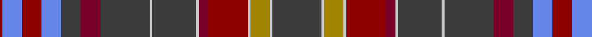

In pattern [BWYWRRWBWBRBBRBR](/patterns/bwywrrwbwbrbbrbr/).

This was sourced from register-of-tartans.  It is a [16 stripes tartan](/stripes/stripes16/).

Original link https://www.tartanregister.gov.uk/tartanDetails.aspx?ref=4544

## Thread count
DR/4 B32 DR32 B32 N32 DRa32 N80 Na4 N72 Na4 DRa16 DR64 Na4 LG32 Na4 N/80

## Palette
Each colour and its ΔE from the base-6 reference it is a variant of.

| Colour | Shade | Base | ΔE (OKLab) |
|---|---|---|---|
| B | <code style="background-color:#6484E8;">#6484E8</code> `#6484E8` | B <code style="background-color:#2A418A;">#2A418A</code> | 0.24 |
| DR | <code style="background-color:#8C0000;">#8C0000</code> `#8C0000` | R <code style="background-color:#CC0000;">#CC0000</code> | 0.14 |
| DRa | <code style="background-color:#780028;">#780028</code> `#780028` | R <code style="background-color:#CC0000;">#CC0000</code> | 0.19 |
| LG | <code style="background-color:#A08400;">#A08400</code> `#A08400` | Y <code style="background-color:#F2BF00;">#F2BF00</code> | 0.21 |
| N | <code style="background-color:#3C3C3C;">#3C3C3C</code> `#3C3C3C` | B <code style="background-color:#2A418A;">#2A418A</code> | 0.13 |
| Na | <code style="background-color:#C8C8C8;">#C8C8C8</code> `#C8C8C8` | W <code style="background-color:#F7F7F7;">#F7F7F7</code> | 0.14 |

## Nearest tartans

The nearest existing variants by ΔTartan distance.

1. [Recycled Lamb, The](/setts/s14/g15r1g8ra3b1ra3w1ra3b1ra3b12r1g7y1~b640267-g05601a-re11b28-ra940545-wffffff-yf2fd00~x2/) — ΔT 1.40
1. [Ryutokukan High School](/setts/s12/b3ba20r1ba4r2ba2r4ba2r5y2bb20w3~b444444-ba2f4f4f-bb660022-r990033-wffffff-y809c64~x2/) — ΔT 1.45
1. [Scottish Spirit Fashion Tartan Tartan Number: 10970. Earliest known date: 2013 ACS Clothing. Designed by Lochcarron. Wanted 'Highland Spirit' but that was taken by Ian McLure of T J Matthews. See products available Copyright © Blair Urquhart, Comrie, 2015](/setts/s12/b10r3b32g12k5g2k4g2k17ra4k2y2~b484848-g747474-k101010-r88243c-ra8c708c-ya0a0a0~x2/) — ΔT 1.48
1. [Ogg of Tarragann Hunting](/setts/s12/r2b6r1k14r1k14r1ka6g10y1g2y2~b237f97-g14492d-k2f0d0a-ka101010-rcb2610-ybe8f2c~x2/) — ΔT 1.55
1. [Scottish H & I Film Com (Corporate)](/setts/s11/b16ba8r2b2ba2b2ra1g4ga4b4w2~b746078-ba1c1c50-g5c6428-ga003820-r888888-rae87878-we0e0e0~x4/) — ΔT 1.57
1. [Hueg (Bavaria) Scottish Blue Thistle (Personal)](/setts/s15/r2g4k2b25g4b4y2b2w2b5g3r7k2r3w2~b433a5a-g23321b-k1c1714-rca2625-we5e0d2-ye0a126~x2/) — ΔT 1.58
1. [Rankin Grey (Personal)](/setts/s21/b14r1b1r1b1r9k6ra1b5w1b5ra1k6r9ra1b5ra2b2ra1b2w1~b5c5c5c-k101010-r888888-rac80000-wfcfcfc~x2/) — ΔT 1.58
1. [Jrgensen of Taasingee (Personal)](/setts/s19/y4r10b6g10b6r22ga6r4b22r4b22g36b22r4b22r4ga6b10ga3~b1c2448-g285828-ga5c8c30-r8c1c38-y8c98b8/) — ΔT 1.59
1. [Hand Name Tartan Tartan Number: 10640. Earliest known date: 2012 James Hand designed this tartan to celebrate his marriage to Miss Gail Wheatley. Colours: green for the Hand family name which originates from Ireland; blue and purple to signify a Scottish connection; charcoal and granite, colours which reflect a modern tartan. Weavers note: the granite and charcoal colours are woven with melange (blended) yarns of grey and black. Developed for weaving by House of Tartan. See products available Copyright © Blair Urquhart, Comrie, 2015](/setts/s12/g1b8y5b23y5ba3y5bb3y5g5y3w1~b5c5c5c-ba141c50-bb3c104c-g043828-we0e0e0-y8c9090~x2/) — ΔT 1.62
1. [Scottish Register of Tartans (Corp)](/setts/s15/r11w4r8g1r1g28y2g28k2g2k23r3ya6r3k5~g604000-k101010-rb03040-we0e0e0-ya08858-yabc8c00~x2/) — ΔT 1.63

## Neighbour map

Every grey dot is one of 15726 variants placed by the first two principal components of the ΔTartan feature space (44% of its variance). Red is this tartan; blue dots are its nearest — click one to open its page.

<svg viewBox="0 0 640 380" role="img" style="max-width:100%;height:auto;border:1px solid #e0e0e0;border-radius:4px;display:block" xmlns="http://www.w3.org/2000/svg"><image href="/nn/cloud.v1.png" width="640" height="380"/><a href="/setts/s14/g15r1g8ra3b1ra3w1ra3b1ra3b12r1g7y1~b640267-g05601a-re11b28-ra940545-wffffff-yf2fd00~x2/"><circle cx="246.5" cy="117.5" r="4" fill="#3465a4"><title>Recycled Lamb, The</title></circle></a><a href="/setts/s12/b3ba20r1ba4r2ba2r4ba2r5y2bb20w3~b444444-ba2f4f4f-bb660022-r990033-wffffff-y809c64~x2/"><circle cx="248.9" cy="112.2" r="4" fill="#3465a4"><title>Ryutokukan High School</title></circle></a><a href="/setts/s12/b10r3b32g12k5g2k4g2k17ra4k2y2~b484848-g747474-k101010-r88243c-ra8c708c-ya0a0a0~x2/"><circle cx="257.5" cy="134.6" r="4" fill="#3465a4"><title>Scottish Spirit Fashion Tartan Tartan Number: 10970. Earliest known date: 2013 ACS Clothing. Designed by Lochcarron. Wanted 'Highland Spirit' but that was taken by Ian McLure of T J Matthews. See products available Copyright © Blair Urquhart, Comrie, 2015</title></circle></a><a href="/setts/s12/r2b6r1k14r1k14r1ka6g10y1g2y2~b237f97-g14492d-k2f0d0a-ka101010-rcb2610-ybe8f2c~x2/"><circle cx="226.5" cy="139.0" r="4" fill="#3465a4"><title>Ogg of Tarragann Hunting</title></circle></a><a href="/setts/s11/b16ba8r2b2ba2b2ra1g4ga4b4w2~b746078-ba1c1c50-g5c6428-ga003820-r888888-rae87878-we0e0e0~x4/"><circle cx="245.2" cy="120.8" r="4" fill="#3465a4"><title>Scottish H &amp; I Film Com (Corporate)</title></circle></a><a href="/setts/s15/r2g4k2b25g4b4y2b2w2b5g3r7k2r3w2~b433a5a-g23321b-k1c1714-rca2625-we5e0d2-ye0a126~x2/"><circle cx="260.1" cy="108.6" r="4" fill="#3465a4"><title>Hueg (Bavaria) Scottish Blue Thistle (Personal)</title></circle></a><a href="/setts/s21/b14r1b1r1b1r9k6ra1b5w1b5ra1k6r9ra1b5ra2b2ra1b2w1~b5c5c5c-k101010-r888888-rac80000-wfcfcfc~x2/"><circle cx="235.3" cy="121.0" r="4" fill="#3465a4"><title>Rankin Grey (Personal)</title></circle></a><a href="/setts/s19/y4r10b6g10b6r22ga6r4b22r4b22g36b22r4b22r4ga6b10ga3~b1c2448-g285828-ga5c8c30-r8c1c38-y8c98b8/"><circle cx="265.9" cy="167.5" r="4" fill="#3465a4"><title>Jrgensen of Taasingee (Personal)</title></circle></a><a href="/setts/s12/g1b8y5b23y5ba3y5bb3y5g5y3w1~b5c5c5c-ba141c50-bb3c104c-g043828-we0e0e0-y8c9090~x2/"><circle cx="287.1" cy="127.0" r="4" fill="#3465a4"><title>Hand Name Tartan Tartan Number: 10640. Earliest known date: 2012 James Hand designed this tartan to celebrate his marriage to Miss Gail Wheatley. Colours: green for the Hand family name which originates from Ireland; blue and purple to signify a Scottish connection; charcoal and granite, colours which reflect a modern tartan. Weavers note: the granite and charcoal colours are woven with melange (blended) yarns of grey and black. Developed for weaving by House of Tartan. See products available Copyright © Blair Urquhart, Comrie, 2015</title></circle></a><a href="/setts/s15/r11w4r8g1r1g28y2g28k2g2k23r3ya6r3k5~g604000-k101010-rb03040-we0e0e0-ya08858-yabc8c00~x2/"><circle cx="263.5" cy="87.0" r="4" fill="#3465a4"><title>Scottish Register of Tartans (Corp)</title></circle></a><circle cx="257.1" cy="125.1" r="5" fill="#c00000"/></svg>

ID: /setts/s16/b20w1y8w1r16ra4w1b18w1b20ra8b8ba8r8ba8r1~b3c3c3c-ba6484e8-r8c0000-ra780028-wc8c8c8-ya08400~x4/
